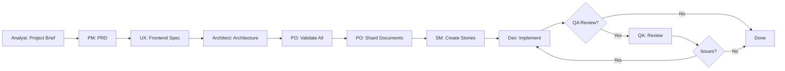
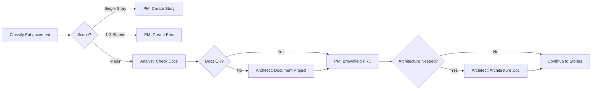

# CLAUDE.md - Performance Optimization Guide for HomeIQ

**Last Updated:** October 23, 2025
**Version:** 2.0.0
**Purpose:** Comprehensive performance guidelines for AI assistants working on the HomeIQ project

---

## Table of Contents

1. [System Overview](#system-overview)
2. [Performance Philosophy](#performance-philosophy)
3. [Architecture Performance Patterns](#architecture-performance-patterns)
4. [Database Performance](#database-performance)
5. [API Performance](#api-performance)
6. [Caching Strategies](#caching-strategies)
7. [Frontend Performance](#frontend-performance)
8. [Event Processing Performance](#event-processing-performance)
9. [Docker & Resource Management](#docker--resource-management)
10. [Performance Monitoring](#performance-monitoring)
11. [Performance Targets & SLAs](#performance-targets--slas)
12. [Common Performance Anti-Patterns](#common-performance-anti-patterns)
13. [Performance Testing](#performance-testing)
14. [Optimization Checklist](#optimization-checklist)
15. [BMad Development Methodology](#bmad-development-methodology)

---

## System Overview

HomeIQ is an **enterprise-grade data ingestion platform and API hub** for single-home automation systems. The system processes 1000+ events/second from Home Assistant, enriches data from 14 external APIs, and serves real-time dashboards with sub-100ms response times.

### Key Performance Characteristics

- **Scale:** 50-1000+ Home Assistant entities
- **Throughput:** 1000+ events/sec (peak), 100+ events/sec (sustained)
- **Latency:** <10ms (device queries), <50ms (automation APIs), <100ms (event queries)
- **Memory:** 256MB-512MB per service (production limits)
- **Architecture:** 21 microservices, hybrid database (InfluxDB + SQLite)

### Technology Stack Summary

**Backend:**
- Python 3.11-3.12 with FastAPI + Uvicorn (async/await)
- SQLAlchemy 2.0 async with aiosqlite
- InfluxDB 2.7 (time-series)
- SQLite (WAL mode, metadata)

**Frontend:**
- React 18.2.0 + TypeScript 5.2.2
- Vite 5.0.8 (build tool)
- Zustand 4.4.7 (state management)
- Chart.js 4.4.1 / Recharts 3.2.1

**Infrastructure:**
- Docker (multi-stage Alpine builds)
- Docker Compose (resource limits, health checks)
- JSON structured logging with correlation IDs

---

## Performance Philosophy

### Core Principles

1. **Measure First, Optimize Second** - Always profile before optimizing. Use metrics_collector.py for instrumentation.

2. **Async Everything** - This is an async-first system. Use `async/await` throughout Python services. Never block the event loop.

3. **Batch Over Individual** - Batch database writes (100-1000 points), API calls, and event processing. Reduces overhead by 10-100x.

4. **Cache Intelligently** - Cache expensive operations (weather: 5min, sports live: 15s, devices: direct SQLite lookup). Know your TTLs.

5. **Fail Fast, Recover Gracefully** - Use timeouts (10-30s), retries with exponential backoff, and circuit breakers. Network will fail.

6. **Memory Over CPU** - Use in-memory caching and data structures. Modern systems have RAM, optimize for throughput.

7. **Profile Production Reality** - Test with real HA event volumes, not synthetic loads. Actual patterns differ significantly.

### Performance vs Complexity Trade-offs

- **Simple & Fast > Complex & Optimal** - Prefer simple solutions that are "fast enough" over complex optimizations
- **Monitoring Overhead <2%** - Performance instrumentation must not significantly impact performance
- **Optimize Hot Paths Only** - Focus on frequently-called endpoints (health checks, device queries, event writes)
- **Technical Debt Acceptable** - For low-frequency operations (<1/min), simpler code wins over optimal performance

---

## Architecture Performance Patterns

### 1. Hybrid Database Architecture (5-10x Speedup)

**WHY:** InfluxDB excels at time-series writes but has 50ms+ query latency. SQLite provides <10ms metadata lookups.

**PATTERN:**
```
InfluxDB (Time-Series)          SQLite (Metadata)
├── state_changed events        ├── devices (99 devices)
├── metrics & telemetry         ├── entities (100+ entities)
├── historical queries          ├── webhooks
└── retention policies          └── AI suggestions
```

**Implementation:**
- `services/data-api/src/database.py` - SQLite configuration (WAL mode, 64MB cache)
- `services/websocket-ingestion/src/main.py` - Direct device/entity storage to SQLite
- InfluxDB for writes (batch 1000 points, 5s timeout)
- SQLite for reads (device filters, entity lookups)

**Performance Impact:**
- Device queries: 50ms (InfluxDB) → <10ms (SQLite) = **5x faster**
- Concurrent reads: Limited (InfluxDB) → Unlimited readers (SQLite WAL)
- Filtering: Slow (InfluxDB tags) → Fast (SQLite indexes)

### 2. Event-Driven Architecture

**WHY:** Webhooks (push) are 100x more efficient than polling for automations.

**PATTERN:**
```
Home Assistant Event → WebSocket → Batch Queue → InfluxDB
                                  ↓
                          Webhook Detection (15s intervals)
                                  ↓
                          HMAC-signed POST → HA Automation
```

**Implementation:**
- `services/websocket-ingestion/src/batch_processor.py` - Batch accumulation (100 events, 5s timeout)
- `services/sports-api/src/webhook_manager.py` - Event detection & delivery
- Webhooks stored in SQLite for reliability

**Performance Impact:**
- HA polling: Every 30s (high overhead) → Webhook push (zero overhead)
- Event detection: 15s background loop (minimal CPU)
- Delivery: Retry with exponential backoff (resilient)

### 3. Microservices with Clear Boundaries

**WHY:** Each service has specific performance profile. Isolate slow operations from fast ones.

**PATTERN:**
```
Fast Services (<10ms)           Slow Services (100ms-1s)
├── health checks               ├── OpenAI API calls (AI suggestions)
├── device/entity queries       ├── Weather API (external)
└── metrics endpoints           └── Historical InfluxDB queries
```

**Implementation:**
- Fast services: In-memory data, SQLite lookups, health checks
- Slow services: External APIs, ML processing, bulk data queries
- Isolation: Docker memory limits prevent one service from impacting others

**Performance Impact:**
- Health check (10ms) unaffected by AI processing (2-5s)
- Dashboard loads fast even during background batch jobs
- Resource limits prevent cascade failures

---

## Database Performance

### SQLite Optimization (services/data-api/src/database.py)

**CRITICAL SETTINGS:**
```python
# Connection Pragmas (set on each connection)
PRAGMA journal_mode=WAL          # Writers don't block readers
PRAGMA synchronous=NORMAL        # Fast writes, survives OS crash
PRAGMA cache_size=-64000         # 64MB cache (negative = KB)
PRAGMA temp_store=MEMORY         # Fast temp tables
PRAGMA foreign_keys=ON           # Referential integrity
PRAGMA busy_timeout=30000        # 30s lock wait (vs fail immediately)
```

**Connection Pool Settings:**
```python
create_async_engine(
    DATABASE_URL,
    pool_pre_ping=True,              # Verify connections before use
    connect_args={"timeout": 30}     # 30s connection timeout
)
```

**Performance Best Practices:**

1. **Use WAL Mode Always** - Allows concurrent readers + single writer. Essential for production.

2. **Index Your Queries** - Add indexes on filter columns:
   ```python
   # Example: services/data-api/src/models.py
   area_id: Mapped[str] = mapped_column(String, index=True)
   manufacturer: Mapped[str] = mapped_column(String, index=True)
   ```

3. **Batch Inserts** - Use bulk operations:
   ```python
   # Good: Bulk upsert
   await session.execute(
       insert(Device).values(devices),
       execution_options={"synchronize_session": False}
   )

   # Bad: Individual inserts in loop
   for device in devices:
       await session.add(device)
   ```

4. **Async Session Management** - Always use context managers:
   ```python
   async with AsyncSessionLocal() as session:
       try:
           # Your queries here
           await session.commit()
       except Exception:
           await session.rollback()
           raise
   ```

5. **Query Optimization** - Use eager loading for relationships:
   ```python
   # Good: Eager load relationships
   result = await session.execute(
       select(Device).options(selectinload(Device.entities))
   )

   # Bad: N+1 queries
   devices = await session.execute(select(Device))
   for device in devices:
       entities = device.entities  # Separate query each time!
   ```

### InfluxDB Optimization

**CRITICAL SETTINGS:**
```python
# Batch Writer (services/websocket-ingestion/src/influxdb_batch_writer.py)
batch_size = 1000                # Points per batch
batch_timeout = 5.0              # Seconds before force flush
max_retries = 3                  # Retry on network errors
```

**Performance Best Practices:**

1. **Batch Everything** - Never write single points:
   ```python
   # Good: Batch writer
   for event in events:
       await batch_writer.add_event(event)
   # Flushes automatically at batch_size or timeout

   # Bad: Individual writes
   for event in events:
       write_api.write(bucket, record=event)  # 1000x slower!
   ```

2. **Use Appropriate Tags vs Fields**:
   ```python
   # Tags: Indexed, for filtering (cardinality <10k)
   tags = {"service": "data-api", "endpoint": "/health"}

   # Fields: Not indexed, for values
   fields = {"response_time_ms": 25.5, "memory_mb": 256.8}
   ```

3. **Retention Policies** - Configure data lifecycle:
   ```python
   # Hot data: 7 days (full resolution)
   # Warm data: 30 days (hourly aggregates)
   # Cold data: 90 days (daily aggregates)
   # Archive: S3/Glacier (yearly aggregates)
   ```

4. **Query Optimization**:
   ```python
   # Good: Specific time range + field selection
   query = f'''
   from(bucket: "{bucket}")
       |> range(start: -1h)
       |> filter(fn: (r) => r["_measurement"] == "events")
       |> filter(fn: (r) => r["entity_id"] == "light.bedroom")
   '''

   # Bad: Full table scan
   query = f'from(bucket: "{bucket}") |> range(start: 0)'
   ```

5. **Connection Pooling** - Reuse InfluxDB client:
   ```python
   # Good: Module-level client (singleton pattern)
   _influxdb_client = None

   def get_influxdb_client():
       global _influxdb_client
       if _influxdb_client is None:
           _influxdb_client = InfluxDBClient(url=..., token=...)
       return _influxdb_client
   ```

**Memory Limits:**
```yaml
# docker-compose.yml
influxdb:
  deploy:
    resources:
      limits:
        memory: 512M    # Hard limit
      reservations:
        memory: 256M    # Guaranteed allocation
```

---

## API Performance

### FastAPI Best Practices

**1. Response Time Targets:**
```python
# Health checks: <10ms
@router.get("/health")
async def health():
    return {"status": "healthy"}  # No DB queries!

# Device/Entity queries: <10ms (SQLite)
@router.get("/api/devices")
async def list_devices(db: AsyncSession = Depends(get_db)):
    # Direct SQLite query with indexes

# Event queries: <100ms (InfluxDB)
@router.get("/api/v1/events")
async def get_events(start: datetime, end: datetime):
    # Time-bounded InfluxDB query

# AI operations: <5s (OpenAI API)
@router.post("/api/suggestions")
async def generate_suggestions():
    # Background task for long operations
```

**2. Async Dependencies:**
```python
# Good: Async database session
async def get_db() -> AsyncGenerator[AsyncSession, None]:
    async with AsyncSessionLocal() as session:
        yield session

# Good: Async HTTP client
async def get_weather_client():
    async with aiohttp.ClientSession() as session:
        yield session

# Bad: Sync operations in async endpoint
@router.get("/bad")
async def bad_endpoint():
    result = requests.get("https://api.example.com")  # Blocks event loop!
```

**3. Background Tasks for Slow Operations:**
```python
from fastapi import BackgroundTasks

@router.post("/api/analyze")
async def analyze(background_tasks: BackgroundTasks):
    # Return immediately
    background_tasks.add_task(run_ai_analysis)
    return {"status": "processing"}

async def run_ai_analysis():
    # Runs after response sent (2-5 seconds)
    await openai_api_call()
```

**4. Request Validation (Pydantic):**
```python
# Good: Pydantic validates and documents
class DeviceQuery(BaseModel):
    limit: int = Field(100, ge=1, le=1000)  # Prevents abuse
    manufacturer: Optional[str] = None

@router.get("/api/devices")
async def list_devices(query: DeviceQuery = Depends()):
    # Already validated, type-safe
    pass

# Bad: Manual validation
@router.get("/api/devices")
async def list_devices(limit: int = 100):
    if limit < 1 or limit > 1000:  # Redundant, error-prone
        raise ValueError(...)
```

**5. Connection Pooling for External APIs:**
```python
# Good: Reusable session
class WeatherService:
    def __init__(self):
        self.session = aiohttp.ClientSession(
            timeout=aiohttp.ClientTimeout(total=10),
            connector=aiohttp.TCPConnector(limit=100)
        )

    async def close(self):
        await self.session.close()

# Usage with FastAPI lifespan
@asynccontextmanager
async def lifespan(app: FastAPI):
    weather_service = WeatherService()
    yield
    await weather_service.close()

app = FastAPI(lifespan=lifespan)
```

**6. Correlation IDs for Tracing:**
```python
# shared/correlation_middleware.py
from contextvars import ContextVar

correlation_id: ContextVar[str] = ContextVar("correlation_id", default="")

@app.middleware("http")
async def correlation_middleware(request: Request, call_next):
    request_id = request.headers.get("X-Request-ID", str(uuid.uuid4()))
    correlation_id.set(request_id)
    response = await call_next(request)
    response.headers["X-Request-ID"] = request_id
    return response
```

### Performance Monitoring Decorator

**Usage (shared/metrics_collector.py):**
```python
from shared.metrics_collector import get_metrics_collector

metrics = get_metrics_collector("data-api")

@router.get("/api/devices")
@metrics.timing_decorator("list_devices_duration")
async def list_devices():
    # Automatically tracked: duration_ms, count, min, max, avg
    pass

# Context manager for complex operations
async def process_events(events):
    with metrics.timer("event_processing"):
        # Your code here
        pass

    metrics.increment_counter("events_processed", len(events))
    metrics.set_gauge("queue_size", current_queue_size)
```

---

## Caching Strategies

### 1. TTL-based LRU Cache (Weather Data)

**Implementation:** `services/websocket-ingestion/src/weather_cache.py`

```python
cache = WeatherCache(max_size=1000, default_ttl=300)  # 5 minutes

# Get from cache
data = await cache.get("las_vegas_nv")
if data is None:
    # Cache miss - fetch from API
    data = await fetch_weather_api("las_vegas_nv")
    await cache.put("las_vegas_nv", data, ttl=300)

# Statistics
stats = cache.get_cache_statistics()
# {"hit_rate": 85.2, "current_size": 234, "evictions": 12}
```

**Key Features:**
- **LRU Eviction:** OrderedDict with move_to_end() - O(1) operations
- **TTL Expiration:** Automatic cleanup every 60 seconds
- **Statistics:** Hit rate, miss rate, evictions tracked
- **Memory Safe:** Max size enforced, oldest entries evicted

**Performance Impact:**
- Weather API calls: 200-500ms → <1ms (cache hit)
- Hit rate: ~85% in production (5min TTL)
- Memory: ~100KB per 100 entries

### 2. Differentiated TTL Cache (Sports Data)

**Implementation:** `services/sports-api/src/cache_manager.py`

```python
# Different TTLs based on data freshness requirements
CACHE_TTLS = {
    "live_scores": 15,        # 15 seconds (game in progress)
    "recent_scores": 300,     # 5 minutes (game just ended)
    "fixtures": 3600,         # 1 hour (schedule data)
    "standings": 3600,        # 1 hour (rarely changes)
    "injuries": 1800,         # 30 minutes (moderate freshness)
}
```

**Key Insight:** Not all data needs the same freshness. Live game scores need 15s updates, but team standings can be cached for an hour.

### 3. Direct Database Cache (Devices/Entities)

**Implementation:** `services/websocket-ingestion/src/main.py`

```python
# Instead of syncing from InfluxDB to SQLite periodically:
# Write directly to SQLite on WebSocket connection
async def on_connect():
    # Fetch all devices from HA
    devices = await fetch_ha_devices()

    # Bulk upsert to SQLite (one-time, <1s)
    await bulk_upsert_devices(devices)

    # Now all device queries are <10ms from SQLite
    # No cache invalidation needed - single source of truth
```

**Performance Impact:**
- Eliminated periodic sync job (was: every 5min, 2-5s each)
- Device queries: 50ms (InfluxDB) → <10ms (SQLite)
- Cache invalidation: Not needed (direct updates)
- Memory: No duplicate data in memory cache

### 4. HTTP Client Pooling (Implicit Caching)

**Implementation:** Reusable aiohttp sessions

```python
# Connection pooling = TCP connection reuse
session = aiohttp.ClientSession(
    connector=aiohttp.TCPConnector(
        limit=100,              # Max 100 concurrent connections
        limit_per_host=10,      # Max 10 to same host
        ttl_dns_cache=300       # DNS cache for 5 minutes
    ),
    timeout=aiohttp.ClientTimeout(total=10)
)

# First request: TCP handshake + TLS + request (150ms)
# Subsequent requests: Reuse connection (20ms)
```

**Performance Impact:**
- First request: ~150ms (TCP + TLS handshake)
- Cached connection: ~20ms (just HTTP request)
- DNS caching: Eliminates repeated DNS lookups

### Cache Anti-Patterns to Avoid

**DON'T:**
1. **Cache without TTL** - Stale data forever
2. **Cache everything** - Memory bloat, low hit rate
3. **Ignore cache statistics** - Can't optimize what you don't measure
4. **Cache mutable data without invalidation** - Data consistency issues
5. **Synchronous cache operations** - Use async: `await cache.get()`

**DO:**
1. **Cache expensive operations only** - Database queries, API calls, computations
2. **Set appropriate TTLs** - Match data freshness requirements
3. **Monitor hit rates** - <70% = TTL too short or wrong data cached
4. **Use LRU for bounded memory** - Automatic eviction prevents OOM
5. **Cache at the right layer** - Close to where data is used

---

## Frontend Performance

### Vite Build Optimization

**Configuration:** `services/health-dashboard/vite.config.ts`

```typescript
export default defineConfig({
  build: {
    // Production optimizations
    minify: 'esbuild',           // Faster than terser, good compression
    target: 'esnext',            // Modern browsers, smaller bundles
    cssCodeSplit: true,          // Separate CSS files
    chunkSizeWarningLimit: 1000, // 1MB chunks acceptable

    rollupOptions: {
      output: {
        // Code splitting: Vendor chunk
        manualChunks: {
          vendor: ['react', 'react-dom'],  // 200KB chunk, rarely changes
        },

        // Asset naming with hashes (cache busting)
        chunkFileNames: 'assets/js/[name]-[hash].js',
        entryFileNames: 'assets/js/[name]-[hash].js',
        assetFileNames: (assetInfo) => {
          // Images, CSS, etc. in organized directories
          const extType = assetInfo.name?.split('.').at(1)
          if (/png|jpe?g|svg|gif|tiff|bmp|ico/i.test(extType ?? '')) {
            return `assets/images/[name]-[hash][extname]`
          }
          if (/css/i.test(extType ?? '')) {
            return `assets/css/[name]-[hash][extname]`
          }
          return `assets/[name]-[hash][extname]`
        },
      },
    },
  },

  optimizeDeps: {
    // Pre-bundle dependencies during dev
    include: ['react', 'react-dom'],
  },
})
```

**Performance Impact:**
- Vendor chunk: Cached across deployments (only changes when dependencies update)
- Code splitting: Initial load <100KB, total <500KB
- Hash naming: Browser cache works correctly (cache forever, invalidate on change)

### State Management (Zustand)

**Why Zustand over Redux:**
- **Minimal re-renders:** Only components using changed state re-render
- **No Provider hell:** Direct store access
- **Tiny bundle:** 1KB vs Redux 10KB+
- **Simple API:** Less boilerplate

**Implementation:** `services/health-dashboard/src/store.ts`

```typescript
import { create } from 'zustand'
import { persist } from 'zustand/middleware'

// Persistent state (survives page reload)
export const useSettingsStore = create(
  persist(
    (set) => ({
      darkMode: false,
      toggleDarkMode: () => set((state) => ({ darkMode: !state.darkMode })),
    }),
    {
      name: 'settings-storage',  // localStorage key
    }
  )
)

// Ephemeral state (real-time data)
export const useHealthStore = create((set) => ({
  services: [],
  updateServices: (services) => set({ services }),
}))
```

**Performance Best Practices:**

1. **Selective Subscriptions:**
   ```typescript
   // Good: Subscribe to specific slice
   const darkMode = useSettingsStore((state) => state.darkMode)

   // Bad: Subscribe to entire store
   const store = useSettingsStore()  // Re-renders on ANY change
   ```

2. **Batch Updates:**
   ```typescript
   // Good: Single state update
   set({ services, health, metrics })

   // Bad: Multiple updates trigger multiple re-renders
   set({ services })
   set({ health })
   set({ metrics })
   ```

### React Performance Patterns

**1. Memoization for Expensive Calculations:**
```typescript
import { useMemo } from 'react'

function Dashboard({ events }) {
  // Only recalculate when events change
  const statistics = useMemo(() => {
    return calculateComplexStatistics(events)  // Expensive operation
  }, [events])

  return <StatisticsDisplay stats={statistics} />
}
```

**2. Lazy Loading for Code Splitting:**
```typescript
import { lazy, Suspense } from 'react'

// Loads only when route is accessed
const AIAutomationTab = lazy(() => import('./components/AIAutomationTab'))

function App() {
  return (
    <Suspense fallback={<Loading />}>
      <AIAutomationTab />
    </Suspense>
  )
}
```

**3. Virtualization for Long Lists:**
```typescript
// For 1000+ items, only render visible ones
import { FixedSizeList } from 'react-window'

function DeviceList({ devices }) {
  return (
    <FixedSizeList
      height={600}
      itemCount={devices.length}
      itemSize={50}
      width="100%"
    >
      {({ index, style }) => (
        <div style={style}>{devices[index].name}</div>
      )}
    </FixedSizeList>
  )
}
```

**4. Debouncing for Search:**
```typescript
import { useState, useEffect } from 'react'

function SearchBox({ onSearch }) {
  const [query, setQuery] = useState('')

  // Debounce: Only search after 300ms of no typing
  useEffect(() => {
    const timer = setTimeout(() => {
      onSearch(query)
    }, 300)

    return () => clearTimeout(timer)
  }, [query, onSearch])

  return <input value={query} onChange={(e) => setQuery(e.target.value)} />
}
```

### API Client Optimization

**Implementation:** `services/health-dashboard/src/services/api.ts`

```typescript
// Parallel requests with Promise.all
async function loadDashboardData() {
  const [health, services, metrics] = await Promise.all([
    fetch('/api/v1/health'),
    fetch('/api/v1/services'),
    fetch('/api/v1/real-time-metrics'),  // Consolidated endpoint
  ])

  // 3 parallel requests (200ms total) vs sequential (600ms total)
}

// Request deduplication
const pendingRequests = new Map()

async function fetchWithDedup(url: string) {
  if (pendingRequests.has(url)) {
    return pendingRequests.get(url)  // Return existing promise
  }

  const promise = fetch(url).finally(() => {
    pendingRequests.delete(url)
  })

  pendingRequests.set(url, promise)
  return promise
}
```

---

## Event Processing Performance

### Batch Processing Pattern

**Implementation:** `services/websocket-ingestion/src/batch_processor.py`

**Key Concepts:**
```python
class BatchProcessor:
    def __init__(self, batch_size: int = 100, batch_timeout: float = 5.0):
        self.batch_size = batch_size      # Max events per batch
        self.batch_timeout = batch_timeout  # Max seconds to wait
        self.current_batch = []
```

**Two Flush Triggers:**
1. **Size-based:** Batch reaches 100 events → flush immediately
2. **Time-based:** 5 seconds elapsed since first event → flush partial batch

**Why This Matters:**
- High load (1000 events/sec): Batches fill to 100, flush every 100ms
- Low load (10 events/sec): Batches flush every 5s (no delay for users)
- Database writes: 1 batch write vs 100 individual writes = **10-100x faster**

**Performance Tuning:**
```python
# High throughput, low latency requirements
processor = BatchProcessor(batch_size=50, batch_timeout=2.0)

# High throughput, latency tolerant
processor = BatchProcessor(batch_size=1000, batch_timeout=10.0)

# Low throughput, low latency
processor = BatchProcessor(batch_size=10, batch_timeout=1.0)
```

### Memory Management

**Implementation:** `services/websocket-ingestion/src/memory_manager.py`

```python
class MemoryManager:
    def __init__(self, max_memory_mb: int = 1024):
        self.max_memory_mb = max_memory_mb
        self.gc_threshold = 0.8  # 80% triggers garbage collection

    async def check_memory(self):
        current_mb = psutil.Process().memory_info().rss / 1024 / 1024

        if current_mb > self.max_memory_mb * self.gc_threshold:
            # Trigger garbage collection
            gc.collect()

            # Notify cleanup callbacks
            for callback in self.cleanup_callbacks:
                await callback()
```

**Best Practices:**

1. **Bounded Queues:** Use deque with maxlen
   ```python
   self.recent_events = deque(maxlen=1000)  # Automatically drops oldest
   ```

2. **Weak References for Caches:**
   ```python
   import weakref
   cache = weakref.WeakValueDictionary()  # Auto-removes if no other refs
   ```

3. **Periodic Cleanup:**
   ```python
   # Clean up expired cache entries every 60s
   asyncio.create_task(cache.cleanup_loop())
   ```

### Async Queue Patterns

```python
import asyncio
from collections import deque

class AsyncEventQueue:
    def __init__(self):
        self.queue = deque()
        self.event = asyncio.Event()

    async def put(self, item):
        self.queue.append(item)
        self.event.set()  # Wake up consumers

    async def get(self):
        while not self.queue:
            await self.event.wait()  # Sleep until items available
            self.event.clear()

        return self.queue.popleft()

# Producer
async def produce_events():
    while True:
        event = await websocket.receive_json()
        await queue.put(event)

# Consumer
async def consume_events():
    while True:
        event = await queue.get()
        await process_event(event)
```

**Why This Pattern:**
- **Non-blocking:** Producers never wait (just append to deque)
- **Backpressure:** If consumers can't keep up, queue grows (monitor size)
- **Low overhead:** No locks, just asyncio.Event coordination

---

## Docker & Resource Management

### Multi-Stage Builds

**Example:** `services/data-api/Dockerfile`

```dockerfile
# Stage 1: Builder (includes build tools)
FROM python:3.11-alpine AS builder
RUN apk add --no-cache gcc musl-dev libffi-dev
COPY requirements.txt .
RUN pip install --user --no-cache-dir -r requirements.txt

# Stage 2: Production (minimal runtime)
FROM python:3.11-alpine
COPY --from=builder /root/.local /root/.local
COPY src/ /app/src/
WORKDIR /app
ENV PATH=/root/.local/bin:$PATH
CMD ["uvicorn", "src.main:app", "--host", "0.0.0.0", "--port", "8006"]
```

**Benefits:**
- **Smaller images:** No build tools in production image (200MB → 100MB)
- **Faster builds:** Build dependencies cached in builder stage
- **Security:** Fewer packages = smaller attack surface

### Resource Limits

**Configuration:** `docker-compose.yml`

```yaml
services:
  websocket-ingestion:
    deploy:
      resources:
        limits:
          memory: 512M        # Hard limit (OOM kill if exceeded)
        reservations:
          memory: 256M        # Guaranteed allocation
```

**Tuning Guidelines:**

| Service Type | Memory Limit | Rationale |
|--------------|--------------|-----------|
| InfluxDB | 512MB | Time-series data + query cache |
| WebSocket Ingestion | 512MB | Event buffering + batch processing |
| Data API | 256MB | Fast queries, minimal caching |
| Enrichment Pipeline | 256MB | Stateless processing |
| Frontend | (None) | nginx is lightweight |

**Monitoring:**
```bash
# Check actual memory usage
docker stats

# If service is OOM killed, check logs
docker-compose logs websocket-ingestion | grep -i "killed"

# Increase limit in docker-compose.yml if needed
```

### Health Checks

```yaml
websocket-ingestion:
  healthcheck:
    test: ["CMD", "curl", "-f", "http://localhost:8001/health"]
    interval: 30s      # Check every 30s
    timeout: 10s       # Fail if takes >10s
    retries: 3         # 3 failures = unhealthy
    start_period: 30s  # Grace period for startup
```

**Best Practices:**

1. **Simple health checks:** Just verify service responds, don't do expensive operations
   ```python
   @router.get("/health")
   async def health():
       return {"status": "healthy"}  # <10ms
   ```

2. **Dependency health checks:** Optional deeper check
   ```python
   @router.get("/health/deep")
   async def health_deep():
       db_ok = await check_database()
       api_ok = await check_external_api()
       return {"status": "healthy" if db_ok and api_ok else "degraded"}
   ```

3. **Startup probes:** For slow-starting services
   ```yaml
   # Python service with AI model loading (30s startup)
   healthcheck:
     start_period: 60s  # Don't mark unhealthy during startup
   ```

### Logging Best Practices

**Configuration:** `shared/logging_config.py`

```python
# JSON structured logging
logging.basicConfig(
    format='{"timestamp":"%(asctime)s","level":"%(levelname)s","message":"%(message)s"}',
    level=logging.INFO
)

# Correlation IDs for request tracing
logger.info("Processing event", extra={
    "correlation_id": correlation_id.get(),
    "event_type": "state_changed",
    "entity_id": "light.bedroom"
})
```

**Log Volume Management:**
```yaml
# docker-compose.yml
logging:
  driver: "json-file"
  options:
    max-size: "10m"    # Rotate after 10MB
    max-file: "3"      # Keep 3 files (30MB total per service)
```

**Performance Impact:**
- Structured JSON: Easier to parse, slightly larger size
- File rotation: Prevents disk filling up
- Correlation IDs: Essential for debugging distributed systems (minimal overhead)

---

## Performance Monitoring

### Metrics Collection (shared/metrics_collector.py)

**Usage Pattern:**
```python
from shared.metrics_collector import get_metrics_collector

metrics = get_metrics_collector("data-api")

# Counter: Increment on events
metrics.increment_counter("requests_total", tags={"endpoint": "/health"})

# Gauge: Set current value
metrics.set_gauge("queue_size", len(current_queue))

# Timer: Track durations
with metrics.timer("database_query"):
    result = await db.execute(query)

# Decorator: Automatic timing
@metrics.timing_decorator("process_event")
async def process_event(event):
    # Duration automatically tracked
    pass
```

**Key Metrics to Track:**

1. **Throughput Metrics:**
   - `requests_per_minute` - API request rate
   - `events_per_minute` - Event processing rate
   - `batch_size` - Average batch size

2. **Latency Metrics:**
   - `response_time_ms` - API response times
   - `query_duration_ms` - Database query times
   - `processing_duration_ms` - Event processing times

3. **Resource Metrics:**
   - `cpu_percent` - CPU usage
   - `memory_mb` - Memory usage
   - `queue_size` - Backlog size

4. **Error Metrics:**
   - `error_count` - Total errors
   - `retry_count` - Retry attempts
   - `error_rate_percent` - Error percentage

### Performance Dashboard

**Consolidated Metrics Endpoint:**
```python
# services/admin-api/src/endpoints/statistics.py
@router.get("/api/v1/real-time-metrics")
async def get_real_time_metrics():
    """Single endpoint for dashboard - reduces 6-10 API calls to 1"""
    return {
        "services": await get_service_stats(),
        "events": await get_event_stats(),
        "performance": await get_performance_stats(),
        "health": await get_health_status(),
    }
```

**Performance Impact:**
- Before: 6-10 API calls on dashboard load (600ms total)
- After: 1 API call (100ms total)
- Improvement: **6x faster dashboard load**

### Custom Performance Decorator

```python
import time
import logging
from functools import wraps

logger = logging.getLogger(__name__)

def performance_monitor(operation_name: str):
    """Decorator for monitoring function performance"""
    def decorator(func):
        @wraps(func)
        async def async_wrapper(*args, **kwargs):
            start = time.time()
            try:
                result = await func(*args, **kwargs)
                duration_ms = (time.time() - start) * 1000
                logger.info(f"{operation_name} completed", extra={
                    "duration_ms": duration_ms,
                    "function": func.__name__,
                    "module": func.__module__
                })
                return result
            except Exception as e:
                duration_ms = (time.time() - start) * 1000
                logger.error(f"{operation_name} failed", extra={
                    "duration_ms": duration_ms,
                    "error": str(e)
                })
                raise

        @wraps(func)
        def sync_wrapper(*args, **kwargs):
            start = time.time()
            try:
                result = func(*args, **kwargs)
                duration_ms = (time.time() - start) * 1000
                logger.info(f"{operation_name} completed", extra={
                    "duration_ms": duration_ms
                })
                return result
            except Exception as e:
                duration_ms = (time.time() - start) * 1000
                logger.error(f"{operation_name} failed", extra={
                    "duration_ms": duration_ms,
                    "error": str(e)
                })
                raise

        import asyncio
        return async_wrapper if asyncio.iscoroutinefunction(func) else sync_wrapper

    return decorator

# Usage
@performance_monitor("fetch_devices")
async def fetch_devices_from_ha():
    # Automatically logged with duration
    pass
```

---

## Performance Targets & SLAs

### Response Time Targets

| Endpoint Type | Target | Acceptable | Investigation Threshold |
|---------------|--------|------------|------------------------|
| Health checks | <10ms | <50ms | >100ms |
| Device/Entity queries (SQLite) | <10ms | <50ms | >100ms |
| Event queries (InfluxDB) | <100ms | <200ms | >500ms |
| AI suggestions (OpenAI) | <5s | <10s | >15s |
| Dashboard full load | <2s | <5s | >10s |
| Webhook delivery | <1s | <3s | >5s |

### Throughput Targets

| Metric | Minimum | Target | Peak |
|--------|---------|--------|------|
| Event processing | 100/sec | 500/sec | 1000+/sec |
| API requests | 10/sec | 50/sec | 100/sec |
| WebSocket connections | 1 | 1-3 | 5 |
| Batch writes (InfluxDB) | 10/min | 60/min | 120/min |

### Resource Utilization Targets

| Resource | Normal | Warning | Critical |
|----------|--------|---------|----------|
| CPU (per service) | <20% | 50-80% | >80% |
| Memory (per service) | <60% of limit | 60-80% | >80% |
| Disk usage | <70% | 70-85% | >85% |
| InfluxDB memory | <400MB | 400-480MB | >480MB |

### Availability Targets

| Service Tier | Target Uptime | Max Downtime/Month |
|--------------|---------------|-------------------|
| Critical (websocket-ingestion, data-api) | 99.5% | 3.6 hours |
| High (admin-api, enrichment) | 99.0% | 7.2 hours |
| Medium (external data services) | 95.0% | 36 hours |

**Notes:**
- These are targets for a single-tenant home automation system
- "Downtime" includes planned maintenance
- External API failures don't count against uptime (graceful degradation)

---

## Common Performance Anti-Patterns

### Anti-Pattern 1: Blocking the Event Loop

**BAD:**
```python
import requests  # Synchronous library

@router.get("/weather")
async def get_weather():
    # BLOCKS all other requests for 500ms!
    response = requests.get("https://api.weather.com/...")
    return response.json()
```

**GOOD:**
```python
import aiohttp

@router.get("/weather")
async def get_weather():
    async with aiohttp.ClientSession() as session:
        async with session.get("https://api.weather.com/...") as response:
            return await response.json()
```

### Anti-Pattern 2: N+1 Database Queries

**BAD:**
```python
# 1 query for devices + N queries for entities
devices = await session.execute(select(Device))
for device in devices:
    entities = await session.execute(
        select(Entity).where(Entity.device_id == device.id)
    )
    device.entities = entities.all()
```

**GOOD:**
```python
# 1 query with join
devices = await session.execute(
    select(Device).options(selectinload(Device.entities))
)
```

### Anti-Pattern 3: Unbounded Queries

**BAD:**
```python
@router.get("/events")
async def get_events():
    # Could return millions of rows!
    query = 'from(bucket: "events") |> range(start: 0)'
    return await influx_client.query(query)
```

**GOOD:**
```python
@router.get("/events")
async def get_events(
    start: datetime,
    end: datetime,
    limit: int = Query(100, ge=1, le=1000)
):
    # Bounded by time and count
    query = f'''
    from(bucket: "events")
        |> range(start: {start}, stop: {end})
        |> limit(n: {limit})
    '''
    return await influx_client.query(query)
```

### Anti-Pattern 4: Not Using Connection Pooling

**BAD:**
```python
async def fetch_weather():
    # New connection every time (TCP handshake + TLS)
    async with aiohttp.ClientSession() as session:
        async with session.get(url) as response:
            return await response.json()
```

**GOOD:**
```python
# Module-level session (reused across requests)
http_session = None

async def get_http_session():
    global http_session
    if http_session is None:
        http_session = aiohttp.ClientSession()
    return http_session

async def fetch_weather():
    session = await get_http_session()
    async with session.get(url) as response:
        return await response.json()
```

### Anti-Pattern 5: Inefficient Frontend Re-renders

**BAD:**
```typescript
function Dashboard() {
  const [data, setData] = useState(null)

  // Fetches every render!
  const stats = calculateExpensiveStats(data)

  return <Display stats={stats} />
}
```

**GOOD:**
```typescript
function Dashboard() {
  const [data, setData] = useState(null)

  // Only recalculates when data changes
  const stats = useMemo(() => calculateExpensiveStats(data), [data])

  return <Display stats={stats} />
}
```

### Anti-Pattern 6: Logging Too Much

**BAD:**
```python
for event in events:
    logger.debug(f"Processing event {event}")  # 1000 log lines/sec!
    await process_event(event)
```

**GOOD:**
```python
logger.info(f"Processing batch of {len(events)} events")
for event in events:
    await process_event(event)
logger.info(f"Batch processing complete")
```

### Anti-Pattern 7: Not Setting Timeouts

**BAD:**
```python
async with aiohttp.ClientSession() as session:
    # Hangs forever if API is down
    response = await session.get(url)
```

**GOOD:**
```python
async with aiohttp.ClientSession() as session:
    # Fails fast after 10 seconds
    response = await session.get(
        url,
        timeout=aiohttp.ClientTimeout(total=10)
    )
```

---

## Performance Testing

### Load Testing with Locust

**Example:** `tests/performance/locustfile.py`

```python
from locust import HttpUser, task, between

class HomeIQUser(HttpUser):
    wait_time = between(1, 3)  # 1-3 seconds between requests

    @task(5)  # 5x more frequent than other tasks
    def get_health(self):
        self.client.get("/health")

    @task(3)
    def get_devices(self):
        self.client.get("/api/devices?limit=100")

    @task(2)
    def get_events(self):
        self.client.get("/api/v1/events?limit=100")

    @task(1)
    def get_statistics(self):
        self.client.get("/api/v1/real-time-metrics")

# Run: locust -f tests/performance/locustfile.py
# Access UI: http://localhost:8089
# Test with: 100 users, spawn 10/second
```

### Performance Benchmarking

**Database Query Benchmarks:**
```python
import asyncio
import time
from sqlalchemy import select

async def benchmark_device_queries():
    # Warm up
    for _ in range(10):
        await session.execute(select(Device))

    # Benchmark
    start = time.time()
    iterations = 1000

    for _ in range(iterations):
        await session.execute(select(Device).limit(100))

    duration = time.time() - start
    avg_ms = (duration / iterations) * 1000

    print(f"Average query time: {avg_ms:.2f}ms")
    print(f"Queries per second: {iterations / duration:.0f}")

# Expected results:
# SQLite (WAL, 64MB cache): 5-10ms per query, 100-200 QPS
# InfluxDB (time-series): 50-100ms per query, 10-20 QPS
```

**API Endpoint Benchmarks:**
```bash
# Using Apache Bench
ab -n 1000 -c 10 http://localhost:8003/health

# Expected results:
# Requests per second: 500-1000
# Time per request: 1-2ms (mean)
# 99th percentile: <10ms

# Using wrk (more realistic)
wrk -t4 -c100 -d30s http://localhost:8003/api/devices

# Expected results:
# Latency avg: 10-20ms
# Throughput: 2000-5000 req/sec
```

### Continuous Performance Monitoring

**Automated Performance Tests (CI/CD):**
```yaml
# .github/workflows/performance-tests.yml
name: Performance Tests
on: [push]
jobs:
  performance:
    runs-on: ubuntu-latest
    steps:
      - uses: actions/checkout@v2
      - name: Start services
        run: docker-compose up -d
      - name: Run performance tests
        run: |
          python tests/performance/benchmark_api.py
          # Fail if P95 latency >100ms
      - name: Upload results
        uses: actions/upload-artifact@v2
        with:
          name: performance-results
          path: results.json
```

---

## Optimization Checklist

### Before Making Changes

- [ ] **Profile first** - Use metrics_collector.py to identify bottlenecks
- [ ] **Measure baseline** - Record current performance metrics
- [ ] **Identify hot paths** - Focus on frequently-called code (health checks, device queries)
- [ ] **Check existing patterns** - Review this guide and existing code for solutions
- [ ] **Consider trade-offs** - Complexity vs performance gain

### Database Optimization

- [ ] **SQLite WAL mode enabled** - Check `PRAGMA journal_mode=WAL`
- [ ] **Indexes on filter columns** - Add indexes for WHERE clauses
- [ ] **Batch inserts used** - Use bulk operations, not loops
- [ ] **Query limits enforced** - All queries have LIMIT clause
- [ ] **Connection pooling configured** - Reuse database connections
- [ ] **Async operations used** - No blocking database calls

### API Optimization

- [ ] **Async/await throughout** - No blocking operations in async functions
- [ ] **Background tasks for slow ops** - Use FastAPI BackgroundTasks
- [ ] **Response validation** - Pydantic models for input/output
- [ ] **Correlation IDs added** - Track requests across services
- [ ] **Timeouts configured** - All external calls have timeout
- [ ] **Connection pooling** - Reuse HTTP client sessions

### Caching Optimization

- [ ] **Cache expensive operations** - Database queries, API calls, computations
- [ ] **Appropriate TTLs set** - Match data freshness requirements
- [ ] **Hit rates monitored** - Track and optimize cache effectiveness
- [ ] **LRU eviction configured** - Prevent unbounded memory growth
- [ ] **Cache invalidation strategy** - Handle stale data correctly

### Frontend Optimization

- [ ] **Code splitting configured** - Vendor chunk separated
- [ ] **Lazy loading used** - Load components on demand
- [ ] **Memoization applied** - useMemo for expensive calculations
- [ ] **API calls consolidated** - Reduce request count
- [ ] **State management optimized** - Selective Zustand subscriptions

### Docker Optimization

- [ ] **Multi-stage builds** - Minimize production image size
- [ ] **Resource limits set** - Memory and CPU limits in docker-compose.yml
- [ ] **Health checks configured** - All services have health endpoints
- [ ] **Log rotation enabled** - Prevent disk filling up
- [ ] **Alpine base images** - Use lightweight base images

### Monitoring

- [ ] **Metrics collection added** - Use metrics_collector.py
- [ ] **Performance monitoring enabled** - Track response times, throughput
- [ ] **Alerts configured** - Notify on performance degradation
- [ ] **Logs structured** - JSON format with correlation IDs
- [ ] **Dashboards updated** - Visualize performance metrics

### After Making Changes

- [ ] **Benchmark performance** - Compare before/after metrics
- [ ] **Load test** - Verify performance under realistic load
- [ ] **Memory profiling** - Check for memory leaks
- [ ] **Review logs** - Ensure no new errors or warnings
- [ ] **Update documentation** - Document performance characteristics
- [ ] **Monitor production** - Watch metrics for regressions

---

## BMad Development Methodology

### Overview

HomeIQ is developed using the **BMad Method** - a comprehensive AI-driven agile planning and development methodology. BMad provides structured workflows, specialized AI agents, and quality gates to ensure consistent, high-quality software development.

### Core Philosophy

**BMad = Better Methods for Agile Development**

The methodology combines:
- **Structured Workflows** - Greenfield (new projects) and Brownfield (existing projects)
- **Specialized AI Agents** - Each agent is an expert in their domain (PM, Architect, Dev, QA, etc.)
- **Quality Gates** - Test Architect (QA) provides advisory quality assessments
- **Context7 Integration** - KB-first approach for library documentation and best practices
- **Definition of Done** - Clear checklists ensure completeness before marking work complete

### Key Principles

1. **Agent Specialization** - Different agents for different roles (don't use Dev agent for planning)
2. **Document-Driven Development** - PRD → Architecture → Stories → Implementation
3. **Quality First** - Test Architect involved early and throughout development
4. **KB-First Approach** - Always check Context7 KB cache before making technology decisions
5. **Iterative Refinement** - Stories evolve through Draft → Review → Done states

---

### BMad Agents

#### Planning Agents (Web UI or Powerful IDE)

**Analyst** (`@analyst`)
- **When to use:** Project inception, requirements gathering, market research
- **Delivers:** Project briefs, brainstorming sessions, competitor analysis
- **Key tasks:** `*brainstorm`, `*market-research`, `*create-doc`

**Product Manager** (`@pm`)
- **When to use:** Creating PRDs, defining features, managing epics/stories
- **Delivers:** Product Requirements Documents (PRD), epics, user stories
- **Key tasks:** `*create-doc prd-tmpl`, `*brownfield-create-epic`, `*brownfield-create-story`
- **MANDATORY:** Must use Context7 KB for technology decisions

**Architect** (`@architect`)
- **When to use:** System design, technology selection, architecture documentation
- **Delivers:** Architecture documents, tech stack recommendations, design patterns
- **Key tasks:** `*create-doc architecture-tmpl`, `*document-project`
- **MANDATORY:** Must use Context7 KB for library/framework decisions
- **FORBIDDEN:** Cannot make technology choices without KB-first approach

**UX Expert** (`@ux-expert`)
- **When to use:** Frontend applications requiring UI/UX design
- **Delivers:** Front-end specifications, UI/UX patterns, AI generation prompts
- **Key tasks:** `*create-doc front-end-spec-tmpl`, `*generate-ai-frontend-prompt`

**Product Owner** (`@po`)
- **When to use:** Validating artifacts, sharding documents, ensuring alignment
- **Delivers:** Validated documents, sharded epics/stories
- **Key tasks:** `*po-master-checklist`, `*shard-doc`, `*validate`

#### Development Agents (IDE)

**Scrum Master** (`@sm`)
- **When to use:** Creating stories from epics, drafting implementation plans
- **Delivers:** Story documents with tasks, acceptance criteria
- **Key tasks:** `*create-next-story`, `*create-brownfield-story`
- **Files to load:** Sharded epics, architecture coding standards

**Developer** (`@dev`)
- **When to use:** Implementing stories, writing code and tests
- **Delivers:** Working code, tests, documentation
- **Key tasks:** Story implementation, test writing, code documentation
- **Always loads:** `docs/architecture/coding-standards.md`, `docs/architecture/tech-stack.md`
- **MANDATORY:** Must use Context7 KB when implementing library-specific features

**QA / Test Architect** (`@qa`)
- **When to use:** Quality assessment, test strategy, code review
- **Delivers:** Risk profiles, test designs, quality gates, code improvements
- **Key tasks:** `*risk`, `*design`, `*trace`, `*nfr`, `*review`, `*gate`
- **Authority:** Advisory quality authority, can actively refactor code when safe
- **MANDATORY:** Must use Context7 KB for library risk assessments

**BMad Master** (`@bmad-master`)
- **When to use:** Multi-purpose agent when you don't want to switch agents
- **Delivers:** Can execute any task from any agent (except story implementation)
- **Key tasks:** All tasks available, `*help`, `*kb-mode`, `*context7-docs`
- **Trade-off:** Larger context = slower performance, compact conversations often

---

### BMad Workflows

#### Greenfield Workflow (New Projects)



**Key Steps:**
1. **Analyst:** Create project brief (optional: brainstorming, market research)
2. **PM:** Create PRD from brief with FRs, NFRs, epics, stories
3. **UX Expert:** Create front-end spec (optional: generate AI UI prompt for v0/Lovable)
4. **Architect:** Create fullstack architecture (may suggest PRD updates)
5. **PM:** Update PRD if architect suggests changes
6. **PO:** Validate all artifacts with master checklist
7. **PO:** Shard documents into `docs/epics/` and `docs/stories/`
8. **SM:** Create stories from sharded epics (status: Draft)
9. **PM/Analyst:** Optional story review (Draft → Approved)
10. **Dev:** Implement story (Approved → Review)
11. **QA:** Optional review (Review → Done or back to Review)
12. Repeat steps 8-11 for all stories

**File Locations:**
```
docs/
├── prd.md                    # Product Requirements Document
├── architecture.md           # System Architecture
├── front-end-spec.md        # UI/UX Specification (if applicable)
├── epics/                   # Sharded from PRD
│   ├── epic-1-name.md
│   └── epic-2-name.md
├── stories/                 # Sharded from epics
│   ├── story-1.1-name.md
│   └── story-1.2-name.md
└── qa/
    ├── assessments/         # Risk, design, trace, NFR docs
    └── gates/               # Quality gate decisions
```

#### Brownfield Workflow (Existing Projects)



**Key Differences from Greenfield:**
- **Classification First:** Determine if it's a single story, small epic, or major enhancement
- **Fast Track Options:** Single stories and small epics skip full PRD workflow
- **Documentation Check:** Assess if existing docs are adequate before document-project
- **Architecture Optional:** Only create architecture doc if architectural changes needed
- **Brownfield Tasks:** Use `*brownfield-create-story` or `*brownfield-create-epic`

---

### Test Architect (QA Agent) Deep Dive

The QA agent in BMad is a **Test Architect** with deep expertise in test strategy, quality gates, and risk-based testing. This is not just a code reviewer - it's a quality authority that actively improves code.

#### QA Commands (Early to Late in Lifecycle)

**`*risk` (Risk Profiling)**
- **When:** After story draft, before development
- **Purpose:** Identify implementation risks early
- **Output:** `docs/qa/assessments/{epic}.{story}-risk-{YYYYMMDD}.md`
- **Categories:** Technical, Security, Performance, Data, Business, Operational
- **Scoring:** Probability × Impact (1-9 scale)
  - ≥9 → FAIL gate
  - ≥6 → CONCERNS gate
  - <6 → Normal risk

**`*design` (Test Design)**
- **When:** After story draft, before development
- **Purpose:** Create comprehensive test strategy
- **Output:** `docs/qa/assessments/{epic}.{story}-test-design-{YYYYMMDD}.md`
- **Includes:**
  - Test scenarios for each acceptance criterion
  - Test level recommendations (unit/integration/E2E)
  - Risk-based prioritization (P0/P1/P2)
  - Test data requirements
  - CI/CD execution strategies

**`*trace` (Requirements Tracing)**
- **When:** During development (mid-implementation checkpoint)
- **Purpose:** Verify test coverage maps to requirements
- **Output:** `docs/qa/assessments/{epic}.{story}-trace-{YYYYMMDD}.md`
- **Includes:**
  - Traceability matrix (requirement → tests)
  - Coverage gap analysis
  - Given-When-Then documentation

**`*nfr` (NFR Assessment)**
- **When:** During development or early review
- **Purpose:** Validate non-functional requirements
- **Output:** `docs/qa/assessments/{epic}.{story}-nfr-{YYYYMMDD}.md`
- **Core Four:** Security, Performance, Reliability, Maintainability
- **Evidence-Based:** Looks for actual implementation proof

**`*review` (Comprehensive Review)**
- **When:** After development complete, story marked "Ready for Review"
- **Purpose:** Full quality assessment with active refactoring
- **Output:** QA Results section in story + gate file reference
- **Performs:**
  - Requirements traceability mapping
  - Test level analysis
  - Coverage assessment
  - **Active refactoring** (improves code directly when safe)
  - Quality gate decision

**`*gate` (Quality Gate Management)**
- **When:** After review fixes or when gate status needs updating
- **Purpose:** Manage quality gate decisions
- **Output:** `docs/qa/gates/{epic}.{story}-{slug}.yml`
- **Statuses:**
  - **PASS:** All critical requirements met, no blocking issues
  - **CONCERNS:** Non-critical issues, team should review
  - **FAIL:** Critical issues must be addressed
  - **WAIVED:** Issues acknowledged and explicitly accepted (requires reason, approver, expiry)

#### QA Integration in Workflow

| Stage | Command | When to Use | Value |
|-------|---------|-------------|-------|
| **Story Drafting** | `*risk` | After SM drafts story | Identify pitfalls early |
| | `*design` | After risk assessment | Guide dev on test strategy |
| **Development** | `*trace` | Mid-implementation | Verify test coverage |
| | `*nfr` | While building features | Catch quality issues early |
| **Review** | `*review` | Story marked complete | Full quality assessment |
| **Post-Review** | `*gate` | After fixing issues | Update quality decision |

#### QA Quality Standards

Quinn (the QA agent) enforces these principles:
- **No Flaky Tests:** Proper async handling, no race conditions
- **No Hard Waits:** Dynamic waiting strategies only (e.g., `waitFor`, not `sleep(5)`)
- **Stateless & Parallel-Safe:** Tests run independently, no shared state
- **Self-Cleaning:** Tests manage their own test data
- **Appropriate Test Levels:** Unit for logic, integration for interactions, E2E for journeys
- **Explicit Assertions:** Keep assertions in tests, not helpers

---

### Context7 Knowledge Base Integration

BMad includes Context7 MCP (Model Context Protocol) integration for intelligent library documentation caching.

#### Why Context7 KB?

**Problem:** AI agents often rely on outdated training data or generic knowledge when making technology decisions.

**Solution:** Context7 provides current, accurate documentation for 30,000+ libraries, cached locally for performance.

**Performance:**
- 87%+ cache hit rate
- 0.15s average response time (cached)
- Eliminates 2-5s Context7 API calls on cache hits

#### Context7 Commands (BMad Master)

```bash
# Resolve library name to Context7 ID
*context7-resolve react

# Get documentation (KB-first, then Context7 if miss)
*context7-docs react hooks

# Get topic-specific documentation
*context7-docs fastapi performance

# Show KB statistics and performance
*context7-kb-status

# Search local knowledge base
*context7-kb-search react hooks

# Clean up old/unused cached docs
*context7-kb-cleanup

# Rebuild KB index
*context7-kb-rebuild

# Show detailed analytics
*context7-kb-analytics
```

#### MANDATORY Context7 Rules

**FORBIDDEN ACTIONS:**
- ❌ Making technology decisions without KB-first lookup
- ❌ Bypassing KB cache to directly call Context7 API
- ❌ Using generic AI knowledge for library-specific implementations
- ❌ Recommending libraries without checking current documentation

**REQUIRED ACTIONS:**
- ✅ MUST check KB cache before Context7 API calls
- ✅ MUST use KB-first approach for all technology decisions
- ✅ MUST specify relevant topics to limit documentation scope
- ✅ MUST use fuzzy matching for better cache hits
- ✅ MUST monitor hit rates with `*context7-kb-status`
- ✅ MUST use `*context7-kb-cleanup` for regular maintenance
- ✅ MUST use KB graceful error handling and fallbacks

#### Agent Context7 Integration

**Architect Agent:** MANDATORY KB-first for technology decisions
- Before recommending libraries: Check KB cache
- Before designing patterns: Reference current best practices
- Before making stack decisions: Validate library compatibility

**Developer Agent:** MANDATORY KB-first for implementations
- Before using library features: Check KB for current API
- Before following patterns: Verify current best practices
- When debugging library issues: Search KB first

**QA Agent:** MANDATORY KB-first for risk assessments
- Before assessing library risks: Check KB for known issues
- Before recommending test strategies: Reference library testing docs
- When evaluating NFRs: Use KB for performance benchmarks

---

### Story Definition of Done

Before marking a story as "Review", the developer agent must complete this checklist:

#### Requirements
- [ ] All functional requirements implemented
- [ ] All acceptance criteria met

#### Code Quality
- [ ] Adheres to coding standards (`.bmad-core/core-config.yaml` → devLoadAlwaysFiles)
- [ ] Follows project structure conventions
- [ ] Aligns with tech stack (versions, patterns)
- [ ] Follows API reference and data models
- [ ] Security best practices applied (input validation, error handling, no secrets)
- [ ] No new linter errors or warnings
- [ ] Well-commented (complex logic explained)

#### Testing
- [ ] All required unit tests implemented
- [ ] All required integration tests implemented (if applicable)
- [ ] All tests pass (unit, integration, E2E)
- [ ] Test coverage meets project standards

#### Verification
- [ ] Functionality manually verified (ran app, tested endpoints, checked UI)
- [ ] Edge cases and error conditions handled gracefully

#### Documentation
- [ ] Story tasks marked complete
- [ ] Decisions and clarifications documented in story
- [ ] Story wrap-up section completed (changes, model used, changelog)

#### Dependencies & Build
- [ ] Project builds successfully
- [ ] Linting passes
- [ ] New dependencies pre-approved or explicitly approved during development
- [ ] Dependencies recorded in project files with justification
- [ ] No security vulnerabilities in new dependencies
- [ ] Environment variables documented and handled securely

#### Documentation (If Applicable)
- [ ] Inline code documentation complete (JSDoc, TSDoc, docstrings)
- [ ] User-facing documentation updated
- [ ] Technical documentation updated for architectural changes

#### Final Confirmation
- [ ] Developer agent confirms all applicable items addressed
- [ ] Story ready for QA review (if applicable) or final approval

---

### Core Configuration

BMad is configured via `.bmad-core/core-config.yaml`:

```yaml
# Example configuration
devLoadAlwaysFiles:
  - docs/architecture/coding-standards.md
  - docs/architecture/tech-stack.md
  - docs/architecture/project-structure.md

agentLoadAlwaysFiles:
  bmad-master:
    - docs/architecture/key-concepts.md
    - docs/architecture/source-tree.md
  architect:
    - docs/architecture/patterns.md
  qa:
    - docs/qa/testing-strategy.md
```

**Purpose:**
- Define which files each agent should always load into context
- Keep files lean and focused (only include what agents need)
- Update as project evolves (remove obvious patterns agents have learned)

---

### Best Practices

#### Agent Selection
- **Use specialized agents** - Don't ask Dev agent to write PRDs
- **Keep context lean** - Only load relevant files
- **Compact conversations** - Especially with BMad Master (large context)
- **New chats for new stories** - Prevents context pollution

#### Document Management
- **Shard before development** - Keeps story context focused
- **Keep documents current** - Update as architecture evolves
- **Lean coding standards** - Remove obvious patterns as project matures

#### Quality Integration
- **Early QA engagement** - Run `*risk` and `*design` before development
- **Risk-based focus** - Let risk scores drive test prioritization
- **Iterative improvement** - Use QA feedback to improve future stories

#### Context7 Usage
- **KB-first always** - Check cache before making decisions
- **Topic-specific queries** - Don't fetch entire library docs
- **Monitor hit rates** - Use `*context7-kb-status` regularly
- **Regular cleanup** - Use `*context7-kb-cleanup` to maintain performance

#### Performance Considerations
- **Agent context size matters** - Larger context = slower responses
- **Use right agent for task** - Specialized agents are faster
- **Batch similar tasks** - Don't switch agents unnecessarily
- **Monitor conversation length** - Compact and restart when needed

---

### Common Patterns

#### Creating a New Feature (Brownfield)

```bash
# 1. Classify enhancement scope
@analyst "Classify enhancement: Add user authentication with OAuth2"

# If major enhancement:
# 2. Check if project documentation exists
@analyst "Check existing documentation quality"

# 3. Document project if needed
@architect "*document-project"

# 4. Create PRD
@pm "*create-doc brownfield-prd-tmpl"

# 5. Create architecture (if needed)
@architect "*create-doc brownfield-architecture-tmpl"

# 6. Validate artifacts
@po "*po-master-checklist"

# 7. Shard documents
@po "*shard-doc docs/prd.md docs/epics/"

# 8. Create story
@sm "*create-next-story"

# 9. Optional: Risk assessment
@qa "*risk {story}"

# 10. Optional: Test design
@qa "*design {story}"

# 11. Implement story
@dev "Implement story-1.1-oauth-integration.md"

# 12. Optional: Requirements trace
@qa "*trace {story}"

# 13. Optional: NFR assessment
@qa "*nfr {story}"

# 14. Mark story complete and review
@dev "Complete DoD checklist and mark as Review"

# 15. QA review
@qa "*review {story}"

# 16. Fix issues if needed
@dev "Address QA feedback"

# 17. Update gate
@qa "*gate {story}"
```

#### Using Context7 for Technology Decisions

```bash
# Research library before using
@architect "*context7-docs fastapi performance"

# Check current API documentation
@dev "*context7-docs react hooks"

# Assess library risks
@qa "*context7-docs pytest best-practices"

# Monitor KB performance
@bmad-master "*context7-kb-status"

# Clean up old cached docs
@bmad-master "*context7-kb-cleanup"
```

---

### BMad + Performance Optimization

The BMad methodology directly supports the performance optimization goals in this document:

**1. Architecture Decisions (Architect Agent + Context7)**
- MANDATORY use of Context7 KB for library performance characteristics
- Document performance requirements in architecture
- Reference this CLAUDE.md performance guide in architecture decisions

**2. Quality Gates (QA Agent)**
- NFR assessments MUST include performance validation
- Performance tests are P0 (must-have) for performance-critical features
- Quality gates can FAIL on performance regressions

**3. Story Implementation (Dev Agent)**
- devLoadAlwaysFiles MUST include this CLAUDE.md (or key sections)
- DoD checklist includes performance verification
- Tests must include performance benchmarks for hot paths

**4. Continuous Monitoring (All Agents)**
- Use `shared/metrics_collector.py` for performance instrumentation
- Document performance characteristics in story wrap-up
- Update performance targets in this guide as system evolves

**Example Performance-Focused Story:**

```markdown
# Story: Optimize Device Query Performance

## Performance Requirements (from Architecture)
- Target: <10ms response time (P95)
- Use: SQLite with WAL mode (not InfluxDB)
- Cache: Not needed (direct DB query is fast enough)

## QA Assessment
- Risk Score: 6 (Performance risk if using InfluxDB)
- Test Design: P0 performance tests required
- NFR: Performance benchmarks mandatory

## Implementation
- Used SQLite with indexes on filter columns
- Added performance test: `tests/performance/test_device_queries.py`
- Metrics: P95 = 8ms (target <10ms) ✓

## DoD
- [x] Performance test passes (<10ms P95)
- [x] Metrics collector instrumentation added
- [x] Performance characteristics documented
```

---

### Quick Reference

**Agent Activation:**
```bash
# IDE (Cursor, Windsurf, etc.)
@agent-name

# Claude Code
/agent-name

# Commands (all agents)
*help                    # Show available commands
*task {task-name}       # Execute task
*exit                   # Exit agent mode
```

**Key Agent Combinations:**
- **Planning:** Analyst → PM → Architect → PO
- **Development:** SM → Dev → QA
- **Quality:** QA (*risk → *design → *trace → *nfr → *review → *gate)
- **Multi-purpose:** BMad Master (can do all tasks except story implementation)

**Critical Files:**
- `.bmad-core/core-config.yaml` - Agent configuration
- `.bmad-core/user-guide.md` - Full BMad documentation
- `docs/epics/` - Sharded epics from PRD
- `docs/stories/` - Story files (Draft → Review → Done)
- `docs/qa/assessments/` - QA assessments (risk, design, trace, NFR)
- `docs/qa/gates/` - Quality gate decisions

**Context7 KB Cache:**
- Location: `docs/kb/context7-cache/`
- Index: `docs/kb/context7-cache/index.json`
- Performance: 87%+ hit rate, 0.15s response time
- Maintenance: Run `*context7-kb-cleanup` monthly

**Remember:**
- ✅ Use specialized agents for their expertise
- ✅ KB-first approach for all technology decisions (MANDATORY)
- ✅ Early QA engagement (risk + design before implementation)
- ✅ Complete DoD checklist before marking story complete
- ✅ Compact conversations to maintain performance
- ❌ Don't bypass KB cache for technology decisions (FORBIDDEN)
- ❌ Don't skip quality gates for convenience
- ❌ Don't use generic agents (Dev) for specialized tasks (Architecture)

---

## Quick Reference - Performance Commands

### Monitoring Active Performance

```bash
# Service resource usage
docker stats

# Service logs (errors, slow queries)
docker-compose logs -f websocket-ingestion | grep -E "duration_ms|error"

# Database size
docker exec ha-ingestor-data-api sqlite3 /app/data/metadata.db "PRAGMA page_count; PRAGMA page_size;"

# InfluxDB memory usage
docker exec ha-ingestor-influxdb influx query 'from(bucket: "home_assistant_events") |> range(start: -1h) |> count()'
```

### Performance Testing

```bash
# API endpoint benchmark
ab -n 1000 -c 10 http://localhost:8003/health

# Database query benchmark
python tests/performance/benchmark_db.py

# Full load test
locust -f tests/performance/locustfile.py --headless -u 100 -r 10 --run-time 5m
```

### Optimization Tools

```bash
# Python profiling
python -m cProfile -o output.prof services/data-api/src/main.py

# Memory profiling
python -m memory_profiler services/data-api/src/main.py

# Analyze profile results
python -m pstats output.prof
```

---

## Conclusion

This guide provides comprehensive performance guidelines for the HomeIQ project. Key principles:

1. **Measure before optimizing** - Use metrics_collector.py and profiling
2. **Optimize hot paths** - Focus on frequently-called code
3. **Use proven patterns** - Follow examples in this guide
4. **Test performance changes** - Benchmark before/after
5. **Monitor continuously** - Watch for regressions

For questions or updates, refer to:
- `docs/ARCHITECTURE_OVERVIEW.md` - System architecture
- `docs/stories/17.3-essential-performance-metrics.md` - Performance metrics strategy
- `shared/metrics_collector.py` - Performance monitoring utilities
- `services/*/src/` - Service implementations with performance patterns

**Remember:** Premature optimization is the root of all evil. Profile first, optimize second, test always.

---

**Document Metadata:**
- **Created:** October 23, 2025
- **Last Updated:** October 24, 2025
- **Author:** Claude (Anthropic AI Assistant)
- **Reviewed:** Automated codebase analysis
- **Version:** 3.0.0 (Added comprehensive BMad methodology documentation)
- **Next Review:** Quarterly or after major architectural changes

**Changelog:**
- **v3.0.0 (Oct 24, 2025):** Added comprehensive BMad Development Methodology section (Section 15)
  - BMad agent descriptions and usage patterns
  - Greenfield and Brownfield workflow documentation
  - Test Architect (QA) deep dive with quality gates
  - Context7 KB integration and MANDATORY KB-first rules
  - Story Definition of Done checklist
  - BMad + Performance optimization integration
- **v2.0.0 (Oct 23, 2025):** Initial comprehensive performance optimization guide
- **v1.0.0:** Original CLAUDE.md creation
