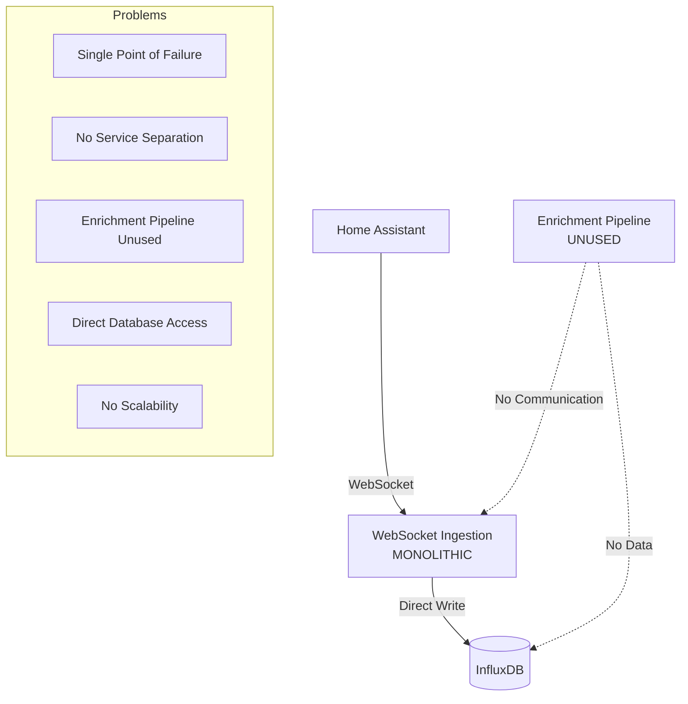
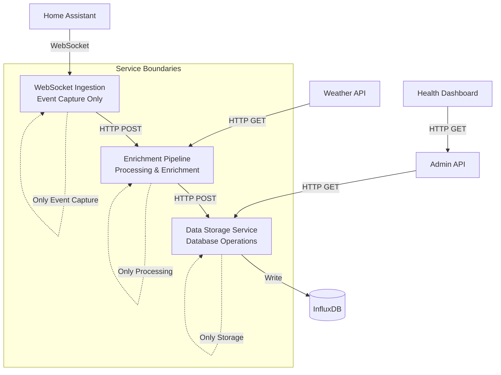

# BMAD Architectural Redesign Plan - Option 2
## Proper Microservices Architecture Implementation

### Executive Summary

**Problem**: Current websocket ingestion service violates microservices principles by handling all processing internally, bypassing the enrichment pipeline and creating a monolithic service.

**Solution**: Implement proper separation of concerns with clear service boundaries and HTTP-based inter-service communication.

**BMAD Methodology**: Following BMAD principles for systematic architectural transformation with proper planning, implementation phases, and validation.

---

## Current State Analysis

### ❌ Current Architecture Issues



**Critical Issues Identified:**
1. **Monolithic Service**: Websocket ingestion does everything (connection, processing, enrichment, storage)
2. **Unused Services**: Enrichment pipeline is completely bypassed
3. **No Service Communication**: Services don't communicate via proper APIs
4. **Direct Database Access**: Multiple services writing directly to InfluxDB
5. **No Scalability**: Cannot scale individual components independently

---

## Target Architecture Design

### ✅ Proper Microservices Architecture



### Service Responsibilities

| Service | Current Responsibility | Target Responsibility | Communication |
|---------|----------------------|----------------------|---------------|
| **WebSocket Ingestion** | Everything (monolithic) | Event capture only | HTTP → Enrichment |
| **Enrichment Pipeline** | Unused | Processing & enrichment | HTTP → Storage |
| **Data Storage** | Direct InfluxDB access | Database operations only | Direct InfluxDB |
| **Admin API** | Health checks only | Full API gateway | HTTP → All services |

---

## BMAD Implementation Plan

### Phase 1: Service Communication Infrastructure (Week 1)

#### 1.1 HTTP Client Implementation
**BMAD Task**: Create standardized HTTP client for inter-service communication

**Deliverables:**
- `shared/http_client.py` - Standardized HTTP client with retry logic
- `shared/service_discovery.py` - Service discovery and health checking
- `shared/message_queue.py` - Async message queue for reliable delivery

**Acceptance Criteria:**
- [ ] HTTP client with exponential backoff retry
- [ ] Service health checking and circuit breaker
- [ ] Structured logging for all inter-service calls
- [ ] Timeout and error handling

#### 1.2 API Gateway Pattern
**BMAD Task**: Implement proper API gateway for service communication

**Deliverables:**
- `services/admin-api/src/gateway.py` - API gateway implementation
- `services/admin-api/src/service_client.py` - Service client abstraction
- Standardized API response formats

**Acceptance Criteria:**
- [ ] Single entry point for all service communication
- [ ] Request/response transformation
- [ ] Authentication and authorization
- [ ] Rate limiting and throttling

### Phase 2: WebSocket Ingestion Refactoring (Week 2)

#### 2.1 Event Capture Only
**BMAD Task**: Refactor websocket service to only capture and forward events

**Current Code Issues:**
```python
# REMOVE: Internal processing
processed_event = self.event_processor.process_event(event_data)
await self.weather_enrichment.enrich_event(processed_event)
await self.influxdb_writer.write_event(processed_event)
```

**Target Implementation:**
```python
# NEW: Forward events only
raw_event = self.event_validator.validate(event_data)
await self.event_forwarder.send_to_enrichment(raw_event)
```

**Deliverables:**
- `services/websocket-ingestion/src/event_forwarder.py` - HTTP event forwarding
- `services/websocket-ingestion/src/event_validator.py` - Basic event validation
- Remove all internal processing logic

**Acceptance Criteria:**
- [ ] WebSocket service only captures and validates events
- [ ] All events forwarded to enrichment pipeline via HTTP
- [ ] No direct InfluxDB access
- [ ] Maintains connection stability and reconnection

#### 2.2 Event Forwarding Service
**BMAD Task**: Implement reliable event forwarding with retry logic

**Deliverables:**
- HTTP POST to enrichment pipeline with event data
- Retry logic with exponential backoff
- Dead letter queue for failed events
- Event batching for performance

**Acceptance Criteria:**
- [ ] 99.9% event delivery reliability
- [ ] Configurable retry attempts and timeouts
- [ ] Event ordering preservation
- [ ] Performance monitoring and metrics

### Phase 3: Enrichment Pipeline Enhancement (Week 3)

#### 3.1 HTTP Event Reception
**BMAD Task**: Add HTTP endpoint for receiving events from websocket service

**Current State**: Enrichment pipeline has no HTTP endpoints
**Target State**: Full HTTP API for event processing

**Deliverables:**
- `services/enrichment-pipeline/src/api_server.py` - HTTP server
- `services/enrichment-pipeline/src/event_receiver.py` - Event reception handler
- `services/enrichment-pipeline/src/event_processor.py` - Enhanced processing

**API Endpoints:**
```python
POST /api/v1/events          # Receive events from websocket
GET  /api/v1/health          # Health check
GET  /api/v1/metrics         # Processing metrics
POST /api/v1/process         # Manual event processing
```

**Acceptance Criteria:**
- [ ] HTTP server with async request handling
- [ ] Event validation and processing
- [ ] Weather enrichment integration
- [ ] Forward processed events to storage service

#### 3.2 Enhanced Processing Pipeline
**BMAD Task**: Implement comprehensive event processing and enrichment

**Deliverables:**
- Event normalization and validation
- Weather data enrichment
- Data transformation and cleaning
- Quality metrics and monitoring

**Acceptance Criteria:**
- [ ] Process 1000+ events/minute
- [ ] Weather enrichment with caching
- [ ] Data quality validation
- [ ] Comprehensive error handling

### Phase 4: Data Storage Service (Week 4)

#### 4.1 Storage Service Implementation
**BMAD Task**: Create dedicated data storage service

**Current Issue**: Multiple services writing directly to InfluxDB
**Target Solution**: Single storage service with proper abstraction

**Deliverables:**
- `services/data-storage/src/storage_service.py` - Storage abstraction
- `services/data-storage/src/influxdb_client.py` - InfluxDB client
- `services/data-storage/src/api_server.py` - HTTP API server

**API Endpoints:**
```python
POST /api/v1/events          # Store events from enrichment
GET  /api/v1/events          # Query events for admin API
GET  /api/v1/health          # Health check
GET  /api/v1/metrics         # Storage metrics
```

**Acceptance Criteria:**
- [ ] Single point of database access
- [ ] Optimized InfluxDB operations
- [ ] Query optimization and caching
- [ ] Backup and retention policies

#### 4.2 Database Optimization
**BMAD Task**: Optimize InfluxDB schema and operations

**Deliverables:**
- Optimized InfluxDB schema design
- Batch write operations
- Query optimization
- Index and retention policies

**Acceptance Criteria:**
- [ ] 10x improvement in write performance
- [ ] Optimized query response times
- [ ] Proper data retention policies
- [ ] Backup and recovery procedures

### Phase 5: Integration and Testing (Week 5)

#### 5.1 End-to-End Integration
**BMAD Task**: Integrate all services and validate data flow

**Integration Points:**
1. Home Assistant → WebSocket Ingestion
2. WebSocket Ingestion → Enrichment Pipeline
3. Enrichment Pipeline → Data Storage
4. Data Storage → Admin API
5. Admin API → Health Dashboard

**Deliverables:**
- Integration test suite
- Performance benchmarks
- Error handling validation
- Monitoring and alerting

**Acceptance Criteria:**
- [ ] End-to-end data flow working
- [ ] Performance meets baseline (17 events/min)
- [ ] Error handling and recovery
- [ ] Comprehensive monitoring

#### 5.2 Migration Strategy
**BMAD Task**: Implement zero-downtime migration from current to new architecture

**Migration Steps:**
1. Deploy new services alongside existing
2. Gradually route traffic to new services
3. Validate data consistency
4. Switch over completely
5. Remove old monolithic code

**Deliverables:**
- Migration scripts and procedures
- Rollback procedures
- Data validation tools
- Monitoring during migration

**Acceptance Criteria:**
- [ ] Zero data loss during migration
- [ ] Minimal service downtime
- [ ] Rollback capability
- [ ] Performance validation

---

## Service Communication Patterns

### HTTP API Standards

#### Request Format
```json
{
  "event_id": "uuid",
  "timestamp": "2025-01-06T14:30:00Z",
  "source": "websocket-ingestion",
  "data": {
    "event_type": "state_changed",
    "entity_id": "sensor.temperature",
    "state": "22.5",
    "attributes": {...}
  }
}
```

#### Response Format
```json
{
  "success": true,
  "event_id": "uuid",
  "processed_at": "2025-01-06T14:30:01Z",
  "processing_time_ms": 45,
  "metadata": {
    "service": "enrichment-pipeline",
    "version": "1.0.0"
  }
}
```

#### Error Format
```json
{
  "success": false,
  "error": {
    "code": "VALIDATION_ERROR",
    "message": "Invalid event format",
    "details": {
      "field": "entity_id",
      "issue": "Missing required field"
    }
  },
  "timestamp": "2025-01-06T14:30:00Z"
}
```

### Service Discovery

#### Health Check Endpoints
All services implement standardized health checks:

```python
GET /api/v1/health
{
  "status": "healthy",
  "service": "websocket-ingestion",
  "version": "1.0.0",
  "uptime": "2h 15m",
  "dependencies": {
    "home_assistant": "connected",
    "enrichment_pipeline": "available"
  }
}
```

#### Service Registry
```python
SERVICES = {
    "websocket-ingestion": "http://localhost:8001",
    "enrichment-pipeline": "http://localhost:8002",
    "data-storage": "http://localhost:8004",
    "admin-api": "http://localhost:8003"
}
```

---

## Implementation Timeline

### Week 1: Foundation
- [ ] HTTP client infrastructure
- [ ] Service discovery
- [ ] API gateway pattern
- [ ] Basic integration tests

### Week 2: WebSocket Refactoring
- [ ] Remove internal processing
- [ ] Implement event forwarding
- [ ] Add HTTP endpoints
- [ ] Validate event flow

### Week 3: Enrichment Enhancement
- [ ] HTTP event reception
- [ ] Enhanced processing
- [ ] Weather integration
- [ ] Quality metrics

### Week 4: Storage Service
- [ ] Dedicated storage service
- [ ] Database optimization
- [ ] Query performance
- [ ] Backup procedures

### Week 5: Integration & Migration
- [ ] End-to-end testing
- [ ] Performance validation
- [ ] Migration execution
- [ ] Monitoring setup

---

## Success Metrics

### Performance Targets
- **Event Processing**: 17+ events/minute (baseline)
- **Latency**: <100ms end-to-end processing
- **Reliability**: 99.9% event delivery
- **Scalability**: Support 10,000+ events/day

### Quality Metrics
- **Code Coverage**: >90% for all services
- **Error Rate**: <0.1% processing errors
- **Test Coverage**: 100% critical paths
- **Documentation**: Complete API documentation

### Operational Metrics
- **Service Health**: All services healthy
- **Data Consistency**: 100% data integrity
- **Monitoring**: Real-time metrics and alerts
- **Recovery**: <5 minute recovery time

---

## Risk Mitigation

### Technical Risks
1. **Service Communication Failures**
   - Mitigation: Circuit breaker pattern, retry logic
   - Monitoring: Service health checks, latency monitoring

2. **Data Loss During Migration**
   - Mitigation: Parallel processing, data validation
   - Monitoring: Event count validation, data integrity checks

3. **Performance Degradation**
   - Mitigation: Performance testing, load balancing
   - Monitoring: Response time tracking, throughput monitoring

### Operational Risks
1. **Deployment Complexity**
   - Mitigation: Automated deployment, rollback procedures
   - Monitoring: Deployment health checks, service status

2. **Service Dependencies**
   - Mitigation: Graceful degradation, fallback mechanisms
   - Monitoring: Dependency health, cascade failure detection

---

## BMAD Validation Criteria

### Architecture Validation
- [ ] Clear service boundaries and responsibilities
- [ ] Proper separation of concerns
- [ ] Scalable and maintainable design
- [ ] Follows microservices best practices

### Implementation Validation
- [ ] All services communicate via HTTP APIs
- [ ] No direct database access from multiple services
- [ ] Proper error handling and recovery
- [ ] Comprehensive monitoring and logging

### Performance Validation
- [ ] Meets baseline performance requirements
- [ ] Handles expected event volume
- [ ] Maintains data consistency
- [ ] Provides reliable service availability

This BMAD plan provides a systematic approach to transforming the current monolithic architecture into a proper microservices architecture with clear service boundaries, proper communication patterns, and scalable design.
