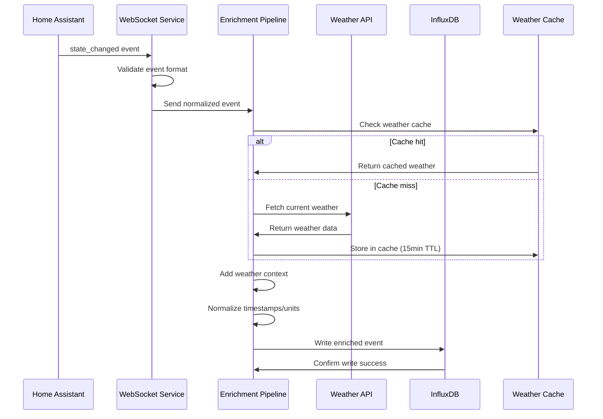
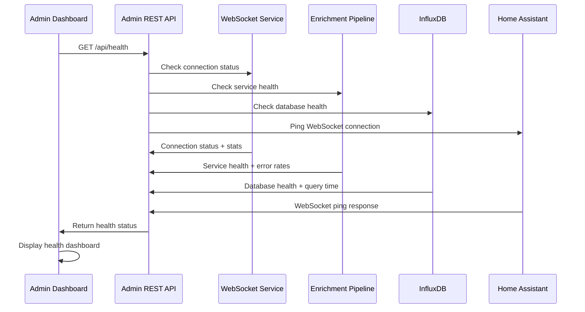
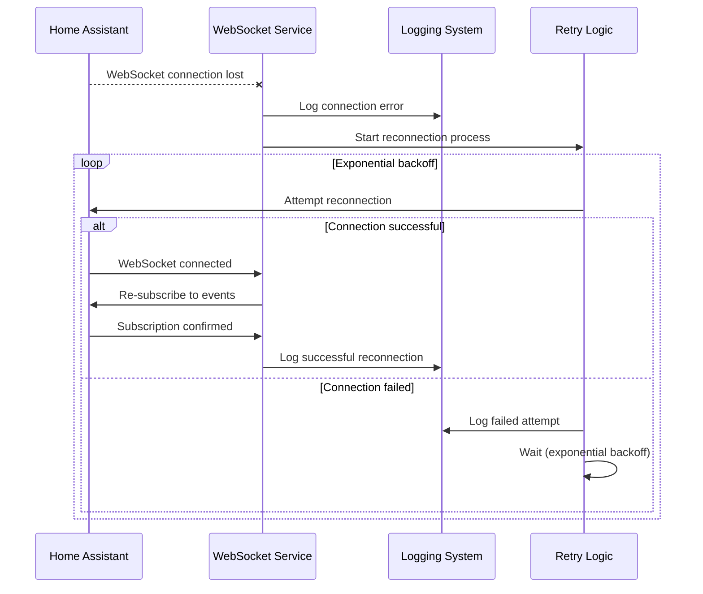
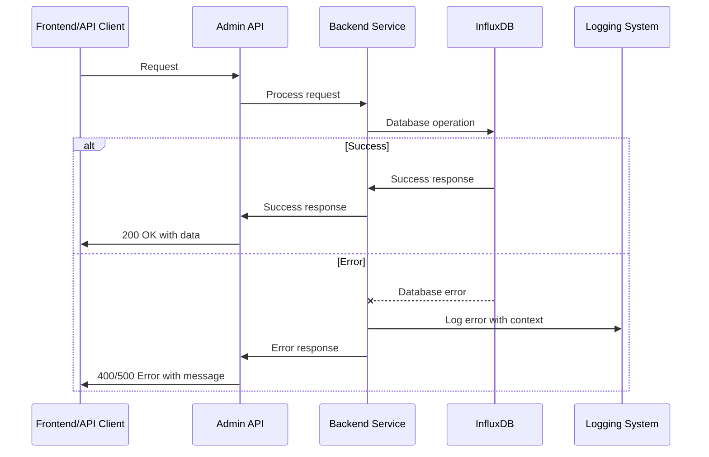

# Home Assistant Ingestion Layer - Detailed Architecture

## Core Workflows

### Primary Data Ingestion Workflow



### System Health Monitoring Workflow



### Error Handling and Reconnection Workflow



## Database Schema

### InfluxDB Schema Design

**Database:** `home_assistant`
**Organization:** `home_assistant`
**Bucket:** `events`
**Retention Policy:** 1 year (365 days)

### Primary Measurement: `home_assistant_events`

**Purpose:** Store all Home Assistant events with enrichment data for time-series analysis

#### Tags (for filtering and grouping):
- `entity_id` - Home Assistant entity identifier (e.g., "sensor.living_room_temperature")
- `domain` - Entity domain (sensor, switch, light, binary_sensor, etc.)
- `device_class` - Device classification (temperature, motion, humidity, etc.)
- `area` - Room/area location (living_room, bedroom, kitchen, etc.)
- `device_name` - Friendly device name
- `integration` - HA integration source (zwave, mqtt, zigbee, etc.)
- `weather_condition` - Current weather condition (clear, cloudy, rain, etc.)
- `time_of_day` - Time period (morning, afternoon, evening, night)

#### Fields (measurements and values):
- `state_value` - Current state value (string)
- `previous_state` - Previous state value (string)
- `normalized_value` - Standardized numeric value (float)
- `confidence` - Sensor confidence level if applicable (float)
- `duration_seconds` - Time in current state (integer)
- `energy_consumption` - Energy usage in kWh if applicable (float)
- `weather_temp` - Current temperature in Celsius (float)
- `weather_humidity` - Current humidity percentage (float)
- `weather_pressure` - Current atmospheric pressure in hPa (float)
- `unit_of_measurement` - Unit of measurement (string)

### Schema Examples

#### Temperature Sensor Event:
```
Measurement: home_assistant_events
Tags:
  entity_id: sensor.living_room_temperature
  domain: sensor
  device_class: temperature
  area: living_room
  weather_condition: clear
  time_of_day: evening
Fields:
  state_value: "22.5"
  normalized_value: 22.5
  weather_temp: 18.2
  weather_humidity: 65.0
  weather_pressure: 1013.25
  unit_of_measurement: "°C"
Timestamp: 2024-12-19T15:30:00Z
```

#### Switch Event:
```
Measurement: home_assistant_events
Tags:
  entity_id: switch.living_room_lamp
  domain: switch
  device_class: switch
  area: living_room
  weather_condition: cloudy
  time_of_day: evening
Fields:
  state_value: "on"
  previous_state: "off"
  normalized_value: 1.0
  energy_consumption: 0.05
Timestamp: 2024-12-19T15:30:00Z
```

### Continuous Queries (Downsampling)

#### Hourly Summaries:
```sql
CREATE CONTINUOUS QUERY "hourly_summaries" ON "home_assistant"
BEGIN
  SELECT 
    mean("normalized_value") as avg_value,
    min("normalized_value") as min_value,
    max("normalized_value") as max_value,
    count("state_value") as event_count
  INTO "home_assistant"."autogen"."hourly_events"
  FROM "home_assistant"."autogen"."home_assistant_events"
  GROUP BY time(1h), "entity_id", "domain", "device_class"
END
```

#### Daily Summaries:
```sql
CREATE CONTINUOUS QUERY "daily_summaries" ON "home_assistant"
BEGIN
  SELECT 
    mean("normalized_value") as avg_value,
    min("normalized_value") as min_value,
    max("normalized_value") as max_value,
    count("state_value") as event_count,
    sum("energy_consumption") as total_energy
  INTO "home_assistant"."autogen"."daily_events"
  FROM "home_assistant"."autogen"."home_assistant_events"
  GROUP BY time(1d), "entity_id", "domain", "device_class"
END
```

### Retention Policies

#### Raw Data:
- **Policy Name:** `raw_data_policy`
- **Duration:** 365 days (1 year)
- **Replication:** 1 (single instance)
- **Shard Duration:** 7 days

#### Hourly Summaries:
- **Policy Name:** `hourly_summary_policy`
- **Duration:** 730 days (2 years)
- **Replication:** 1
- **Shard Duration:** 30 days

#### Daily Summaries:
- **Policy Name:** `daily_summary_policy`
- **Duration:** 1825 days (5 years)
- **Replication:** 1
- **Shard Duration:** 90 days

## Unified Project Structure

```
ha-ingestor/
├── .github/                           # CI/CD workflows
│   └── workflows/
│       ├── ci.yml                     # Continuous integration
│       └── deploy.yml                 # Deployment workflow
├── services/                          # Backend services
│   ├── websocket-ingestion/           # WebSocket client service
│   │   ├── src/
│   │   │   ├── __init__.py
│   │   │   ├── main.py                # Service entry point
│   │   │   ├── websocket_client.py    # HA WebSocket client
│   │   │   ├── event_processor.py     # Event processing logic
│   │   │   └── health_check.py        # Health monitoring
│   │   ├── tests/
│   │   │   ├── test_websocket_client.py
│   │   │   └── test_event_processor.py
│   │   ├── Dockerfile
│   │   └── requirements.txt
│   ├── enrichment-pipeline/           # Data enrichment service
│   │   ├── src/
│   │   │   ├── __init__.py
│   │   │   ├── main.py
│   │   │   ├── weather_service.py     # Weather API integration
│   │   │   ├── data_normalizer.py     # Data normalization
│   │   │   └── influxdb_client.py     # Database operations
│   │   ├── tests/
│   │   ├── Dockerfile
│   │   └── requirements.txt
│   └── admin-api/                     # Admin REST API
│       ├── src/
│       │   ├── __init__.py
│       │   ├── main.py                # FastAPI application
│       │   ├── routes/
│       │   │   ├── __init__.py
│       │   │   ├── health.py          # Health endpoints
│       │   │   ├── stats.py           # Statistics endpoints
│       │   │   ├── events.py          # Events endpoints
│       │   │   └── config.py          # Configuration endpoints
│       │   ├── models/                # Data models
│       │   │   ├── __init__.py
│       │   │   ├── events.py
│       │   │   ├── health.py
│       │   │   └── config.py
│       │   └── services/              # Business logic
│       │       ├── __init__.py
│       │       ├── health_service.py
│       │       └── config_service.py
│       ├── tests/
│       ├── Dockerfile
│       └── requirements.txt
├── frontend/                          # Admin dashboard
│   ├── src/
│   │   ├── components/
│   │   │   ├── HealthDashboard.tsx    # System health display
│   │   │   ├── EventList.tsx          # Recent events list
│   │   │   ├── StatsDisplay.tsx       # Statistics display
│   │   │   └── ConfigForm.tsx         # Configuration form
│   │   ├── services/
│   │   │   ├── api.ts                 # API client
│   │   │   └── types.ts               # TypeScript types
│   │   ├── App.tsx
│   │   └── main.tsx
│   ├── public/
│   ├── tests/
│   ├── package.json
│   ├── vite.config.ts
│   └── Dockerfile
├── shared/                            # Shared code and types
│   ├── types/
│   │   ├── events.ts                  # Event data types
│   │   ├── health.ts                  # Health data types
│   │   └── config.ts                  # Configuration types
│   ├── utils/
│   │   ├── __init__.py
│   │   ├── logging.py                 # Shared logging utilities
│   │   └── validation.py              # Data validation
│   └── constants/
│       ├── __init__.py
│       └── schemas.py                 # Database schemas
├── infrastructure/                    # Deployment configuration
│   ├── docker-compose.yml             # Main orchestration
│   ├── docker-compose.dev.yml         # Development environment
│   ├── docker-compose.prod.yml        # Production environment
│   ├── .env.example                   # Environment template
│   └── influxdb/
│       ├── init-scripts/
│       │   ├── setup-database.sql     # Database initialization
│       │   └── create-retention.sql   # Retention policies
│       └── config/
│           └── influxdb.conf          # InfluxDB configuration
├── scripts/                           # Utility scripts
│   ├── setup.sh                       # Initial setup script
│   ├── backup.sh                      # Data backup script
│   ├── restore.sh                     # Data restore script
│   └── health-check.sh                # System health check
├── docs/                              # Documentation
│   ├── prd.md                         # Product requirements
│   ├── architecture.md                # This architecture document
│   ├── setup.md                       # Setup instructions
│   ├── api.md                         # API documentation
│   └── troubleshooting.md             # Troubleshooting guide
├── tests/                             # Integration tests
│   ├── __init__.py
│   ├── test_integration.py            # End-to-end tests
│   ├── test_data_flow.py              # Data flow tests
│   └── fixtures/                      # Test data
├── .env.example                       # Environment variables template
├── .gitignore
├── docker-compose.yml                 # Main compose file
├── README.md
└── requirements.txt                   # Python dependencies
```

## Development Workflow

### Local Development Setup

#### Prerequisites
```bash
# Required software
- Docker Desktop 24+
- Docker Compose 2.20+
- Node.js 18+ (for frontend development)
- Python 3.11+ (for local testing)
- Git
```

#### Initial Setup
```bash
# Clone repository
git clone <repository-url>
cd ha-ingestor

# Copy environment template
cp .env.example .env

# Edit environment variables
nano .env

# Start development environment
docker-compose -f docker-compose.dev.yml up -d
```

#### Development Commands
```bash
# Start all services
docker-compose -f docker-compose.dev.yml up

# Start frontend only (with hot reload)
cd frontend && npm run dev

# Start backend services only
docker-compose -f docker-compose.dev.yml up websocket-ingestion enrichment-pipeline admin-api influxdb

# Run tests
docker-compose -f docker-compose.dev.yml run --rm websocket-ingestion pytest
docker-compose -f docker-compose.dev.yml run --rm enrichment-pipeline pytest
docker-compose -f docker-compose.dev.yml run --rm admin-api pytest
cd frontend && npm test

# View logs
docker-compose -f docker-compose.dev.yml logs -f websocket-ingestion
docker-compose -f docker-compose.dev.yml logs -f enrichment-pipeline
docker-compose -f docker-compose.dev.yml logs -f admin-api
```

### Environment Configuration

#### Environment Variables
```bash
# Frontend (.env.local)
VITE_API_BASE_URL=http://localhost:8080/api

# Backend (.env)
# Home Assistant Configuration
HA_URL=ws://homeassistant.local:8123/api/websocket
HA_ACCESS_TOKEN=your_long_lived_access_token_here

# Weather API Configuration
WEATHER_API_KEY=your_openweathermap_api_key_here
WEATHER_LOCATION=Your City, Country
WEATHER_CACHE_MINUTES=15

# InfluxDB Configuration
INFLUXDB_URL=http://influxdb:8086
INFLUXDB_TOKEN=your_influxdb_token_here
INFLUXDB_ORG=home_assistant
INFLUXDB_BUCKET=events

# Admin API Configuration
ADMIN_API_HOST=0.0.0.0
ADMIN_API_PORT=8080

# Logging Configuration
LOG_LEVEL=INFO
LOG_FORMAT=json

# Shared
ENVIRONMENT=development
```

## Deployment Architecture

### Deployment Strategy

**Frontend Deployment:**
- **Platform:** Docker container with nginx
- **Build Command:** `npm run build`
- **Output Directory:** `dist/`
- **CDN/Edge:** Local nginx serving static files

**Backend Deployment:**
- **Platform:** Docker containers orchestrated by Docker Compose
- **Build Command:** Docker multi-stage builds
- **Deployment Method:** Docker Compose with health checks and restart policies

### CI/CD Pipeline

```yaml
# .github/workflows/ci.yml
name: CI/CD Pipeline

on:
  push:
    branches: [ main ]
  pull_request:
    branches: [ main ]

jobs:
  test:
    runs-on: ubuntu-latest
    services:
      influxdb:
        image: influxdb:2.7
        ports:
          - 8086:8086

    steps:
    - uses: actions/checkout@v4
    - name: Run tests
      run: |
        docker-compose -f docker-compose.yml build
        docker-compose -f docker-compose.yml up -d
        sleep 30
        docker-compose -f docker-compose.yml run --rm test-integration
        docker-compose -f docker-compose.yml down
```

### Environments

| Environment | Frontend URL | Backend URL | Purpose |
|-------------|--------------|-------------|---------|
| Development | http://localhost:3000 | http://localhost:8080 | Local development |
| Production | http://ha-ingestor.local:3000 | http://ha-ingestor.local:8080 | Live environment |

## Security and Performance

### Security Requirements

**Frontend Security:**
- CSP Headers: `default-src 'self'; script-src 'self' 'unsafe-inline'; style-src 'self' 'unsafe-inline'`
- XSS Prevention: React's built-in XSS protection, input sanitization
- Secure Storage: No sensitive data stored in browser (tokens handled server-side)

**Backend Security:**
- Input Validation: Pydantic models for request validation, type checking
- Rate Limiting: 100 requests/minute per IP for admin API endpoints
- CORS Policy: Allow only localhost and local network access

**Authentication Security:**
- Token Storage: Home Assistant access tokens in environment variables only
- Session Management: Stateless API design, no sessions required
- Password Policy: N/A (uses Home Assistant's existing authentication)

### Performance Optimization

**Frontend Performance:**
- Bundle Size Target: <500KB total bundle size
- Loading Strategy: Code splitting for admin dashboard components
- Caching Strategy: Static assets cached by nginx, API responses cached in browser

**Backend Performance:**
- Response Time Target: <200ms for admin API endpoints
- Database Optimization: InfluxDB indexes on frequently queried tags
- Caching Strategy: Weather data cached for 15 minutes, in-memory only

## Testing Strategy

### Testing Pyramid

```
E2E Tests (Integration)
/        \
Integration Tests (API)
/            \
Frontend Unit  Backend Unit
```

### Test Organization

#### Frontend Tests
```
frontend/tests/
├── components/
│   ├── HealthDashboard.test.tsx
│   ├── EventList.test.tsx
│   └── ConfigForm.test.tsx
├── services/
│   └── api.test.ts
└── __mocks__/
    └── api.ts
```

#### Backend Tests
```
services/*/tests/
├── test_websocket_client.py
├── test_event_processor.py
├── test_weather_service.py
├── test_influxdb_client.py
└── test_api_endpoints.py
```

#### E2E Tests
```
tests/
├── test_integration.py
├── test_data_flow.py
└── fixtures/
    └── sample_events.json
```

### Test Examples

#### Frontend Component Test
```typescript
import { render, screen } from '@testing-library/react';
import { HealthDashboard } from '../HealthDashboard';

test('displays system health status', () => {
  const mockHealth = {
    service_status: { websocket_client: 'healthy' },
    event_stats: { events_per_hour: 100 }
  };
  
  render(<HealthDashboard health={mockHealth} />);
  expect(screen.getByText('healthy')).toBeInTheDocument();
});
```

#### Backend API Test
```python
import pytest
from fastapi.testclient import TestClient
from admin_api.main import app

client = TestClient(app)

def test_health_endpoint():
    response = client.get("/api/health")
    assert response.status_code == 200
    assert "service_status" in response.json()
```

#### E2E Test
```python
import pytest
import asyncio
from services.websocket_ingestion.src.websocket_client import WebSocketClient

@pytest.mark.asyncio
async def test_end_to_end_data_flow():
    # Test complete data flow from HA to InfluxDB
    client = WebSocketClient("ws://test-ha:8123/websocket")
    await client.connect()
    
    # Simulate event and verify storage
    event = await client.receive_event()
    assert event is not None
    
    # Verify event stored in InfluxDB
    stored_event = await query_influxdb(event.entity_id)
    assert stored_event is not None
```

## Coding Standards

### Critical Fullstack Rules

- **Type Sharing:** Always define types in `shared/types/` and import from there
- **API Calls:** Never make direct HTTP calls - use the service layer in `services/`
- **Environment Variables:** Access only through config objects, never `process.env` directly
- **Error Handling:** All API routes must use the standard error handler
- **State Updates:** Never mutate state directly - use proper state management patterns

### Naming Conventions

| Element | Frontend | Backend | Example |
|---------|----------|---------|---------|
| Components | PascalCase | - | `HealthDashboard.tsx` |
| Hooks | camelCase with 'use' | - | `useHealthStatus.ts` |
| API Routes | - | kebab-case | `/api/health-status` |
| Database Tables | - | snake_case | `home_assistant_events` |
| Functions | camelCase | snake_case | `getHealthStatus()` / `get_health_status()` |

## Error Handling Strategy

### Error Flow


### Error Response Format
```typescript
interface ApiError {
  error: {
    code: string;
    message: string;
    details?: Record<string, any>;
    timestamp: string;
    requestId: string;
  };
}
```

### Frontend Error Handling
```typescript
// API service with error handling
export const apiClient = {
  async get<T>(endpoint: string): Promise<T> {
    try {
      const response = await fetch(`/api${endpoint}`);
      if (!response.ok) {
        const error = await response.json();
        throw new ApiError(error.error.message, error.error.code);
      }
      return response.json();
    } catch (error) {
      console.error(`API Error: ${endpoint}`, error);
      throw error;
    }
  }
};
```

### Backend Error Handling
```python
# Standard error handler
@app.exception_handler(Exception)
async def global_exception_handler(request: Request, exc: Exception):
    logger.error(f"Unhandled error: {str(exc)}", extra={
        "request_id": request.headers.get("x-request-id"),
        "endpoint": str(request.url)
    })
    return JSONResponse(
        status_code=500,
        content={"error": {"code": "INTERNAL_ERROR", "message": "Internal server error"}}
    )
```

## Monitoring and Observability

### Monitoring Stack

- **Frontend Monitoring:** Browser console errors, API response times
- **Backend Monitoring:** Python logging with structured JSON format
- **Error Tracking:** Comprehensive error logging with request context
- **Performance Monitoring:** Response time tracking, database query performance

### Key Metrics

**Frontend Metrics:**
- API response times
- JavaScript errors
- Component render performance
- User interactions

**Backend Metrics:**
- Request rate and response times
- Error rate by endpoint
- Database query performance
- WebSocket connection health
- Weather API response times
