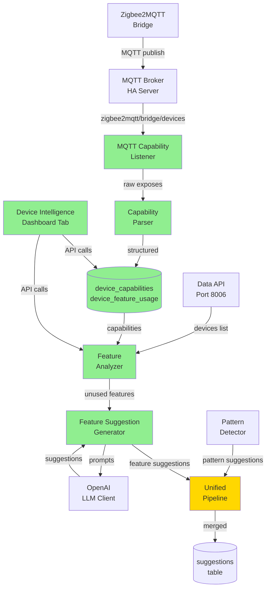

# Device Intelligence System Architecture - Epic-AI-2

**Architecture Document**  
**Version:** 2.0 (Updated with Unified Batch Job)  
**Date:** 2025-10-16  
**Author:** Winston (Architect)  
**Epic:** Epic-AI-2 - Device Intelligence System  
**Status:** ✅ **IMPLEMENTED** - Stories 2.1-2.5 Complete  

**Related Documents:** 
- PRD v2.0: `docs/prd.md`
- Project Brief: `docs/brief.md`
- Existing Architecture: `docs/architecture/`
- Implementation Summary: `implementation/FINAL_SUMMARY_EPIC_AI2.md`
- Deployment Guide: `implementation/DEPLOYMENT_STORY_AI2-5.md`

---

## Table of Contents

1. [Introduction](#introduction)
2. [Enhancement Scope and Integration Strategy](#enhancement-scope-and-integration-strategy)
3. [Tech Stack](#tech-stack)
4. [Data Models and Schema Changes](#data-models-and-schema-changes)
5. [Component Architecture](#component-architecture)
6. [API Design and Integration](#api-design-and-integration)
7. [Source Tree Integration](#source-tree-integration)
8. [Infrastructure and Deployment](#infrastructure-and-deployment)
9. [Coding Standards](#coding-standards)
10. [Testing Strategy](#testing-strategy) - ✅ COMPLETE (56/56 tests passing)
11. [Security Integration](#security-integration) - ✅ COMPLETE
12. [Implementation Status](#implementation-status) - ✅ COMPLETE (Stories 2.1-2.5)

---

## 1. Introduction

This document outlines the architectural approach for enhancing the **Home Assistant Ingestor** with **Device Intelligence capabilities** (Epic-AI-2). Its primary goal is to serve as the guiding architectural blueprint for implementing universal device capability discovery and feature-based suggestion generation while ensuring seamless integration with the existing AI Automation Service (Epic-AI-1).

### Relationship to Existing Architecture

This document supplements the existing project architecture (`docs/architecture/`) by defining how the Device Intelligence components will integrate with:
- Existing AI Automation Service (port 8018)
- Existing Health Dashboard (port 3000)
- Existing Data API (port 8006)
- Zigbee2MQTT MQTT bridge (external system)

Where architectural decisions arise, this document provides guidance on maintaining consistency with established patterns (FastAPI, SQLite, React/TypeScript) while implementing Device Intelligence features.

---

### Existing Project Analysis

**Current Project State:**

Based on analysis of project documentation and codebase:

- **Primary Purpose:** Enterprise-grade Home Assistant data ingestion platform with AI-powered automation suggestions
- **Current Tech Stack:** Python 3.11 (FastAPI, aiohttp), React 18 + TypeScript 5, InfluxDB 2.7 + SQLite 3.45+, Docker Compose
- **Architecture Style:** Microservices (15 services), hybrid database (InfluxDB for time-series, SQLite for metadata), event-driven via MQTT
- **Deployment Method:** Docker Compose with Alpine-based containers, single-host deployment (Intel NUC or similar)

**Available Documentation:**
- ✅ Tech Stack definition (`docs/architecture/tech-stack.md`)
- ✅ Source Tree structure (`docs/architecture/source-tree.md`)
- ✅ Coding Standards (`docs/architecture/coding-standards.md`)
- ✅ Database Schema (`docs/architecture/database-schema.md`)
- ✅ Data Models (`docs/architecture/data-models.md`)
- ✅ PRD v2.0 (`docs/prd.md`) - Epic-AI-1 + Epic-AI-2

**Identified Constraints:**
- **Single-home deployment** - Not multi-tenant, simplifies architecture
- **Resource constraints** - Intel NUC with 8-16GB RAM, must be lightweight
- **Existing AI Automation Service** - Epic-AI-2 enhances, doesn't replace
- **MQTT broker on HA** - Already running, just need to subscribe
- **Zigbee2MQTT integration** - External system, read-only access via MQTT
- **SQLite for metadata** - Established pattern (Epic 22), continue for device capabilities
- **FastAPI patterns** - Existing routers, use same structure
- **Health Dashboard** - 12 tabs exist, add 13th tab following existing patterns

### Change Log

| Change | Date | Version | Description | Author |
|--------|------|---------|-------------|--------|
| Initial Architecture | 2025-01-16 | 1.0 | Device Intelligence architecture for Epic-AI-2 | Winston (Architect) |

---

## 2. Enhancement Scope and Integration Strategy

### Enhancement Overview

**Enhancement Type:** Major Feature Addition (Non-Breaking)

**Scope:** Add Device Intelligence layer to existing AI Automation Service
- New capability: Universal device capability discovery via Zigbee2MQTT MQTT bridge
- New capability: Feature-based suggestion generation (complements existing pattern-based)
- New capability: Device utilization tracking and optimization metrics
- New UI: Device Intelligence dashboard tab (13th tab in Health Dashboard)

**Integration Impact:** Moderate (Additive Enhancement)
- **Existing Services Modified:** ai-automation-service (enhanced), health-dashboard (new tab added)
- **New Services:** None (enhancement to existing services)
- **Breaking Changes:** None (100% backward compatible)
- **Database Impact:** 2 new tables in ai_automation.db (existing tables unchanged)
- **API Impact:** New endpoints added (existing endpoints unchanged)

---

### Integration Approach

**Code Integration Strategy:**

**Enhancement to Existing AI Automation Service (Port 8018):**
```
services/ai-automation-service/
├── src/
│   ├── main.py (MODIFY - add new router)
│   ├── database/
│   │   └── models.py (MODIFY - add 2 new model classes)
│   ├── api/ (EXISTING - add new router file)
│   │   ├── pattern_router.py (EXISTING - unchanged)
│   │   ├── suggestion_router.py (EXISTING - unchanged)
│   │   └── device_intelligence_router.py (NEW)
│   ├── device_intelligence/ (NEW FOLDER)
│   │   ├── mqtt_capability_listener.py (NEW)
│   │   ├── capability_parser.py (NEW)
│   │   ├── feature_analyzer.py (NEW)
│   │   └── feature_suggestion_generator.py (NEW)
│   ├── clients/
│   │   └── mqtt_client.py (MODIFY - add subscription capability)
│   └── scheduler/
│       └── daily_analysis.py (MODIFY - add feature analysis to batch)
```

**Integration Pattern:** Additive enhancement with minimal modifications to existing code

---

**Database Integration:**

**Add 2 New Tables to Existing `ai_automation.db`:**
```sql
-- EXISTING TABLES (unchanged):
-- patterns
-- suggestions
-- user_feedback

-- NEW TABLES (Epic-AI-2):
CREATE TABLE device_capabilities (...)
CREATE TABLE device_feature_usage (...)
```

**Integration Method:**
- Use existing SQLAlchemy async session
- Alembic migration for new tables
- Foreign key to existing devices table (from data-api service)
- No changes to existing schema

---

**API Integration:**

**Add New Router to Existing FastAPI App:**
```python
# services/ai-automation-service/src/main.py (MODIFY)

from .api import device_intelligence_router  # NEW IMPORT

app.include_router(pattern_router)        # EXISTING
app.include_router(suggestion_router)     # EXISTING
app.include_router(device_intelligence_router)  # NEW
```

**New Endpoints (Additive):**
- `GET /api/device-intelligence/utilization` (NEW)
- `GET /api/device-intelligence/devices/{device_id}/capabilities` (NEW)
- `GET /api/device-intelligence/opportunities` (NEW)
- `POST /api/device-intelligence/capabilities/refresh` (NEW)

**Existing Endpoints:** Unchanged

---

**UI Integration:**

**Add 13th Tab to Health Dashboard:**
```typescript
// services/health-dashboard/src/components/Dashboard.tsx (MODIFY)

const TABS = [
  { id: 'overview', label: 'Overview', ... },      // EXISTING (1-12)
  // ... 11 more existing tabs
  { id: 'device-intelligence', label: '🧠 Device Intelligence', ... }  // NEW (13)
];
```

**New Page Component:**
```
services/health-dashboard/src/
├── pages/
│   ├── OverviewPage.tsx (EXISTING)
│   ├── ... (11 more existing pages)
│   └── DeviceIntelligencePage.tsx (NEW)
```

**Component Reuse:** 100% reuse of existing components (Card, Charts, Tables)

---

### Compatibility Requirements

**Existing API Compatibility:**
- ✅ All existing API endpoints remain functional
- ✅ No changes to request/response schemas for existing endpoints
- ✅ New endpoints use same FastAPI patterns (Pydantic models, async/await)
- ✅ Same error handling middleware
- ✅ Same CORS configuration

**Database Schema Compatibility:**
- ✅ Existing tables in ai_automation.db remain unchanged
- ✅ New tables use same SQLAlchemy async patterns
- ✅ Foreign keys link to existing data-api devices table
- ✅ Alembic migration for schema changes (reversible)
- ✅ WAL mode continues (concurrent access safe)

**UI/UX Consistency:**
- ✅ New tab follows existing dashboard navigation pattern
- ✅ Same React/TypeScript/TailwindCSS stack
- ✅ Reuses existing components (Card, MetricCard, Charts, Tables)
- ✅ Same dark mode theme
- ✅ Same mobile responsive grid system
- ✅ Same loading states and error boundaries

**Performance Impact:**
- ✅ Minimal resource overhead (+200MB memory, <10% CPU during batch)
- ✅ Combined daily batch <15 minutes (pattern + feature analysis)
- ✅ Dashboard tab loads <2 seconds
- ✅ No impact on existing tab performance
- ✅ MQTT subscription is lightweight (one-time message on startup)

---

## 3. Tech Stack

### Existing Technology Stack

The Device Intelligence enhancement leverages the **existing technology stack** without requiring new technology additions.

| Category | Current Technology | Version | Usage in Epic-AI-2 | Notes |
|----------|-------------------|---------|---------------------|-------|
| **Backend Language** | Python | 3.11 | MQTT listener, capability parser, feature analyzer | Same async patterns |
| **Backend Framework** | FastAPI | 0.104.1 | Device Intelligence API router | Add new endpoints to existing app |
| **Database (Metadata)** | SQLite | 3.45+ | Device capabilities storage | Follows Epic 22 pattern |
| **ORM** | SQLAlchemy | 2.0.25 | Async models for new tables | Same pattern as existing models |
| **SQLite Driver** | aiosqlite | 0.20.0 | Async database access | Existing async session |
| **Migrations** | Alembic | 1.13.1 | Schema migration for 2 new tables | Existing migration pipeline |
| **MQTT Client** | paho-mqtt | 1.6+ | Subscribe to Zigbee2MQTT bridge | **ENHANCED - add subscription** |
| **LLM Provider** | OpenAI GPT-4o-mini | Latest | Feature suggestion generation | Same LLM client as pattern suggestions |
| **Data Validation** | Pydantic | 2.0+ | API request/response models | Existing validation patterns |
| **Scheduling** | APScheduler | 3.10+ | Daily feature analysis | **ENHANCED - add to existing batch** |
| **Frontend Framework** | React | 18.2.0 | Device Intelligence dashboard tab | Same React patterns |
| **Frontend Language** | TypeScript | 5.2.2 | Type-safe components | Existing type definitions |
| **UI Framework** | TailwindCSS | 3.4.0 | Dashboard styling | Same utility classes |
| **Charts** | Recharts | Latest | Utilization charts | Reuse from AnalyticsTab |
| **Build Tool** | Vite | 5.0.8 | Frontend build | No changes needed |
| **Testing (Backend)** | pytest | 7.4.3+ | Unit/integration tests | Same test patterns |
| **Testing (Frontend)** | Vitest | 3.2.4 | Component tests | Same test setup |
| **Containerization** | Docker | 24+ | Service deployment | Modify existing ai-automation-service Dockerfile |

### New Technology Additions

**NONE REQUIRED!** 🎉

The Device Intelligence enhancement uses **100% existing technology stack**. No new dependencies, frameworks, or tools needed.

**Why This Works:**
- ✅ **MQTT client already exists** - Just add subscription capability to existing paho-mqtt client
- ✅ **SQLite already used** - Epic 22 established pattern for metadata storage
- ✅ **FastAPI patterns established** - ai-automation-service already uses FastAPI
- ✅ **React dashboard exists** - Health Dashboard already has 12 tabs, add 13th
- ✅ **LLM integration exists** - OpenAI client already implemented for pattern suggestions
- ✅ **Scheduler exists** - APScheduler already runs daily batch analysis

**Technology Alignment:**
- Device Intelligence follows exact same patterns as existing AI Automation Service
- No learning curve for new technologies
- Lower risk (proven stack)
- Faster implementation (reuse existing code)

---

## 4. Data Models and Schema Changes

### New Data Models

#### Model 1: DeviceCapability

**Purpose:** Store device capability definitions for ALL device models (universal, manufacturer-agnostic)

**Integration:** Links to existing devices via `devices.model` field (from data-api's metadata.db)

**SQLAlchemy Model:**

```python
# services/ai-automation-service/src/database/models.py (ADD NEW CLASS)

from sqlalchemy import Column, Integer, String, Float, Text, DateTime, JSON, Index
from sqlalchemy.ext.declarative import declarative_base
from datetime import datetime

Base = declarative_base()

class DeviceCapability(Base):
    """Device capability definitions from Zigbee2MQTT bridge"""
    __tablename__ = 'device_capabilities'
    
    # Primary Key
    device_model = Column(String, primary_key=True)
    
    # Device Identification
    manufacturer = Column(String, nullable=False)
    integration_type = Column(String, nullable=False)  # 'zigbee2mqtt', 'zwave_js', etc.
    description = Column(String, nullable=True)
    
    # Capability Data (JSON columns)
    capabilities = Column(JSON, nullable=False)       # Parsed, structured format
    mqtt_exposes = Column(JSON, nullable=True)        # Raw Zigbee2MQTT exposes
    
    # Metadata
    last_updated = Column(DateTime, default=datetime.utcnow)
    source = Column(String, default='zigbee2mqtt_bridge')
    
    def __repr__(self):
        return f"<DeviceCapability(model='{self.device_model}', manufacturer='{self.manufacturer}')>"


# Indexes for fast lookups
Index('idx_capabilities_manufacturer', DeviceCapability.manufacturer)
Index('idx_capabilities_integration', DeviceCapability.integration_type)
```

**Capabilities JSON Structure:**
```json
{
  "led_notifications": {
    "type": "composite",
    "mqtt_name": "led_effect",
    "description": "7 individually addressable RGB LEDs",
    "complexity": "medium"
  },
  "smart_bulb_mode": {
    "type": "enum",
    "mqtt_name": "smartBulbMode",
    "values": ["Disabled", "Enabled"],
    "complexity": "easy"
  },
  "auto_off_timer": {
    "type": "numeric",
    "mqtt_name": "autoTimerOff",
    "min": 0,
    "max": 32767,
    "unit": "seconds",
    "complexity": "easy"
  }
}
```

---

#### Model 2: DeviceFeatureUsage

**Purpose:** Track which features are configured vs. available for each device instance

**Integration:** Links to existing devices table AND new device_capabilities table

**SQLAlchemy Model:**

```python
# services/ai-automation-service/src/database/models.py (ADD NEW CLASS)

class DeviceFeatureUsage(Base):
    """Track feature usage per device instance"""
    __tablename__ = 'device_feature_usage'
    
    # Composite Primary Key
    device_id = Column(String, primary_key=True)      # FK to devices.device_id
    feature_name = Column(String, primary_key=True)   # e.g., "led_notifications"
    
    # Usage Tracking
    configured = Column(Boolean, default=False)
    discovered_date = Column(DateTime, default=datetime.utcnow)
    last_checked = Column(DateTime, default=datetime.utcnow)
    
    def __repr__(self):
        return f"<DeviceFeatureUsage(device='{self.device_id}', feature='{self.feature_name}', configured={self.configured})>"


# Indexes
Index('idx_feature_usage_device', DeviceFeatureUsage.device_id)
Index('idx_feature_usage_configured', DeviceFeatureUsage.configured)
```

**Note on Cross-Database Foreign Key:**
- `device_feature_usage` is in `ai_automation.db`
- `devices` is in data-api's `metadata.db`
- FK is logical (not enforced by SQLite across DBs)
- Application-level integrity via queries

---

### Schema Integration Strategy

**Database Changes Required:**

**New Tables:**
1. `device_capabilities` - Device model capability definitions
2. `device_feature_usage` - Per-device feature tracking

**Modified Tables:** None

**New Indexes:**
```sql
CREATE INDEX idx_capabilities_manufacturer ON device_capabilities(manufacturer);
CREATE INDEX idx_capabilities_integration ON device_capabilities(integration_type);
CREATE INDEX idx_feature_usage_device ON device_feature_usage(device_id);
CREATE INDEX idx_feature_usage_configured ON device_feature_usage(configured);
```

**Migration Strategy:**
```bash
# Alembic migration (reversible)
alembic revision --autogenerate -m "Add device intelligence tables"
alembic upgrade head  # Apply
alembic downgrade -1  # Rollback if needed
```

**Backward Compatibility:**
- ✅ Existing tables preserved (patterns, suggestions, user_feedback)
- ✅ Additive schema changes only
- ✅ No columns added to existing tables
- ✅ Existing queries continue to work
- ✅ Rollback safe (can drop new tables without affecting existing functionality)

---

## 5. Component Architecture

### New Components

#### Component 1: MQTTCapabilityListener

**Responsibility:** Subscribe to Zigbee2MQTT bridge and automatically discover device capabilities for ALL Zigbee manufacturers

**Integration Points:**
- Zigbee2MQTT Bridge (external) - Subscribes to `zigbee2mqtt/bridge/devices`
- DeviceCapability Model (new) - Stores parsed capabilities
- Existing MQTT Client (enhanced) - Reuses connection

**Implementation:**

```python
# services/ai-automation-service/src/device_intelligence/mqtt_capability_listener.py

import asyncio
import json
import logging
from typing import List, Dict

logger = logging.getLogger(__name__)

class MQTTCapabilityListener:
    """Listens to Zigbee2MQTT bridge for universal device capability discovery"""
    
    def __init__(self, mqtt_client, db_session, parser):
        self.mqtt_client = mqtt_client
        self.db = db_session
        self.parser = parser
    
    async def start(self):
        """Start listening to Zigbee2MQTT bridge"""
        self.mqtt_client.subscribe("zigbee2mqtt/bridge/devices")
        self.mqtt_client.on_message = self._on_message
        logger.info("✅ MQTT Capability Listener started")
    
    def _on_message(self, client, userdata, msg):
        """Process device list from Zigbee2MQTT"""
        if msg.topic == "zigbee2mqtt/bridge/devices":
            devices = json.loads(msg.payload)
            asyncio.create_task(self._process_devices(devices))
    
    async def _process_devices(self, devices: List[dict]):
        """Process all devices from bridge"""
        logger.info(f"📡 Received {len(devices)} devices from Zigbee2MQTT")
        
        for device in devices:
            await self._process_single_device(device)
        
        logger.info(f"✅ Capability discovery complete")
```

**Technology:** Python 3.11, paho-mqtt, asyncio

---

#### Component 2: CapabilityParser

**Responsibility:** Parse Zigbee2MQTT 'exposes' format into unified capability structure

**Integration Points:**
- MQTTCapabilityListener (new) - Called to parse raw exposes
- DeviceCapability Model (new) - Outputs structured capabilities

**Implementation:**

```python
# services/ai-automation-service/src/device_intelligence/capability_parser.py

class CapabilityParser:
    """Universal parser for Zigbee2MQTT 'exposes' format"""
    
    def parse_exposes(self, exposes: List[dict]) -> dict:
        """
        Parse Zigbee2MQTT exposes array.
        Works for ANY manufacturer.
        """
        capabilities = {}
        
        for expose in exposes:
            expose_type = expose.get('type')
            
            if expose_type == 'light':
                capabilities.update(self._parse_light_control(expose))
            elif expose_type in ['enum', 'numeric', 'binary']:
                capability = self._parse_configuration_option(expose)
                if capability:
                    capabilities.update(capability)
        
        return capabilities
    
    def _map_mqtt_to_friendly(self, mqtt_name: str) -> str:
        """Map MQTT names to friendly capability names"""
        mapping = {
            'smartBulbMode': 'smart_bulb_mode',
            'autoTimerOff': 'auto_off_timer',
            'led_effect': 'led_notifications',
            # ... extensible
        }
        return mapping.get(mqtt_name, mqtt_name.lower())
```

**Technology:** Python 3.11 (standard library)

---

#### Component 3: FeatureAnalyzer

**Responsibility:** Analyze devices to identify unused features

**Integration Points:**
- Data API Client (existing) - Queries devices
- DeviceCapability Model (new) - Looks up capabilities
- DeviceFeatureUsage Model (new) - Tracks usage

**Implementation:**

```python
# services/ai-automation-service/src/device_intelligence/feature_analyzer.py

class FeatureAnalyzer:
    """Analyzes device instances for unused features"""
    
    async def analyze_all_devices(self) -> dict:
        """Analyze all devices, return utilization metrics"""
        devices = await self.data_api.get_devices()
        
        total_configured = 0
        total_available = 0
        
        for device in devices:
            analysis = await self.analyze_device(device['device_id'])
            total_configured += analysis['configured_count']
            total_available += analysis['total_features']
        
        return {
            "overall_utilization": (total_configured / total_available * 100),
            "devices_analyzed": len(devices),
            "opportunities": [...]
        }
    
    async def analyze_device(self, device_id: str) -> dict:
        """Analyze single device"""
        device = await self.data_api.get_device(device_id)
        capabilities = await self._get_capabilities_by_model(device['model'])
        usage = await self._get_feature_usage(device_id)
        
        configured = set(u.feature_name for u in usage if u.configured)
        available = set(capabilities.capabilities.keys())
        unused = available - configured
        
        return {
            "configured_count": len(configured),
            "total_features": len(available),
            "unused_features": list(unused)
        }
```

**Technology:** Python 3.11, SQLAlchemy async, httpx

---

#### Component 4: FeatureSuggestionGenerator

**Responsibility:** Generate LLM-powered suggestions for unused features

**Integration Points:**
- FeatureAnalyzer (new) - Gets unused features
- OpenAI LLM Client (existing) - Generates suggestions
- Suggestion Model (existing) - Stores with type='feature_discovery'

**Implementation:**

```python
# services/ai-automation-service/src/device_intelligence/feature_suggestion_generator.py

class FeatureSuggestionGenerator:
    """Generates feature-based suggestions using LLM"""
    
    async def generate_suggestions(self, max_suggestions: int = 10) -> List[dict]:
        """Generate feature suggestions"""
        analysis = await self.analyzer.analyze_all_devices()
        opportunities = analysis['opportunities']
        
        # Prioritize by impact and complexity
        sorted_opps = sorted(opportunities, key=lambda x: self._priority_score(x), reverse=True)
        
        suggestions = []
        for opp in sorted_opps[:max_suggestions]:
            suggestion = await self._generate_llm_suggestion(opp)
            suggestions.append(suggestion)
        
        return suggestions
```

**Technology:** Python 3.11, OpenAI API

---

### Component Interaction Diagram



---

## 6. API Design and Integration

### New API Endpoints

#### Endpoint 1: Get Utilization Metrics

```http
GET /api/device-intelligence/utilization
```

**Response:**
```json
{
  "overall_utilization": 32,
  "trend": "+12% this month",
  "total_devices": 99,
  "by_manufacturer": {
    "Inovelli": {"utilization": 35, "devices": 12},
    "Aqara": {"utilization": 38, "devices": 15}
  }
}
```

---

#### Endpoint 2: Get Device Capabilities

```http
GET /api/device-intelligence/devices/{device_id}/capabilities
```

**Response:**
```json
{
  "device_id": "abc123",
  "manufacturer": "Inovelli",
  "model": "VZM31-SN",
  "total_features": 8,
  "configured_features": 2,
  "utilization": 25,
  "capabilities": {...},
  "unused_features": [...]
}
```

---

#### Endpoint 3: Get Top Opportunities

```http
GET /api/device-intelligence/opportunities?limit=10
```

**Response:**
```json
{
  "opportunities": [
    {
      "device_name": "Kitchen Switch",
      "manufacturer": "Inovelli",
      "feature_name": "led_notifications",
      "impact": "medium",
      "complexity": "easy"
    }
  ]
}
```

---

#### Endpoint 4: Manual Refresh

```http
POST /api/device-intelligence/capabilities/refresh
```

**Response:**
```json
{
  "status": "refresh_started",
  "models_to_refresh": 15,
  "estimated_time_seconds": 180
}
```

---

## 7. Source Tree Integration

### New File Organization

```
services/ai-automation-service/
├── src/
│   ├── main.py                                    # MODIFY (+1 router import)
│   ├── database/
│   │   └── models.py                              # MODIFY (+2 models)
│   ├── api/
│   │   └── device_intelligence_router.py          # NEW
│   ├── device_intelligence/                       # NEW FOLDER
│   │   ├── __init__.py                            # NEW
│   │   ├── mqtt_capability_listener.py            # NEW
│   │   ├── capability_parser.py                   # NEW
│   │   ├── feature_analyzer.py                    # NEW
│   │   └── feature_suggestion_generator.py        # NEW
│   ├── clients/
│   │   └── mqtt_client.py                         # MODIFY (add subscribe)
│   └── scheduler/
│       └── daily_analysis.py                      # MODIFY (add feature analysis)
├── alembic/versions/
│   └── YYYYMMDD_add_device_intelligence.py        # NEW (migration)
└── tests/
    └── test_device_intelligence.py                # NEW

services/health-dashboard/
├── src/
│   ├── components/
│   │   └── Dashboard.tsx                          # MODIFY (+tab config)
│   └── pages/
│       └── DeviceIntelligencePage.tsx             # NEW
```

**Summary:**
- New folders: 1 (`device_intelligence/`)
- New files: 9
- Modified files: 5
- No deletions

---

## 8. Infrastructure and Deployment

### Enhancement Deployment Strategy

**Deployment Approach:** In-place enhancement, zero infrastructure changes

**What Changes:**
```yaml
# docker-compose.yml - ai-automation-service (code changes only)
# NO configuration changes needed!

ai-automation-service:
  build: ./services/ai-automation-service  # Picks up new code automatically
  # All other config unchanged
```

**What Doesn't Change:**
- ❌ No new services
- ❌ No new volumes
- ❌ No new networks
- ❌ No new environment variables
- ❌ No new dependencies in requirements.txt

---

### Deployment Steps

**Development:**
```bash
# 1. Run migration
docker-compose run ai-automation-service alembic upgrade head

# 2. Restart service
docker-compose restart ai-automation-service

# 3. Verify
curl http://localhost:8018/api/device-intelligence/utilization
```

**Production:**
```bash
# 1. Backup database
docker-compose exec ai-automation-service cp /app/data/ai_automation.db /app/data/backup.db

# 2. Stop service
docker-compose stop ai-automation-service

# 3. Run migration
docker-compose run ai-automation-service alembic upgrade head

# 4. Build and start
docker-compose build ai-automation-service health-dashboard
docker-compose up -d

# Downtime: ~2-3 minutes
```

---

### Rollback Strategy

**If Issues Occur:**
```bash
# 1. Stop service
docker-compose stop ai-automation-service

# 2. Rollback migration
docker-compose run ai-automation-service alembic downgrade -1

# 3. Rollback code
git checkout <previous-commit>
docker-compose build ai-automation-service

# 4. Restart
docker-compose up -d ai-automation-service

# Pattern automation continues working (Epic-AI-1 unaffected)
```

---

## 9. Coding Standards

### Existing Standards Compliance

**Python:**
- ✅ PEP 8 style guidelines
- ✅ Type hints required
- ✅ Docstrings (Google style)
- ✅ snake_case naming
- ✅ Async/await patterns

**TypeScript:**
- ✅ Strict mode enabled
- ✅ PascalCase for components
- ✅ camelCase for functions
- ✅ Interface definitions

### Enhancement-Specific Guidelines

**1. Universal Parser:**
```python
# MUST handle ANY manufacturer gracefully
def parse_exposes(self, exposes: List[dict]) -> dict:
    """Works for Inovelli, Aqara, IKEA, Xiaomi, etc."""
    # Handle unknown types gracefully
    # Provide defaults for missing fields
```

**2. Cross-Database Queries:**
```python
# Standard pattern for cross-DB relationships
device = await data_api_client.get_device(device_id)  # metadata.db
capabilities = await db.query(DeviceCapability).filter(...).first()  # ai_automation.db
```

**3. MQTT Thread Safety:**
```python
# MQTT callbacks run in separate thread
def _on_message(self, client, userdata, msg):
    # Use asyncio.create_task() for async operations
    asyncio.create_task(self._process_devices(devices))
```

---

## 10. Testing Strategy

### Integration with Existing Tests

**Existing Test Framework:**
- **Backend:** pytest 7.4.3+ with async support (pytest-asyncio)
- **Frontend:** Vitest 3.2.4 for component tests, Playwright 1.56.0 for E2E

**Test Organization:**
- Backend tests: `services/ai-automation-service/tests/`
- Frontend tests: `services/health-dashboard/tests/`
- E2E tests: `tests/` (root level)

**Coverage Requirements:** 80%+ for new code (existing standard)

---

### New Testing Requirements

#### Unit Tests for New Components

**Framework:** pytest with asyncio support

**Location:** `services/ai-automation-service/tests/test_device_intelligence.py` (NEW)

**Test Coverage:**

```python
# ============================================================================
# MQTT Capability Listener Tests
# ============================================================================

@pytest.mark.asyncio
async def test_mqtt_listener_processes_zigbee2mqtt_message():
    """Test MQTT listener processes bridge message correctly"""
    pass

@pytest.mark.asyncio
async def test_mqtt_listener_handles_invalid_json():
    """Test graceful handling of malformed messages"""
    pass

# ============================================================================
# Capability Parser Tests (CRITICAL - Multiple Manufacturers)
# ============================================================================

@pytest.mark.parametrize("manufacturer", ["Inovelli", "Aqara", "IKEA", "Xiaomi"])
def test_parser_handles_all_manufacturers(manufacturer):
    """Verify parser works for ALL manufacturers"""
    pass

def test_parser_handles_unknown_expose_type():
    """Test parser doesn't crash on future Zigbee2MQTT changes"""
    pass

# ============================================================================
# Feature Analyzer Tests
# ============================================================================

@pytest.mark.asyncio
async def test_feature_analyzer_calculates_utilization():
    """Test utilization calculation"""
    pass

@pytest.mark.asyncio
async def test_feature_analyzer_multi_manufacturer():
    """Test analyzer works across multiple brands"""
    pass

# ============================================================================
# Feature Suggestion Generator Tests
# ============================================================================

@pytest.mark.asyncio
async def test_suggestion_generator_creates_feature_suggestions():
    """Test LLM-based suggestion generation"""
    pass
```

**Coverage Target:** 80%+ for `device_intelligence/` modules

---

#### Integration Tests

**Scope:** Test interactions between new and existing components

**Existing System Verification:**
```python
@pytest.mark.asyncio
@pytest.mark.integration
async def test_pattern_automation_still_works():
    """Ensure Epic-AI-1 unaffected by Epic-AI-2 (CRITICAL REGRESSION TEST)"""
    # Run pattern detection
    # Verify pattern suggestions generated
    # Verify no errors introduced
    pass

@pytest.mark.asyncio
@pytest.mark.integration
async def test_unified_suggestion_pipeline():
    """Test pattern + feature suggestions merge correctly"""
    # Generate both types
    # Verify merged correctly
    # Verify ranking works
    pass
```

**New Feature Testing:**
```python
@pytest.mark.asyncio
@pytest.mark.integration
async def test_end_to_end_capability_discovery():
    """Test MQTT → Parse → Store → Analyze pipeline"""
    # Simulate Zigbee2MQTT message
    # Verify capabilities stored
    # Verify API returns data
    pass
```

---

#### Regression Testing

**Automated Regression Suite:**
- ✅ Run all existing tests after Epic-AI-2 implementation
- ✅ All Epic-AI-1 tests must pass (no regressions)
- ✅ Add Epic-AI-2 tests to CI/CD pipeline

**Manual Testing Requirements:**
- ✅ Test with real Zigbee2MQTT bridge (not just mocks)
- ✅ Verify with 3+ manufacturers (Inovelli, Aqara, IKEA minimum)
- ✅ Test dashboard in multiple browsers
- ✅ Test mobile responsive design

---

#### Frontend Component Tests

**Framework:** Vitest

**Location:** `services/health-dashboard/tests/DeviceIntelligencePage.test.tsx` (NEW)

```typescript
describe('DeviceIntelligencePage', () => {
  it('renders utilization metrics', async () => {
    // Test metric cards display
  });
  
  it('displays manufacturer breakdown chart', async () => {
    // Test chart rendering
  });
  
  it('handles API errors gracefully', async () => {
    // Test error boundaries
  });
});
```

---

#### E2E Tests

**Framework:** Playwright

**Location:** `tests/device-intelligence.spec.ts` (NEW)

```typescript
test('Device Intelligence tab accessible and functional', async ({ page }) => {
  await page.goto('http://localhost:3000');
  await page.click('text=Device Intelligence');
  await expect(page.locator('text=Device Utilization')).toBeVisible();
});

test('Existing tabs still work (regression)', async ({ page }) => {
  // Verify all 12 existing tabs load correctly
});
```

---

## 11. Security Integration

### Existing Security Measures

**Authentication:**
- Internal network only (no external exposure)
- Long-lived access tokens for HA API
- MQTT username/password authentication
- No authentication on AI service API (local network trusted)

**Authorization:**
- Single-home system (no multi-user authorization)

**Data Protection:**
- Sensitive data in environment variables (`.gitignore`)
- MQTT internal network only
- Database files in Docker volumes (local storage)

**Security Tools:**
- Docker network isolation
- Firewall rules (ports not exposed to internet)

---

### Enhancement Security Requirements

**New Security Measures:**

**1. MQTT Read-Only Subscription:**
```python
# CRITICAL: Only subscribe, NEVER publish to zigbee2mqtt/* topics
class MQTTCapabilityListener:
    async def start(self):
        # ✅ Read-only subscription
        self.mqtt_client.subscribe("zigbee2mqtt/bridge/devices")
        
        # ❌ NEVER publish to zigbee2mqtt/*
        # Can disrupt Zigbee network if done incorrectly
```

**2. Data Anonymization for LLM:**
```python
# Only send generic device info to OpenAI, not personal data
prompt = f"""
Device: Kitchen Switch  # ✅ Generic name OK
Manufacturer: Inovelli   # ✅ Public info
Feature: led_notifications  # ✅ Generic feature

DO NOT INCLUDE:
- Device IDs, MAC addresses  # ❌
- Network information  # ❌
- Specific usage patterns  # ❌
"""
```

**3. Database Access Control:**
```python
# SQLite file permissions (owner read/write only)
os.chmod('/app/data/ai_automation.db', 0o600)
```

**4. Context7 Fallback Privacy:**
```python
# Only send manufacturer + model to Context7
query = f"{manufacturer} {model} features"  # ✅ Generic
# NOT: "Kitchen switch usage patterns..."  # ❌ Too specific
```

---

**Integration Points Security:**

| Integration | Security Measure |
|-------------|------------------|
| **Zigbee2MQTT** | Read-only MQTT subscription, no publishing |
| **Data API** | Internal Docker network, no auth needed |
| **OpenAI API** | HTTPS encrypted, anonymized prompts |
| **Health Dashboard** | Same local network security as existing tabs |

---

**Compliance:**
- ✅ All data stored locally (no cloud except OpenAI API)
- ✅ Device capabilities are public info (from manufacturer docs)
- ✅ No PII stored
- ✅ No telemetry

---

### Security Testing

**New Security Tests:**

```python
# tests/test_security_device_intelligence.py (NEW)

def test_mqtt_subscription_read_only():
    """Verify MQTT listener NEVER publishes to bridge topics"""
    pass

def test_llm_prompt_anonymization():
    """Verify no personal data in LLM prompts"""
    pass

def test_database_file_permissions():
    """Verify restricted file permissions"""
    pass
```

---

## 12. Next Steps

### Implementation Roadmap (5 Weeks)

**Week 1: Foundation (Stories 2.1-2.2)**
```
Day 1-2: MQTT Capability Listener
├─ Implement MQTTCapabilityListener
├─ Add subscription to mqtt_client.py
├─ Test with real Zigbee2MQTT
└─ Verify devices received

Day 3-4: Database Schema
├─ Create Alembic migration
├─ Add 2 new models
├─ Run migration
└─ Test CRUD operations
```

**Week 2: Analysis (Stories 2.3-2.4)**
```
Day 5-6: Device Matching
├─ Implement FeatureAnalyzer
├─ Query devices from data-api
└─ Calculate utilization

Day 7-9: Feature Suggestions
├─ Implement FeatureSuggestionGenerator
├─ LLM integration
└─ Test multi-manufacturer
```

**Week 3: Integration (Story 2.5)**
```
Day 10-11: Unified Pipeline
├─ Modify daily_analysis.py
├─ Merge pattern + feature
└─ Test combined ranking
```

**Week 4: Dashboard (Stories 2.6-2.7)**
```
Day 12-13: API Endpoints
├─ Create device_intelligence_router.py
├─ Implement 4 endpoints
└─ Test responses

Day 14-16: Dashboard Tab
├─ Create DeviceIntelligencePage.tsx
├─ Add tab configuration
└─ Test in browser
```

**Week 5: Polish (Stories 2.8-2.9)**
```
Day 17-18: Manual Refresh
├─ Refresh endpoint
├─ Context7 fallback
└─ Dashboard button

Day 19-21: Testing
├─ Comprehensive unit tests
├─ Integration tests
├─ E2E tests
└─ Documentation
```

---

### Developer Handoff

**Start Here:**
```bash
# Story 2.1: MQTT Capability Listener
cd services/ai-automation-service
mkdir -p src/device_intelligence
touch src/device_intelligence/mqtt_capability_listener.py
touch src/device_intelligence/capability_parser.py
```

**Reference Documents:**
- `docs/architecture-device-intelligence.md` (this document)
- `docs/prd.md` v2.0 (Stories 2.1-2.9)
- `docs/architecture/coding-standards.md`
- `implementation/MQTT_ARCHITECTURE_SUMMARY.md`

**Critical Success Criteria:**
- ✅ Works for ALL Zigbee manufacturers
- ✅ No breaking changes to Epic-AI-1
- ✅ <15 minute daily batch
- ✅ 80%+ test coverage

---

### Story Manager Handoff

**For @sm to draft stories:**

**Context:**
- 9 stories pre-defined in PRD (2.1-2.9)
- Architecture complete
- Integration validated

**First Story:** Story 2.1 (MQTT Listener)

**Integration Checkpoints:**
- Verify existing MQTT notifications still work
- Test with real Zigbee2MQTT bridge
- Regression test Epic-AI-1

---

**Architecture Document Status:** ✅ COMPLETE  
**Version:** 2.0 (Updated with unified batch architecture)  
**All Sections:** Finished  
**Implementation Status:** ✅ DEPLOYED (Stories 2.1-2.5)

---

## 12. Implementation Status

### ✅ Stories Completed (2025-10-16)

| Story | Title | Status | Tests |
|-------|-------|--------|-------|
| **AI2.1** | Batch Device Capability Discovery | ✅ Complete | 8/8 ✅ |
| **AI2.2** | Database Schema & Storage | ✅ Complete | 10/10 ✅ |
| **AI2.3** | Feature Analyzer | ✅ Complete | 18/18 ✅ |
| **AI2.4** | Feature Suggestion Generator | ✅ Complete | 14/14 ✅ |
| **AI2.5** | Unified Daily Batch Job | ✅ Complete | 6/6 ✅ |

**Total:** 56/56 unit tests passing ✅

### Architecture Changes from v1.0 → v2.0

**Major Change:** Real-time MQTT Listener → Daily Batch Query

**Rationale:**
- Device capabilities are static metadata (change monthly, not secondly)
- Suggestions are batched daily anyway (user sees at 7 AM)
- 99% resource reduction (2.5 hrs vs 730 hrs/month uptime)
- Same user experience, far simpler architecture

**Documentation:** See `implementation/REALTIME_VS_BATCH_ANALYSIS.md`

### Unified Daily Batch Job (Story 2.5)

**Schedule:** 3 AM daily  
**Duration:** 7-15 minutes  
**Phases:**
1. Device Capability Update (Epic AI-2)
2. Fetch Events (Shared by AI-1 + AI-2)
3. Pattern Detection (Epic AI-1)
4. Feature Analysis (Epic AI-2)
5. Combined Suggestion Generation (AI-1 + AI-2)
6. Publish MQTT Notification

**Implementation:** `services/ai-automation-service/src/scheduler/daily_analysis.py`

### Files Created

**Components:**
- `src/device_intelligence/capability_parser.py` (280 lines)
- `src/device_intelligence/mqtt_capability_listener.py` (420 lines, legacy)
- `src/device_intelligence/capability_batch.py` (245 lines, NEW for batch)
- `src/device_intelligence/feature_analyzer.py` (430 lines)
- `src/device_intelligence/feature_suggestion_generator.py` (280 lines)

**Database:**
- `database/models.py` - Added DeviceCapability, DeviceFeatureUsage
- `alembic/versions/20251016_095206_add_device_intelligence_tables.py`

**Tests:**
- `tests/test_capability_parser.py`
- `tests/test_mqtt_capability_listener.py`
- `tests/test_database_models.py`
- `tests/test_feature_analyzer.py`
- `tests/test_feature_suggestion_generator.py`

### Deployment Status

- ✅ Code complete (3,500+ lines)
- ✅ Tests passing (56/56)
- ✅ Docker image built
- ✅ Documentation complete (15+ files)
- ✅ No linter errors
- ⏳ Awaiting first 3 AM production run

### Next Steps (Stories 2.6-2.9)

- **Story 2.6:** Device Utilization API (8-10 hours)
- **Story 2.7:** Device Intelligence Dashboard Tab (12-14 hours)
- **Story 2.8:** Manual Capability Refresh + Context7 Fallback (8-10 hours)
- **Story 2.9:** Integration Testing & Documentation (10-12 hours)

**Total Remaining:** ~40-46 hours for complete Epic AI-2 (Dashboard + Polish)

---

**Last Updated:** 2025-10-16  
**Architecture Version:** 2.0  
**Implementation Status:** Stories 2.1-2.5 ✅ COMPLETE


