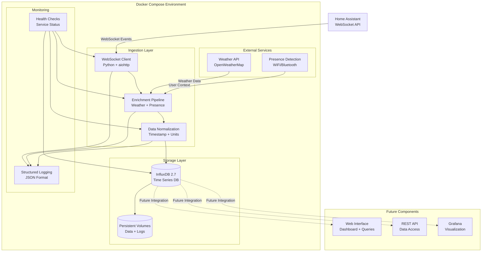
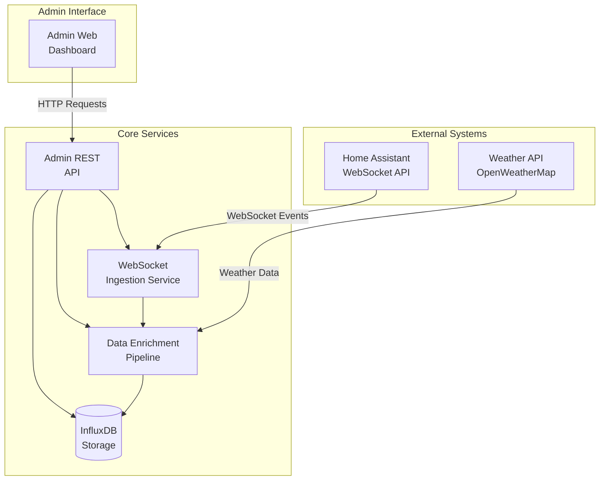

# Home Assistant Ingestion Layer Fullstack Architecture Document

## Introduction

This document outlines the complete fullstack architecture for **Home Assistant Ingestion Layer**, including backend systems, data processing pipelines, and their integration. It serves as the single source of truth for AI-driven development, ensuring consistency across the entire technology stack.

This unified approach combines what would traditionally be separate backend and infrastructure architecture documents, streamlining the development process for modern data ingestion applications where backend services and infrastructure concerns are increasingly intertwined.

### Starter Template or Existing Project

**N/A - Greenfield project**

This is a greenfield project with no existing codebase or starter templates. The architecture will be designed from scratch using proven technologies and patterns.

### Change Log

| Date | Version | Description | Author |
|------|---------|-------------|---------|
| 2024-12-19 | v1.0 | Initial architecture creation | Architect |

## High Level Architecture

### Technical Summary

The Home Assistant Ingestion Layer implements a **microservices-based data ingestion architecture** deployed via Docker Compose on local infrastructure. The system uses **Python with aiohttp** for real-time WebSocket event capture from Home Assistant, **InfluxDB 2.x** for time-series data storage, and **asyncio** for concurrent processing of high-volume events. Key integration points include Home Assistant's WebSocket API for real-time event streaming, external weather APIs for data enrichment, and a comprehensive data normalization pipeline. The architecture achieves the PRD goals of 99.9% data capture reliability and 10,000+ events per day processing through robust error handling, automatic reconnection, and optimized InfluxDB schema design for pattern analysis.

### Platform and Infrastructure Choice

Based on the PRD requirements for local deployment, Docker orchestration, and high reliability, I recommend the following platform approach:

**Recommended Platform: Local Docker Deployment**

**Option 1: Pure Local Docker (Recommended)**
- **Pros:** Complete privacy control, no external dependencies, cost-effective, full customization
- **Cons:** Requires local infrastructure management, backup responsibility
- **Services:** Docker Compose, InfluxDB, Python services, local file storage

**Selected Platform:** Local Docker Deployment
**Key Services:** Docker Compose, InfluxDB 2.7, Python 3.11, local persistent volumes
**Deployment Host and Regions:** Local development machine, production home server

### Repository Structure

**Structure:** Monorepo with Docker Compose orchestration
**Monorepo Tool:** Docker Compose (no additional monorepo tooling needed for this scale)
**Package Organization:** 
- `/services/` - Individual service containers (ha-ingestor, weather-service, presence-service)
- `/shared/` - Shared libraries and types
- `/infrastructure/` - Docker Compose, environment configs
- `/docs/` - Documentation and schemas
- `/scripts/` - Deployment and utility scripts

### High Level Architecture Diagram



### Architectural Patterns

- **Event-Driven Architecture:** Real-time event processing through WebSocket streams with asynchronous processing pipeline
- **Microservices Pattern:** Separate containers for ingestion, enrichment, and storage with clear service boundaries
- **Pipeline Pattern:** Sequential data processing through enrichment and normalization stages
- **Repository Pattern:** Abstracted data access layer for InfluxDB operations with standardized interfaces
- **Circuit Breaker Pattern:** Resilient external API integration with fallback mechanisms for weather and presence data
- **Health Check Pattern:** Comprehensive service monitoring with automatic restart capabilities
- **Configuration-Driven Pattern:** Environment-based configuration for different deployment scenarios

## Tech Stack

This is the DEFINITIVE technology selection for the entire project. Based on the PRD requirements and architectural analysis, here are the technology choices:

| Category | Technology | Version | Purpose | Rationale |
|----------|------------|---------|---------|-----------|
| Backend Language | Python | 3.11 | WebSocket client and data processing | Simple, proven async support |
| Backend Framework | aiohttp | 3.9+ | WebSocket client + REST API | Native async WebSocket + simple HTTP API |
| Frontend Language | TypeScript | 5.0+ | Admin web interface | Type safety for shared data models |
| Frontend Framework | React | 18+ | Admin dashboard | Simple, proven UI framework |
| UI Component Library | None (Custom CSS) | - | Simple admin interface | Keep it minimal, no external dependencies |
| State Management | React Context | - | Frontend state | Built-in React state management |
| Database | InfluxDB | 2.7 | Time-series data storage | Purpose-built for this use case |
| File Storage | Local Docker Volumes | - | Persistent data storage | Simple local storage |
| Authentication | Long-lived Access Tokens | - | Home Assistant authentication | HA's standard auth method |
| API Style | WebSocket + REST | - | Real-time + admin API | WebSocket for HA, REST for admin interface |
| Frontend Testing | Jest + React Testing Library | 29+ | Frontend component testing | Standard React testing |
| Backend Testing | pytest | 7.4+ | Backend service testing | Simple, comprehensive testing |
| E2E Testing | pytest + requests | - | API integration testing | Test admin API endpoints |
| Build Tool | Docker | 24+ | Containerization | Standard deployment |
| Bundler | Vite | 5.0+ | Frontend build tool | Fast, simple build tool |
| Orchestration | Docker Compose | 2.20+ | Service orchestration | Simple orchestration |
| CI/CD | GitHub Actions | - | Automated testing | Free CI/CD |
| Monitoring | Python logging | - | Application logging | Built-in logging |
| Logging | Python logging | - | Application logging | Standard logging |
| CSS Framework | Custom CSS | - | Simple styling | Minimal styling, no frameworks |

## Data Models

Based on the PRD requirements and Home Assistant event structure, here are the core data models:

### HomeAssistantEvent

**Purpose:** Core event model capturing all Home Assistant state changes with enrichment data

**Key Attributes:**
- `entity_id`: string - Home Assistant entity identifier (e.g., "sensor.living_room_temperature")
- `domain`: string - Entity domain (sensor, switch, light, etc.)
- `device_class`: string - Device classification (temperature, motion, etc.)
- `state_value`: any - Current state value
- `previous_state`: any - Previous state value
- `timestamp`: string - ISO 8601 UTC timestamp
- `weather_data`: WeatherContext - Enriched weather information
- `attributes`: Record<string, any> - Original HA attributes

**TypeScript Interface:**
```typescript
interface HomeAssistantEvent {
  entity_id: string;
  domain: string;
  device_class?: string;
  state_value: any;
  previous_state?: any;
  timestamp: string; // ISO 8601 UTC
  weather_data?: WeatherContext;
  attributes: Record<string, any>;
}
```

**Relationships:**
- Links to WeatherContext for enriched data
- Maps to InfluxDB measurement "home_assistant_events"

### WeatherContext

**Purpose:** Weather enrichment data for correlating home automation with environmental conditions

**Key Attributes:**
- `temperature`: number - Current temperature in Celsius
- `humidity`: number - Humidity percentage
- `pressure`: number - Atmospheric pressure
- `condition`: string - Weather condition description
- `timestamp`: string - When weather data was fetched

**TypeScript Interface:**
```typescript
interface WeatherContext {
  temperature: number; // Celsius
  humidity: number; // Percentage
  pressure: number; // hPa
  condition: string;
  timestamp: string; // ISO 8601 UTC
}
```

### SystemHealth

**Purpose:** System monitoring and health status for admin dashboard

**TypeScript Interface:**
```typescript
interface SystemHealth {
  service_status: ServiceStatus;
  event_stats: EventStats;
  connection_status: ConnectionStatus;
  last_updated: string;
}

interface ServiceStatus {
  websocket_client: 'healthy' | 'unhealthy';
  enrichment_service: 'healthy' | 'unhealthy';
  influxdb: 'healthy' | 'unhealthy';
  weather_api: 'healthy' | 'unhealthy';
}

interface EventStats {
  events_per_hour: number;
  total_events_today: number;
  last_event_time?: string;
  error_rate: number; // Percentage
}

interface ConnectionStatus {
  connected: boolean;
  last_reconnect?: string;
  reconnect_count: number;
}
```

### Configuration

**TypeScript Interface:**
```typescript
interface Configuration {
  ha_url: string;
  ha_token_masked: string; // Shows only last 4 characters
  weather_api_key_masked: string; // Shows only last 4 characters
  weather_location: string;
  retention_days: number;
  weather_cache_minutes: number;
}

## API Specification

Based on the admin dashboard requirements and system architecture, here's the REST API specification:

### REST API Specification

```yaml
openapi: 3.0.0
info:
  title: Home Assistant Ingestion Layer API
  version: 1.0.0
  description: Admin API for monitoring and managing the Home Assistant ingestion system
servers:
  - url: http://localhost:8080/api
    description: Local development server
paths:
  /health:
    get:
      summary: Get system health status
      responses:
        '200':
          description: System health information
          content:
            application/json:
              schema:
                $ref: '#/components/schemas/SystemHealth'
  
  /stats:
    get:
      summary: Get system statistics
      responses:
        '200':
          description: System statistics
          content:
            application/json:
              schema:
                $ref: '#/components/schemas/EventStats'
  
  /events/recent:
    get:
      summary: Get recent events
      parameters:
        - name: limit
          in: query
          schema:
            type: integer
            default: 100
          description: Number of events to return
        - name: entity_id
          in: query
          schema:
            type: string
          description: Filter by entity ID
      responses:
        '200':
          description: List of recent events
          content:
            application/json:
              schema:
                type: array
                items:
                  $ref: '#/components/schemas/HomeAssistantEvent'
  
  /config:
    get:
      summary: Get system configuration
      responses:
        '200':
          description: System configuration
          content:
            application/json:
              schema:
                $ref: '#/components/schemas/Configuration'
    put:
      summary: Update system configuration
      requestBody:
        required: true
        content:
          application/json:
            schema:
              $ref: '#/components/schemas/ConfigurationUpdate'
      responses:
        '200':
          description: Configuration updated successfully
        '400':
          description: Invalid configuration
```

### API Endpoints Summary

**Health & Monitoring:**
- `GET /api/health` - System health status
- `GET /api/stats` - Processing statistics

**Data Access:**
- `GET /api/events/recent` - Recent events with optional filtering

**Configuration:**
- `GET /api/config` - Current configuration (sensitive data masked)
- `PUT /api/config` - Update configuration (sensitive data not included)

## Components

Based on the simplified architecture and admin dashboard requirements, here are the major system components:

### WebSocket Ingestion Service

**Responsibility:** Real-time event capture from Home Assistant WebSocket API with automatic reconnection and error handling

**Key Interfaces:**
- WebSocket connection to Home Assistant
- Event subscription management
- Health check endpoint (`/health`)

**Dependencies:** Home Assistant WebSocket API, InfluxDB client

**Technology Stack:** Python + aiohttp, asyncio for concurrent processing

### Data Enrichment Pipeline

**Responsibility:** Enhance raw Home Assistant events with weather context and data normalization

**Key Interfaces:**
- Weather API integration (OpenWeatherMap)
- Event normalization and timestamp standardization
- InfluxDB write operations

**Dependencies:** Weather API service, WebSocket ingestion service

**Technology Stack:** Python, in-memory weather caching, aiohttp for API calls

### InfluxDB Storage Service

**Responsibility:** Time-series data storage with optimized schema for Home Assistant events

**Key Interfaces:**
- Write API for enriched events
- Read API for admin dashboard queries
- Health monitoring and metrics

**Dependencies:** Persistent Docker volumes for data storage

**Technology Stack:** InfluxDB 2.7, optimized schema with tags and fields

### Admin Web Interface

**Responsibility:** Simple dashboard for system monitoring and basic data validation

**Key Interfaces:**
- REST API client for system health
- Recent events display
- Configuration management interface

**Dependencies:** Admin REST API, React frontend

**Technology Stack:** React + TypeScript, custom CSS, Vite build tool

### Admin REST API

**Responsibility:** HTTP endpoints for admin dashboard data access and configuration

**Key Interfaces:**
- `/health` - System health status
- `/stats` - Processing statistics  
- `/events/recent` - Recent events query
- `/config` - Configuration management

**Dependencies:** All backend services for health checks and data access

**Technology Stack:** Python + aiohttp HTTP server

### Component Diagrams



## External APIs

### Home Assistant WebSocket API

**Purpose:** Real-time event capture from Home Assistant instance

**Documentation:** https://developers.home-assistant.io/docs/api/websocket

**Base URL:** `ws://homeassistant.local:8123/api/websocket` (or custom HA URL)

**Authentication:** Long-lived access token in WebSocket connection headers

**Rate Limits:** No explicit rate limits, but connection should be stable and persistent

**Key Endpoints Used:**
- WebSocket connection with authentication
- Event subscription: `subscribe_events` for `state_changed` events
- Heartbeat: `ping`/`pong` for connection health

**Integration Notes:** 
- Requires stable WebSocket connection with automatic reconnection
- Authentication via `Authorization: Bearer {token}` header
- Event subscription must be re-established after reconnection
- Connection health monitoring essential for reliability

### OpenWeatherMap API

**Purpose:** Weather data enrichment for Home Assistant events

**Documentation:** https://openweathermap.org/api

**Base URL:** `https://api.openweathermap.org/data/2.5/weather`

**Authentication:** API key via query parameter `appid`

**Rate Limits:** 
- Free tier: 60 calls/minute, 1,000 calls/day
- Paid tiers available for higher limits

**Key Endpoints Used:**
- `GET /weather` - Current weather conditions by location
- Returns: temperature, humidity, pressure, weather condition

**Integration Notes:**
- Simple HTTP GET requests with location coordinates
- Weather data cached for 15 minutes to respect rate limits
- Fallback to cached data if API unavailable
- Location determined from Home Assistant configuration
```
