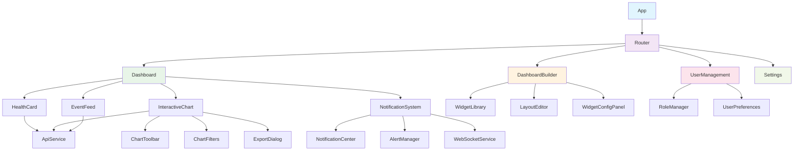

# Health Dashboard UI Enhancement Architecture

## Introduction

This document outlines the architectural approach for enhancing the Health Dashboard with comprehensive UI improvements, custom dashboard capabilities, advanced data visualization, and enhanced user experience features. Its primary goal is to serve as the guiding architectural blueprint for AI-driven development of new features while ensuring seamless integration with the existing React/TypeScript system.

**Relationship to Existing Architecture:**
This document supplements existing project architecture by defining how new components will integrate with current systems. Where conflicts arise between new and existing patterns, this document provides guidance on maintaining consistency while implementing enhancements.

### Existing Project Analysis

Based on my analysis of your existing Health Dashboard project, I've identified the following about your current system:

**Current Project State:**
- **Primary Purpose:** React-based monitoring interface for Home Assistant Ingestor system providing real-time health monitoring, data visualization, and configuration management
- **Current Tech Stack:** React 18.2.0, TypeScript 5.2.2, Vite 5.0.8, Tailwind CSS 3.4.0, Chart.js 4.4.0, Vitest testing framework
- **Architecture Style:** Component-based React architecture with custom hooks, service layer pattern, and modular component organization
- **Deployment Method:** Docker-based deployment with Vite build process and nginx serving

**Available Documentation:**
- Comprehensive architecture documentation in docs/architecture/ folder
- Well-defined TypeScript interfaces and types in src/types/
- Existing component structure with clear separation of concerns
- API service layer with consistent patterns
- Testing infrastructure with Vitest and Testing Library

**Identified Constraints:**
- Must maintain backward compatibility with existing API endpoints
- Current WebSocket integration patterns must be preserved
- Existing Tailwind CSS design system must be extended, not replaced
- TypeScript strict mode and ESLint configuration must be maintained
- Current component naming and file organization patterns must be followed

### Change Log
| Change | Date | Version | Description | Author |
|--------|------|---------|-------------|---------|
| Initial Architecture | 2024-12-19 | 1.0 | Created comprehensive frontend architecture for UI enhancement | Architect |

## Enhancement Scope and Integration Strategy

### Enhancement Overview
**Enhancement Type:** UI/UX Overhaul with Advanced Features
**Scope:** Comprehensive dashboard enhancement with custom layouts, advanced visualization, real-time notifications, and improved user experience
**Integration Impact:** Significant frontend changes with minimal backend impact

### Integration Approach
**Code Integration Strategy:** Extend existing React component architecture with new components following established patterns, implement gradual migration of legacy components, and maintain existing service layer integration

**Database Integration:** No database schema changes required; maintain existing API contracts and data structures

**API Integration:** Enhance existing ApiService class with new endpoints while preserving current functionality and response formats

**UI Integration:** Extend current Tailwind CSS design system with new components, maintain existing visual patterns, and implement progressive enhancement for new features

### Compatibility Requirements
- **Existing API Compatibility:** All current API endpoints and data structures must remain unchanged
- **Database Schema Compatibility:** No database changes required; maintain existing data models
- **UI/UX Consistency:** New components must follow existing design patterns and Tailwind CSS conventions
- **Performance Impact:** Maintain current performance characteristics with page load times under 2 seconds

## Tech Stack

### Existing Technology Stack
| Category | Current Technology | Version | Usage in Enhancement | Notes |
|----------|-------------------|---------|---------------------|-------|
| Frontend Framework | React | 18.2.0 | Core framework for all new components | Maintain existing patterns |
| Language | TypeScript | 5.2.2 | All new code must be TypeScript | Strict mode compliance |
| Build Tool | Vite | 5.0.8 | Build system for enhanced features | Extend existing config |
| Styling | Tailwind CSS | 3.4.0 | Design system foundation | Extend, don't replace |
| Charts | Chart.js | 4.4.0 | Enhanced with interactivity | Add new chart types |
| Testing | Vitest | 1.0.4 | Test all new components | Extend existing test suite |
| State Management | React Hooks | 18.2.0 | Current pattern | Add Redux Toolkit for complex state |
| Routing | None | - | Add React Router | New addition for navigation |
| Icons | Heroicons | - | Icon library | Consistent with Tailwind |

### New Technology Additions
| Technology | Version | Purpose | Rationale | Integration Method |
|------------|---------|---------|-----------|-------------------|
| React Router | 6.8.0 | Navigation and routing | Required for multi-page dashboard | Add to existing Vite config |
| Redux Toolkit | 1.9.0 | State management | Complex dashboard state needs | Gradual integration with existing hooks |
| React DnD | 16.0.0 | Drag and drop | Custom dashboard builder | Add to component library |
| React Query | 4.0.0 | Data fetching | Enhanced caching and synchronization | Integrate with existing ApiService |
| Framer Motion | 10.0.0 | Animations | Smooth UI transitions | Add to component animations |

## Data Models and Schema Changes

### New Data Models

#### DashboardLayout
**Purpose:** Store custom dashboard configurations and widget arrangements
**Integration:** Extends existing configuration system without modifying current schema

**Key Attributes:**
- id: string - Unique layout identifier
- name: string - User-friendly layout name
- userId: string - Owner of the layout
- widgets: WidgetConfig[] - Array of widget configurations
- createdAt: string - Creation timestamp
- updatedAt: string - Last modification timestamp

**Relationships:**
- **With Existing:** Links to existing user system through userId
- **With New:** Contains WidgetConfig objects for dashboard customization

#### WidgetConfig
**Purpose:** Define individual widget configurations within dashboard layouts
**Integration:** Self-contained configuration objects stored within DashboardLayout

**Key Attributes:**
- id: string - Unique widget identifier
- type: string - Widget type (chart, metric, alert, etc.)
- position: Position - Grid position and size
- config: Record<string, any> - Widget-specific configuration
- dataSource: string - Data source identifier

**Relationships:**
- **With Existing:** References existing data sources and API endpoints
- **With New:** Part of DashboardLayout configuration

#### NotificationSettings
**Purpose:** User preferences for real-time notifications and alerts
**Integration:** Extends existing user preference system

**Key Attributes:**
- userId: string - User identifier
- channels: NotificationChannel[] - Available notification channels
- preferences: NotificationPreferences - User-specific settings
- thresholds: AlertThreshold[] - Custom alert thresholds

**Relationships:**
- **With Existing:** Links to existing user system
- **With New:** Integrates with new notification system

### Schema Integration Strategy
**Database Changes Required:**
- **New Tables:** dashboard_layouts, notification_settings
- **Modified Tables:** None (maintains backward compatibility)
- **New Indexes:** userId on dashboard_layouts, userId on notification_settings
- **Migration Strategy:** Additive-only changes with no existing data modification

**Backward Compatibility:**
- All existing API endpoints continue to function unchanged
- Current data structures remain intact
- New features are opt-in and don't affect existing functionality

## Component Architecture

### New Components

#### DashboardBuilder
**Responsibility:** Main interface for creating and managing custom dashboard layouts with drag-and-drop functionality
**Integration Points:** Integrates with existing Dashboard component, uses current data sources, and extends existing widget system

**Key Interfaces:**
- DashboardBuilderProps: Configuration and callback interfaces
- WidgetLibrary: Component for selecting and adding widgets
- LayoutEditor: Drag-and-drop layout editing interface

**Dependencies:**
- **Existing Components:** Dashboard, MetricsChart, HealthCard, EventFeed
- **New Components:** WidgetLibrary, LayoutEditor, WidgetConfigPanel

**Technology Stack:** React, TypeScript, React DnD, Tailwind CSS

#### InteractiveChart
**Responsibility:** Enhanced chart components with zoom, pan, filter, and export capabilities
**Integration Points:** Extends existing MetricsChart component, integrates with current data sources, and maintains Chart.js compatibility

**Key Interfaces:**
- InteractiveChartProps: Extended chart configuration with interaction options
- ChartToolbar: Controls for zoom, pan, and export functionality
- ChartFilters: Dynamic filtering interface

**Dependencies:**
- **Existing Components:** MetricsChart, existing data hooks
- **New Components:** ChartToolbar, ChartFilters, ExportDialog

**Technology Stack:** React, TypeScript, Chart.js, React Query

#### NotificationSystem
**Responsibility:** Real-time notification display and management system
**Integration Points:** Integrates with existing WebSocket service, extends current alert system, and provides user preference management

**Key Interfaces:**
- NotificationProvider: Context provider for notification state
- NotificationCenter: Centralized notification display
- NotificationSettings: User preference management

**Dependencies:**
- **Existing Components:** WebSocket service, existing alert components
- **New Components:** NotificationCenter, NotificationSettings, AlertManager

**Technology Stack:** React, TypeScript, WebSocket, Redux Toolkit

#### UserManagement
**Responsibility:** User management interface with role-based access control
**Integration Points:** Extends existing authentication system, integrates with current API service, and provides user preference management

**Key Interfaces:**
- UserManagementProps: User management configuration
- RoleManager: Role and permission management
- UserPreferences: User-specific settings interface

**Dependencies:**
- **Existing Components:** ApiService, existing authentication
- **New Components:** RoleManager, UserPreferences, PermissionMatrix

**Technology Stack:** React, TypeScript, existing API service

### Component Interaction Diagram



## API Design and Integration

### API Integration Strategy
**API Integration Strategy:** Extend existing ApiService class with new endpoints while maintaining current patterns and response formats
**Authentication:** Integrate with existing authentication system using current token-based approach
**Versioning:** Maintain current API versioning strategy with backward compatibility

### New API Endpoints

#### Dashboard Layouts
- **Method:** GET
- **Endpoint:** /api/v1/dashboard/layouts
- **Purpose:** Retrieve user's dashboard layouts
- **Integration:** Extends existing configuration API patterns

```json
{
  "success": true,
  "data": [
    {
      "id": "layout-1",
      "name": "Default Dashboard",
      "widgets": [...],
      "createdAt": "2024-12-19T10:00:00Z"
    }
  ],
  "timestamp": "2024-12-19T10:00:00Z"
}
```

#### Save Dashboard Layout
- **Method:** POST
- **Endpoint:** /api/v1/dashboard/layouts
- **Purpose:** Save custom dashboard layout
- **Integration:** Follows existing configuration save patterns

```json
{
  "name": "Custom Layout",
  "widgets": [
    {
      "id": "widget-1",
      "type": "health-card",
      "position": { "x": 0, "y": 0, "w": 6, "h": 4 },
      "config": {}
    }
  ]
}
```

#### Notification Settings
- **Method:** GET
- **Endpoint:** /api/v1/notifications/settings
- **Purpose:** Retrieve user notification preferences
- **Integration:** Extends existing user preference API

```json
{
  "success": true,
  "data": {
    "channels": ["browser", "email"],
    "preferences": {
      "critical": true,
      "warning": true,
      "info": false
    },
    "thresholds": [...]
  }
}
```

## Source Tree

### Existing Project Structure
```
services/health-dashboard/
├── src/
│   ├── components/
│   │   ├── Dashboard.tsx
│   │   ├── HealthCard.tsx
│   │   ├── MetricsChart.tsx
│   │   └── EventFeed.tsx
│   ├── hooks/
│   │   ├── useHealth.ts
│   │   ├── useStatistics.ts
│   │   └── useEvents.ts
│   ├── services/
│   │   ├── api.ts
│   │   └── websocket.ts
│   ├── types/
│   │   └── index.ts
│   └── utils/
```

### New File Organization
```
services/health-dashboard/
├── src/
│   ├── components/
│   │   ├── Dashboard.tsx                    # Enhanced existing
│   │   ├── HealthCard.tsx                  # Existing
│   │   ├── MetricsChart.tsx                # Existing
│   │   ├── EventFeed.tsx                   # Existing
│   │   ├── dashboard-builder/              # New folder
│   │   │   ├── DashboardBuilder.tsx
│   │   │   ├── WidgetLibrary.tsx
│   │   │   ├── LayoutEditor.tsx
│   │   │   └── WidgetConfigPanel.tsx
│   │   ├── charts/                         # New folder
│   │   │   ├── InteractiveChart.tsx
│   │   │   ├── ChartToolbar.tsx
│   │   │   ├── ChartFilters.tsx
│   │   │   └── ExportDialog.tsx
│   │   ├── notifications/                  # New folder
│   │   │   ├── NotificationSystem.tsx
│   │   │   ├── NotificationCenter.tsx
│   │   │   └── AlertManager.tsx
│   │   └── user-management/                # New folder
│   │       ├── UserManagement.tsx
│   │       ├── RoleManager.tsx
│   │       └── UserPreferences.tsx
│   ├── hooks/
│   │   ├── useHealth.ts                    # Existing
│   │   ├── useStatistics.ts                # Existing
│   │   ├── useEvents.ts                    # Existing
│   │   ├── useDashboard.ts                 # New
│   │   ├── useNotifications.ts             # New
│   │   └── useUserManagement.ts            # New
│   ├── services/
│   │   ├── api.ts                          # Enhanced existing
│   │   ├── websocket.ts                    # Existing
│   │   ├── dashboardService.ts             # New
│   │   ├── notificationService.ts          # New
│   │   └── userService.ts                  # New
│   ├── store/                              # New folder
│   │   ├── index.ts
│   │   ├── dashboardSlice.ts
│   │   ├── notificationSlice.ts
│   │   └── userSlice.ts
│   ├── types/
│   │   ├── index.ts                        # Enhanced existing
│   │   ├── dashboard.ts                    # New
│   │   ├── notifications.ts                # New
│   │   └── user.ts                         # New
│   └── utils/
│       ├── dashboardUtils.ts               # New
│       ├── notificationUtils.ts            # New
│       └── validationUtils.ts              # New
```

### Integration Guidelines
- **File Naming:** Follow existing camelCase pattern for components and kebab-case for folders
- **Folder Organization:** Group related components in feature folders while maintaining existing structure
- **Import/Export Patterns:** Use existing import/export patterns with barrel exports for new feature folders

## Infrastructure and Deployment Integration

### Existing Infrastructure
**Current Deployment:** Docker-based deployment with Vite build process, nginx serving static files, and container orchestration
**Infrastructure Tools:** Docker, docker-compose, nginx, existing CI/CD pipeline
**Environments:** Development, production environments with environment-specific configurations

### Enhancement Deployment Strategy
**Deployment Approach:** Extend existing Docker build process with new frontend features, maintain current deployment pipeline
**Infrastructure Changes:** No infrastructure changes required; new features are frontend-only
**Pipeline Integration:** Integrate new build steps into existing Vite build process, maintain current deployment workflow

### Rollback Strategy
**Rollback Method:** Docker image rollback to previous version, maintain existing rollback procedures
**Risk Mitigation:** Feature flags for new functionality, gradual rollout capability, comprehensive testing
**Monitoring:** Extend existing monitoring to include new frontend metrics and user interaction tracking

## Coding Standards

### Existing Standards Compliance
**Code Style:** TypeScript strict mode, ESLint configuration, Prettier formatting
**Linting Rules:** Existing ESLint rules with React and TypeScript plugins
**Testing Patterns:** Vitest with Testing Library, component testing patterns
**Documentation Style:** JSDoc comments for functions, TypeScript interfaces for type documentation

### Enhancement-Specific Standards
- **Component Documentation:** All new components must include JSDoc comments and TypeScript interfaces
- **State Management:** Use Redux Toolkit for complex state, React hooks for simple state
- **Error Handling:** Implement consistent error boundaries and error handling patterns
- **Accessibility:** All new components must meet WCAG 2.1 AA compliance requirements

### Critical Integration Rules
- **Existing API Compatibility:** All new API calls must use existing ApiService patterns
- **Database Integration:** No database changes; use existing data structures
- **Error Handling:** Follow existing error handling patterns and user feedback mechanisms
- **Logging Consistency:** Use existing logging patterns for new functionality

## Testing Strategy

### Integration with Existing Tests
**Existing Test Framework:** Vitest with Testing Library and Jest DOM matchers
**Test Organization:** Component tests in __tests__ folders, integration tests in tests/ folder
**Coverage Requirements:** Maintain existing coverage standards, target 80%+ for new components

### New Testing Requirements

#### Unit Tests for New Components
- **Framework:** Vitest with Testing Library
- **Location:** Component __tests__ folders following existing pattern
- **Coverage Target:** 80%+ coverage for all new components
- **Integration with Existing:** Extend existing test utilities and mocking patterns

#### Integration Tests
- **Scope:** Test new features integration with existing components and services
- **Existing System Verification:** Ensure existing functionality remains intact
- **New Feature Testing:** Comprehensive testing of new dashboard builder, notifications, and user management

#### Regression Testing
- **Existing Feature Verification:** Automated testing of all existing dashboard functionality
- **Automated Regression Suite:** Extend existing test suite with new feature tests
- **Manual Testing Requirements:** User acceptance testing for new dashboard customization features

## Security Integration

### Existing Security Measures
**Authentication:** Token-based authentication with localStorage
**Authorization:** Basic role-based access control
**Data Protection:** HTTPS communication, secure API endpoints
**Security Tools:** Existing security headers and CORS configuration

### Enhancement Security Requirements
**New Security Measures:** Enhanced user management with granular permissions, secure dashboard sharing
**Integration Points:** Extend existing authentication system, maintain current security patterns
**Compliance Requirements:** Maintain existing security standards, add user data protection

### Security Testing
**Existing Security Tests:** Current authentication and authorization testing
**New Security Test Requirements:** User management security, dashboard sharing permissions
**Penetration Testing:** Security review of new user management and notification systems

## Next Steps

### Story Manager Handoff
**Reference:** This architecture document provides the technical foundation for implementing the Health Dashboard UI Enhancement
**Key Integration Requirements:** All new components must integrate with existing React/TypeScript patterns, maintain API compatibility, and follow established coding standards
**Existing System Constraints:** No database changes, maintain existing API contracts, preserve current performance characteristics
**First Story to Implement:** Foundation and Navigation Enhancement (Story 1.1) with React Router integration and error boundaries
**Integration Checkpoints:** Verify existing functionality after each story, maintain backward compatibility, test integration points

### Developer Handoff
**Reference:** This architecture document and existing coding standards in docs/architecture/coding-standards.md
**Integration Requirements:** Follow existing component patterns, use established service layer, maintain TypeScript strict mode compliance
**Key Technical Decisions:** Redux Toolkit for complex state management, React Router for navigation, gradual migration approach
**Existing System Compatibility:** All new features must work alongside existing functionality without breaking changes
**Implementation Sequencing:** Start with foundation improvements, then add new features incrementally to minimize risk to existing system