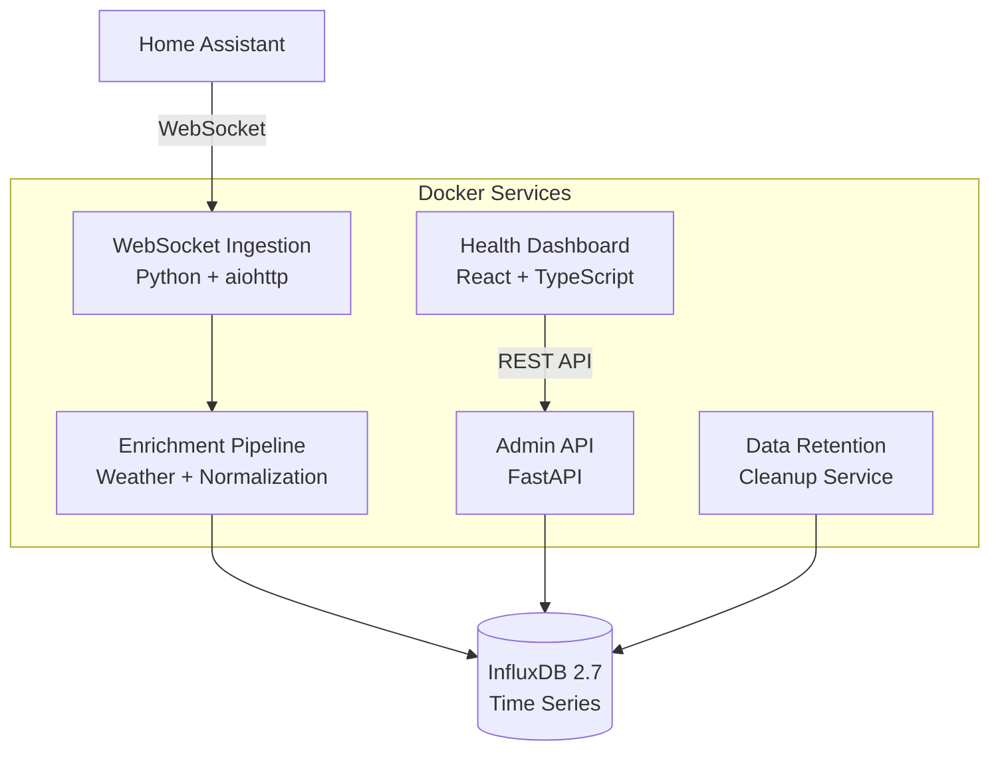

# Home Assistant Ingestor - Full Stack Architecture

## Executive Summary

**Microservices-based real-time data ingestion system** with React dashboard, deployed via Docker Compose. Captures Home Assistant events via WebSocket, processes through Python services, stores in InfluxDB, and provides admin interface via FastAPI + React.

## Core Architecture



## Technology Stack

| Layer | Technology | Version | Purpose |
|-------|------------|---------|---------|
| **Frontend** | React + TypeScript | 18.2.0 + 5.2.2 | Dashboard UI |
| **Frontend** | TailwindCSS | 3.4.0 | Styling |
| **Frontend** | Vite | 5.0.8 | Build tool |
| **Frontend** | Vitest | 1.0.4 | Testing |
| **Backend API** | FastAPI | 0.104.1 | REST API |
| **Backend WS** | aiohttp | 3.9.1 | WebSocket client |
| **Backend** | Python | 3.11 | All services |
| **Database** | InfluxDB | 2.7 | Time series storage |
| **Testing** | Playwright | 1.55.1 | E2E testing |
| **Deployment** | Docker Compose | 2.20+ | Orchestration |

## Service Architecture

### Core Services
1. **websocket-ingestion** - Captures HA events via WebSocket
2. **admin-api** - FastAPI REST API for dashboard
3. **health-dashboard** - React frontend interface
4. **enrichment-pipeline** - Data processing and weather enrichment
5. **data-retention** - Cleanup and backup management

### Key Integration Points
- **Home Assistant WebSocket API** → Real-time event streaming
- **OpenWeatherMap API** → Weather data enrichment
- **InfluxDB 2.7** → Time-series data storage
- **Docker Compose** → Service orchestration

## Data Flow

1. **Ingestion**: Home Assistant events → WebSocket service → Event queue
2. **Processing**: Event queue → Enrichment pipeline → Data normalization
3. **Storage**: Normalized data → InfluxDB time-series database
4. **Visualization**: Dashboard → Admin API → InfluxDB queries → Real-time UI

## Development Workflow

```bash
# Start all services
docker-compose up

# Frontend development
cd services/health-dashboard
npm run dev

# Backend development
cd services/admin-api
python -m uvicorn src.main:app --reload
```

## Key Patterns

- **Microservices**: Independent, containerized services
- **Event-Driven**: Real-time WebSocket event processing
- **API Gateway**: FastAPI as single entry point for frontend
- **Time-Series**: InfluxDB optimized for Home Assistant data
- **Container-First**: Everything runs in Docker containers

## Critical Rules for Development

1. **Type Safety**: Use TypeScript interfaces from `shared/types/`
2. **API Calls**: Always use service layer, never direct HTTP calls
3. **Environment**: Access config through environment objects only
4. **Testing**: Vitest for frontend, pytest for backend, Playwright for E2E
5. **Styling**: Use TailwindCSS utility classes, extend design system
6. **Error Handling**: Standardized error responses across all services

## Deployment

- **Local Development**: `docker-compose up`
- **Production**: `docker-compose -f docker-compose.prod.yml up`
- **Health Checks**: All services have built-in health endpoints
- **Monitoring**: Structured JSON logging across all services

This architecture supports 10,000+ events/day with 99.9% reliability through robust error handling and automatic reconnection patterns.