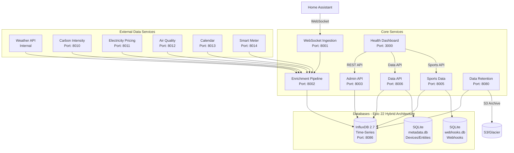

# Home Assistant Ingestor - Architecture Documentation

## 📖 Overview

This document serves as the main entry point for the Home Assistant Ingestor architecture documentation.

**For complete architectural documentation, please see:** **[Architecture Documentation Index](architecture/index.md)**

---

## Quick Summary

**System Type:** Microservices-based real-time data ingestion system  
**Tech Stack:** Python 3.11, React 18.2, FastAPI, aiohttp, InfluxDB 2.7, SQLite 3.45+, Docker  
**Database:** Hybrid architecture (InfluxDB for time-series, SQLite for metadata)  
**Deployment:** Docker Compose with optimized Alpine images  
**Purpose:** Capture Home Assistant events, enrich with weather context, store in time-series database

## Architecture Diagram



## Services

### Core Services

| Service | Technology | Port | Purpose |
|---------|-----------|------|---------|
| **websocket-ingestion** | Python/aiohttp | 8001 | Home Assistant WebSocket client |
| **enrichment-pipeline** | Python/FastAPI | 8002 | Data validation and multi-source enrichment |
| **data-retention** | Python/FastAPI | 8080 | Enhanced data lifecycle, tiered retention, S3 archival |
| **admin-api** | Python/FastAPI | 8003 | System monitoring & control REST API |
| **data-api** | Python/FastAPI | 8006 | Feature data hub (events, devices, sports, analytics) |
| **sports-data** | Python/FastAPI | 8005 | NFL/NHL game data with InfluxDB persistence |
| **health-dashboard** | React/TypeScript | 3000 | Web-based monitoring interface |
| **influxdb** | InfluxDB 2.7 | 8086 | Time-series data storage (events, metrics, sports) |
| **sqlite** | SQLite 3.45+ | N/A | Metadata storage (devices, entities, webhooks) - Epic 22 |

### External Data Services

| Service | Technology | Port | Purpose |
|---------|-----------|------|---------|
| **carbon-intensity-service** | Python/FastAPI | 8010 | Carbon intensity data from National Grid |
| **electricity-pricing-service** | Python/FastAPI | 8011 | Real-time electricity pricing (Octopus, etc.) |
| **air-quality-service** | Python/FastAPI | 8012 | Air quality index and pollutant levels |
| **calendar-service** | Python/aiohttp | 8013 | Home Assistant calendar integration, occupancy prediction |
| **smart-meter-service** | Python/FastAPI | 8014 | Smart meter data (SMETS2, P1, etc.) |
| **weather-api** | Python/FastAPI | Internal | Weather data integration |

## 📚 Complete Documentation

For detailed architecture information, please refer to the comprehensive documentation in the `architecture/` directory:

### Getting Started
- **[Introduction](architecture/introduction.md)** - Project overview and high-level architecture
- **[Key Concepts](architecture/key-concepts.md)** - Core architectural concepts
- **[Tech Stack](architecture/tech-stack.md)** - Technology stack with rationale

### System Design
- **[Core Workflows](architecture/core-workflows.md)** - Data flow and sequence diagrams
- **[Deployment Architecture](architecture/deployment-architecture.md)** - Deployment patterns
- **[Source Tree](architecture/source-tree.md)** - Project structure
- **[Data Models](architecture/data-models.md)** - Data structures and types
- **[Database Schema](architecture/database-schema.md)** - InfluxDB schema design

### Development
- **[Development Workflow](architecture/development-workflow.md)** - Setup and contribution guide
- **[Coding Standards](architecture/coding-standards.md)** - Code quality standards
- **[Configuration Management](architecture/configuration-management.md)** - Environment configuration
- **[API Guidelines](architecture/api-guidelines.md)** - REST API design standards

### Quality & Operations
- **[Testing Strategy](architecture/testing-strategy.md)** - Testing approach
- **[Error Handling Strategy](architecture/error-handling-strategy.md)** - Error handling patterns
- **[Monitoring and Observability](architecture/monitoring-and-observability.md)** - Logging and metrics
- **[Performance Standards](architecture/performance-standards.md)** - Performance targets
- **[Security Standards](architecture/security-standards.md)** - Security best practices

### Full Index
📋 **[Complete Architecture Documentation Index](architecture/index.md)**

---

## Quick Development Reference

```bash
# Start all services
docker-compose up

# Frontend development (with hot reload)
cd services/health-dashboard && npm run dev

# Backend development (with auto-reload)
cd services/admin-api && python -m uvicorn src.main:app --reload

# Run tests
docker-compose -f docker-compose.yml run --rm websocket-ingestion pytest
cd services/health-dashboard && npm test
```

## Key Patterns

- **Microservices Architecture**: Independent, containerized services
- **Event-Driven Processing**: Real-time WebSocket event streaming
- **API Gateway Pattern**: FastAPI as unified REST interface
- **Service Isolation**: Docker containerization with health checks
- **Optimized Deployment**: Multi-stage Docker builds with Alpine Linux

## Performance Characteristics

- **Event Processing**: 10,000+ events/day
- **Response Time**: <100ms API calls
- **Reliability**: 99.9% uptime with auto-reconnection
- **Container Size**: 71% reduction with Alpine images (40-80MB per service)

---

**Last Updated**: October 2025  
**Version**: 4.0  
**Status**: Production Ready

**For complete details, see the [Architecture Documentation Index](architecture/index.md)**
