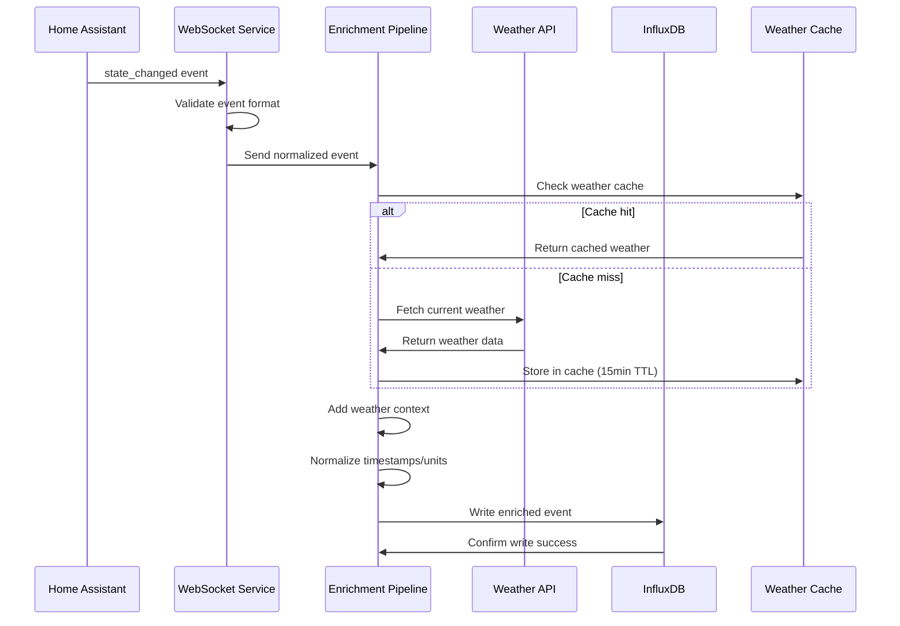
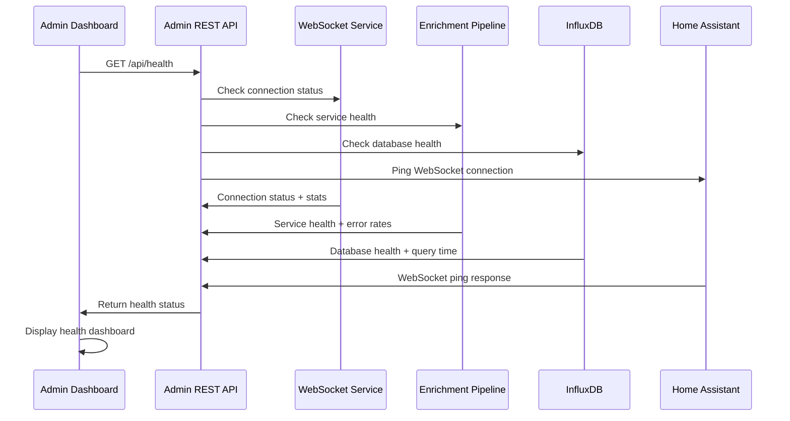
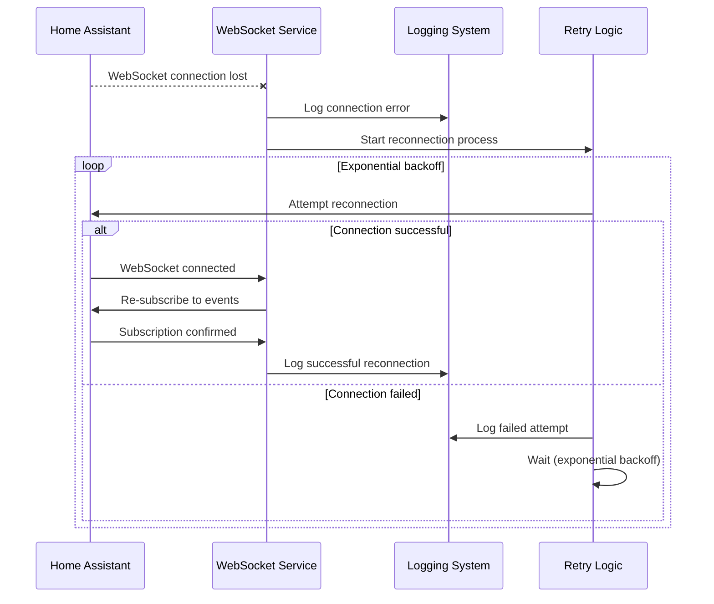

# Core Workflows

### Primary Data Ingestion Workflow

```mermaid
sequenceDiagram
    participant HA as Home Assistant
    participant WS as WebSocket Service
    participant ENRICH as Enrichment Pipeline
    participant WEATHER as Weather API
    participant INFLUX as InfluxDB
    participant CACHE as Weather Cache

    HA->>WS: state_changed event
    WS->>WS: Validate event format
    WS->>ENRICH: Send normalized event
    
    ENRICH->>CACHE: Check weather cache
    alt Cache hit
        CACHE->>ENRICH: Return cached weather
    else Cache miss
        ENRICH->>WEATHER: Fetch current weather
        WEATHER->>ENRICH: Return weather data
        ENRICH->>CACHE: Store in cache (15min TTL)
    end
    
    ENRICH->>ENRICH: Add weather context
    ENRICH->>ENRICH: Normalize timestamps/units
    ENRICH->>INFLUX: Write enriched event
    INFLUX->>ENRICH: Confirm write success
```

### System Health Monitoring Workflow

```mermaid
sequenceDiagram
    participant ADMIN as Admin Dashboard
    participant API as Admin REST API
    participant WS as WebSocket Service
    participant ENRICH as Enrichment Pipeline
    participant INFLUX as InfluxDB
    participant HA as Home Assistant

    ADMIN->>API: GET /api/health
    API->>WS: Check connection status
    API->>ENRICH: Check service health
    API->>INFLUX: Check database health
    API->>HA: Ping WebSocket connection
    
    WS->>API: Connection status + stats
    ENRICH->>API: Service health + error rates
    INFLUX->>API: Database health + query time
    HA->>API: WebSocket ping response
    
    API->>ADMIN: Return health status
    ADMIN->>ADMIN: Display health dashboard
```

### Error Handling and Reconnection Workflow

```mermaid
sequenceDiagram
    participant HA as Home Assistant
    participant WS as WebSocket Service
    participant LOG as Logging System
    participant RETRY as Retry Logic

    HA--xWS: WebSocket connection lost
    WS->>LOG: Log connection error
    WS->>RETRY: Start reconnection process
    
    loop Exponential backoff
        RETRY->>HA: Attempt reconnection
        alt Connection successful
            HA->>WS: WebSocket connected
            WS->>HA: Re-subscribe to events
            HA->>WS: Subscription confirmed
            WS->>LOG: Log successful reconnection
        else Connection failed
            RETRY->>LOG: Log failed attempt
            RETRY->>RETRY: Wait (exponential backoff)
        end
    end
```

