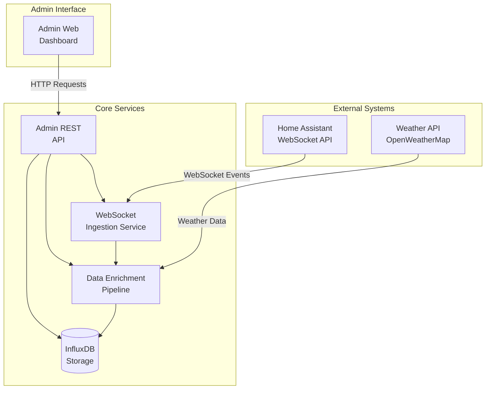

# Data Models

Based on the PRD requirements and Home Assistant event structure, here are the core data models:

## Event Processing Data Models

### ProcessedEvent (WebSocket → Enrichment Pipeline)

**Purpose:** Flattened event structure sent from WebSocket Ingestion Service to Enrichment Pipeline

**Key Attributes:**
- `event_type`: string - Type of event (e.g., "state_changed", "call_service")
- `entity_id`: string - Home Assistant entity identifier (e.g., "sensor.living_room_temperature")
- `domain`: string - Entity domain (sensor, switch, light, etc.)
- `timestamp`: string - ISO 8601 UTC timestamp when event was processed
- `time_fired`: string - ISO 8601 UTC timestamp when event was fired in Home Assistant
- `origin`: string - Event origin ("LOCAL" or "REMOTE")
- `context`: object - Event context with id, parent_id, user_id
- **[Epic 23.1]** `context_id`: string - Event context identifier for tracing
- **[Epic 23.1]** `context_parent_id`: string - Parent context for automation causality tracking
- **[Epic 23.1]** `context_user_id`: string - User who triggered the event
- **[Epic 23.2]** `device_id`: string - Physical device identifier for device-level analytics
- **[Epic 23.2]** `area_id`: string - Room/area location for spatial analytics
- **[Epic 23.3]** `duration_in_state`: number - Seconds entity was in previous state
- **[Epic 23.5]** `device_metadata`: object - Device manufacturer, model, software version
- `new_state`: StateObject - Current state information
- `old_state`: StateObject - Previous state information (may be null/empty)
- `state_change`: StateChangeInfo - State change summary
- `weather`: WeatherContext - Enriched weather information (optional)
- `weather_enriched`: boolean - Whether weather data was added
- `weather_location`: string - Location used for weather data
- `raw_data`: object - Original Home Assistant event data

**TypeScript Interface:**
```typescript
interface ProcessedEvent {
  event_type: string;
  entity_id: string;
  domain: string;
  timestamp: string; // ISO 8601 UTC
  time_fired?: string; // ISO 8601 UTC
  origin?: string;
  context?: {
    id: string;
    parent_id: string | null;
    user_id: string | null;
  };
  // Epic 23.1: Context hierarchy tracking
  context_id?: string;
  context_parent_id?: string;
  context_user_id?: string;
  // Epic 23.2: Device and area linkage
  device_id?: string;
  area_id?: string;
  // Epic 23.3: Time-based analytics
  duration_in_state?: number; // seconds
  // Epic 23.5: Device metadata
  device_metadata?: {
    manufacturer?: string;
    model?: string;
    sw_version?: string;
  };
  new_state: StateObject;
  old_state?: StateObject;
  state_change?: StateChangeInfo;
  weather?: WeatherContext;
  weather_enriched?: boolean;
  weather_location?: string;
  raw_data?: any;
}

interface StateObject {
  state: string;
  attributes: Record<string, any>;
  last_changed: string; // ISO 8601 UTC
  last_updated: string; // ISO 8601 UTC
}

interface StateChangeInfo {
  from: string | null;
  to: string;
  changed: boolean;
}
```

**Python Pydantic Model:**
```python
from pydantic import BaseModel, Field
from typing import Dict, Any, Optional
from datetime import datetime

class StateObject(BaseModel):
    state: str
    attributes: Dict[str, Any] = Field(default_factory=dict)
    last_changed: datetime
    last_updated: datetime

class StateChangeInfo(BaseModel):
    from_state: Optional[str] = Field(alias="from")
    to: str
    changed: bool

class ProcessedEvent(BaseModel):
    event_type: str
    entity_id: str
    domain: str
    timestamp: datetime
    time_fired: Optional[datetime] = None
    origin: Optional[str] = None
    context: Optional[Dict[str, Any]] = None
    new_state: StateObject
    old_state: Optional[StateObject] = None
    state_change: Optional[StateChangeInfo] = None
    weather: Optional[Dict[str, Any]] = None
    weather_enriched: Optional[bool] = False
    weather_location: Optional[str] = None
    raw_data: Optional[Dict[str, Any]] = None
```

**Relationships:**
- Produced by WebSocket Ingestion Service's `EventProcessor.extract_event_data()`
- Consumed by Enrichment Pipeline's `process_event()` method
- Validated by `DataValidationEngine.validate_event()`
- Normalized by `DataNormalizer.normalize_event()`
- Written to InfluxDB measurement "home_assistant_events"

**Important Notes:**
- `entity_id` is at the **top level**, not nested in state objects
- State objects (`new_state`, `old_state`) do **not** contain `entity_id` field
- The structure is **flattened** for efficient HTTP transport between services

### HomeAssistantEvent (Legacy/Display)

**Purpose:** Core event model for display and dashboard consumption

**Key Attributes:**
- `entity_id`: string - Home Assistant entity identifier (e.g., "sensor.living_room_temperature")
- `domain`: string - Entity domain (sensor, switch, light, etc.)
- `device_class`: string - Device classification (temperature, motion, etc.)
- `state_value`: any - Current state value
- `previous_state`: any - Previous state value
- `timestamp`: string - ISO 8601 UTC timestamp
- `weather_data`: WeatherContext - Enriched weather information
- `attributes`: Record<string, any> - Original HA attributes

**TypeScript Interface:**
```typescript
interface HomeAssistantEvent {
  entity_id: string;
  domain: string;
  device_class?: string;
  state_value: any;
  previous_state?: any;
  timestamp: string; // ISO 8601 UTC
  weather_data?: WeatherContext;
  attributes: Record<string, any>;
}
```

**Relationships:**
- Derived from ProcessedEvent for dashboard display
- Maps to InfluxDB measurement "home_assistant_events"

### WeatherContext

**Purpose:** Weather enrichment data for correlating home automation with environmental conditions

**Key Attributes:**
- `temperature`: number - Current temperature in Celsius
- `humidity`: number - Humidity percentage
- `pressure`: number - Atmospheric pressure
- `condition`: string - Weather condition description
- `timestamp`: string - When weather data was fetched

**TypeScript Interface:**
```typescript
interface WeatherContext {
  temperature: number; // Celsius
  humidity: number; // Percentage
  pressure: number; // hPa
  condition: string;
  timestamp: string; // ISO 8601 UTC
}
```

### SystemHealth

**Purpose:** System monitoring and health status for admin dashboard

**TypeScript Interface:**
```typescript
interface SystemHealth {
  service_status: ServiceStatus;
  event_stats: EventStats;
  connection_status: ConnectionStatus;
  last_updated: string;
}

interface ServiceStatus {
  websocket_client: 'healthy' | 'unhealthy';
  enrichment_service: 'healthy' | 'unhealthy';
  influxdb: 'healthy' | 'unhealthy';
  weather_api: 'healthy' | 'unhealthy';
}

interface EventStats {
  events_per_hour: number;
  total_events_today: number;
  last_event_time?: string;
  error_rate: number; // Percentage
}

interface ConnectionStatus {
  connected: boolean;
  last_reconnect?: string;
  reconnect_count: number;
}
```

### Configuration

**TypeScript Interface:**
```typescript
interface Configuration {
  ha_url: string;
  ha_token_masked: string; // Shows only last 4 characters
  weather_api_key_masked: string; // Shows only last 4 characters
  weather_location: string;
  retention_days: number;
  weather_cache_minutes: number;
}

## API Specification

Based on the admin dashboard requirements and system architecture, here's the REST API specification:

### REST API Specification

```yaml
openapi: 3.0.0
info:
  title: Home Assistant Ingestion Layer API
  version: 1.0.0
  description: Admin API for monitoring and managing the Home Assistant ingestion system
servers:
  - url: http://localhost:8080/api
    description: Local development server
paths:
  /health:
    get:
      summary: Get system health status
      responses:
        '200':
          description: System health information
          content:
            application/json:
              schema:
                $ref: '#/components/schemas/SystemHealth'
  
  /stats:
    get:
      summary: Get system statistics
      responses:
        '200':
          description: System statistics
          content:
            application/json:
              schema:
                $ref: '#/components/schemas/EventStats'
  
  /events/recent:
    get:
      summary: Get recent events
      parameters:
        - name: limit
          in: query
          schema:
            type: integer
            default: 100
          description: Number of events to return
        - name: entity_id
          in: query
          schema:
            type: string
          description: Filter by entity ID
      responses:
        '200':
          description: List of recent events
          content:
            application/json:
              schema:
                type: array
                items:
                  $ref: '#/components/schemas/HomeAssistantEvent'
  
  /config:
    get:
      summary: Get system configuration
      responses:
        '200':
          description: System configuration
          content:
            application/json:
              schema:
                $ref: '#/components/schemas/Configuration'
    put:
      summary: Update system configuration
      requestBody:
        required: true
        content:
          application/json:
            schema:
              $ref: '#/components/schemas/ConfigurationUpdate'
      responses:
        '200':
          description: Configuration updated successfully
        '400':
          description: Invalid configuration
```

### API Endpoints Summary

**Health & Monitoring:**
- `GET /api/health` - System health status
- `GET /api/stats` - Processing statistics

**Data Access:**
- `GET /api/events/recent` - Recent events with optional filtering

**Configuration:**
- `GET /api/config` - Current configuration (sensitive data masked)
- `PUT /api/config` - Update configuration (sensitive data not included)

## Components

Based on the simplified architecture and admin dashboard requirements, here are the major system components:

### WebSocket Ingestion Service

**Responsibility:** Real-time event capture from Home Assistant WebSocket API with automatic reconnection and error handling

**Key Interfaces:**
- WebSocket connection to Home Assistant
- Event subscription management
- Health check endpoint (`/health`)

**Dependencies:** Home Assistant WebSocket API, InfluxDB client

**Technology Stack:** Python + aiohttp, asyncio for concurrent processing

### Data Enrichment Pipeline

**Responsibility:** Enhance raw Home Assistant events with weather context and data normalization

**Key Interfaces:**
- Weather API integration (OpenWeatherMap)
- Event normalization and timestamp standardization
- InfluxDB write operations

**Dependencies:** Weather API service, WebSocket ingestion service

**Technology Stack:** Python, in-memory weather caching, aiohttp for API calls

### InfluxDB Storage Service

**Responsibility:** Time-series data storage with optimized schema for Home Assistant events

**Key Interfaces:**
- Write API for enriched events
- Read API for admin dashboard queries
- Health monitoring and metrics

**Dependencies:** Persistent Docker volumes for data storage

**Technology Stack:** InfluxDB 2.7, optimized schema with tags and fields

### Admin Web Interface

**Responsibility:** Simple dashboard for system monitoring and basic data validation

**Key Interfaces:**
- REST API client for system health
- Recent events display
- Configuration management interface

**Dependencies:** Admin REST API, React frontend

**Technology Stack:** React + TypeScript, custom CSS, Vite build tool

### Admin REST API

**Responsibility:** HTTP endpoints for admin dashboard data access and configuration

**Key Interfaces:**
- `/health` - System health status
- `/stats` - Processing statistics  
- `/events/recent` - Recent events query
- `/config` - Configuration management

**Dependencies:** All backend services for health checks and data access

**Technology Stack:** Python + aiohttp HTTP server

### Component Diagrams



## External APIs

### Home Assistant WebSocket API

**Purpose:** Real-time event capture from Home Assistant instance

**Documentation:** https://developers.home-assistant.io/docs/api/websocket

**Base URL:** `ws://homeassistant.local:8123/api/websocket` (or custom HA URL)

**Authentication:** Long-lived access token in WebSocket connection headers

**Rate Limits:** No explicit rate limits, but connection should be stable and persistent

**Key Endpoints Used:**
- WebSocket connection with authentication
- Event subscription: `subscribe_events` for `state_changed` events
- Heartbeat: `ping`/`pong` for connection health

**Integration Notes:** 
- Requires stable WebSocket connection with automatic reconnection
- Authentication via `Authorization: Bearer {token}` header
- Event subscription must be re-established after reconnection
- Connection health monitoring essential for reliability

### OpenWeatherMap API

**Purpose:** Weather data enrichment for Home Assistant events

**Documentation:** https://openweathermap.org/api

**Base URL:** `https://api.openweathermap.org/data/2.5/weather`

**Authentication:** API key via query parameter `appid`

**Rate Limits:** 
- Free tier: 60 calls/minute, 1,000 calls/day
- Paid tiers available for higher limits

**Key Endpoints Used:**
- `GET /weather` - Current weather conditions by location
- Returns: temperature, humidity, pressure, weather condition

**Integration Notes:**
- Simple HTTP GET requests with location coordinates
- Weather data cached for 15 minutes to respect rate limits
- Fallback to cached data if API unavailable
- Location determined from Home Assistant configuration
```
