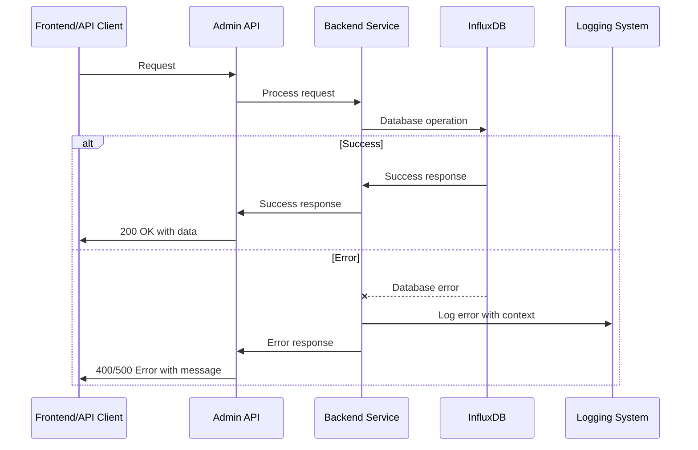

# Error Handling Strategy

### Error Flow


### Error Response Format
```typescript
interface ApiError {
  error: {
    code: string;
    message: string;
    details?: Record<string, any>;
    timestamp: string;
    requestId: string;
  };
}
```

### Frontend Error Handling
```typescript
// API service with error handling
export const apiClient = {
  async get<T>(endpoint: string): Promise<T> {
    try {
      const response = await fetch(`/api${endpoint}`);
      if (!response.ok) {
        const error = await response.json();
        throw new ApiError(error.error.message, error.error.code);
      }
      return response.json();
    } catch (error) {
      console.error(`API Error: ${endpoint}`, error);
      throw error;
    }
  }
};
```

### Backend Error Handling
```python
# Standard error handler
@app.exception_handler(Exception)
async def global_exception_handler(request: Request, exc: Exception):
    logger.error(f"Unhandled error: {str(exc)}", extra={
        "request_id": request.headers.get("x-request-id"),
        "endpoint": str(request.url)
    })
    return JSONResponse(
        status_code=500,
        content={"error": {"code": "INTERNAL_ERROR", "message": "Internal server error"}}
    )
```

