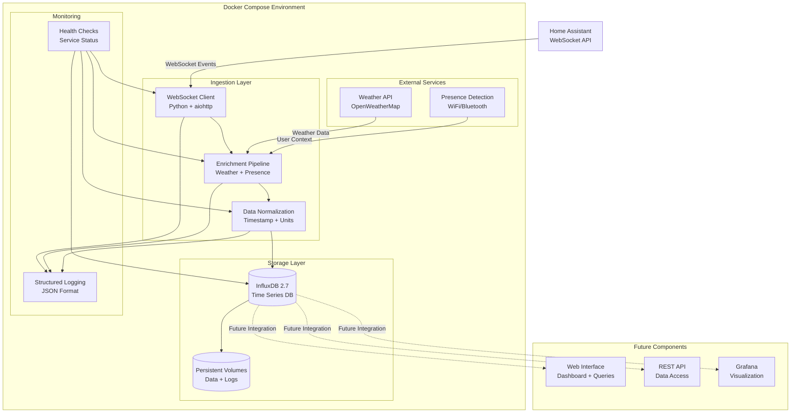

# High Level Architecture

### Technical Summary

The Home Assistant Ingestion Layer implements a **microservices-based data ingestion architecture** deployed via Docker Compose on local infrastructure. The system uses **Python with aiohttp** for real-time WebSocket event capture from Home Assistant, **InfluxDB 2.x** for time-series data storage, and **asyncio** for concurrent processing of high-volume events. Key integration points include Home Assistant's WebSocket API for real-time event streaming, external weather APIs for data enrichment, and a comprehensive data normalization pipeline. The architecture achieves the PRD goals of 99.9% data capture reliability and 10,000+ events per day processing through robust error handling, automatic reconnection, and optimized InfluxDB schema design for pattern analysis.

### Platform and Infrastructure Choice

Based on the PRD requirements for local deployment, Docker orchestration, and high reliability, I recommend the following platform approach:

**Recommended Platform: Local Docker Deployment**

**Option 1: Pure Local Docker (Recommended)**
- **Pros:** Complete privacy control, no external dependencies, cost-effective, full customization
- **Cons:** Requires local infrastructure management, backup responsibility
- **Services:** Docker Compose, InfluxDB, Python services, local file storage

**Selected Platform:** Local Docker Deployment
**Key Services:** Docker Compose, InfluxDB 2.7, Python 3.11, local persistent volumes
**Deployment Host and Regions:** Local development machine, production home server

### Repository Structure

**Structure:** Monorepo with Docker Compose orchestration
**Monorepo Tool:** Docker Compose (no additional monorepo tooling needed for this scale)
**Package Organization:** 
- `/services/` - Individual service containers (ha-ingestor, weather-service, presence-service)
- `/shared/` - Shared libraries and types
- `/infrastructure/` - Docker Compose, environment configs
- `/docs/` - Documentation and schemas
- `/scripts/` - Deployment and utility scripts

### High Level Architecture Diagram

### Architectural Patterns

- **Event-Driven Architecture:** Real-time event processing through WebSocket streams with asynchronous processing pipeline
- **Microservices Pattern:** Separate containers for ingestion, enrichment, and storage with clear service boundaries
- **Pipeline Pattern:** Sequential data processing through enrichment and normalization stages
- **Repository Pattern:** Abstracted data access layer for InfluxDB operations with standardized interfaces
- **Circuit Breaker Pattern:** Resilient external API integration with fallback mechanisms for weather and presence data
- **Health Check Pattern:** Comprehensive service monitoring with automatic restart capabilities
- **Configuration-Driven Pattern:** Environment-based configuration for different deployment scenarios

