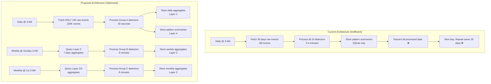
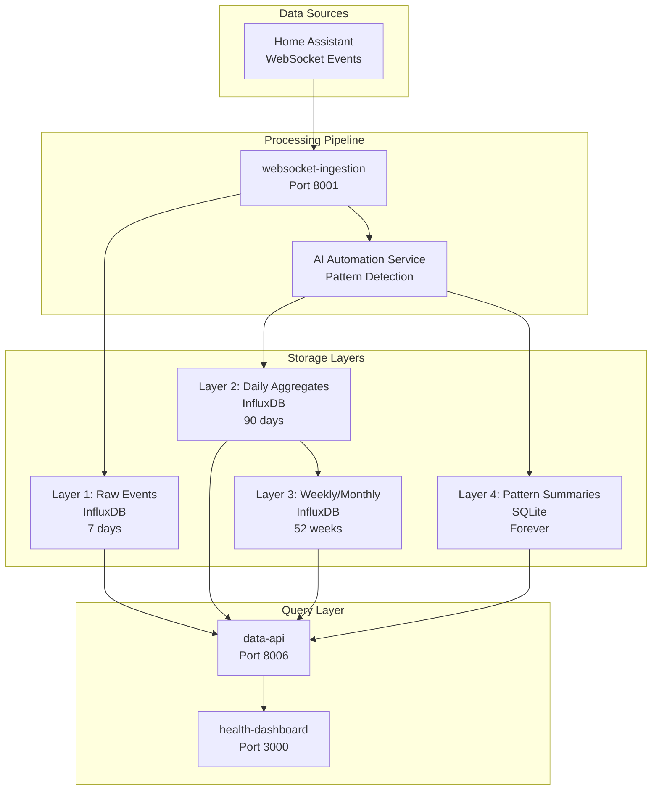
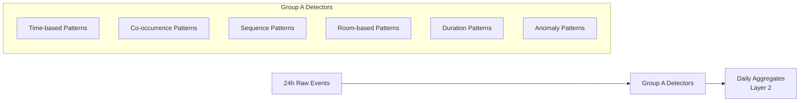
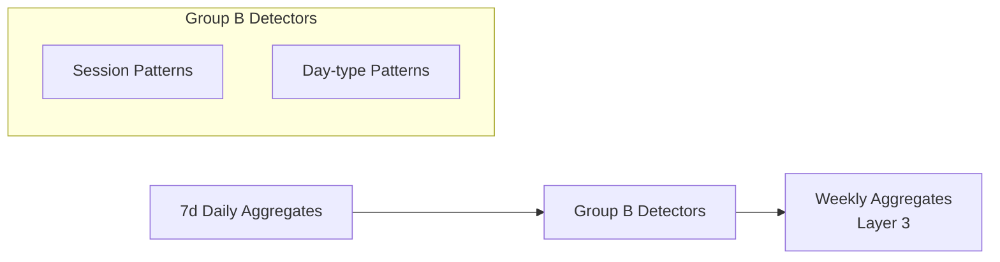
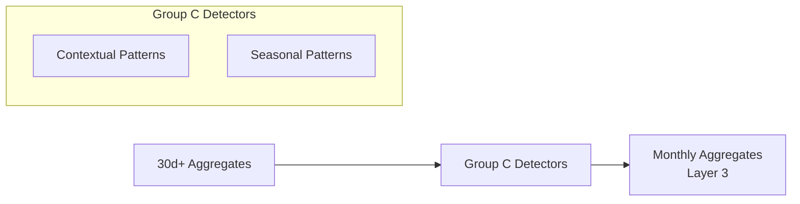

# Multi-Layer Storage Architecture

**Epic:** AI-5 (Incremental Pattern Processing)  
**Created:** 2025-01-15  
**Status:** Design Complete  
**Purpose:** Visual and conceptual architecture for incremental pattern processing

---

## Architecture Overview

The multi-layer storage architecture converts the AI Automation Service from inefficient 30-day reprocessing to optimized incremental processing with pre-aggregated data layers.

### Current vs Proposed Architecture



---

## Four-Layer Storage Design

### Layer 1: Raw Events (Source of Truth)
```
┌─────────────────────────────────────────────────────────────┐
│                    Layer 1: Raw Events                     │
├─────────────────────────────────────────────────────────────┤
│ Bucket: home_assistant_events                              │
│ Retention: 7 days (reduced from 30)                       │
│ Size: ~700K events (7 days × 100K/day)                    │
│ Purpose: Source of truth for recent data                   │
│                                                             │
│ Measurement: home_assistant_events                         │
│ Tags: entity_id, device_id, event_type, domain, area_id   │
│ Fields: state, attr_friendly_name, attributes              │
└─────────────────────────────────────────────────────────────┘
```

### Layer 2: Daily Aggregates (Pattern Analysis)
```
┌─────────────────────────────────────────────────────────────┐
│                  Layer 2: Daily Aggregates                 │
├─────────────────────────────────────────────────────────────┤
│ Bucket: pattern_aggregates_daily                           │
│ Retention: 90 days                                         │
│ Size: ~9K records (90 days × 10 detectors × ~10/day)      │
│ Purpose: Pre-computed daily patterns for historical queries│
│                                                             │
│ Measurements:                                               │
│ • time_based_daily      • co_occurrence_daily              │
│ • sequence_daily        • room_based_daily                 │
│ • duration_daily        • anomaly_daily                    │
│                                                             │
│ Tags: date, entity_id, domain, area_id, device_pair       │
│ Fields: JSON aggregates, metrics, confidence scores        │
└─────────────────────────────────────────────────────────────┘
```

### Layer 3: Weekly/Monthly Aggregates (Long-term Trends)
```
┌─────────────────────────────────────────────────────────────┐
│              Layer 3: Weekly/Monthly Aggregates            │
├─────────────────────────────────────────────────────────────┤
│ Bucket: pattern_aggregates_weekly                          │
│ Retention: 52 weeks (1 year)                              │
│ Size: ~1K records (52 weeks × 4 detectors × ~5/week)      │
│ Purpose: Long-term trends and seasonal analysis            │
│                                                             │
│ Measurements:                                               │
│ • session_weekly        • day_type_weekly                  │
│ • contextual_monthly    • seasonal_monthly                 │
│                                                             │
│ Tags: week, month, session_type, day_type, weather_context │
│ Fields: Aggregated patterns, correlation scores, trends    │
└─────────────────────────────────────────────────────────────┘
```

### Layer 4: Pattern Summaries (UI/API Compatibility)
```
┌─────────────────────────────────────────────────────────────┐
│                Layer 4: Pattern Summaries                  │
├─────────────────────────────────────────────────────────────┤
│ Database: SQLite (existing)                                │
│ Retention: Forever (configurable)                          │
│ Size: ~1K records                                          │
│ Purpose: High-level pattern catalog for UI/API             │
│                                                             │
│ Table: patterns                                             │
│ Columns: id, pattern_type, device_id, pattern_metadata,    │
│          confidence, occurrences, created_at                │
│                                                             │
│ Note: Unchanged from current system for backward           │
│       compatibility                                         │
└─────────────────────────────────────────────────────────────┘
```

---

## Data Flow Architecture



---

## Detector Grouping Strategy

### Group A: Daily Incremental Processing
**Process:** 24h raw events → Store to Layer 2  
**Schedule:** Daily @ 3 AM  
**Detectors:** 6 detectors



### Group B: Weekly Aggregated Processing
**Process:** 7d Layer 2 aggregates → Store to Layer 3  
**Schedule:** Weekly @ Sunday 3 AM  
**Detectors:** 2 detectors



### Group C: Monthly Contextual Processing
**Process:** 30d+ Layer 2/3 aggregates → Store to Layer 3  
**Schedule:** Monthly @ 1st 3 AM  
**Detectors:** 2 detectors



---

## Query Patterns

### Daily Pattern Queries
```flux
// Time-based patterns for last 30 days
from(bucket: "pattern_aggregates_daily")
  |> range(start: -30d)
  |> filter(fn: (r) => r._measurement == "time_based_daily")
  |> filter(fn: (r) => r.entity_id == "light.living_room")
  |> aggregateWindow(every: 1d, fn: mean)
```

### Cross-Layer Queries
```flux
// Combine daily and weekly data for comprehensive analysis
daily = from(bucket: "pattern_aggregates_daily")
  |> range(start: -7d)
  |> filter(fn: (r) => r._measurement == "day_type_daily")

weekly = from(bucket: "pattern_aggregates_weekly")
  |> range(start: -4w)
  |> filter(fn: (r) => r._measurement == "day_type_weekly")

union(tables: [daily, weekly])
  |> aggregateWindow(every: 1w, fn: mean)
```

---

## Performance Characteristics

### Storage Efficiency
| Layer | Current | Proposed | Reduction |
|-------|---------|----------|-----------|
| Raw Events | 90M events (9GB) | 4.9M events (500MB) | **94%** |
| Aggregates | 0 | 10K records (55MB) | **New** |
| Pattern Summaries | 1K records (1MB) | 1K records (1MB) | **0%** |
| **Total** | **9GB** | **556MB** | **94%** |

### Processing Efficiency
| Metric | Current | Proposed | Improvement |
|--------|---------|----------|-------------|
| Daily Processing | 2-4 min | 30-60 sec | **4x faster** |
| Memory Usage | 200-400MB | 100-150MB | **50% reduction** |
| Events Processed | 3M daily | 100K daily | **30x reduction** |
| Query Speed | 2-5 sec | 100-500ms | **10x faster** |

---

## Retention Policies

### Automatic Cleanup
```yaml
Layer 1 (Raw Events):
  retention: 7 days
  cleanup: Automatic via InfluxDB
  rationale: Only needed for daily processing

Layer 2 (Daily Aggregates):
  retention: 90 days
  cleanup: Automatic via InfluxDB
  rationale: Supports 30-day analysis with buffer

Layer 3 (Weekly/Monthly):
  retention: 52 weeks
  cleanup: Automatic via InfluxDB
  rationale: Supports seasonal analysis

Layer 4 (Pattern Summaries):
  retention: Configurable (default: forever)
  cleanup: Manual or admin API
  rationale: Historical pattern catalog
```

---

## Single-Home Optimizations

### Design Principles
1. **Simplicity over Scalability**: Optimize for 1 home, not 1000
2. **Resource Efficiency**: Minimize CPU, memory, storage
3. **Local-First**: No cloud dependencies
4. **Graceful Degradation**: Work even if components fail
5. **Easy Recovery**: Simple backup/restore

### Resource Constraints
- **CPU**: Raspberry Pi 4 typical (4 cores)
- **Memory**: 2-8GB RAM typical
- **Storage**: 32-128GB typical
- **Network**: Local network only
- **Power**: Must handle outages gracefully

---

## Migration Strategy

### Phase 1: Foundation
1. Create InfluxDB buckets with retention policies
2. Implement PatternAggregateClient
3. Convert Group A detectors to incremental processing

### Phase 2: Daily Processing
1. Refactor daily batch job for 24h processing
2. Implement retention policies
3. Begin performance testing

### Phase 3: Weekly/Monthly
1. Implement weekly aggregation layer
2. Convert Group B detectors
3. Implement monthly aggregation layer
4. Convert Group C detectors

### Phase 4: Production
1. Complete performance validation
2. Run migration script
3. Deploy to production

---

## Benefits Summary

### Performance Benefits
- **30x faster daily processing** (4 min → 30 sec)
- **10x faster queries** (5 sec → 500ms)
- **50% less memory usage** (400MB → 150MB)
- **94% less storage** (9GB → 556MB)

### Operational Benefits
- **Linear scalability** instead of exponential
- **Better reliability** with lower resource usage
- **Easier maintenance** with cleaner architecture
- **Backward compatibility** maintained

### Business Benefits
- **Lower infrastructure costs**
- **Better user experience** with faster responses
- **Future-proof architecture** for growth
- **Reduced maintenance overhead**

---

## Next Steps

1. **Review and approve** this architecture design
2. **Create detailed InfluxDB schemas** (Story AI5.1 Task 2)
3. **Calculate storage estimates** (Story AI5.1 Task 3)
4. **Design migration plan** (Story AI5.1 Task 4)
5. **Begin implementation** (Story AI5.2)

---

**Document Status:** Complete  
**Last Updated:** 2025-01-15  
**Ready for:** Implementation  
**Next:** InfluxDB Schema Documentation
