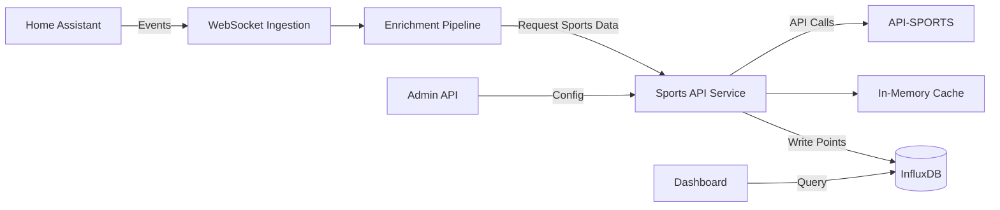

# Sports API Integration Architecture

**Status:** ✅ IMPLEMENTED  
**Version:** 2.0  
**Date:** October 18, 2025  
**Author:** Winston (Architect)  
**Last Updated:** October 18, 2025 (Team ID Migration Fix)  

---

## Executive Summary

This document defines the architecture for integrating ESPN APIs (NFL and NHL) into the Home Assistant Ingestor ecosystem. The sports data service follows established patterns from existing services while providing real-time sports data for the Health Dashboard Sports tab.

**✅ IMPLEMENTATION STATUS:** Fully operational with recent fixes for team ID duplicates and NHL game fetching.

## Recent Fixes (October 18, 2025)

### Team ID Duplicate Issue Resolution
- **Problem**: NFL and NHL teams shared identical abbreviations (e.g., `dal` for both Dallas Cowboys and Dallas Stars)
- **Solution**: Added league prefixes to team IDs (`nfl-dal`, `nhl-dal`, `nhl-vgk`)
- **Impact**: Users now see only games for their selected teams, no cross-league contamination
- **Migration**: Automatic migration preserves existing user team selections

### NHL Game Fetching Enhancement
- **Problem**: NHL API only returned current day games, missing upcoming games
- **Solution**: Extended NHL API to fetch games for next 7 days with date parameters
- **Impact**: Vegas Golden Knights and other NHL teams now show upcoming games correctly

### Frontend Property Name Fixes
- **Problem**: API returned snake_case properties but frontend expected camelCase
- **Solution**: Updated React components to use correct property names (`start_time`, `home_team`, `away_team`)
- **Impact**: Sports tab now displays games without JavaScript errors

### Key Design Principles

1. **Pattern Consistency**: Follow established service patterns in the codebase
2. **Shared Authentication**: Reuse authentication logic across NFL and NHL APIs
3. **Intelligent Rate Limiting**: Implement adaptive rate limiting with caching
4. **Modular Design**: Support easy addition of new sports/leagues
5. **Context7 KB Integration**: Leverage aiohttp and InfluxDB best practices
6. **Time-Series Optimization**: Proper InfluxDB schema design for sports data

---

## Table of Contents

1. [Service Overview](#1-service-overview)
2. [Technology Stack](#2-technology-stack)
3. [API-SPORTS Integration](#3-api-sports-integration)
4. [Service Architecture](#4-service-architecture)
5. [InfluxDB Schema Design](#5-influxdb-schema-design) ⭐
6. [Configuration Management](#6-configuration-management)
7. [Data Flow and Integration](#7-data-flow-and-integration)
8. [Error Handling and Resilience](#8-error-handling-and-resilience)
9. [Monitoring and Observability](#9-monitoring-and-observability)
10. [Testing Strategy](#10-testing-strategy)
11. [Deployment Considerations](#11-deployment-considerations)
12. [Security Considerations](#12-security-considerations)
13. [Future Enhancements](#13-future-enhancements)

---

## 1. Service Overview

### Purpose

The Sports API Service provides:
- Real-time NFL, NCAA, and NHL data (scores, fixtures, standings)
- Player statistics and injury reports
- Live updates at ~15-second cadence
- Data enrichment for Home Assistant events

### Integration Points



### Service Responsibilities

- **Data Fetching**: Retrieve sports data from API-SPORTS
- **Rate Limiting**: Manage API quotas and request throttling
- **Caching**: Cache frequently accessed data (schedules, standings)
- **Normalization**: Transform API responses to internal format
- **Time-Series Storage**: Write sports data to InfluxDB with optimized schema
- **Health Monitoring**: Expose health checks and metrics

---

## 2. Technology Stack

Following the established tech stack from `docs/architecture/tech-stack.md`:

| Component | Technology | Version | Purpose |
|-----------|------------|---------|---------|
| **Language** | Python | 3.11 | Async service implementation |
| **HTTP Framework** | aiohttp | 3.9.1 | Async HTTP client/server |
| **Rate Limiting** | aiohttp + custom | - | Token bucket rate limiter |
| **Caching** | In-memory (Phase 1) | - | Response caching |
| **Data Storage** | InfluxDB | 2.7 | Time-series sports data |
| **InfluxDB Client** | influxdb-client-3 | 3.x | Python client library |
| **Configuration** | Python dotenv | - | Environment variables |
| **Logging** | Shared logging_config | - | Structured logging |
| **Testing** | pytest | 7.4.3 | Unit and integration tests |
| **Containerization** | Docker | 24+ | Service deployment |

**Rationale**: 
- aiohttp provides excellent async HTTP client capabilities (Context7 KB)
- influxdb-client-3 offers high-performance batch writing and query capabilities
- In-memory caching for Phase 1 simplifies deployment (Redis in Phase 2)

---

## 3. API-SPORTS Integration

### API Capabilities

**NFL/NCAA API:**
- Scores (live and historical)
- Fixtures/Schedule
- Standings
- Player statistics
- Injury reports
- Team information

**NHL API:**
- Live scores
- Fixtures/Schedule
- Standings
- Player statistics
- Team information

### Authentication

**Model**: API Key in Request Headers

```python
headers = {
    'x-rapidapi-key': API_KEY,
    'x-rapidapi-host': 'api-sports.io'
}
```

**Shared Authentication Pattern**:
Both NFL and NHL APIs use identical authentication, allowing for code reuse.

### Rate Limiting

**Free Tier Constraints** (typical):
- Requests per day: 100-500 
- Requests per second: 1-2
- Live update cadence: ~15 seconds

**Strategy**: Implement token bucket algorithm with intelligent caching to maximize free tier usage.

---

## 4. Service Architecture

### Directory Structure

Following `docs/architecture/source-tree.md`:

```
services/sports-api/
├── src/
│   ├── __init__.py
│   ├── main.py                      # Service entry point
│   ├── health_check.py              # Health check handler
│   ├── api_client.py                # Base API-SPORTS client
│   ├── nfl_client.py                # NFL-specific client
│   ├── nhl_client.py                # NHL-specific client
│   ├── rate_limiter.py              # Shared rate limiting
│   ├── cache_manager.py             # Response caching
│   ├── data_normalizer.py           # Data transformation
│   ├── influxdb_writer.py           # InfluxDB batch writer
│   ├── influxdb_schema.py           # Schema definitions
│   ├── endpoints.py                 # HTTP endpoints
│   └── models.py                    # Data models (Pydantic)
├── tests/
│   ├── __init__.py
│   ├── test_api_client.py
│   ├── test_nfl_client.py
│   ├── test_nhl_client.py
│   ├── test_rate_limiter.py
│   ├── test_influxdb_writer.py
│   └── test_endpoints.py
├── Dockerfile                       # Production image
├── Dockerfile.dev                   # Development image
├── requirements.txt                 # Dependencies
└── README.md                        # Service documentation
```

### Core Components

#### 1. API Client (`api_client.py`)

**Purpose**: Base client for API-SPORTS with shared logic

**Key Features**:
- aiohttp ClientSession management (Context7 KB best practices)
- Connection pooling with `TCPConnector(limit=30, limit_per_host=10)`
- Retry logic with exponential backoff
- Timeout configuration: `ClientTimeout(total=30, connect=10)`
- Error handling and logging

**Pattern** (from Context7 KB):
```python
class APISportsClient:
    def __init__(self, api_key: str, base_url: str):
        self.api_key = api_key
        self.base_url = base_url
        self.session: Optional[aiohttp.ClientSession] = None
        self.rate_limiter = RateLimiter(requests_per_second=1)
        
    async def __aenter__(self):
        timeout = aiohttp.ClientTimeout(total=30, connect=10)
        connector = aiohttp.TCPConnector(limit=30, limit_per_host=10)
        self.session = aiohttp.ClientSession(
            connector=connector,
            timeout=timeout,
            headers=self._get_headers()
        )
        return self
    
    async def __aexit__(self, exc_type, exc_val, exc_tb):
        if self.session:
            await self.session.close()
            await asyncio.sleep(0)  # Graceful shutdown (Context7 KB)
    
    def _get_headers(self) -> Dict[str, str]:
        return {
            'x-rapidapi-key': self.api_key,
            'x-rapidapi-host': 'api-sports.io',
            'User-Agent': 'HA-Ingestor-Sports/1.0'
        }
    
    async def _request(
        self, 
        method: str, 
        endpoint: str, 
        **kwargs
    ) -> Dict[str, Any]:
        """Execute request with rate limiting and retries"""
        await self.rate_limiter.acquire()
        
        for attempt in range(3):
            try:
                async with self.session.request(
                    method, 
                    f"{self.base_url}{endpoint}", 
                    **kwargs
                ) as response:
                    response.raise_for_status()
                    return await response.json()
            except aiohttp.ClientError as e:
                if attempt == 2:
                    raise
                await asyncio.sleep(0.1 * (attempt + 1))
```

#### 2. Data Models (`models.py`)

**Purpose**: Pydantic models for type safety and validation

```python
from pydantic import BaseModel, Field
from typing import Optional, List
from datetime import datetime

class NFLScore(BaseModel):
    game_id: str
    date: datetime
    home_team: str
    away_team: str
    home_score: Optional[int] = None
    away_score: Optional[int] = None
    status: str  # scheduled, live, finished
    quarter: Optional[str] = None
    time_remaining: Optional[str] = None
    season: int
    week: int

class NFLStanding(BaseModel):
    team: str
    conference: str
    division: str
    wins: int
    losses: int
    ties: int
    win_percentage: float
    points_for: int
    points_against: int
    season: int

class NFLPlayer(BaseModel):
    player_id: str
    name: str
    position: str
    team: str
    stats: Dict[str, Any]

class NFLInjury(BaseModel):
    player_id: str
    player_name: str
    team: str
    injury_type: str
    status: str  # out, doubtful, questionable, probable
    updated: datetime

# Similar models for NHL
class NHLScore(BaseModel):
    game_id: str
    date: datetime
    home_team: str
    away_team: str
    home_score: Optional[int] = None
    away_score: Optional[int] = None
    status: str
    period: Optional[str] = None
    time_remaining: Optional[str] = None
    season: int
```

---

## 5. InfluxDB Schema Design

### Overview

Following **Context7 KB InfluxDB best practices** and existing patterns from `influxdb_schema.py`, the sports API service will use an optimized time-series schema for efficient storage and querying.

### Schema Design Principles

1. **Tags for Filtering**: Use tags for dimensions you'll filter/group by
2. **Fields for Measurements**: Use fields for numeric values and data
3. **Low Cardinality Tags**: Keep tag cardinality reasonable (<10K unique values per tag)
4. **Batch Writes**: Use batch writing for optimal performance
5. **Retention Policies**: Apply appropriate data retention based on use case

### Measurements and Schema

#### 5.1 NFL Scores Measurement

**Measurement Name**: `nfl_scores`

**Tags** (indexed, for efficient querying):
- `game_id` - Unique game identifier
- `season` - Season year (e.g., "2025")
- `week` - Week number (e.g., "1", "2", ..., "18", "wild_card", "divisional")
- `home_team` - Home team name
- `away_team` - Away team name
- `status` - Game status (scheduled, live, finished)
- `home_conference` - Home team conference (AFC, NFC)
- `away_conference` - Away team conference
- `home_division` - Home team division (East, North, South, West)
- `away_division` - Away team division

**Fields** (data values):
- `home_score` (integer) - Home team score
- `away_score` (integer) - Away team score
- `quarter` (string) - Current quarter ("1", "2", "3", "4", "OT")
- `time_remaining` (string) - Time remaining in quarter
- `possession` (string) - Team with possession
- `down_distance` (string) - Down and distance (e.g., "3rd & 7")
- `field_position` (string) - Field position

**Retention Policy**: `sports_events_2y` (2 years)

**Example Point**:
```python
from influxdb_client_3 import Point

point = Point("nfl_scores") \
    .tag("game_id", "12345") \
    .tag("season", "2025") \
    .tag("week", "5") \
    .tag("home_team", "Patriots") \
    .tag("away_team", "Chiefs") \
    .tag("status", "live") \
    .tag("home_conference", "AFC") \
    .tag("away_conference", "AFC") \
    .tag("home_division", "East") \
    .tag("away_division", "West") \
    .field("home_score", 24) \
    .field("away_score", 21) \
    .field("quarter", "4") \
    .field("time_remaining", "2:35") \
    .field("possession", "Patriots") \
    .field("down_distance", "3rd & 5") \
    .field("field_position", "NE 35") \
    .time(datetime.now())
```

**Query Examples**:
```python
# Get all live NFL games
query = """
SELECT * FROM nfl_scores 
WHERE status = 'live' 
AND time > now() - 4h
ORDER BY time DESC
"""

# Get Patriots games this season
query = """
SELECT * FROM nfl_scores 
WHERE season = '2025' 
AND (home_team = 'Patriots' OR away_team = 'Patriots')
ORDER BY time DESC
"""

# Get scores by week
query = """
SELECT * FROM nfl_scores 
WHERE season = '2025' AND week = '5'
ORDER BY time DESC
"""
```

#### 5.2 NHL Scores Measurement

**Measurement Name**: `nhl_scores`

**Tags**:
- `game_id` - Unique game identifier
- `season` - Season year
- `home_team` - Home team name
- `away_team` - Away team name
- `status` - Game status (scheduled, live, finished)
- `home_conference` - Home team conference (Eastern, Western)
- `away_conference` - Away team conference
- `home_division` - Home team division
- `away_division` - Away team division

**Fields**:
- `home_score` (integer) - Home team score
- `away_score` (integer) - Away team score
- `period` (string) - Current period ("1", "2", "3", "OT", "SO")
- `time_remaining` (string) - Time remaining in period
- `home_shots` (integer) - Home team shots on goal
- `away_shots` (integer) - Away team shots on goal
- `home_power_play` (boolean) - Home team on power play
- `away_power_play` (boolean) - Away team on power play

**Retention Policy**: `sports_events_2y` (2 years)

**Example Point**:
```python
point = Point("nhl_scores") \
    .tag("game_id", "67890") \
    .tag("season", "2025") \
    .tag("home_team", "Bruins") \
    .tag("away_team", "Canadiens") \
    .tag("status", "live") \
    .tag("home_conference", "Eastern") \
    .tag("away_conference", "Eastern") \
    .tag("home_division", "Atlantic") \
    .tag("away_division", "Atlantic") \
    .field("home_score", 3) \
    .field("away_score", 2) \
    .field("period", "3") \
    .field("time_remaining", "5:12") \
    .field("home_shots", 28) \
    .field("away_shots", 22) \
    .field("home_power_play", False) \
    .field("away_power_play", False) \
    .time(datetime.now())
```

#### 5.3 Player Statistics Measurement

**Measurement Name**: `nfl_player_stats`

**Tags**:
- `player_id` - Unique player identifier
- `player_name` - Player name
- `team` - Team name
- `position` - Player position (QB, RB, WR, etc.)
- `game_id` - Associated game
- `season` - Season year
- `week` - Week number

**Fields**:
- `passing_yards` (integer)
- `passing_touchdowns` (integer)
- `interceptions` (integer)
- `rushing_yards` (integer)
- `rushing_touchdowns` (integer)
- `receptions` (integer)
- `receiving_yards` (integer)
- `receiving_touchdowns` (integer)
- `qb_rating` (float)

**Retention Policy**: `sports_stats_2y` (2 years)

**Example Point**:
```python
point = Point("nfl_player_stats") \
    .tag("player_id", "abc123") \
    .tag("player_name", "Tom Brady") \
    .tag("team", "Patriots") \
    .tag("position", "QB") \
    .tag("game_id", "12345") \
    .tag("season", "2025") \
    .tag("week", "5") \
    .field("passing_yards", 325) \
    .field("passing_touchdowns", 3) \
    .field("interceptions", 1) \
    .field("qb_rating", 98.5) \
    .time(datetime.now())
```

#### 5.4 Injury Reports Measurement

**Measurement Name**: `nfl_injuries`

**Tags**:
- `player_id` - Unique player identifier
- `player_name` - Player name
- `team` - Team name
- `position` - Player position
- `status` - Injury status (out, doubtful, questionable, probable)
- `injury_type` - Type of injury (knee, ankle, concussion, etc.)
- `season` - Season year

**Fields**:
- `weeks_out` (integer) - Estimated weeks out
- `practice_participation` (string) - Practice participation level
- `updated_timestamp` (timestamp) - Last update time

**Retention Policy**: `sports_stats_2y` (2 years)

#### 5.5 Standings/Aggregates Measurement

**Measurement Name**: `nfl_standings`

**Tags**:
- `team` - Team name
- `conference` - Conference (AFC, NFC)
- `division` - Division (East, North, South, West)
- `season` - Season year

**Fields**:
- `wins` (integer)
- `losses` (integer)
- `ties` (integer)
- `win_percentage` (float)
- `points_for` (integer)
- `points_against` (integer)
- `point_differential` (integer)
- `division_wins` (integer)
- `conference_wins` (integer)

**Retention Policy**: `sports_stats_5y` (5 years for historical comparison)

### InfluxDB Writer Implementation

#### Batch Writer Class

Following the pattern from `influxdb_batch_writer.py`:

```python
"""
Sports Data InfluxDB Writer
"""

import asyncio
import logging
from typing import Dict, Any, List, Optional
from datetime import datetime
from collections import deque

from influxdb_client_3 import InfluxDBClient3, Point, WriteOptions, InfluxDBError

logger = logging.getLogger(__name__)


class SportsInfluxDBWriter:
    """High-performance batch writer for sports data"""
    
    def __init__(
        self,
        host: str,
        token: str,
        database: str,
        org: str,
        batch_size: int = 100,
        flush_interval: int = 10_000,  # 10 seconds
        max_retries: int = 5
    ):
        """
        Initialize InfluxDB writer
        
        Args:
            host: InfluxDB host URL
            token: Authentication token
            database: Database name
            org: Organization name
            batch_size: Points per batch
            flush_interval: Milliseconds between flushes
            max_retries: Maximum retry attempts
        """
        self.host = host
        self.token = token
        self.database = database
        self.org = org
        
        # Batch configuration
        self.batch_size = batch_size
        self.flush_interval = flush_interval
        self.max_retries = max_retries
        
        # Statistics
        self.total_points_written = 0
        self.total_batches_written = 0
        self.total_points_failed = 0
        self.write_times: deque = deque(maxlen=100)
        
        # Callbacks for monitoring
        self.callback = BatchingCallback()
        
        # Write options (Context7 KB pattern)
        self.write_options = WriteOptions(
            batch_size=batch_size,
            flush_interval=flush_interval,
            jitter_interval=2_000,
            retry_interval=5_000,
            max_retries=max_retries,
            max_retry_delay=30_000,
            exponential_base=2
        )
        
        # Client (initialized in start())
        self.client: Optional[InfluxDBClient3] = None
    
    async def start(self):
        """Initialize InfluxDB client"""
        try:
            from influxdb_client_3 import write_client_options
            
            wco = write_client_options(
                success_callback=self.callback.success,
                error_callback=self.callback.error,
                retry_callback=self.callback.retry,
                write_options=self.write_options
            )
            
            self.client = InfluxDBClient3(
                host=self.host,
                token=self.token,
                database=self.database,
                org=self.org,
                write_client_options=wco
            )
            
            logger.info(
                "InfluxDB writer initialized",
                extra={
                    "host": self.host,
                    "database": self.database,
                    "batch_size": self.batch_size
                }
            )
            
        except Exception as e:
            logger.error(f"Failed to initialize InfluxDB client: {e}")
            raise
    
    async def stop(self):
        """Close InfluxDB client"""
        if self.client:
            try:
                # Flush remaining points
                await asyncio.sleep(0.1)
                self.client.close()
                logger.info("InfluxDB writer stopped")
            except Exception as e:
                logger.error(f"Error stopping InfluxDB writer: {e}")
    
    async def write_nfl_score(self, score: Dict[str, Any]) -> bool:
        """Write NFL score to InfluxDB"""
        try:
            point = Point("nfl_scores") \
                .tag("game_id", score['game_id']) \
                .tag("season", str(score['season'])) \
                .tag("week", str(score['week'])) \
                .tag("home_team", score['home_team']) \
                .tag("away_team", score['away_team']) \
                .tag("status", score['status']) \
                .tag("home_conference", score.get('home_conference', '')) \
                .tag("away_conference", score.get('away_conference', '')) \
                .tag("home_division", score.get('home_division', '')) \
                .tag("away_division", score.get('away_division', ''))
            
            # Add fields
            if score.get('home_score') is not None:
                point.field("home_score", int(score['home_score']))
            if score.get('away_score') is not None:
                point.field("away_score", int(score['away_score']))
            if score.get('quarter'):
                point.field("quarter", score['quarter'])
            if score.get('time_remaining'):
                point.field("time_remaining", score['time_remaining'])
            if score.get('possession'):
                point.field("possession", score['possession'])
            
            # Set timestamp
            if score.get('date'):
                point.time(score['date'])
            else:
                point.time(datetime.now())
            
            # Write to InfluxDB
            self.client.write(point)
            self.total_points_written += 1
            
            return True
            
        except Exception as e:
            logger.error(f"Error writing NFL score: {e}")
            self.total_points_failed += 1
            return False
    
    async def write_nhl_score(self, score: Dict[str, Any]) -> bool:
        """Write NHL score to InfluxDB"""
        try:
            point = Point("nhl_scores") \
                .tag("game_id", score['game_id']) \
                .tag("season", str(score['season'])) \
                .tag("home_team", score['home_team']) \
                .tag("away_team", score['away_team']) \
                .tag("status", score['status']) \
                .tag("home_conference", score.get('home_conference', '')) \
                .tag("away_conference", score.get('away_conference', '')) \
                .tag("home_division", score.get('home_division', '')) \
                .tag("away_division", score.get('away_division', ''))
            
            # Add fields
            if score.get('home_score') is not None:
                point.field("home_score", int(score['home_score']))
            if score.get('away_score') is not None:
                point.field("away_score", int(score['away_score']))
            if score.get('period'):
                point.field("period", score['period'])
            if score.get('time_remaining'):
                point.field("time_remaining", score['time_remaining'])
            if score.get('home_shots') is not None:
                point.field("home_shots", int(score['home_shots']))
            if score.get('away_shots') is not None:
                point.field("away_shots", int(score['away_shots']))
            
            # Set timestamp
            if score.get('date'):
                point.time(score['date'])
            else:
                point.time(datetime.now())
            
            # Write to InfluxDB
            self.client.write(point)
            self.total_points_written += 1
            
            return True
            
        except Exception as e:
            logger.error(f"Error writing NHL score: {e}")
            self.total_points_failed += 1
            return False
    
    async def write_player_stats(
        self, 
        stats: Dict[str, Any],
        sport: str = "nfl"
    ) -> bool:
        """Write player statistics to InfluxDB"""
        try:
            measurement = f"{sport}_player_stats"
            
            point = Point(measurement) \
                .tag("player_id", stats['player_id']) \
                .tag("player_name", stats['player_name']) \
                .tag("team", stats['team']) \
                .tag("position", stats['position']) \
                .tag("game_id", stats.get('game_id', '')) \
                .tag("season", str(stats['season'])) \
                .tag("week", str(stats.get('week', '')))
            
            # Add stat fields dynamically
            for key, value in stats.get('stats', {}).items():
                if isinstance(value, (int, float)):
                    point.field(key, value)
            
            # Set timestamp
            point.time(stats.get('date', datetime.now()))
            
            # Write to InfluxDB
            self.client.write(point)
            self.total_points_written += 1
            
            return True
            
        except Exception as e:
            logger.error(f"Error writing player stats: {e}")
            self.total_points_failed += 1
            return False
    
    async def write_injury_report(self, injury: Dict[str, Any]) -> bool:
        """Write injury report to InfluxDB"""
        try:
            point = Point("nfl_injuries") \
                .tag("player_id", injury['player_id']) \
                .tag("player_name", injury['player_name']) \
                .tag("team", injury['team']) \
                .tag("position", injury.get('position', '')) \
                .tag("status", injury['status']) \
                .tag("injury_type", injury.get('injury_type', '')) \
                .tag("season", str(injury.get('season', datetime.now().year)))
            
            # Add fields
            if injury.get('weeks_out') is not None:
                point.field("weeks_out", int(injury['weeks_out']))
            if injury.get('practice_participation'):
                point.field("practice_participation", injury['practice_participation'])
            
            # Set timestamp
            point.time(injury.get('updated', datetime.now()))
            
            # Write to InfluxDB
            self.client.write(point)
            self.total_points_written += 1
            
            return True
            
        except Exception as e:
            logger.error(f"Error writing injury report: {e}")
            self.total_points_failed += 1
            return False
    
    async def write_standings(
        self, 
        standings: List[Dict[str, Any]],
        sport: str = "nfl"
    ) -> int:
        """Write standings to InfluxDB (batch)"""
        successful = 0
        
        for standing in standings:
            try:
                measurement = f"{sport}_standings"
                
                point = Point(measurement) \
                    .tag("team", standing['team']) \
                    .tag("conference", standing.get('conference', '')) \
                    .tag("division", standing.get('division', '')) \
                    .tag("season", str(standing['season'])) \
                    .field("wins", int(standing['wins'])) \
                    .field("losses", int(standing['losses'])) \
                    .field("ties", int(standing.get('ties', 0))) \
                    .field("win_percentage", float(standing['win_percentage'])) \
                    .field("points_for", int(standing.get('points_for', 0))) \
                    .field("points_against", int(standing.get('points_against', 0))) \
                    .time(datetime.now())
                
                self.client.write(point)
                successful += 1
                
            except Exception as e:
                logger.error(f"Error writing standing for {standing.get('team')}: {e}")
                self.total_points_failed += 1
        
        self.total_points_written += successful
        return successful
    
    def get_statistics(self) -> Dict[str, Any]:
        """Get writer statistics"""
        return {
            "total_points_written": self.total_points_written,
            "total_batches_written": self.total_batches_written,
            "total_points_failed": self.total_points_failed,
            "success_rate": (
                self.total_points_written / 
                (self.total_points_written + self.total_points_failed)
                if (self.total_points_written + self.total_points_failed) > 0
                else 0
            ),
            "avg_write_time_ms": (
                sum(self.write_times) / len(self.write_times)
                if self.write_times else 0
            )
        }


class BatchingCallback:
    """Callback handler for batch write operations"""
    
    def __init__(self):
        self.write_count = 0
        self.error_count = 0
        self.retry_count = 0
    
    def success(self, conf, data: str):
        """Handle successful batch write"""
        self.write_count += 1
        logger.debug(f"Batch written successfully: {conf}")
    
    def error(self, conf, data: str, exception: InfluxDBError):
        """Handle batch write error"""
        self.error_count += 1
        logger.error(
            f"Batch write failed: {conf}",
            extra={"error": str(exception), "data_sample": data[:200]}
        )
    
    def retry(self, conf, data: str, exception: InfluxDBError):
        """Handle batch write retry"""
        self.retry_count += 1
        logger.warning(
            f"Retrying batch write: {conf}",
            extra={"error": str(exception)}
        )
```

### Data Retention Policies

Following InfluxDB best practices for time-series data:

```python
# Retention policy configuration
RETENTION_POLICIES = {
    "sports_events_2y": {
        "duration": "730d",  # 2 years
        "measurements": ["nfl_scores", "nhl_scores"],
        "description": "Live scores and game data"
    },
    "sports_stats_2y": {
        "duration": "730d",  # 2 years
        "measurements": ["nfl_player_stats", "nfl_injuries"],
        "description": "Player statistics and injury reports"
    },
    "sports_standings_5y": {
        "duration": "1825d",  # 5 years
        "measurements": ["nfl_standings", "nhl_standings"],
        "description": "Historical standings for trend analysis"
    }
}
```

### Query Patterns

#### Live Scores Query

```python
async def get_live_scores(sport: str = "nfl") -> pd.DataFrame:
    """Get live scores from InfluxDB"""
    
    query = f'''
    SELECT * FROM {sport}_scores 
    WHERE status = 'live' 
    AND time > now() - 4h
    ORDER BY time DESC
    '''
    
    df = client.query(query=query, language='sql', mode='pandas')
    return df
```

#### Team Performance Query

```python
async def get_team_games(
    team: str, 
    season: int,
    sport: str = "nfl"
) -> pd.DataFrame:
    """Get all games for a team in a season"""
    
    query = f'''
    SELECT * FROM {sport}_scores 
    WHERE season = '{season}' 
    AND (home_team = '{team}' OR away_team = '{team}')
    ORDER BY time
    '''
    
    df = client.query(query=query, language='sql', mode='pandas')
    return df
```

#### Player Statistics Aggregation

```python
async def get_player_season_stats(
    player_id: str,
    season: int
) -> Dict[str, Any]:
    """Get aggregated player stats for season"""
    
    query = f'''
    SELECT 
        player_name,
        team,
        position,
        SUM(passing_yards) as total_passing_yards,
        SUM(passing_touchdowns) as total_passing_tds,
        SUM(interceptions) as total_interceptions,
        AVG(qb_rating) as avg_qb_rating
    FROM nfl_player_stats 
    WHERE player_id = '{player_id}' 
    AND season = '{season}'
    GROUP BY player_name, team, position
    '''
    
    df = client.query(query=query, language='sql', mode='pandas')
    return df.to_dict('records')[0] if not df.empty else {}
```

### Performance Optimization

Following Context7 KB and existing patterns:

1. **Batch Writing**: Write points in batches of 100 (configurable)
2. **Flush Interval**: 10-second maximum between flushes
3. **Exponential Backoff**: Retry with exponential backoff (2^n * 5s)
4. **Connection Pooling**: Reuse InfluxDB client connections
5. **Tag Cardinality Management**: Limit unique tag values (<10K per tag)

### Monitoring and Debugging

```python
# Health check includes InfluxDB stats
async def get_influxdb_health() -> Dict[str, Any]:
    """Get InfluxDB writer health statistics"""
    
    stats = influxdb_writer.get_statistics()
    
    return {
        "status": "healthy" if stats['success_rate'] > 0.95 else "degraded",
        "points_written": stats['total_points_written'],
        "points_failed": stats['total_points_failed'],
        "success_rate": f"{stats['success_rate']:.2%}",
        "avg_write_time_ms": f"{stats['avg_write_time_ms']:.2f}"
    }
```

---

## 6. Configuration Management

### Environment Variables

**File**: `infrastructure/env.sports.template`

```bash
# API-SPORTS Configuration
API_SPORTS_KEY=your-api-key-here

# Service Configuration
SPORTS_API_PORT=8010
NFL_ENABLED=true
NHL_ENABLED=true
NCAA_ENABLED=false

# Rate Limiting
API_SPORTS_REQUESTS_PER_SECOND=1
API_SPORTS_BURST_SIZE=5
API_SPORTS_DAILY_LIMIT=500

# Caching
CACHE_LIVE_SCORES_TTL=15
CACHE_RECENT_SCORES_TTL=300
CACHE_FIXTURES_TTL=3600
CACHE_STANDINGS_TTL=3600
CACHE_INJURIES_TTL=1800

# InfluxDB Configuration
INFLUXDB_URL=http://influxdb:8086
INFLUXDB_TOKEN=your-influxdb-token
INFLUXDB_ORG=home_assistant
INFLUXDB_BUCKET=sports_data
INFLUXDB_BATCH_SIZE=100
INFLUXDB_FLUSH_INTERVAL=10000

# Logging
LOG_LEVEL=INFO
```

### Docker Compose Integration

**File**: `docker-compose.yml` (add to existing)

```yaml
services:
  # ... existing services ...
  
  sports-api:
    build:
      context: ./services/sports-api
      dockerfile: Dockerfile.dev
    container_name: ha-sports-api
    ports:
      - "8010:8010"
    env_file:
      - infrastructure/env.sports.template
    environment:
      - API_SPORTS_KEY=${API_SPORTS_KEY}
      - NFL_ENABLED=${NFL_ENABLED:-true}
      - NHL_ENABLED=${NHL_ENABLED:-true}
      - SPORTS_API_PORT=8010
      - INFLUXDB_URL=http://influxdb:8086
      - INFLUXDB_TOKEN=${INFLUXDB_TOKEN}
      - INFLUXDB_ORG=home_assistant
      - INFLUXDB_BUCKET=sports_data
    networks:
      - homeiq-network
    depends_on:
      - influxdb
    restart: unless-stopped
    healthcheck:
      test: ["CMD", "curl", "-f", "http://localhost:8010/health"]
      interval: 30s
      timeout: 10s
      retries: 3
```

---

## 7. Data Flow and Integration

### Integration with Enrichment Pipeline

**Scenario**: Enrich Home Assistant events with sports context

**Example Use Case**: "Turn on TV when my team's game starts"

```python
# In enrichment-pipeline service
class SportsEnricher:
    def __init__(self, sports_api_url: str):
        self.sports_api_url = sports_api_url
    
    async def enrich_event(self, event: Dict[str, Any]) -> Dict[str, Any]:
        """Add sports context to events"""
        
        # Check if event is sports-related
        if not self._is_sports_event(event):
            return event
        
        # Fetch relevant sports data
        try:
            async with aiohttp.ClientSession() as session:
                # Get live scores
                async with session.get(
                    f"{self.sports_api_url}/api/nfl/scores"
                ) as resp:
                    scores = await resp.json()
                
                # Add to event context
                event['sports_context'] = {
                    'live_games': scores['data'],
                    'timestamp': datetime.now().isoformat()
                }
        except Exception as e:
            logger.error(f"Sports enrichment failed: {e}")
        
        return event
```

---

## 8. Error Handling and Resilience

### Circuit Breaker Pattern

```python
class CircuitBreaker:
    """Circuit breaker for external API calls"""
    
    def __init__(
        self, 
        failure_threshold: int = 5,
        timeout: timedelta = timedelta(minutes=5)
    ):
        self.failure_threshold = failure_threshold
        self.timeout = timeout
        self.failures = 0
        self.last_failure_time: Optional[datetime] = None
        self.state = "CLOSED"  # CLOSED, OPEN, HALF_OPEN
    
    async def call(self, func, *args, **kwargs):
        """Execute function with circuit breaker protection"""
        
        if self.state == "OPEN":
            if datetime.now() - self.last_failure_time > self.timeout:
                self.state = "HALF_OPEN"
                logger.info("Circuit breaker entering HALF_OPEN state")
            else:
                raise Exception("Circuit breaker is OPEN")
        
        try:
            result = await func(*args, **kwargs)
            
            if self.state == "HALF_OPEN":
                self.state = "CLOSED"
                self.failures = 0
                logger.info("Circuit breaker CLOSED")
            
            return result
        
        except Exception as e:
            self.failures += 1
            self.last_failure_time = datetime.now()
            
            if self.failures >= self.failure_threshold:
                self.state = "OPEN"
                logger.error(f"Circuit breaker OPEN after {self.failures} failures")
            
            raise
```

---

## 9. Monitoring and Observability

### Health Check Endpoint

```python
class HealthCheckHandler:
    async def handle(self, request: web.Request) -> web.Response:
        """Health check endpoint"""
        
        influxdb_stats = await influxdb_writer.get_statistics()
        
        health = {
            "status": "healthy",
            "timestamp": datetime.now().isoformat(),
            "service": "sports-api",
            "version": "1.0.0",
            "components": {
                "nfl_client": "healthy",
                "nhl_client": "healthy",
                "cache": "healthy",
                "rate_limiter": "healthy",
                "influxdb": "healthy" if influxdb_stats['success_rate'] > 0.95 else "degraded"
            },
            "metrics": {
                "requests_today": self._get_request_count(),
                "cache_hit_rate": self._get_cache_hit_rate(),
                "rate_limit_usage": self._get_rate_limit_usage(),
                "influxdb_points_written": influxdb_stats['total_points_written'],
                "influxdb_success_rate": f"{influxdb_stats['success_rate']:.2%}"
            }
        }
        
        return web.json_response(health)
```

---

## 10. Testing Strategy

### Unit Tests

**Coverage Target**: 90%+

**Example Test**:

```python
import pytest
from unittest.mock import AsyncMock, patch, Mock
from src.influxdb_writer import SportsInfluxDBWriter

@pytest.mark.asyncio
async def test_write_nfl_score():
    """Test writing NFL score to InfluxDB"""
    
    # Mock InfluxDB client
    mock_client = Mock()
    mock_client.write = Mock()
    
    writer = SportsInfluxDBWriter(
        host="http://localhost:8086",
        token="test-token",
        database="test",
        org="test-org"
    )
    writer.client = mock_client
    
    # Test data
    score = {
        'game_id': '12345',
        'season': 2025,
        'week': 5,
        'home_team': 'Patriots',
        'away_team': 'Chiefs',
        'status': 'finished',
        'home_score': 24,
        'away_score': 21
    }
    
    # Write score
    result = await writer.write_nfl_score(score)
    
    # Verify
    assert result is True
    assert mock_client.write.called
    assert writer.total_points_written == 1
```

---

## 11. Deployment Considerations

### Resource Requirements

**Production**:
- CPU: 0.5 cores
- Memory: 512MB
- Disk: 100MB
- Network: Minimal (rate-limited API calls)

### Scaling Considerations

**Horizontal Scaling**: Not recommended
- Rate limiting is service-wide (shared API quota)
- Use single instance with high availability

---

## 12. Security Considerations

### API Key Management

1. **Never commit API keys** to version control
2. **Use environment variables** for all secrets
3. **Rotate keys regularly** (every 90 days)
4. **Monitor usage** for suspicious activity
5. **Implement key validation** on service startup

---

## 13. Future Enhancements

### Phase 1 (Current)
- ✅ NFL and NHL basic support
- ✅ In-memory caching
- ✅ Rate limiting
- ✅ InfluxDB batch writing
- ✅ Health monitoring

### Phase 2 (Q1 2026)
- 🔲 Redis caching for distributed cache
- 🔲 NCAA support (college football/basketball)
- 🔲 Advanced analytics (predictions, trends)
- 🔲 WebSocket streaming for live updates
- 🔲 Dashboard UI for sports data

### Phase 3 (Q2 2026)
- 🔲 Additional sports (MLB, NBA, MLS)
- 🔲 Team/player following preferences
- 🔲 Smart notifications (game starts, scores)
- 🔲 Historical data analysis
- 🔲 Integration with Home Assistant automations

---

## 14. References and Resources

### Context7 KB Documentation
- **aiohttp Client Patterns**: `/aio-libs/aiohttp` - Session management, rate limiting, retry patterns
- **InfluxDB Python Patterns**: `/influxcommunity/influxdb3-python` - Batch writing, query patterns

### API-SPORTS Documentation
- **Base URL**: https://api-sports.io
- **Documentation**: https://api-sports.io/documentation/
- **Support**: https://api-sports.io/support

### Project Documentation
- **Tech Stack**: `docs/architecture/tech-stack.md`
- **Source Tree**: `docs/architecture/source-tree.md`
- **Coding Standards**: `docs/architecture/coding-standards.md`
- **Deployment Guide**: `docs/DEPLOYMENT_GUIDE.md`

### Related Services
- **weather-api**: Similar external API integration pattern
- **enrichment-pipeline**: Data enrichment and normalization
- **websocket-ingestion**: InfluxDB batch writing patterns
- **admin-api**: REST API patterns and health checks

---

## 15. Decision Log

| Date | Decision | Rationale | Impact |
|------|----------|-----------|--------|
| 2025-10-11 | Use aiohttp for HTTP client | Context7 KB best practices, existing pattern | High - Core technology |
| 2025-10-11 | In-memory caching (Phase 1) | Simpler deployment, defer Redis complexity | Medium - Future migration needed |
| 2025-10-11 | Token bucket rate limiter | Flexible, handles bursts, proven algorithm | Medium - Critical for API quota |
| 2025-10-11 | Shared authentication model | API-SPORTS uses same auth for all sports | Low - Code reuse benefit |
| 2025-10-11 | Single service for all sports | Simpler orchestration, shared rate limiting | High - Architectural decision |
| 2025-10-11 | InfluxDB batch writing | High performance, existing pattern | High - Critical for time-series data |
| 2025-10-11 | Tag-based schema design | Efficient querying, low cardinality | High - Query performance |
| 2025-10-11 | 2-year retention for events | Balance storage cost and historical analysis | Medium - Can be adjusted |

---

**Document Status**: Complete - Ready for Review  
**Next Steps**: 
1. Review and approve architecture
2. Create implementation stories
3. Set up development environment
4. Begin Phase 1 implementation

**Review Checklist**:
- [x] Architecture aligns with existing patterns
- [x] Rate limiting strategy is sound
- [x] Security considerations addressed
- [x] Testing strategy is comprehensive
- [x] Deployment plan is clear
- [x] Future scalability considered
- [x] InfluxDB schema optimized for time-series queries
- [x] Batch writing pattern follows best practices
- [x] Data retention policies defined
