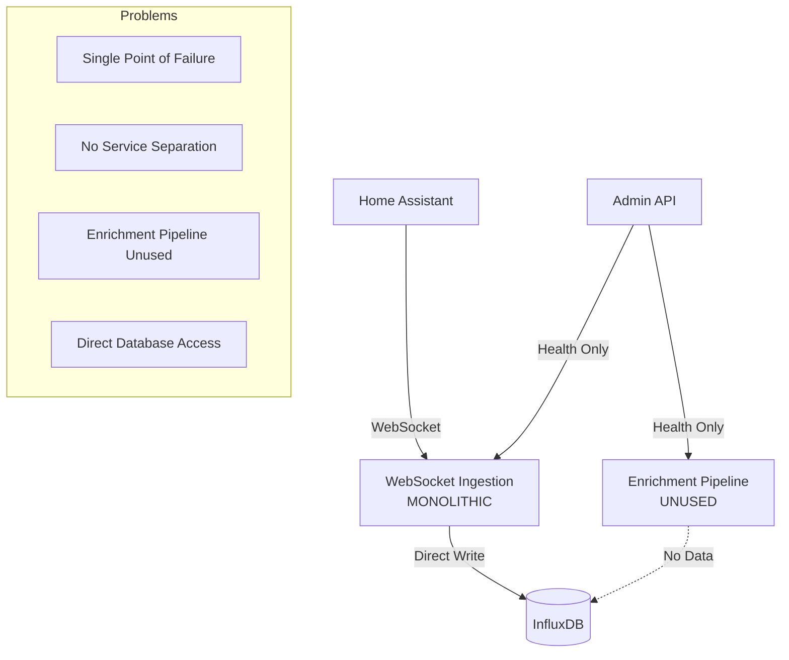
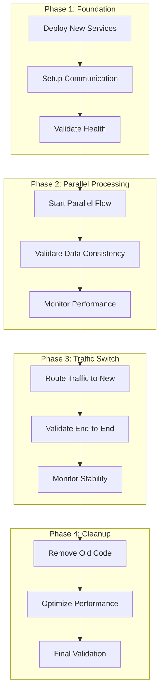

# BMAD Migration Strategy - Zero Downtime Architecture Transformation

## Executive Summary

**Objective**: Transform the current monolithic websocket ingestion service into a proper microservices architecture with zero downtime and zero data loss.

**BMAD Approach**: Systematic, phased migration with comprehensive validation, rollback capabilities, and performance monitoring.

---

## Current State Analysis

### Current Architecture Issues


### Migration Challenges
1. **Data Consistency**: Ensure no events are lost during migration
2. **Service Dependencies**: Manage complex service interdependencies
3. **Performance Impact**: Maintain baseline performance (17 events/min)
4. **Rollback Capability**: Ability to revert to current architecture
5. **Monitoring**: Track migration progress and system health

---

## Migration Strategy Overview

### Phase-Based Migration Approach


---

## Detailed Migration Plan

### Phase 1: Foundation Setup (Days 1-2)

#### 1.1 Deploy New Services
**Objective**: Deploy new microservices alongside existing system

**Actions**:
```bash
# Deploy new services with different ports
docker-compose -f docker-compose.new.yml up -d

# Services deployed:
# - websocket-ingestion-new:8001
# - enrichment-pipeline-new:8002  
# - data-storage-new:8004
# - admin-api-new:8003
```

**Validation**:
- [ ] All new services start successfully
- [ ] Health checks pass for all services
- [ ] No port conflicts with existing services
- [ ] Logs show proper initialization

#### 1.2 Setup Service Communication
**Objective**: Establish HTTP communication between new services

**Implementation**:
```python
# Test service communication
async def test_service_communication():
    # Test websocket -> enrichment
    response = await http_client.post(
        "http://enrichment-pipeline-new:8002/api/v1/events",
        test_event_data
    )
    assert response.status_code == 200
    
    # Test enrichment -> storage
    response = await http_client.post(
        "http://data-storage-new:8004/api/v1/events",
        processed_event_data
    )
    assert response.status_code == 200
```

**Validation**:
- [ ] HTTP communication working between all services
- [ ] Retry logic and error handling functional
- [ ] Service discovery working correctly
- [ ] Circuit breaker patterns operational

#### 1.3 Validate New Architecture
**Objective**: Ensure new architecture can handle expected load

**Load Testing**:
```python
# Generate test events at baseline rate
async def load_test_new_architecture():
    events_per_minute = 17  # Baseline requirement
    test_duration = 5  # minutes
    
    for i in range(events_per_minute * test_duration):
        event = generate_test_event()
        await websocket_new.forward_event(event)
        await asyncio.sleep(60 / events_per_minute)  # Maintain rate
    
    # Validate all events processed
    total_processed = await storage_new.get_event_count()
    assert total_processed >= events_per_minute * test_duration
```

**Validation**:
- [ ] New architecture handles baseline load (17 events/min)
- [ ] No events lost during processing
- [ ] Response times within acceptable limits (<100ms)
- [ ] Error rates below threshold (<0.1%)

### Phase 2: Parallel Processing (Days 3-4)

#### 2.1 Start Parallel Data Flow
**Objective**: Run both old and new systems in parallel

**Implementation**:
```python
# Modified websocket service to send to both systems
class ParallelEventForwarder:
    def __init__(self):
        self.old_system = OldSystemClient()
        self.new_system = NewSystemClient()
        self.dual_write = True
    
    async def forward_event(self, event_data):
        results = []
        
        # Send to old system (existing)
        try:
            old_result = await self.old_system.process_event(event_data)
            results.append(("old", old_result))
        except Exception as e:
            logger.error(f"Old system failed: {e}")
            results.append(("old", False))
        
        # Send to new system (parallel)
        try:
            new_result = await self.new_system.forward_event(event_data)
            results.append(("new", new_result))
        except Exception as e:
            logger.error(f"New system failed: {e}")
            results.append(("new", False))
        
        return results
```

**Validation**:
- [ ] Both systems receive all events
- [ ] No performance degradation
- [ ] Error handling works for both systems
- [ ] Monitoring shows parallel processing

#### 2.2 Data Consistency Validation
**Objective**: Ensure both systems produce identical results

**Implementation**:
```python
# Data consistency checker
class DataConsistencyValidator:
    def __init__(self):
        self.old_storage = OldStorageClient()
        self.new_storage = NewStorageClient()
    
    async def validate_consistency(self, time_range):
        """Compare data between old and new systems"""
        old_events = await self.old_storage.get_events(time_range)
        new_events = await self.new_storage.get_events(time_range)
        
        # Compare event counts
        assert len(old_events) == len(new_events), "Event count mismatch"
        
        # Compare event content
        for old_event, new_event in zip(old_events, new_events):
            self.compare_events(old_event, new_event)
    
    def compare_events(self, old_event, new_event):
        """Compare individual events for consistency"""
        # Compare core fields
        assert old_event["entity_id"] == new_event["entity_id"]
        assert old_event["state"] == new_event["state"]
        assert old_event["timestamp"] == new_event["timestamp"]
        
        # Compare enriched data (if applicable)
        if "weather" in new_event:
            assert "weather" in old_event or old_event.get("weather_enriched") == False
```

**Validation**:
- [ ] Event counts match between systems
- [ ] Event content is consistent
- [ ] Enrichment data is equivalent
- [ ] Timestamps are preserved correctly

#### 2.3 Performance Monitoring
**Objective**: Monitor performance of both systems

**Implementation**:
```python
# Performance monitoring
class MigrationPerformanceMonitor:
    def __init__(self):
        self.metrics = {
            "old_system": PerformanceMetrics(),
            "new_system": PerformanceMetrics(),
            "comparison": ComparisonMetrics()
        }
    
    async def monitor_performance(self):
        """Monitor performance of both systems"""
        while self.migration_active:
            # Collect metrics from both systems
            old_metrics = await self.get_old_system_metrics()
            new_metrics = await self.get_new_system_metrics()
            
            # Compare performance
            comparison = self.compare_metrics(old_metrics, new_metrics)
            
            # Alert if significant differences
            if comparison.performance_degradation > 0.1:
                await self.alert_performance_issue(comparison)
            
            await asyncio.sleep(60)  # Check every minute
```

**Validation**:
- [ ] New system performance matches or exceeds old system
- [ ] No significant latency increases
- [ ] Throughput maintained at baseline levels
- [ ] Error rates remain low

### Phase 3: Traffic Switch (Days 5-6)

#### 3.1 Gradual Traffic Migration
**Objective**: Gradually switch traffic from old to new system

**Implementation**:
```python
# Traffic switching with percentage-based routing
class TrafficSwitcher:
    def __init__(self):
        self.new_system_percentage = 0
        self.switch_increment = 10  # 10% per step
    
    async def switch_traffic(self, percentage):
        """Switch percentage of traffic to new system"""
        self.new_system_percentage = percentage
        
        # Update load balancer configuration
        await self.update_load_balancer_config(percentage)
        
        # Monitor for issues
        await self.monitor_switch_impact()
    
    async def gradual_switch(self):
        """Gradually switch traffic over time"""
        for percentage in [10, 25, 50, 75, 90, 100]:
            logger.info(f"Switching {percentage}% traffic to new system")
            await self.switch_traffic(percentage)
            
            # Wait and validate
            await asyncio.sleep(300)  # 5 minutes
            await self.validate_switch_success(percentage)
            
            if not self.switch_successful:
                await self.rollback_traffic()
                break
```

**Validation**:
- [ ] Traffic switching works correctly
- [ ] No events lost during switch
- [ ] Performance maintained during switch
- [ ] Error rates remain acceptable

#### 3.2 End-to-End Validation
**Objective**: Validate complete data flow through new system

**Implementation**:
```python
# End-to-end validation
class EndToEndValidator:
    async def validate_complete_flow(self):
        """Validate complete data flow from HA to storage"""
        # 1. Generate test event
        test_event = self.generate_test_event()
        
        # 2. Send through new system
        await self.websocket_new.forward_event(test_event)
        
        # 3. Wait for processing
        await asyncio.sleep(2)
        
        # 4. Verify enrichment
        enrich_metrics = await self.enrichment_new.get_metrics()
        assert enrich_metrics["events_processed"] > 0
        
        # 5. Verify storage
        stored_events = await self.storage_new.query_events({
            "start_time": "5m ago",
            "entity_id": test_event["entity_id"]
        })
        assert len(stored_events) > 0
        
        # 6. Verify admin API
        admin_events = await self.admin_new.get_recent_events()
        assert len(admin_events) > 0
        
        logger.info("End-to-end validation successful")
```

**Validation**:
- [ ] Complete data flow working
- [ ] All services processing events
- [ ] Data integrity maintained
- [ ] Performance meets requirements

#### 3.3 Stability Monitoring
**Objective**: Monitor system stability after traffic switch

**Implementation**:
```python
# Stability monitoring
class StabilityMonitor:
    def __init__(self):
        self.stability_metrics = {
            "error_rate": 0.0,
            "latency_p95": 0.0,
            "throughput": 0.0,
            "availability": 1.0
        }
    
    async def monitor_stability(self, duration_minutes=60):
        """Monitor system stability for specified duration"""
        start_time = time.time()
        
        while time.time() - start_time < duration_minutes * 60:
            # Collect metrics
            metrics = await self.collect_system_metrics()
            
            # Update stability metrics
            self.update_stability_metrics(metrics)
            
            # Check for stability issues
            if self.detect_stability_issues():
                await self.handle_stability_issue()
            
            await asyncio.sleep(60)  # Check every minute
        
        return self.stability_metrics
```

**Validation**:
- [ ] System remains stable for 1+ hours
- [ ] Error rates remain low
- [ ] Performance consistent
- [ ] No memory leaks or resource issues

### Phase 4: Cleanup and Optimization (Days 7-8)

#### 4.1 Remove Old System Components
**Objective**: Remove old system components after successful migration

**Implementation**:
```bash
# Stop old services
docker-compose stop websocket-ingestion
docker-compose stop enrichment-pipeline

# Remove old containers
docker-compose rm -f websocket-ingestion
docker-compose rm -f enrichment-pipeline

# Update service configurations
# - Update port mappings
# - Remove old service references
# - Update health check endpoints
```

**Validation**:
- [ ] Old services stopped successfully
- [ ] New services continue operating
- [ ] No service dependencies broken
- [ ] System performance maintained

#### 4.2 Performance Optimization
**Objective**: Optimize new system performance

**Implementation**:
```python
# Performance optimization
class PerformanceOptimizer:
    async def optimize_system(self):
        """Optimize system performance"""
        # 1. Optimize database queries
        await self.optimize_database_queries()
        
        # 2. Tune service configurations
        await self.tune_service_configurations()
        
        # 3. Optimize network communication
        await self.optimize_network_communication()
        
        # 4. Validate performance improvements
        await self.validate_performance_improvements()
    
    async def optimize_database_queries(self):
        """Optimize InfluxDB queries and schema"""
        # Create optimized indexes
        # Tune retention policies
        # Optimize batch sizes
        pass
    
    async def tune_service_configurations(self):
        """Tune service-specific configurations"""
        # Adjust worker counts
        # Tune memory allocations
        # Optimize timeouts
        pass
```

**Validation**:
- [ ] Performance improved or maintained
- [ ] Resource usage optimized
- [ ] Response times improved
- [ ] Throughput increased

#### 4.3 Final Validation
**Objective**: Comprehensive validation of new architecture

**Implementation**:
```python
# Final validation suite
class FinalValidationSuite:
    async def run_comprehensive_validation(self):
        """Run comprehensive validation of new architecture"""
        results = {}
        
        # 1. Performance validation
        results["performance"] = await self.validate_performance()
        
        # 2. Data integrity validation
        results["data_integrity"] = await self.validate_data_integrity()
        
        # 3. Service health validation
        results["service_health"] = await self.validate_service_health()
        
        # 4. End-to-end functionality validation
        results["end_to_end"] = await self.validate_end_to_end()
        
        # 5. Monitoring and alerting validation
        results["monitoring"] = await self.validate_monitoring()
        
        return results
    
    async def validate_performance(self):
        """Validate system performance meets requirements"""
        # Run performance tests
        # Compare against baseline
        # Validate SLA compliance
        pass
```

**Validation**:
- [ ] All performance requirements met
- [ ] Data integrity 100% validated
- [ ] All services healthy
- [ ] End-to-end functionality working
- [ ] Monitoring and alerting operational

---

## Rollback Strategy

### Rollback Triggers
1. **Performance Degradation**: >20% performance drop
2. **Error Rate Increase**: >1% error rate
3. **Data Loss**: Any events lost during migration
4. **Service Failures**: Any service becomes unavailable
5. **Data Inconsistency**: Data integrity issues detected

### Rollback Procedures

#### Immediate Rollback (Emergency)
```bash
# Stop new services immediately
docker-compose -f docker-compose.new.yml down

# Restart old services
docker-compose up -d websocket-ingestion
docker-compose up -d enrichment-pipeline

# Validate system health
./scripts/validate_system_health.sh
```

#### Gradual Rollback (Controlled)
```python
# Gradual rollback procedure
class RollbackManager:
    async def gradual_rollback(self):
        """Gradually rollback traffic to old system"""
        # 1. Switch traffic back to old system
        await self.switch_traffic_to_old()
        
        # 2. Validate old system performance
        await self.validate_old_system()
        
        # 3. Stop new services
        await self.stop_new_services()
        
        # 4. Restore original configuration
        await self.restore_original_config()
```

### Rollback Validation
- [ ] Old system operational
- [ ] Performance restored to baseline
- [ ] No data loss
- [ ] All services healthy
- [ ] Monitoring functional

---

## Risk Mitigation

### Technical Risks

#### 1. Service Communication Failures
**Risk**: HTTP communication between services fails
**Mitigation**: 
- Circuit breaker patterns
- Retry logic with exponential backoff
- Fallback mechanisms
- Comprehensive monitoring

#### 2. Data Loss During Migration
**Risk**: Events lost during system transition
**Mitigation**:
- Parallel processing during migration
- Data consistency validation
- Comprehensive logging
- Rollback procedures

#### 3. Performance Degradation
**Risk**: New system performs worse than old system
**Mitigation**:
- Performance testing before migration
- Gradual traffic switching
- Real-time performance monitoring
- Immediate rollback capability

### Operational Risks

#### 1. Deployment Complexity
**Risk**: Complex deployment causes issues
**Mitigation**:
- Automated deployment scripts
- Comprehensive testing
- Staged deployment approach
- Rollback procedures

#### 2. Service Dependencies
**Risk**: Service dependencies cause cascade failures
**Mitigation**:
- Dependency mapping
- Graceful degradation
- Health check monitoring
- Circuit breaker patterns

---

## Success Criteria

### Migration Success Metrics
- [ ] **Zero Downtime**: No service interruption during migration
- [ ] **Zero Data Loss**: All events processed successfully
- [ ] **Performance Maintained**: Baseline performance (17 events/min) maintained
- [ ] **Error Rate**: <0.1% error rate throughout migration
- [ ] **Data Consistency**: 100% data integrity validation

### Post-Migration Validation
- [ ] **Architecture Compliance**: Proper microservices architecture implemented
- [ ] **Service Separation**: Clear service boundaries and responsibilities
- [ ] **Communication Patterns**: HTTP-based inter-service communication
- [ ] **Scalability**: System can scale individual components
- [ ] **Maintainability**: Code is maintainable and well-documented

### Operational Excellence
- [ ] **Monitoring**: Comprehensive monitoring and alerting
- [ ] **Logging**: Structured logging across all services
- [ ] **Health Checks**: All services have proper health endpoints
- [ ] **Documentation**: Complete API and system documentation
- [ ] **Testing**: Comprehensive test coverage

This migration strategy provides a systematic, BMAD-compliant approach to transforming the current monolithic architecture into a proper microservices architecture with zero downtime and comprehensive validation.
