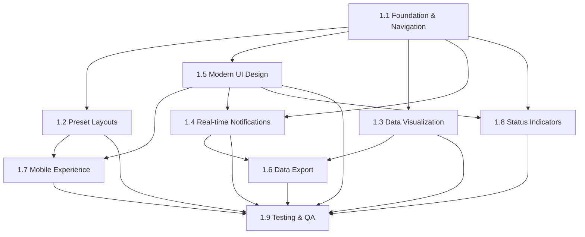

# 🚀 **Dashboard Enhancement Implementation Roadmap**

## 📋 **Project Overview**

This roadmap outlines the implementation sequence for the 9 enhanced dashboard stories, with clear dependencies and estimated timelines.

## 🎯 **Implementation Phases**

### **Phase 1: Foundation (Week 1)**
**Stories**: 1.1, 1.2, 1.5

| Story | Priority | Dependencies | Est. Time | Key Deliverables |
|-------|----------|--------------|-----------|------------------|
| **1.1 Foundation & Navigation** | 🔴 Critical | None | 2-3 days | React Router, Error Boundaries, Loading States |
| **1.2 Preset Dashboard Layouts** | 🟡 High | 1.1 | 2-3 days | Layout System, CSS Grid, TypeScript Interfaces |
| **1.5 Modern UI Design & Styling** | 🟡 High | 1.1 | 2-3 days | Design System, Theme Switching, CSS Variables |

**Phase 1 Outcomes:**
- ✅ Solid foundation with routing and error handling
- ✅ Flexible layout system for different dashboard views
- ✅ Modern, consistent design system
- ✅ Theme switching capability

### **Phase 2: Core Features (Week 2)**
**Stories**: 1.3, 1.4, 1.8

| Story | Priority | Dependencies | Est. Time | Key Deliverables |
|-------|----------|--------------|-----------|------------------|
| **1.3 Advanced Data Visualization** | 🔴 Critical | 1.1, 1.2 | 3-4 days | Chart.js v4, Interactive Charts, Filtering |
| **1.4 Real-time Notifications** | 🟡 High | 1.1, 1.5 | 2-3 days | Notification System, React Context, WebSocket |
| **1.8 Enhanced Status Indicators** | 🟡 High | 1.1, 1.5 | 2-3 days | Status Components, Real-time Updates |

**Phase 2 Outcomes:**
- ✅ Interactive, zoomable charts with filtering
- ✅ Real-time notification system
- ✅ Clear system status indicators
- ✅ Enhanced user experience

### **Phase 3: Advanced Features (Week 3)**
**Stories**: 1.6, 1.7

| Story | Priority | Dependencies | Est. Time | Key Deliverables |
|-------|----------|--------------|-----------|------------------|
| **1.6 Data Export & Analysis** | 🟢 Medium | 1.3, 1.4 | 2-3 days | Export System, Progress Tracking, Multiple Formats |
| **1.7 Mobile Experience** | 🟢 Medium | 1.2, 1.5 | 2-3 days | Touch Interface, Gestures, Responsive Design |

**Phase 3 Outcomes:**
- ✅ Data export functionality
- ✅ Mobile-optimized experience
- ✅ Touch-friendly interactions
- ✅ Complete feature set

### **Phase 4: Quality Assurance (Week 4)**
**Stories**: 1.9

| Story | Priority | Dependencies | Est. Time | Key Deliverables |
|-------|----------|--------------|-----------|------------------|
| **1.9 Testing & Quality Assurance** | 🔴 Critical | All (1.1-1.8) | 3-4 days | Playwright Tests, Visual Regression, Accessibility |

**Phase 4 Outcomes:**
- ✅ Comprehensive test coverage
- ✅ Visual regression testing
- ✅ Accessibility compliance
- ✅ Performance validation
- ✅ Production-ready code

## 🔄 **Implementation Dependencies**



## 📅 **Detailed Timeline**

### **Week 1: Foundation**
- **Days 1-3**: Story 1.1 (Foundation & Navigation)
- **Days 4-6**: Story 1.2 (Preset Layouts) + Story 1.5 (Modern UI)
- **Day 7**: Integration testing and bug fixes

### **Week 2: Core Features**
- **Days 1-4**: Story 1.3 (Data Visualization)
- **Days 5-7**: Story 1.4 (Notifications) + Story 1.8 (Status Indicators)

### **Week 3: Advanced Features**
- **Days 1-3**: Story 1.6 (Data Export)
- **Days 4-6**: Story 1.7 (Mobile Experience)
- **Day 7**: Integration testing and refinements

### **Week 4: Quality Assurance**
- **Days 1-4**: Story 1.9 (Testing & QA)
- **Days 5-7**: Final testing, bug fixes, and deployment preparation

## 🛠️ **Development Environment Setup**

### **Prerequisites**
```bash
# Node.js 18+
node --version

# Package manager
npm --version

# Git
git --version
```

### **Initial Setup**
```bash
# Clone repository
git clone <repository-url>
cd homeiq

# Install dependencies
npm install

# Install Playwright
npm install --save-dev @playwright/test
npx playwright install

# Start development server
npm run dev
```

### **Required Tools**
- **IDE**: VS Code with React/TypeScript extensions
- **Browser**: Chrome, Firefox, Safari for testing
- **Testing**: Playwright, Vitest, React Testing Library
- **Design**: Figma (for design reference)

## 🧪 **Testing Strategy**

### **Unit Testing** (Vitest + React Testing Library)
- Component testing
- Hook testing
- Utility function testing
- Mock testing

### **Integration Testing** (Playwright)
- User workflow testing
- API integration testing
- Cross-browser testing
- Performance testing

### **Visual Regression Testing** (Playwright)
- Screenshot comparisons
- Responsive design testing
- Theme switching testing
- Component-level testing

### **Accessibility Testing** (Playwright)
- ARIA snapshot testing
- Keyboard navigation testing
- Screen reader testing
- WCAG compliance testing

## 📊 **Success Metrics**

### **Technical Metrics**
- **Test Coverage**: 80%+ for all new code
- **Performance**: <3s load time, <1.5s FCP
- **Accessibility**: WCAG 2.1 AA compliance
- **Browser Support**: Chrome, Firefox, Safari, Mobile

### **User Experience Metrics**
- **Responsiveness**: Works on all device sizes
- **Usability**: Intuitive navigation and interactions
- **Reliability**: Error-free operation
- **Performance**: Smooth animations and transitions

## 🚨 **Risk Mitigation**

### **Technical Risks**
- **Bundle Size**: Monitor and optimize bundle size
- **Performance**: Regular performance testing
- **Compatibility**: Cross-browser testing
- **Accessibility**: Automated accessibility testing

### **Project Risks**
- **Scope Creep**: Stick to defined stories
- **Timeline**: Regular progress reviews
- **Quality**: Continuous testing and review
- **Dependencies**: Clear dependency management

## 📝 **Documentation Requirements**

### **Code Documentation**
- JSDoc comments for all functions
- README files for each component
- TypeScript interfaces and types
- API documentation

### **User Documentation**
- User guide for new features
- Troubleshooting guide
- FAQ for common issues
- Video tutorials (optional)

## 🎯 **Next Steps**

1. **Review this roadmap** with the development team
2. **Set up development environment** following the setup guide
3. **Begin with Story 1.1** (Foundation & Navigation)
4. **Follow the implementation guides** for each story
5. **Track progress** using the acceptance criteria checklists

## 📞 **Support & Resources**

- **Story Implementation Guides**: `docs/stories/sharded/`
- **Technical Requirements**: Enhanced stories with Context7 best practices
- **Testing Utilities**: Playwright helpers and test utilities
- **Design System**: Tailwind CSS with custom properties

---

**Ready to start implementation? Begin with Story 1.1 and follow the detailed implementation guide!** 🚀


