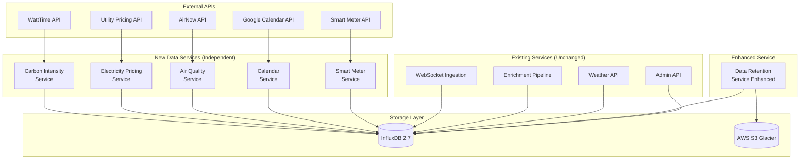

# Data Enrichment & Storage Optimization Architecture
**Brownfield Enhancement for HA Ingestor**

**Version:** 1.0  
**Date:** October 10, 2025  
**Architect:** Winston  
**Status:** Ready for Implementation

---

## Introduction

This architecture defines how to enhance the existing HA Ingestor system with external data source integration and storage optimization. The design follows existing patterns, requires no changes to current services, and adds five independent microservices plus storage optimization to the data-retention service.

### Existing Project Analysis

**Current Project State:**
- **Primary Purpose:** Capture Home Assistant events, enrich with weather, store in InfluxDB
- **Current Tech Stack:** Python 3.11, FastAPI, aiohttp, InfluxDB 2.7, Docker Compose
- **Architecture Style:** Microservices with independent services per function
- **Deployment Method:** Docker Compose with individual service containers

**Available Documentation:**
- ✅ Complete architecture documentation in `docs/architecture/`
- ✅ Existing database schema in `docs/architecture/database-schema.md`
- ✅ Established coding standards in `docs/architecture/coding-standards.md`
- ✅ Working Docker configurations for all current services
- ✅ PRD for this enhancement in `docs/DATA_ENRICHMENT_PRD.md`

**Identified Constraints:**
- Must not modify existing services (websocket-ingestion, enrichment-pipeline, admin-api, weather-api)
- Must use existing InfluxDB 2.7 instance
- Must follow established Python/FastAPI patterns
- Must deploy via docker-compose.yml
- Must maintain existing REST API compatibility
- No new infrastructure dependencies (databases, message queues, etc.)

### Change Log

| Change | Date | Version | Description | Author |
|--------|------|---------|-------------|--------|
| Initial | 2025-10-10 | 1.0 | Architecture for data enrichment and storage optimization | Winston |

---

## Enhancement Scope and Integration Strategy

### Enhancement Overview

**Enhancement Type:** Backend data enrichment + storage optimization  
**Scope:** Add 5 data source services + enhance data-retention service  
**Integration Impact:** Additive only - no modifications to existing services

### Integration Approach

**Code Integration Strategy:**  
- Add new services to `services/` directory following existing patterns
- No changes to existing service code
- All new services are independent and write directly to InfluxDB
- Data-retention service enhanced with new functions (not modified, only extended)

**Database Integration:**  
- New InfluxDB measurements added (no schema changes to existing measurements)
- Materialized views created as new measurements
- All existing queries continue to work unchanged
- Backward compatible schema evolution only

**API Integration:**  
- New REST endpoints added to existing admin-api service (versioned routes)
- Existing endpoints remain unchanged
- No breaking changes to API contracts

**No UI Integration Required:**  
- This enhancement is backend-only
- No changes to health-dashboard service

### Compatibility Requirements

- **Existing API Compatibility:** All existing REST endpoints unchanged
- **Database Schema Compatibility:** Only additive changes (new measurements)
- **Performance Impact:** Positive only (faster queries via materialized views)
- **Deployment:** Add services to docker-compose.yml, no other changes required

---

## Tech Stack

### Existing Technology Stack

| Category | Current Technology | Version | Usage in Enhancement | Notes |
|----------|-------------------|---------|---------------------|-------|
| Language | Python | 3.11 | All new services | Consistent with existing |
| Web Framework | FastAPI | Latest | New services | Proven in existing services |
| Async HTTP | aiohttp | Latest | API calls | Used in existing services |
| Database | InfluxDB | 2.7 | All data storage | No changes |
| Container | Docker | Latest | All services | Existing pattern |
| Orchestration | Docker Compose | Latest | Service management | Existing pattern |

### New Technology Additions

| Technology | Version | Purpose | Rationale | Integration Method |
|------------|---------|---------|-----------|-------------------|
| boto3 | Latest | S3 archival | AWS SDK for S3 operations | New dependency in data-retention |
| pyarrow | Latest | Parquet compression | Efficient archival format | New dependency in data-retention |
| google-api-python-client | Latest | Calendar API | Google Calendar integration | New dependency in calendar-service |

**Research Source:** Context7 documentation reviewed for aiohttp (678 snippets, Trust Score 9.3), boto3 (107,133 snippets, Trust Score 7.5), InfluxDB Python (27 snippets, Trust Score 7.7)

---

## Data Models and Schema Changes

### New InfluxDB Measurements

#### 1. carbon_intensity
**Purpose:** Store grid carbon intensity data  
**Integration:** Standalone measurement, no relationshipwith existing data

**Schema:**
```
Measurement: carbon_intensity
Tags:
  region: string (e.g., "CA-CAISO")
  grid_operator: string (e.g., "CAISO")
Fields:
  carbon_intensity_gco2_kwh: float
  renewable_percentage: float
  fossil_percentage: float
  forecast_1h: float
  forecast_24h: float
Timestamp: auto
```

#### 2. electricity_pricing
**Purpose:** Store real-time electricity pricing  
**Integration:** Standalone measurement

**Schema:**
```
Measurement: electricity_pricing
Tags:
  provider: string (e.g., "awattar")
  currency: string (e.g., "USD", "EUR")
Fields:
  current_price: float
  peak_period: boolean

Measurement: electricity_pricing_forecast
Tags:
  provider: string
Fields:
  price: float
  hour_offset: integer (0-23)
```

#### 3. air_quality
**Purpose:** Store AQI and air quality data  
**Integration:** Standalone measurement

**Schema:**
```
Measurement: air_quality
Tags:
  location: string (lat,lon)
  category: string ("Good", "Moderate", "Unhealthy")
  parameter: string ("PM2.5", "PM10", "Ozone")
Fields:
  aqi: integer (0-500)
  pm25: float
  pm10: float
  ozone: float
```

#### 4. occupancy_prediction
**Purpose:** Store calendar-based occupancy predictions  
**Integration:** Can join with home_assistant_events on timestamp

**Schema:**
```
Measurement: occupancy_prediction
Tags:
  source: string ("calendar")
  user: string ("primary")
Fields:
  currently_home: boolean
  wfh_today: boolean
  confidence: float (0-1)
  hours_until_arrival: float
```

#### 5. smart_meter
**Purpose:** Store whole-home power consumption  
**Integration:** Correlates with home_assistant_events energy_consumption

**Schema:**
```
Measurement: smart_meter
Tags:
  meter_type: string ("emporia", "sense")
Fields:
  total_power_w: float
  daily_kwh: float

Measurement: smart_meter_circuit
Tags:
  circuit_name: string
Fields:
  power_w: float
  percentage: float
```

#### 6. Materialized Views (New Measurements)

```
Measurement: mv_daily_energy_by_device
Tags:
  entity_id: string
Fields:
  date: timestamp (day)
  total_kwh: float
  avg_power: float
  peak_power: float
  cost_usd: float

Measurement: mv_hourly_room_activity
Tags:
  area: string
Fields:
  hour: integer (0-23)
  day_of_week: integer (0-6)
  motion_count: integer
  occupancy_rate: float

Measurement: mv_daily_carbon_summary
Fields:
  date: timestamp (day)
  avg_carbon: float
  min_carbon: float
  max_carbon: float
  avg_renewable: float
```

### Schema Integration Strategy

**Database Changes Required:**
- **New Measurements:** 9 new measurements (listed above)
- **Modified Tables:** None
- **New Indexes:** Automatic via InfluxDB tags
- **Migration Strategy:** Not applicable (additive only, no migrations)

**Backward Compatibility:**
- All existing measurements remain unchanged
- All existing queries continue to work
- New measurements are optional (services can fail without affecting existing system)
- Existing admin-api can ignore new measurements

---

## Component Architecture

### New Components

#### Component 1: Carbon Intensity Service
**Responsibility:** Fetch grid carbon intensity from WattTime API every 15 minutes, cache responses, and store in InfluxDB

**Integration Points:**
- InfluxDB (write-only)
- WattTime API (external)
- No integration with other services

**Key Interfaces:**
- REST API endpoint: `GET /health` (standard health check)
- Environment variables: `WATTTIME_API_TOKEN`, `GRID_REGION`, `INFLUXDB_URL`, `INFLUXDB_TOKEN`

**Dependencies:**
- **Existing Components:** InfluxDB only
- **New Components:** None (standalone)

**Technology Stack:** Python 3.11, aiohttp (API calls), influxdb-client-python, FastAPI (health endpoint)

**Service Pattern:**
```python
# Continuous loop service
while True:
    data = await fetch_from_api()
    if data:
        await store_in_influxdb(data)
    await asyncio.sleep(900)  # 15 minutes
```

---

#### Component 2: Electricity Pricing Service
**Responsibility:** Fetch electricity pricing from utility APIs hourly, identify cheap/expensive hours, store in InfluxDB

**Integration Points:**
- InfluxDB (write-only)
- Utility APIs: Awattar, Tibber, Octopus (external)
- No integration with other services

**Key Interfaces:**
- REST API endpoint: `GET /health`
- REST API endpoint: `GET /cheapest-hours?hours=4` (utility endpoint)
- Environment variables: `PRICING_PROVIDER`, `PRICING_API_KEY`, `INFLUXDB_URL`

**Dependencies:**
- **Existing Components:** InfluxDB only
- **New Components:** None (standalone)

**Technology Stack:** Python 3.11, aiohttp, influxdb-client-python, FastAPI

**Provider Adapters:** Multiple provider support via adapter pattern (Awattar, Tibber, Octopus, Generic)

---

#### Component 3: Air Quality Service
**Responsibility:** Fetch AQI from AirNow API hourly, store in InfluxDB

**Integration Points:**
- InfluxDB (write-only)
- AirNow API (external)
- No integration with other services

**Key Interfaces:**
- REST API endpoint: `GET /health`
- REST API endpoint: `GET /current-aqi`
- Environment variables: `AIRNOW_API_KEY`, `LATITUDE`, `LONGITUDE`, `INFLUXDB_URL`

**Dependencies:**
- **Existing Components:** InfluxDB only
- **New Components:** None (standalone)

**Technology Stack:** Python 3.11, aiohttp, influxdb-client-python, FastAPI

---

#### Component 4: Calendar Service
**Responsibility:** Fetch calendar events from Google Calendar API, predict occupancy, store in InfluxDB

**Integration Points:**
- InfluxDB (write-only)
- Google Calendar API (external, OAuth2)
- No integration with other services

**Key Interfaces:**
- REST API endpoint: `GET /health`
- REST API endpoint: `GET /occupancy-prediction`
- REST API endpoint: `GET /oauth-callback` (for OAuth flow)
- Environment variables: `GOOGLE_CLIENT_ID`, `GOOGLE_CLIENT_SECRET`, `GOOGLE_REFRESH_TOKEN`

**Dependencies:**
- **Existing Components:** InfluxDB only
- **New Components:** None (standalone)

**Technology Stack:** Python 3.11, google-api-python-client, aiohttp, influxdb-client-python, FastAPI

**OAuth Flow:** One-time setup, refresh token stored in environment variable

---

#### Component 5: Smart Meter Service
**Responsibility:** Fetch power consumption from smart meter APIs every 5 minutes, detect phantom loads, store in InfluxDB

**Integration Points:**
- InfluxDB (write-only)
- Smart Meter APIs: Emporia Vue, Sense (external)
- No integration with other services

**Key Interfaces:**
- REST API endpoint: `GET /health`
- REST API endpoint: `GET /current-consumption`
- REST API endpoint: `GET /phantom-loads`
- Environment variables: `METER_TYPE`, `METER_API_TOKEN`, `METER_DEVICE_ID`

**Dependencies:**
- **Existing Components:** InfluxDB only
- **New Components:** None (standalone)

**Technology Stack:** Python 3.11, aiohttp, influxdb-client-python, FastAPI

**Adapter Pattern:** Support Emporia, Sense, Generic meter types

---

#### Component 6: Data Retention Service (Enhanced)
**Responsibility:** Existing service enhanced with materialized views, downsampling, and S3 archival

**New Functions Added:**
- Create and refresh materialized views
- Downsample raw→hourly (7 days)
- Downsample hourly→daily (90 days)
- Archive daily→S3 (365 days)
- Restore from S3 archive
- Storage analytics and reporting

**Integration Points:**
- InfluxDB (read/write)
- AWS S3 (write/read for archival)
- Existing data-retention service code (enhanced, not replaced)

**New Dependencies:**
- boto3 (AWS S3 client)
- pyarrow (Parquet compression)

**Technology Stack:** Existing Python 3.11 + boto3 + pyarrow added to requirements.txt

---

### Component Interaction Diagram



**Key Points:**
- All new services are independent (no inter-service communication)
- All new services write to InfluxDB only
- Existing services remain completely unchanged
- Data-retention service reads from InfluxDB, writes to InfluxDB + S3

---

## External API Integration

### WattTime API (Carbon Intensity)

- **Purpose:** Fetch real-time grid carbon intensity
- **Documentation:** https://docs.watttime.org/
- **Base URL:** https://api.watttime.org/v3
- **Authentication:** Bearer token (API key)
- **Integration Method:** aiohttp GET request with 15-minute polling

**Key Endpoints Used:**
- `GET /forecast` - Get carbon intensity forecast
- **Rate Limit:** 100 calls/day (free tier) - 96 calls/day at 15-min intervals
- **Error Handling:** Use cached data if API unavailable, log failures, continue service

---

### Utility Pricing APIs (Awattar/Tibber/Octopus)

- **Purpose:** Fetch real-time electricity pricing
- **Documentation:** Provider-specific
- **Authentication:** API key or OAuth (provider-dependent)
- **Integration Method:** aiohttp GET request with hourly polling

**Key Endpoints Used:**
- Awattar: `GET /marketdata` - Get current and forecast pricing
- Tibber: `POST /graphql` - GraphQL query for pricing
- Octopus: `GET /products/{product}/electricity-tariffs/{tariff}/` - Get pricing
- **Rate Limit:** Provider-dependent (all sufficient for hourly requests)
- **Error Handling:** Use cached data, provider-specific error codes

---

### AirNow API (Air Quality)

- **Purpose:** Fetch air quality index
- **Documentation:** https://docs.airnowapi.org/
- **Base URL:** https://www.airnowapi.org/aq/observation/latLong/current/
- **Authentication:** API key in query parameter
- **Integration Method:** aiohttp GET request with hourly polling

**Key Endpoints Used:**
- `GET /observation/latLong/current/` - Get current AQI by coordinates
- **Rate Limit:** 500 calls/hour - 24 calls/hour needed
- **Error Handling:** Use cached data, continue on failure

---

### Google Calendar API

- **Purpose:** Fetch calendar events for occupancy prediction
- **Documentation:** https://developers.google.com/calendar/api
- **Base URL:** https://www.googleapis.com/calendar/v3
- **Authentication:** OAuth 2.0 (refresh token stored)
- **Integration Method:** google-api-python-client with 15-minute polling

**Key Endpoints Used:**
- `GET /calendars/{calendarId}/events` - List events
- **Rate Limit:** 10,000 requests/day - 96 calls/day needed
- **Error Handling:** Use last known schedule, log OAuth errors, automatic token refresh

---

### Smart Meter APIs (Emporia Vue / Sense)

- **Purpose:** Fetch real-time power consumption data
- **Documentation:** Provider-specific (Emporia, Sense)
- **Authentication:** API token (provider-dependent)
- **Integration Method:** aiohttp with 5-minute polling

**Key Endpoints Used:**
- Emporia: `GET /devices/{deviceId}/usage` - Get consumption data
- Sense: `GET /app/monitor` - Get real-time data
- **Rate Limit:** Provider-dependent (sufficient for 5-min intervals)
- **Error Handling:** Use cached data, continue on failure

---

## Source Tree

### Existing Project Structure (Relevant Parts)

```
homeiq/
├── services/
│   ├── websocket-ingestion/          # Existing - unchanged
│   ├── enrichment-pipeline/          # Existing - unchanged
│   ├── admin-api/                    # Existing - unchanged
│   ├── weather-api/                  # Existing - unchanged
│   ├── data-retention/               # Existing - will be enhanced
│   └── health-dashboard/             # Existing - unchanged
├── infrastructure/
│   └── env.example                   # Existing - will add new variables
├── docker-compose.yml                # Existing - will add new services
└── docs/
    └── architecture/                 # Existing - will add this document
```

### New File Organization

```
homeiq/
├── services/
│   ├── carbon-intensity-service/    # NEW
│   │   ├── src/
│   │   │   ├── __init__.py
│   │   │   ├── main.py
│   │   │   └── health_check.py
│   │   ├── requirements.txt
│   │   ├── Dockerfile
│   │   └── README.md
│   ├── electricity-pricing-service/ # NEW
│   │   ├── src/
│   │   │   ├── __init__.py
│   │   │   ├── main.py
│   │   │   ├── providers/
│   │   │   │   ├── awattar.py
│   │   │   │   ├── tibber.py
│   │   │   │   └── octopus.py
│   │   │   └── health_check.py
│   │   ├── requirements.txt
│   │   ├── Dockerfile
│   │   └── README.md
│   ├── air-quality-service/         # NEW
│   │   ├── src/
│   │   │   ├── __init__.py
│   │   │   ├── main.py
│   │   │   └── health_check.py
│   │   ├── requirements.txt
│   │   ├── Dockerfile
│   │   └── README.md
│   ├── calendar-service/            # NEW
│   │   ├── src/
│   │   │   ├── __init__.py
│   │   │   ├── main.py
│   │   │   ├── oauth_handler.py
│   │   │   └── health_check.py
│   │   ├── requirements.txt
│   │   ├── Dockerfile
│   │   └── README.md
│   ├── smart-meter-service/         # NEW
│   │   ├── src/
│   │   │   ├── __init__.py
│   │   │   ├── main.py
│   │   │   ├── adapters/
│   │   │   │   ├── emporia.py
│   │   │   │   └── sense.py
│   │   │   └── health_check.py
│   │   ├── requirements.txt
│   │   ├── Dockerfile
│   │   └── README.md
│   └── data-retention/              # ENHANCED
│       ├── src/
│       │   ├── materialized_views.py    # NEW
│       │   ├── tiered_retention.py      # NEW
│       │   ├── s3_archival.py           # NEW
│       │   └── (existing files unchanged)
│       └── requirements.txt             # boto3, pyarrow added
├── infrastructure/
│   └── env.example                  # NEW variables added
└── docker-compose.yml               # NEW services added
```

### Integration Guidelines

- **File Naming:** Follow existing pattern: `service-name-service/`
- **Folder Organization:** Match existing structure (`src/`, `tests/`, `Dockerfile`, `requirements.txt`, `README.md`)
- **Import/Export Patterns:** Use existing shared logging from `/app/shared`

---

## Infrastructure and Deployment Integration

### Existing Infrastructure

**Current Deployment:** Docker Compose with individual service containers  
**Infrastructure Tools:** Docker, Docker Compose, bash scripts in `scripts/`  
**Environments:** Development (.env), Production (env.production)

### Enhancement Deployment Strategy

**Deployment Approach:** Add new services to `docker-compose.yml`, no changes to existing services

**docker-compose.yml additions:**
```yaml
# New services
carbon-intensity:
  build: ./services/carbon-intensity-service
  environment:
    - WATTTIME_API_TOKEN=${WATTTIME_API_TOKEN}
    - GRID_REGION=${GRID_REGION}
    - INFLUXDB_URL=http://influxdb:8086
    - INFLUXDB_TOKEN=${INFLUX_TOKEN}
    - INFLUXDB_ORG=${INFLUX_ORG}
    - INFLUXDB_BUCKET=${INFLUX_BUCKET}
  restart: unless-stopped
  depends_on:
    - influxdb

electricity-pricing:
  build: ./services/electricity-pricing-service
  environment:
    - PRICING_PROVIDER=${PRICING_PROVIDER}
    - PRICING_API_KEY=${PRICING_API_KEY}
    - INFLUXDB_URL=http://influxdb:8086
    - INFLUXDB_TOKEN=${INFLUX_TOKEN}
    - INFLUXDB_ORG=${INFLUX_ORG}
    - INFLUXDB_BUCKET=${INFLUX_BUCKET}
  restart: unless-stopped
  depends_on:
    - influxdb

air-quality:
  build: ./services/air-quality-service
  environment:
    - AIRNOW_API_KEY=${AIRNOW_API_KEY}
    - LATITUDE=${LATITUDE}
    - LONGITUDE=${LONGITUDE}
    - INFLUXDB_URL=http://influxdb:8086
    - INFLUXDB_TOKEN=${INFLUX_TOKEN}
    - INFLUXDB_ORG=${INFLUX_ORG}
    - INFLUXDB_BUCKET=${INFLUX_BUCKET}
  restart: unless-stopped
  depends_on:
    - influxdb

calendar:
  build: ./services/calendar-service
  environment:
    - GOOGLE_CLIENT_ID=${GOOGLE_CLIENT_ID}
    - GOOGLE_CLIENT_SECRET=${GOOGLE_CLIENT_SECRET}
    - GOOGLE_REFRESH_TOKEN=${GOOGLE_REFRESH_TOKEN}
    - INFLUXDB_URL=http://influxdb:8086
    - INFLUXDB_TOKEN=${INFLUX_TOKEN}
    - INFLUXDB_ORG=${INFLUX_ORG}
    - INFLUXDB_BUCKET=${INFLUX_BUCKET}
  restart: unless-stopped
  depends_on:
    - influxdb

smart-meter:
  build: ./services/smart-meter-service
  environment:
    - METER_TYPE=${METER_TYPE}
    - METER_API_TOKEN=${METER_API_TOKEN}
    - METER_DEVICE_ID=${METER_DEVICE_ID}
    - INFLUXDB_URL=http://influxdb:8086
    - INFLUXDB_TOKEN=${INFLUX_TOKEN}
    - INFLUXDB_ORG=${INFLUX_ORG}
    - INFLUXDB_BUCKET=${INFLUX_BUCKET}
  restart: unless-stopped
  depends_on:
    - influxdb
```

**Infrastructure Changes:**
- AWS credentials added to environment (for S3 archival)
- New API keys added to `.env` file
- No network changes (all services use existing influxdb network)

**Pipeline Integration:**
- Use existing Docker build process
- Add new services to `scripts/test-services.sh`
- No CI/CD changes required

### Rollback Strategy

**Rollback Method:** Remove new services from docker-compose.yml, restart stack

**Risk Mitigation:**
- New services are independent - can be stopped without affecting existing system
- InfluxDB measurements are additive - can be deleted without affecting existing measurements
- S3 archival is one-way - can disable without data loss (data remains in InfluxDB until manually cleaned)

**Monitoring:**
- All services expose `/health` endpoint
- Existing `scripts/test-services.sh` extended to check new services
- Logs available via `docker-compose logs {service-name}`

---

## Coding Standards

### Existing Standards Compliance

**Code Style:** PEP 8, Python 3.11 type hints, docstrings for all public functions  
**Linting Rules:** Existing code uses pylint/black (not strictly enforced but recommended)  
**Testing Patterns:** pytest for unit tests in `tests/` directory within each service  
**Documentation Style:** README.md per service with setup instructions, docstrings in code

### Enhancement-Specific Standards

- **API Caching:** All external API calls must implement caching with configurable TTL
- **Error Handling:** All API calls wrapped in try/except with fallback to cached data
- **Logging:** Use existing `shared.logging_config` from shared module
- **Rate Limiting:** Implement rate limit checking before API calls

### Critical Integration Rules

- **Existing API Compatibility:** No changes to existing admin-api endpoints
- **Database Integration:** Only add new measurements, never modify existing
- **Error Handling:** Services must continue running even if external APIs fail completely
- **Logging Consistency:** Use shared logging module for correlation IDs and structured logging

---

## Testing Strategy

### Integration with Existing Tests

**Existing Test Framework:** pytest with pytest-asyncio  
**Test Organization:** Each service has `tests/` directory with test_*.py files  
**Coverage Requirements:** 80% minimum (existing standard)

### New Testing Requirements

#### Unit Tests for New Components

- **Framework:** pytest + pytest-asyncio
- **Location:** `services/{service-name}/tests/`
- **Coverage Target:** 80% minimum
- **Integration with Existing:** Follow existing test patterns, use same pytest configuration

**Test Files Per Service:**
```
services/carbon-intensity-service/tests/
  ├── test_main.py               # Service loop tests
  ├── test_api_integration.py    # Mock API responses
  └── test_influxdb_writes.py    # Verify data written correctly

services/electricity-pricing-service/tests/
  ├── test_main.py
  ├── test_providers.py          # Test each provider adapter
  └── test_influxdb_writes.py

services/data-retention/tests/
  ├── test_materialized_views.py # NEW
  ├── test_tiered_retention.py   # NEW
  ├── test_s3_archival.py        # NEW (mock S3)
  └── (existing tests unchanged)
```

#### Integration Tests

- **Scope:** Verify data flows from API → Service → InfluxDB
- **Existing System Verification:** Run existing test suite to ensure no regressions
- **New Feature Testing:** Create integration tests that:
  - Start all services with docker-compose
  - Verify data appears in InfluxDB within expected timeframe
  - Query materialized views and verify results match raw queries

**Integration Test Example:**
```python
# tests/integration/test_carbon_intensity_flow.py

async def test_carbon_intensity_end_to_end():
    """Test carbon intensity service writes to InfluxDB"""
    
    # Wait for service to fetch and store data
    await asyncio.sleep(20)
    
    # Query InfluxDB
    query = '''
    from(bucket: "events")
      |> range(start: -1h)
      |> filter(fn: (r) => r._measurement == "carbon_intensity")
    '''
    
    result = await influxdb_client.query(query)
    
    # Verify data exists
    assert len(result) > 0
    assert 'carbon_intensity_gco2_kwh' in result[0].keys()
```

#### Regression Testing

- **Existing Feature Verification:** Run full existing test suite before and after deployment
- **Automated Regression Suite:** Use existing pytest tests (no changes needed)
- **Manual Testing Requirements:** 
  - Verify all existing service health endpoints still respond
  - Verify existing dashboard still loads and displays data
  - Verify existing admin-api endpoints return expected data

---

## Security Integration

### Existing Security Measures

**Authentication:** No authentication required for internal services (Docker network isolation)  
**Authorization:** Not applicable (internal services)  
**Data Protection:** API keys stored in environment variables, not in code  
**Security Tools:** Docker network isolation, no exposed ports except necessary APIs

### Enhancement Security Requirements

**New Security Measures:**
- OAuth tokens for Google Calendar stored securely in environment variables
- AWS credentials for S3 stored in environment variables (never in code)
- All API keys added to `.env` template but not committed to Git
- External API calls over HTTPS only

**Integration Points:**
- Follow existing pattern: sensitive data in `.env`, loaded via `load_dotenv()`
- Add new variables to `infrastructure/env.example` with placeholder values
- Document OAuth setup in service README

**Compliance Requirements:**
- Do not log API keys or tokens
- Do not expose external API data via unauthenticated endpoints
- Follow existing pattern of internal-only services (no external ports)

### Security Testing

**Existing Security Tests:** None currently (manual review only)  
**New Security Test Requirements:**
- Verify API keys not logged or exposed
- Verify OAuth tokens refreshed correctly
- Test graceful degradation when APIs unavailable

**Penetration Testing:** Not required (internal services only, existing Docker network security sufficient)

---

## Implementation Checklist

### Pre-Implementation

- [ ] Review this architecture with team
- [ ] Obtain API keys for external services
- [ ] Setup Google OAuth credentials
- [ ] Setup AWS S3 bucket for archival
- [ ] Review and approve PRD

### Epic 1: External Data Sources (4 weeks)

**Week 1:**
- [ ] Story 1.1: Carbon Intensity Service
- [ ] Story 1.2: Electricity Pricing Service
- [ ] Update docker-compose.yml with new services
- [ ] Update env.example with new variables
- [ ] Test both services with real APIs

**Week 2:**
- [ ] Story 1.3: Air Quality Service
- [ ] Test AQI data collection
- [ ] Documentation for all 3 services

**Week 3:**
- [ ] Story 1.4: Calendar Service
- [ ] OAuth setup and testing
- [ ] Documentation for calendar setup

**Week 4:**
- [ ] Story 1.5: Smart Meter Service
- [ ] Adapter implementation and testing
- [ ] Integration testing all 5 services
- [ ] Update system documentation

### Epic 2: Storage Optimization (4 weeks)

**Week 5:**
- [ ] Story 2.1: Materialized Views
- [ ] Create 3 materialized views
- [ ] Benchmark query performance
- [ ] Documentation

**Week 6:**
- [ ] Story 2.2: Hot to Warm Downsampling
- [ ] Implement and test downsampling
- [ ] Verify data integrity

**Week 7:**
- [ ] Story 2.3: Warm to Cold Downsampling
- [ ] Story 2.4: S3 Archival
- [ ] Setup S3 bucket and test upload/download

**Week 8:**
- [ ] Story 2.5: Storage Analytics
- [ ] Integration testing full retention pipeline
- [ ] Documentation updates
- [ ] Final system testing

### Post-Implementation

- [ ] Run full regression test suite
- [ ] Monitor services for 1 week
- [ ] Measure storage reduction
- [ ] Measure query performance improvement
- [ ] Update system documentation

---

## Next Steps

### Developer Handoff

**@dev - Implementation Instructions:**

1. **Start with Story 1.1 (Carbon Intensity)**
   - Create `services/carbon-intensity-service/` following existing service pattern
   - Copy structure from `services/weather-api/` as template
   - Use aiohttp for API calls (see Context7 docs for error handling patterns)
   - Test with real WattTime API before moving to next story

2. **Follow Story Sequence 1.1 → 1.2 → 1.3 → 1.4 → 1.5**
   - Each story is 1-2 days of work
   - Deploy and test each service before moving to next
   - Update docker-compose.yml incrementally

3. **Epic 2 Builds on Epic 1**
   - Materialized views need enriched data from Epic 1
   - Test with real data from new sources
   - Benchmark performance improvements

4. **Key Integration Points:**
   - All services use existing InfluxDB connection pattern
   - All services follow existing logging pattern
   - All services include health check endpoint
   - All Dockerfiles follow existing multi-stage build pattern

5. **Validation Checkpoints:**
   - After each story: verify data in InfluxDB
   - After each epic: run existing test suite (ensure no regressions)
   - After Epic 2: benchmark storage reduction and query performance

**Reference Documents:**
- PRD: `docs/DATA_ENRICHMENT_PRD.md`
- Coding Standards: `docs/architecture/coding-standards.md`
- Existing Service Examples: `services/weather-api/`, `services/data-retention/`
- Context7 Documentation: aiohttp client patterns, boto3 S3 operations, InfluxDB write patterns

---

**Architecture Status:** ✅ Complete and Ready for Implementation

**Total Effort:** 8 weeks  
**Team Size:** 1 developer  
**Risk Level:** Low  
**Expected Value:** $63K/year in savings + enables new automation patterns
