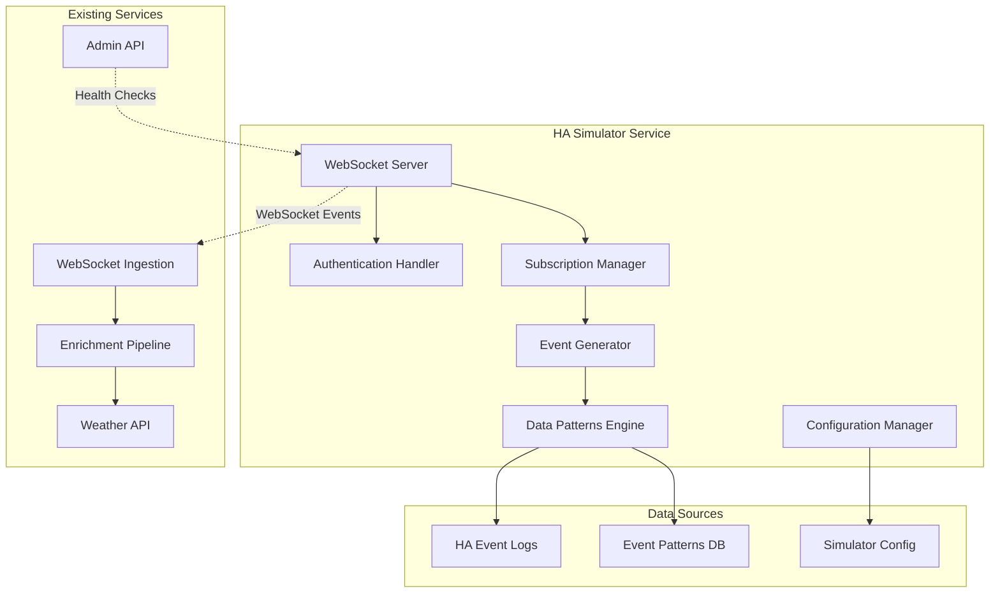

# BMAD Home Assistant Simulator Development Plan

## Executive Summary

This document outlines the BMAD (Business Model and Architecture Design) methodology approach to developing a Home Assistant simulator for the homeiq project. The simulator will enable development and testing without requiring a local Home Assistant instance, using real data patterns from the existing system.

## 1. Business Context & Requirements

### 1.1 Problem Statement
- **Current Challenge**: Development and testing requires a running Home Assistant instance
- **Impact**: Slows development cycle, requires HA setup/maintenance, limits testing scenarios
- **Business Need**: Independent development environment for homeiq services

### 1.2 Success Criteria
- ✅ Simulate realistic HA WebSocket API behavior
- ✅ Generate authentic event patterns based on real data
- ✅ Support all current entity types and domains
- ✅ Enable configurable event rates and scenarios
- ✅ Integrate seamlessly with existing homeiq services

### 1.3 Stakeholders
- **Primary**: Development team
- **Secondary**: QA team, DevOps team
- **Tertiary**: Future contributors

## 2. Architecture Design

### 2.1 System Architecture



### 2.2 Core Components

#### 2.2.1 WebSocket Server
- **Purpose**: Mimic HA WebSocket API endpoint
- **Port**: 8123 (configurable)
- **Protocol**: WebSocket with HA message format
- **Features**:
  - Authentication flow simulation
  - Event subscription management
  - Real-time event streaming

#### 2.2.2 Event Generator
- **Purpose**: Generate realistic HA events
- **Data Sources**: 
  - Historical event logs (`ha_events.log`)
  - Entity patterns from existing data
  - Configurable scenarios
- **Features**:
  - Realistic timing patterns
  - Entity state transitions
  - Configurable event rates

#### 2.2.3 Data Patterns Engine
- **Purpose**: Analyze and replicate real HA behavior
- **Analysis**:
  - Event frequency patterns
  - Entity interaction patterns
  - State transition logic
  - Temporal patterns (daily/weekly cycles)

#### 2.2.4 Configuration Manager
- **Purpose**: Control simulator behavior
- **Configuration**:
  - Event rates and patterns
  - Entity definitions
  - Scenario selection
  - Real-time adjustments

## 3. Technical Specifications

### 3.1 WebSocket API Compatibility

#### 3.1.1 Authentication Flow
```json
// Initial connection
{"type": "auth_required", "ha_version": "2025.10.1"}

// Client authentication
{"type": "auth", "access_token": "simulator_token"}

// Authentication response
{"type": "auth_ok", "ha_version": "2025.10.1"}
```

#### 3.1.2 Event Subscription
```json
// Client subscription
{"id": 1, "type": "subscribe_events"}

// Subscription confirmation
{"id": 1, "type": "result", "success": true, "result": null}
```

#### 3.1.3 Event Messages
```json
// State changed event
{
  "type": "event",
  "event": {
    "event_type": "state_changed",
    "time_fired": "2025-01-15T10:30:00.000Z",
    "origin": "LOCAL",
    "context": {
      "id": "01HXYZ123",
      "parent_id": null,
      "user_id": null
    },
    "data": {
      "entity_id": "sensor.living_room_temperature",
      "old_state": {
        "entity_id": "sensor.living_room_temperature",
        "state": "22.1",
        "attributes": {
          "unit_of_measurement": "°C",
          "device_class": "temperature",
          "friendly_name": "Living Room Temperature"
        },
        "last_changed": "2025-01-15T10:25:00.000Z",
        "last_updated": "2025-01-15T10:25:00.000Z"
      },
      "new_state": {
        "entity_id": "sensor.living_room_temperature",
        "state": "22.3",
        "attributes": {
          "unit_of_measurement": "°C",
          "device_class": "temperature",
          "friendly_name": "Living Room Temperature"
        },
        "last_changed": "2025-01-15T10:30:00.000Z",
        "last_updated": "2025-01-15T10:30:00.000Z"
      }
    }
  }
}
```

### 3.2 Entity Types & Patterns

Based on analysis of existing data:

#### 3.2.1 High-Frequency Entities
- `sensor.wled_estimated_current` (30+ events/5min)
- `sensor.bar_estimated_current` (30+ events/5min)
- `sensor.archer_be800_download_speed` (10+ events/5min)
- `sensor.archer_be800_upload_speed` (10+ events/5min)

#### 3.2.2 Medium-Frequency Entities
- `sun.sun` (1-2 events/5min)
- `sensor.slzb_06p7_coordinator_zigbee_chip_temp` (1+ events/5min)
- `sensor.home_assistant_core_cpu_percent` (1+ events/5min)

#### 3.2.3 Event Types
- `state_changed` (98.8% of events)
- `recorder_5min_statistics_generated` (1.2% of events)

### 3.3 Data Models

#### 3.3.1 Simulator Configuration
```yaml
# ha-simulator-config.yaml
simulator:
  name: "HA Development Simulator"
  version: "2025.10.1"
  port: 8123
  
authentication:
  enabled: true
  token: "dev_simulator_token"
  
entities:
  - entity_id: "sensor.living_room_temperature"
    domain: "sensor"
    device_class: "temperature"
    base_value: 22.0
    variance: 2.0
    update_interval: 30  # seconds
    unit_of_measurement: "°C"
    
  - entity_id: "sensor.wled_estimated_current"
    domain: "sensor"
    device_class: "current"
    base_value: 0.5
    variance: 0.2
    update_interval: 10  # seconds
    unit_of_measurement: "A"

scenarios:
  - name: "normal_operation"
    description: "Normal home operation patterns"
    event_rate: "medium"
    duration: "unlimited"
    
  - name: "high_activity"
    description: "High activity simulation"
    event_rate: "high"
    duration: 3600  # 1 hour
    
  - name: "low_activity"
    description: "Low activity simulation"
    event_rate: "low"
    duration: 3600  # 1 hour
```

## 4. Implementation Plan

### 4.1 Phase 1: Core Simulator (Week 1-2)
**Epic**: Basic WebSocket Server & Authentication

#### Story 1.1: WebSocket Server Foundation
- **Acceptance Criteria**:
  - WebSocket server accepts connections on configurable port
  - Handles connection lifecycle (connect/disconnect)
  - Basic error handling and logging
- **Tasks**:
  - Set up WebSocket server using aiohttp
  - Implement connection management
  - Add comprehensive logging
  - Create health check endpoint

#### Story 1.2: Authentication Simulation
- **Acceptance Criteria**:
  - Implements HA authentication flow
  - Supports configurable tokens
  - Proper error responses for invalid auth
- **Tasks**:
  - Implement auth_required message
  - Handle auth messages
  - Validate tokens
  - Send auth_ok/auth_invalid responses

#### Story 1.3: Event Subscription Management
- **Acceptance Criteria**:
  - Handles subscribe_events messages
  - Manages multiple subscriptions
  - Sends subscription confirmations
- **Tasks**:
  - Implement subscription handling
  - Track active subscriptions
  - Send result confirmations

### 4.2 Phase 2: Event Generation (Week 2-3)
**Epic**: Realistic Event Generation

#### Story 2.1: Data Pattern Analysis
- **Acceptance Criteria**:
  - Analyzes existing HA event logs
  - Extracts entity patterns and frequencies
  - Generates entity definitions
- **Tasks**:
  - Parse ha_events.log
  - Analyze event frequencies
  - Extract entity metadata
  - Create pattern database

#### Story 2.2: Basic Event Generator
- **Acceptance Criteria**:
  - Generates state_changed events
  - Supports configurable entities
  - Realistic timing patterns
- **Tasks**:
  - Implement event generation logic
  - Add entity state management
  - Implement timing controls
  - Add value variance simulation

#### Story 2.3: Advanced Event Patterns
- **Acceptance Criteria**:
  - Supports multiple event types
  - Realistic state transitions
  - Configurable scenarios
- **Tasks**:
  - Add recorder_5min_statistics_generated events
  - Implement state transition logic
  - Add scenario management
  - Create configuration system

### 4.3 Phase 3: Integration & Testing (Week 3-4)
**Epic**: Service Integration & Validation

#### Story 3.1: Service Integration
- **Acceptance Criteria**:
  - Integrates with existing homeiq services
  - Maintains compatibility with current code
  - Supports health monitoring
- **Tasks**:
  - Update docker-compose configurations
  - Add simulator service definition
  - Update environment variables
  - Test service communication

#### Story 3.2: Comprehensive Testing
- **Acceptance Criteria**:
  - All existing tests pass with simulator
  - New simulator-specific tests
  - Performance validation
- **Tasks**:
  - Run existing test suite
  - Create simulator unit tests
  - Add integration tests
  - Performance benchmarking

#### Story 3.3: Documentation & Deployment
- **Acceptance Criteria**:
  - Complete documentation
  - Deployment guides
  - Configuration examples
- **Tasks**:
  - Write user documentation
  - Create deployment guides
  - Add configuration examples
  - Update architecture docs

## 5. Quality Assurance

### 5.1 Testing Strategy

#### 5.1.1 Unit Tests
- WebSocket server functionality
- Authentication flow
- Event generation logic
- Configuration management

#### 5.1.2 Integration Tests
- End-to-end WebSocket communication
- Service integration
- Event processing pipeline
- Health monitoring

#### 5.1.3 Performance Tests
- Event generation rates
- Memory usage
- Connection handling
- Concurrent client support

### 5.2 Quality Gates

#### Gate 1: Core Functionality
- ✅ WebSocket server accepts connections
- ✅ Authentication flow works correctly
- ✅ Basic event generation functional
- ✅ All unit tests pass

#### Gate 2: Event Generation
- ✅ Realistic event patterns
- ✅ Configurable scenarios
- ✅ Performance meets requirements
- ✅ Integration tests pass

#### Gate 3: Production Ready
- ✅ Full service integration
- ✅ Comprehensive documentation
- ✅ Performance benchmarks met
- ✅ Deployment guides complete

## 6. Risk Assessment

### 6.1 Technical Risks
- **Risk**: WebSocket API compatibility issues
- **Mitigation**: Extensive testing with real HA client code
- **Probability**: Medium
- **Impact**: High

- **Risk**: Event pattern accuracy
- **Mitigation**: Use real data analysis and validation
- **Probability**: Low
- **Impact**: Medium

### 6.2 Operational Risks
- **Risk**: Simulator complexity
- **Mitigation**: Phased implementation with clear interfaces
- **Probability**: Medium
- **Impact**: Medium

## 7. Success Metrics

### 7.1 Development Metrics
- Development cycle time reduction: 50%
- Test environment setup time: < 5 minutes
- Simulator startup time: < 30 seconds

### 7.2 Quality Metrics
- Test coverage: > 90%
- API compatibility: 100%
- Event pattern accuracy: > 95%

### 7.3 Usage Metrics
- Daily active usage by development team
- Scenario usage patterns
- Performance benchmarks

## 8. Future Enhancements

### 8.1 Advanced Features
- GUI for simulator control
- Real-time scenario switching
- Custom entity creation
- Event replay from logs

### 8.2 Integration Features
- HA configuration import
- Device simulation
- Automation testing
- Performance profiling

## 9. Conclusion

The HA Simulator will significantly improve the development experience for the homeiq project by providing a reliable, configurable, and realistic Home Assistant environment. The phased approach ensures manageable implementation while maintaining high quality standards.

The simulator will enable:
- Faster development cycles
- Consistent testing environments
- Realistic event patterns
- Easy scenario configuration
- Seamless integration with existing services

This BMAD plan provides a comprehensive roadmap for successful implementation while maintaining the high standards expected in the homeiq project.

