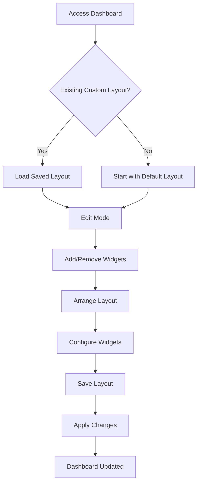
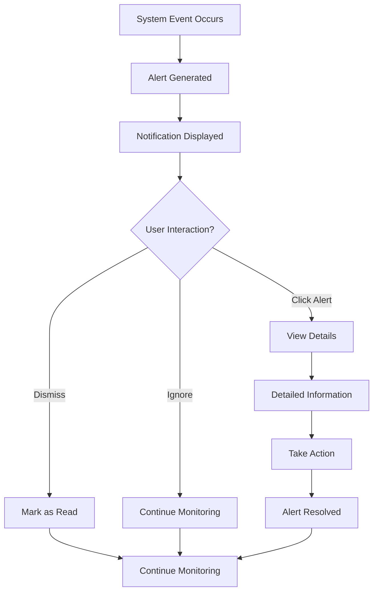
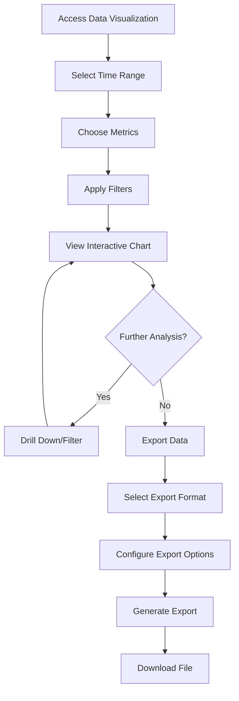

# Health Dashboard UI/UX Specification

## Introduction

This document defines the user experience goals, information architecture, user flows, and visual design specifications for the Health Dashboard UI Enhancement's user interface. It serves as the foundation for visual design and frontend development, ensuring a cohesive and user-centered experience that enhances the existing monitoring capabilities while maintaining full backward compatibility.

### Overall UX Goals & Principles

#### Target User Personas

**System Administrator:** Technical professionals responsible for monitoring and maintaining the Home Assistant Ingestor system. They need comprehensive oversight, advanced configuration capabilities, and detailed performance metrics to ensure system reliability and troubleshoot issues effectively. This persona encompasses all technical users including developers, engineers, and operations staff who interact with the monitoring system.

#### Usability Goals

- **Ease of learning:** New administrators can understand system status within 2 minutes and complete core monitoring tasks within 5 minutes
- **Efficiency of use:** Experienced administrators can access advanced features and complete complex analysis tasks with minimal clicks and navigation
- **Error prevention:** Clear validation, confirmation dialogs, and undo capabilities for all destructive actions
- **Memorability:** Administrators can return to the dashboard and immediately understand system status without relearning interface patterns
- **Accessibility:** All administrators, including those with disabilities, can effectively use the dashboard with keyboard navigation and screen reader support

#### Design Principles

1. **Clarity over cleverness** - Prioritize clear communication and intuitive interfaces over aesthetic innovation
2. **Progressive disclosure** - Show essential information first, with advanced features available on demand
3. **Consistent patterns** - Use familiar UI patterns and maintain visual consistency throughout the application
4. **Immediate feedback** - Every user action should have a clear, immediate visual response
5. **Accessible by default** - Design for all users from the start, not as an afterthought
6. **Data-driven design** - Prioritize data clarity and effective visualization over decorative elements
7. **Mobile-first responsive** - Ensure excellent experience across all device sizes
8. **Power-user focused** - Optimize for technical users who need efficiency and advanced capabilities

### Change Log
| Date | Version | Description | Author |
|------|---------|-------------|---------|
| 2024-12-19 | 1.0 | Initial UI/UX specification creation | UX Expert |

## Information Architecture (IA)

### Site Map / Screen Inventory

```mermaid
graph TD
    A[Dashboard Home] --> B[Custom Dashboard Builder]
    A --> C[System Health Overview]
    A --> D[Data Visualization]
    A --> E[Event Monitoring]
    A --> F[Configuration Management]
    A --> G[User Management]
    A --> H[Settings & Preferences]
    A --> I[Help & Documentation]
    
    B --> B1[Widget Library]
    B --> B2[Layout Editor]
    B --> B3[Dashboard Templates]
    
    C --> C1[Service Status]
    C --> C2[Performance Metrics]
    C --> C3[Alert Center]
    
    D --> D1[Interactive Charts]
    D --> D2[Historical Analysis]
    D --> D3[Data Export]
    
    E --> E1[Event Feed]
    E --> E2[Event Search]
    E --> E3[Event Details]
    
    F --> F1[Service Configuration]
    F --> F2[Backup & Restore]
    F --> F3[Configuration History]
    
    G --> G1[User Roles]
    G --> G2[Permission Management]
    G --> G3[Access Logs]
    
    H --> H1[Display Preferences]
    H --> H2[Notification Settings]
    H --> H3[Theme Selection]
    
    I --> I1[User Guide]
    I --> I2[API Documentation]
    I --> I3[Video Tutorials]
```

### Navigation Structure

**Primary Navigation:** Horizontal top navigation bar with main sections: Dashboard, Monitoring, Configuration, Users, Settings, and Help. Each section expands to show relevant subsections.

**Secondary Navigation:** Contextual navigation within each section, including breadcrumbs, filters, and quick actions. Sidebar navigation for detailed subsections and tools.

**Breadcrumb Strategy:** Clear breadcrumb navigation showing current location within the application hierarchy, with clickable links for easy navigation back to parent sections.

## User Flows

### Dashboard Customization Flow

**User Goal:** Create and manage personalized dashboard layouts with custom widgets and arrangements

**Entry Points:** Main dashboard page, "Customize Dashboard" button, or "Add Widget" actions

**Success Criteria:** User successfully creates, saves, and loads custom dashboard configurations

#### Flow Diagram

**Edge Cases & Error Handling:**
- Widget configuration errors with clear error messages
- Layout save failures with retry options
- Widget compatibility issues with alternative suggestions
- Browser refresh during editing with auto-save recovery

**Notes:** This flow supports both novice users with guided templates and power users with advanced customization options.

### Real-time Monitoring Flow

**User Goal:** Monitor system health and receive timely alerts about important events

**Entry Points:** Dashboard landing page, notification center, or direct alerts

**Success Criteria:** User receives relevant alerts and can quickly access detailed information about system status

#### Flow Diagram

**Edge Cases & Error Handling:**
- Multiple simultaneous alerts with prioritization
- Alert delivery failures with retry mechanisms
- User offline scenarios with alert queuing
- Alert acknowledgment timeouts with escalation

**Notes:** This flow prioritizes immediate visibility of critical issues while allowing users to manage less urgent notifications.

### Data Analysis Flow

**User Goal:** Analyze system data through interactive charts and export results for reporting

**Entry Points:** Data Visualization section, chart interactions, or export requests

**Success Criteria:** User successfully filters, analyzes, and exports relevant data in desired format

#### Flow Diagram

**Edge Cases & Error Handling:**
- Large dataset performance issues with pagination
- Export format limitations with alternative suggestions
- Filter combination conflicts with clear error messages
- Export generation failures with retry options

**Notes:** This flow supports both quick data access and comprehensive analysis workflows.

## Wireframes & Mockups

**Primary Design Files:** [Figma Design System - Health Dashboard Enhancement](https://figma.com/health-dashboard-enhancement)

### Key Screen Layouts

#### Enhanced Main Dashboard
**Purpose:** Central monitoring hub with customizable widgets and real-time updates

**Key Elements:**
- Customizable widget grid with drag-and-drop functionality
- Real-time status indicators and alerts
- Quick action toolbar for common tasks
- Navigation sidebar with collapsible sections
- Notification center with priority-based display

**Interaction Notes:** Widgets support hover states for configuration options, drag handles for repositioning, and click-to-expand for detailed views

**Design File Reference:** [Dashboard Layout - Desktop](https://figma.com/dashboard-desktop)

#### Mobile Dashboard View
**Purpose:** Touch-optimized monitoring interface for mobile devices

**Key Elements:**
- Stacked widget layout optimized for vertical scrolling
- Touch-friendly navigation with bottom tab bar
- Swipe gestures for widget interaction
- Collapsible sections for space efficiency
- Quick access to critical alerts

**Interaction Notes:** Swipe left/right to navigate between dashboard sections, pull-to-refresh for data updates, and long-press for widget configuration

**Design File Reference:** [Dashboard Layout - Mobile](https://figma.com/dashboard-mobile)

#### Custom Dashboard Builder
**Purpose:** Interface for creating and managing personalized dashboard layouts

**Key Elements:**
- Widget library with categorized components
- Drag-and-drop layout editor
- Preview mode with live data
- Save/load dashboard templates
- Configuration panels for each widget

**Interaction Notes:** Drag widgets from library to layout area, resize widgets with corner handles, and configure properties in right sidebar

**Design File Reference:** [Dashboard Builder Interface](https://figma.com/dashboard-builder)

## Component Library / Design System

**Design System Approach:** Extend existing Tailwind CSS design system with new components while maintaining visual consistency. Create a comprehensive component library that supports both the current functionality and new enhanced features.

### Core Components

#### Dashboard Widget
**Purpose:** Reusable container for displaying various types of monitoring data and controls

**Variants:** 
- Health Status Widget (system health indicators)
- Chart Widget (data visualization)
- Alert Widget (notifications and alerts)
- Metric Widget (key performance indicators)
- Control Widget (configuration and actions)

**States:** 
- Default (normal display)
- Loading (data fetching)
- Error (connection or data issues)
- Configure (editing mode)
- Minimized (collapsed view)

**Usage Guidelines:** Use consistent padding, border radius, and shadow patterns. Ensure all widgets support the same interaction patterns for consistency.

#### Interactive Chart
**Purpose:** Advanced data visualization with zoom, pan, filter, and export capabilities

**Variants:**
- Line Chart (time series data)
- Bar Chart (categorical data)
- Doughnut Chart (proportional data)
- Area Chart (cumulative data)
- Scatter Plot (correlation data)

**States:**
- Static (basic display)
- Interactive (zoom/pan enabled)
- Filtered (data subset)
- Loading (data fetching)
- Error (data unavailable)

**Usage Guidelines:** Maintain consistent color schemes, provide clear legends, and ensure accessibility with keyboard navigation and screen reader support.

#### Notification System
**Purpose:** Real-time alert and notification display with priority management

**Variants:**
- Toast Notification (temporary alerts)
- Banner Alert (persistent warnings)
- Modal Alert (critical notifications)
- Inline Alert (contextual warnings)
- Notification Center (centralized alerts)

**States:**
- Info (informational)
- Warning (caution required)
- Error (action needed)
- Success (confirmation)
- Critical (immediate attention)

**Usage Guidelines:** Use appropriate colors and icons for each severity level, provide clear action buttons, and ensure notifications don't interfere with core functionality.

## Branding & Style Guide

### Visual Identity
**Brand Guidelines:** [Health Dashboard Brand Guidelines](https://brand.health-dashboard.com)

### Color Palette
| Color Type | Hex Code | Usage |
|------------|----------|-------|
| Primary | #3B82F6 | Main actions, links, primary buttons |
| Secondary | #6B7280 | Secondary actions, supporting text |
| Accent | #10B981 | Success states, positive indicators |
| Success | #10B981 | Positive feedback, confirmations |
| Warning | #F59E0B | Cautions, important notices |
| Error | #EF4444 | Errors, destructive actions |
| Neutral | #F9FAFB, #E5E7EB, #9CA3AF, #374151 | Text, borders, backgrounds |

### Typography

#### Font Families
- **Primary:** Inter (clean, modern, highly readable)
- **Secondary:** Inter (consistent with primary)
- **Monospace:** JetBrains Mono (code, data, technical content)

#### Type Scale
| Element | Size | Weight | Line Height |
|---------|------|--------|-------------|
| H1 | 2.25rem (36px) | 700 | 1.2 |
| H2 | 1.875rem (30px) | 600 | 1.3 |
| H3 | 1.5rem (24px) | 600 | 1.4 |
| Body | 1rem (16px) | 400 | 1.5 |
| Small | 0.875rem (14px) | 400 | 1.4 |

### Iconography
**Icon Library:** Heroicons (consistent with existing Tailwind CSS integration)

**Usage Guidelines:** Use outlined icons for primary actions, solid icons for active states, and maintain consistent sizing (16px, 20px, 24px) throughout the interface.

### Spacing & Layout
**Grid System:** 12-column responsive grid with 24px gutters, maximum content width of 1200px

**Spacing Scale:** 4px base unit (4px, 8px, 12px, 16px, 20px, 24px, 32px, 40px, 48px, 64px, 80px, 96px)

## Accessibility Requirements

### Compliance Target
**Standard:** WCAG 2.1 AA compliance with AAA where practical

### Key Requirements

**Visual:**
- Color contrast ratios: Minimum 4.5:1 for normal text, 3:1 for large text
- Focus indicators: Clear, high-contrast focus rings on all interactive elements
- Text sizing: Support for 200% zoom without horizontal scrolling

**Interaction:**
- Keyboard navigation: Full functionality accessible via keyboard only
- Screen reader support: Proper ARIA labels, roles, and descriptions
- Touch targets: Minimum 44px touch targets for mobile interfaces

**Content:**
- Alternative text: Descriptive alt text for all images and charts
- Heading structure: Logical heading hierarchy (H1 → H2 → H3)
- Form labels: Clear, descriptive labels for all form inputs

### Testing Strategy
Comprehensive accessibility testing using automated tools (axe-core), manual testing with screen readers (NVDA, JAWS), and keyboard-only navigation testing across all major browsers.

## Responsiveness Strategy

### Breakpoints
| Breakpoint | Min Width | Max Width | Target Devices |
|------------|-----------|-----------|----------------|
| Mobile | 320px | 767px | Smartphones, small tablets |
| Tablet | 768px | 1023px | Tablets, small laptops |
| Desktop | 1024px | 1439px | Laptops, desktop monitors |
| Wide | 1440px | - | Large monitors, ultrawide displays |

### Adaptation Patterns

**Layout Changes:** 
- Mobile: Single-column stacked layout with collapsible navigation
- Tablet: Two-column layout with sidebar navigation
- Desktop: Multi-column grid with persistent sidebar
- Wide: Expanded grid with additional information panels

**Navigation Changes:**
- Mobile: Bottom tab navigation with hamburger menu
- Tablet: Collapsible sidebar with icon labels
- Desktop: Full sidebar with text labels
- Wide: Expanded sidebar with additional quick actions

**Content Priority:**
- Mobile: Critical alerts and key metrics first
- Tablet: Balanced view of alerts and detailed metrics
- Desktop: Comprehensive dashboard with all features
- Wide: Additional analytics and comparison views

**Interaction Changes:**
- Mobile: Touch-optimized with swipe gestures
- Tablet: Hybrid touch and mouse interactions
- Desktop: Full mouse and keyboard support
- Wide: Enhanced keyboard shortcuts and power-user features

## Animation & Micro-interactions

### Motion Principles
Smooth, purposeful animations that enhance usability without distracting from content. Use easing curves that feel natural and maintain 60fps performance. Respect user preferences for reduced motion.

### Key Animations
- **Page Transitions:** Fade and slide transitions between sections (Duration: 300ms, Easing: ease-out)
- **Widget Interactions:** Subtle hover and focus animations (Duration: 150ms, Easing: ease-in-out)
- **Loading States:** Skeleton screens and progress indicators (Duration: 1000ms, Easing: ease-in-out)
- **Notifications:** Slide-in from top with fade (Duration: 400ms, Easing: ease-out)
- **Data Updates:** Gentle pulse animation for real-time updates (Duration: 200ms, Easing: ease-in-out)
- **Modal Overlays:** Backdrop fade with content scale (Duration: 250ms, Easing: ease-out)

## Performance Considerations

### Performance Goals
- **Page Load:** Initial page load under 2 seconds on 3G connection
- **Interaction Response:** All user interactions respond within 100ms
- **Animation FPS:** Maintain 60fps for all animations and transitions

### Design Strategies
- Optimize images and icons with appropriate formats and sizes
- Implement lazy loading for non-critical content and charts
- Use CSS transforms for animations to leverage GPU acceleration
- Minimize layout shifts with proper sizing and placeholder content
- Implement progressive enhancement for advanced features

## Next Steps

### Immediate Actions
1. Review specification with stakeholders and development team
2. Create detailed visual designs in Figma based on wireframes
3. Develop component library and design system documentation
4. Conduct user testing with prototype designs
5. Prepare handoff documentation for frontend development

### Design Handoff Checklist
- [x] All user flows documented
- [x] Component inventory complete
- [x] Accessibility requirements defined
- [x] Responsive strategy clear
- [x] Brand guidelines incorporated
- [x] Performance goals established
- [ ] Visual designs created in Figma
- [ ] Component specifications detailed
- [ ] Animation guidelines documented
- [ ] User testing completed
- [ ] Development handoff materials prepared