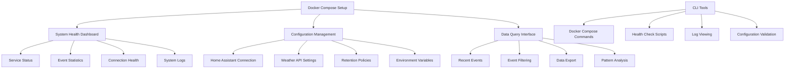
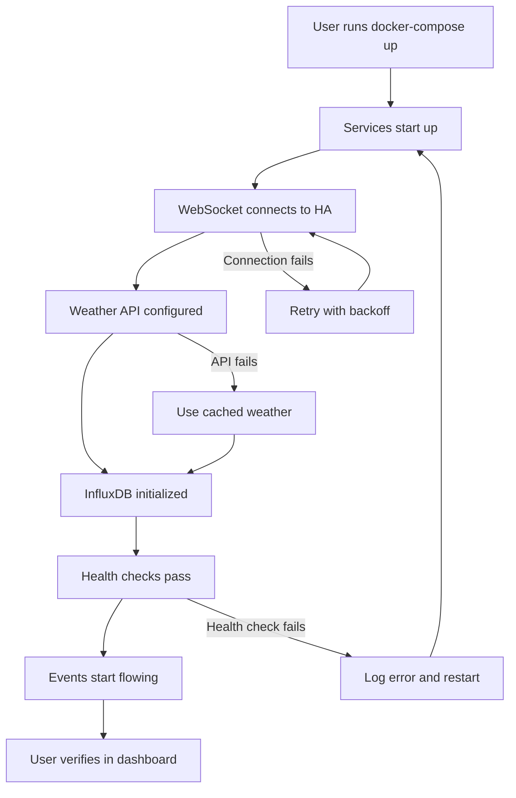
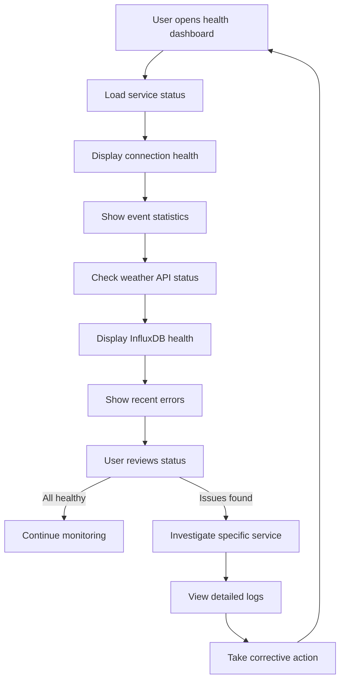
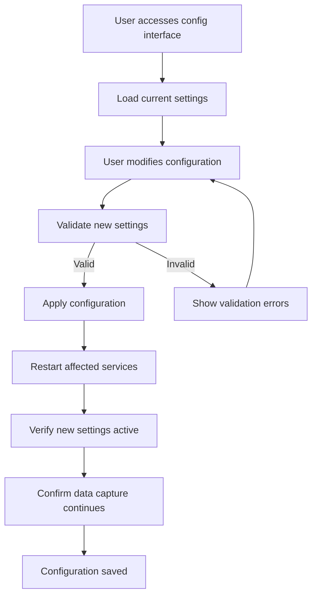
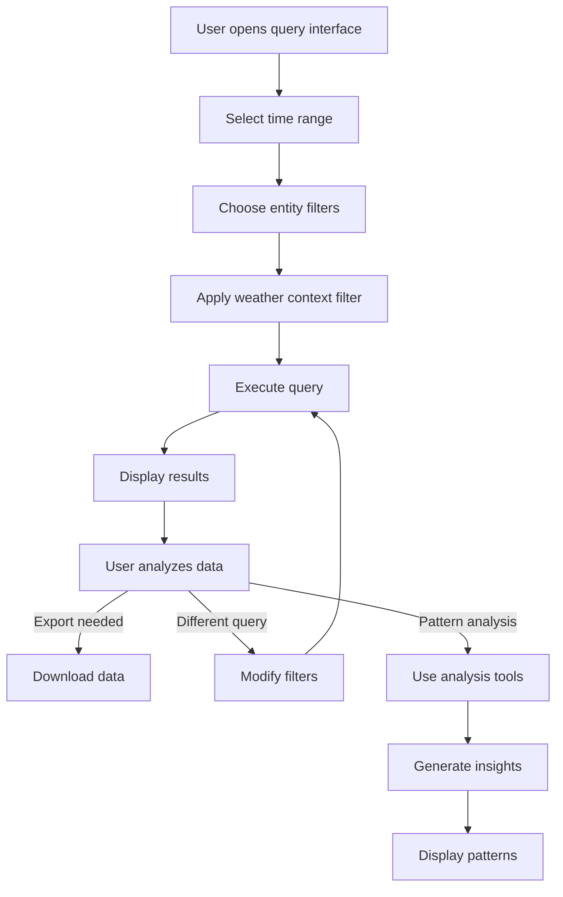

# Home Assistant Ingestion Layer UI/UX Specification

This document defines the user experience goals, information architecture, user flows, and visual design specifications for **Home Assistant Ingestion Layer**'s user interface. It serves as the foundation for visual design and frontend development, ensuring a cohesive and user-centered experience.

## Overall UX Goals & Principles

### Target User Personas

- **Power User:** Technical professionals (software developers, engineers, IT professionals) with 2+ years of Home Assistant experience, comfortable with Docker and command-line tools
- **System Administrator:** Users who need to monitor and maintain the ingestion system, requiring clear health monitoring and troubleshooting capabilities
- **Data Analyst:** Users who want to query and analyze the captured Home Assistant data for insights and pattern recognition

### Usability Goals

- **Ease of deployment:** Users can deploy the complete system with a single Docker Compose command within 30 minutes
- **Set it and forget it:** Minimal ongoing interaction required - system operates autonomously once configured
- **Clear status visibility:** Users can quickly understand system health, data capture rates, and any issues
- **Technical transparency:** Power users can access detailed logs, metrics, and configuration options
- **Reliable operation:** 99.9% uptime with automatic error recovery and reconnection

### Design Principles

1. **Clarity over cleverness** - Prioritize clear communication and technical accuracy over aesthetic innovation
2. **Progressive disclosure** - Show essential information first, with detailed technical data available on demand
3. **Consistent technical patterns** - Use familiar CLI and web interface patterns that technical users expect
4. **Immediate feedback** - Every action should have clear, immediate response (deployment status, health checks, data capture confirmation)
5. **Accessible by default** - Design for technical accessibility (keyboard navigation, clear error messages, comprehensive logging)

### Change Log

| Date | Version | Description | Author |
|------|---------|-------------|---------|
| 2024-12-19 | v1.0 | Initial front-end specification creation | UX Expert |

## Information Architecture (IA)

### Site Map / Screen Inventory

### Navigation Structure

**Primary Navigation:** 
- **Deploy** - Docker Compose setup and initial configuration
- **Monitor** - System health, logs, and real-time status
- **Configure** - Settings management and environment setup
- **Query** - Data access and basic analysis tools

**Secondary Navigation:**
- **Quick Actions** - Start/stop services, view logs, check health
- **Advanced Tools** - CLI commands, configuration files, troubleshooting

**Breadcrumb Strategy:** 
Simple linear breadcrumbs for web interface: Home > [Current Section] > [Current Page]. CLI tools use clear command hierarchies and help text.

## User Flows

### Flow 1: Initial System Deployment

**User Goal:** Deploy the complete ingestion system with a single command and verify it's working correctly

**Entry Points:** 
- Docker Compose command from project directory
- Documentation or setup guide

**Success Criteria:** 
- All services start successfully and remain running
- WebSocket connection established with Home Assistant
- Events are being captured and stored in InfluxDB
- Health checks show all services as healthy

**Flow Diagram:**

**Edge Cases & Error Handling:**
- Home Assistant not accessible: Clear error message with connection troubleshooting
- Invalid access token: Authentication error with token validation guidance
- Weather API unavailable: Fallback to cached data with warning notification
- InfluxDB startup failure: Database initialization error with storage troubleshooting
- Port conflicts: Clear port conflict resolution instructions
- Insufficient resources: Resource requirement validation with hardware recommendations

**Notes:** This flow must be bulletproof since it's the primary user interaction. Error messages should be actionable and include specific troubleshooting steps.

### Flow 2: System Health Monitoring

**User Goal:** Quickly assess system health and identify any issues requiring attention

**Entry Points:**
- Health dashboard web interface
- CLI health check commands
- Automated monitoring alerts

**Success Criteria:**
- Clear visibility into all service statuses
- Real-time event capture rates and error rates
- Historical health trends and performance metrics
- Actionable alerts for issues requiring attention

**Flow Diagram:**

**Edge Cases & Error Handling:**
- Service down: Clear indication with restart instructions
- High error rates: Alert with investigation guidance
- Connection drops: Automatic reconnection status with manual override options
- Storage full: Capacity warnings with cleanup recommendations
- API rate limits: Weather service throttling notifications

**Notes:** The monitoring flow should provide both high-level status and drill-down capabilities for technical users who need detailed troubleshooting information.

### Flow 3: Configuration Management

**User Goal:** Update system configuration without disrupting ongoing data capture

**Entry Points:**
- Configuration web interface
- Environment variable updates
- Configuration file modifications

**Success Criteria:**
- Configuration changes applied successfully
- Services restart gracefully with new settings
- Data capture continues uninterrupted
- Changes are validated and persisted

**Flow Diagram:**

**Edge Cases & Error Handling:**
- Invalid configuration: Clear validation errors with correction guidance
- Service restart failure: Rollback to previous configuration with error logging
- Configuration conflicts: Dependency validation with resolution suggestions
- Sensitive data exposure: Secure handling of tokens and API keys
- Partial configuration failure: Graceful degradation with affected service identification

**Notes:** Configuration changes should be atomic - either all succeed or all fail. Sensitive data should never be displayed in full, only masked versions.

### Flow 4: Data Query and Analysis

**User Goal:** Access and analyze captured Home Assistant data for insights and pattern recognition

**Entry Points:**
- Data query web interface
- CLI query tools
- Future integration with Grafana or other analytics tools

**Success Criteria:**
- Fast query response times (<2 seconds for complex queries)
- Flexible filtering by entity, time range, and data type
- Clear data visualization and export options
- Integration with external analytics tools

**Flow Diagram:**

**Edge Cases & Error Handling:**
- Query timeout: Progress indication with timeout handling
- Large result sets: Pagination and result limiting
- Invalid query parameters: Clear parameter validation with examples
- Database connection issues: Connection retry with fallback options
- Export failures: Alternative export formats and error recovery

**Notes:** This flow supports the core value proposition of pattern analysis. Query performance is critical for user experience, and the interface should guide users toward efficient queries.

## Wireframes & Mockups

**Primary Design Files:** 
Design will be created in **Figma** for the web interface components, with CLI tool designs documented in markdown format. The design system will prioritize functionality over visual complexity, aligning with the technical user base and "set it and forget it" operational model.

### Key Screen Layouts

#### Screen 1: System Health Dashboard

**Purpose:** Provide real-time visibility into system health, data capture rates, and service status for monitoring and troubleshooting

**Key Elements:**
- Service status indicators (WebSocket Client, Enrichment Service, InfluxDB, Weather API)
- Real-time event capture metrics (events/hour, total today, error rate)
- Connection health status with last reconnect information
- Recent events feed with entity_id, state changes, and timestamps
- Quick action buttons (restart services, view logs, refresh status)

**Interaction Notes:** 
- Auto-refresh every 30 seconds with manual refresh option
- Click on service status for detailed health information
- Expandable sections for detailed metrics and logs
- Color-coded status indicators (green=healthy, yellow=warning, red=error)

**Design File Reference:** `figma.com/file/health-dashboard` (to be created)

#### Screen 2: Configuration Management

**Purpose:** Allow users to update system configuration without disrupting data capture

**Key Elements:**
- Home Assistant connection settings (URL, token validation)
- Weather API configuration (API key, location, cache settings)
- Data retention policies (retention period, cleanup schedule)
- Environment variables display (masked sensitive data)
- Configuration validation and save/apply buttons

**Interaction Notes:**
- Real-time validation of configuration changes
- Sensitive data (tokens, API keys) shown as masked values
- Configuration changes require service restart confirmation
- Backup/restore configuration options
- Test connection buttons for external services

**Design File Reference:** `figma.com/file/config-management` (to be created)

#### Screen 3: Data Query Interface

**Purpose:** Enable users to query and analyze captured Home Assistant data

**Key Elements:**
- Time range selector (last hour, day, week, month, custom range)
- Entity filter dropdown with search functionality
- Weather context filter (temperature range, weather conditions)
- Query results table with pagination
- Export options (CSV, JSON, InfluxDB query)
- Basic visualization charts for pattern analysis

**Interaction Notes:**
- Query builder with common patterns (energy usage, occupancy patterns)
- Real-time query execution with progress indicators
- Result caching for repeated queries
- Export functionality with format options
- Integration links to external tools (Grafana, Jupyter)

**Design File Reference:** `figma.com/file/data-query` (to be created)

#### Screen 4: CLI Command Reference

**Purpose:** Provide comprehensive CLI documentation and command examples for power users

**Key Elements:**
- Docker Compose command examples with explanations
- Health check command syntax and options
- Log viewing commands with filtering options
- Configuration validation commands
- Troubleshooting command sequences
- Service management commands (start, stop, restart, status)

**Interaction Notes:**
- Copy-to-clipboard functionality for all commands
- Command validation and syntax highlighting
- Interactive command builder for complex operations
- Context-sensitive help based on current system state
- Command history and favorites for frequent operations

**Design File Reference:** `docs/cli-reference.md` (markdown documentation)

## Component Library / Design System

**Design System Approach:** 
Create a **minimal, technical design system** focused on information density and functional clarity rather than visual complexity. The system will use a monospace-friendly typography approach, high-contrast color schemes for readability, and component patterns familiar to technical users (CLI-inspired interfaces, data tables, status indicators).

### Core Components

#### Component 1: Status Indicator

**Purpose:** Display service health status with clear visual and textual indicators

**Variants:** 
- Healthy (green dot + "Healthy" text)
- Warning (yellow dot + "Warning" text) 
- Error (red dot + "Error" text)
- Unknown (gray dot + "Unknown" text)

**States:**
- Default: Static status display
- Hover: Show detailed status information
- Loading: Pulsing animation during status check
- Click: Expand to show detailed health metrics

**Usage Guidelines:**
- Always pair with descriptive text, never rely on color alone
- Use consistent color coding across all interfaces
- Include timestamp of last status check
- Provide drill-down capability for detailed information

#### Component 2: Data Table

**Purpose:** Display structured data (events, metrics, configuration) in a scannable format

**Variants:**
- Basic table with standard columns
- Sortable table with clickable headers
- Filterable table with search functionality
- Paginated table for large datasets

**States:**
- Default: Standard table display
- Loading: Skeleton rows during data fetch
- Empty: No data message with helpful actions
- Error: Error state with retry option

**Usage Guidelines:**
- Use consistent column widths and alignment
- Include row hover states for better scanning
- Provide clear sorting and filtering controls
- Show data freshness timestamps
- Include export functionality for all data tables

#### Component 3: Command Input

**Purpose:** Provide CLI-style command input for power users

**Variants:**
- Single command input with execution button
- Multi-line command input for complex operations
- Command history dropdown
- Command validation with syntax highlighting

**States:**
- Default: Ready for input
- Validating: Checking command syntax
- Executing: Command running with progress indicator
- Success: Command completed with results
- Error: Command failed with error message

**Usage Guidelines:**
- Provide command autocomplete and suggestions
- Include command history and favorites
- Show command validation in real-time
- Display execution results clearly
- Provide copy-to-clipboard functionality

#### Component 4: Configuration Form

**Purpose:** Manage system settings with validation and security considerations

**Variants:**
- Basic form with standard inputs
- Secure form with masked sensitive data
- Validation form with real-time error checking
- Multi-step form for complex configurations

**States:**
- Default: Form ready for input
- Validating: Checking input validity
- Saving: Applying configuration changes
- Success: Configuration saved successfully
- Error: Validation or save errors

**Usage Guidelines:**
- Mask sensitive data (tokens, API keys) with show/hide toggle
- Provide real-time validation feedback
- Include test connection buttons for external services
- Show configuration change impact warnings
- Provide backup/restore functionality

#### Component 5: Metric Display

**Purpose:** Show key performance indicators and system metrics

**Variants:**
- Single metric with value and label
- Metric comparison (current vs previous period)
- Metric trend with simple chart
- Metric grid for dashboard overview

**States:**
- Default: Standard metric display
- Loading: Skeleton or spinner during data fetch
- Error: Error state with retry option
- Stale: Data freshness warning

**Usage Guidelines:**
- Use consistent number formatting and units
- Include data freshness indicators
- Provide context for metric values (good/bad ranges)
- Show trend indicators when relevant
- Include drill-down capability for detailed analysis

#### Component 6: Log Viewer

**Purpose:** Display system logs with filtering and search capabilities

**Variants:**
- Basic log display with timestamps
- Filterable log viewer with level filtering
- Searchable log viewer with text search
- Real-time log stream with auto-scroll

**States:**
- Default: Log entries displayed
- Filtering: Logs filtered by criteria
- Searching: Search results highlighted
- Streaming: Real-time log updates

**Usage Guidelines:**
- Use monospace font for log content
- Color-code log levels consistently
- Provide clear filtering and search controls
- Include log export functionality
- Show log rotation and retention information

## Branding & Style Guide

**Brand Guidelines:** 
The Home Assistant Ingestion Layer should maintain a **clean, technical aesthetic** that prioritizes functionality over visual design. The brand should feel professional and reliable, reflecting the system's role as critical infrastructure. Visual design should be minimal and purposeful, with clear information hierarchy and excellent readability.

### Visual Identity

**Brand Guidelines:** Clean, technical aesthetic prioritizing functionality over visual design

### Color Palette

| Color Type | Hex Code | Usage |
|------------|----------|-------|
| Primary | #1976D2 | Primary actions, links, active states |
| Secondary | #424242 | Secondary text, borders, inactive elements |
| Accent | #FF9800 | Warnings, important notices, highlights |
| Success | #4CAF50 | Positive feedback, confirmations, healthy status |
| Warning | #FF9800 | Cautions, important notices, warning status |
| Error | #F44336 | Errors, destructive actions, error status |
| Neutral | #F5F5F5, #E0E0E0, #9E9E9E, #424242, #212121 | Text, borders, backgrounds, disabled states |

### Typography

**Font Families:**
- **Primary:** Inter (web), SF Pro Display (macOS), Segoe UI (Windows), Roboto (Android) - Clean, readable sans-serif for UI text
- **Secondary:** Inter (web), system fonts - Consistent with primary for labels and secondary text
- **Monospace:** JetBrains Mono, SF Mono (macOS), Consolas (Windows), Roboto Mono (Android) - For code, commands, and data display

**Type Scale:**

| Element | Size | Weight | Line Height |
|---------|------|--------|-------------|
| H1 | 32px | 600 | 1.2 |
| H2 | 24px | 600 | 1.3 |
| H3 | 20px | 500 | 1.4 |
| Body | 16px | 400 | 1.5 |
| Small | 14px | 400 | 1.4 |

### Iconography

**Icon Library:** 
Use **Lucide React** icons for consistency and clarity. Focus on functional, recognizable icons that technical users expect.

**Usage Guidelines:**
- Use consistent icon sizes (16px, 20px, 24px)
- Prefer outlined icons over filled for better readability
- Use semantic icons (check for success, X for error, warning triangle for warnings)
- Include text labels with icons for accessibility
- Use monospace-friendly icons for CLI interfaces

### Spacing & Layout

**Grid System:** 
Use an 8px base grid system for consistent spacing and alignment.

**Spacing Scale:**
- **xs:** 4px (0.25rem)
- **sm:** 8px (0.5rem) 
- **md:** 16px (1rem)
- **lg:** 24px (1.5rem)
- **xl:** 32px (2rem)
- **xxl:** 48px (3rem)

**Layout Principles:**
- Use consistent margins and padding based on the 8px grid
- Maintain adequate white space for readability
- Align elements to the grid for visual consistency
- Use consistent component spacing throughout the interface

## Accessibility Requirements

**Standard:** 
Target **WCAG 2.1 AA compliance** with additional technical accessibility considerations for power users who rely on keyboard navigation, screen readers, and high-contrast displays.

### Compliance Target

**Standard:** WCAG 2.1 AA compliance

### Key Requirements

**Visual:**
- Color contrast ratios: Minimum 4.5:1 for normal text, 3:1 for large text, 7:1 for enhanced contrast mode
- Focus indicators: Clear, visible focus rings with 2px solid outline and sufficient contrast
- Text sizing: Support for 200% zoom without horizontal scrolling, minimum 16px base font size

**Interaction:**
- Keyboard navigation: Full keyboard accessibility with logical tab order, skip links, and keyboard shortcuts
- Screen reader support: Semantic HTML, ARIA labels, live regions for dynamic content updates
- Touch targets: Minimum 44px touch targets for mobile interfaces, adequate spacing between interactive elements

**Content:**
- Alternative text: Descriptive alt text for all images, icons, and visual indicators
- Heading structure: Logical heading hierarchy (H1 → H2 → H3) for screen reader navigation
- Form labels: Clear, descriptive labels for all form inputs with error message association

### Testing Strategy

**Automated Testing:**
- Use axe-core for automated accessibility testing in CI/CD pipeline
- Lighthouse accessibility audits for web interface components
- Color contrast validation tools for design system compliance

**Manual Testing:**
- Keyboard-only navigation testing for all user flows
- Screen reader testing with NVDA (Windows) and VoiceOver (macOS)
- High contrast mode testing for visual accessibility
- Zoom testing up to 200% for responsive design validation

**User Testing:**
- Test with technical users who rely on assistive technologies
- Validate CLI accessibility for users with visual impairments
- Test configuration interfaces with keyboard-only users

## Responsiveness Strategy

### Breakpoints

| Breakpoint | Min Width | Max Width | Target Devices |
|------------|-----------|-----------|----------------|
| Mobile | 320px | 767px | Smartphones, small tablets |
| Tablet | 768px | 1023px | Tablets, small laptops |
| Desktop | 1024px | 1439px | Laptops, desktop monitors |
| Wide | 1440px | - | Large monitors, ultrawide displays |

### Adaptation Patterns

**Layout Changes:** 
- Mobile: Single-column layout with collapsible sidebar navigation
- Tablet: Two-column layout with persistent sidebar
- Desktop: Three-column layout with full sidebar and detailed panels
- Wide: Four-column layout with expanded data tables and multiple panels

**Navigation Changes:**
- Mobile: Hamburger menu with slide-out navigation drawer
- Tablet: Collapsible sidebar with icon-only mode
- Desktop: Full sidebar with text labels and expanded sections
- Wide: Persistent sidebar with additional quick access panels

**Content Priority:**
- Mobile: Essential metrics and status indicators only
- Tablet: Core functionality with simplified data tables
- Desktop: Full feature set with detailed information
- Wide: Enhanced data visualization and multiple concurrent views

**Interaction Changes:**
- Mobile: Touch-optimized controls with larger touch targets
- Tablet: Hybrid touch and mouse interaction support
- Desktop: Full mouse and keyboard interaction with hover states
- Wide: Multi-panel interaction with drag-and-drop capabilities

## Animation & Micro-interactions

### Motion Principles

**Purposeful Motion:** 
All animations should serve a functional purpose - indicating state changes, providing feedback, or guiding user attention. Avoid decorative animations that don't enhance usability.

**Performance-First:** 
Animations must not impact system performance or interfere with real-time data updates. Use CSS transforms and opacity changes for optimal performance.

**Accessibility-Aware:** 
Respect user preferences for reduced motion. Provide options to disable animations for users with vestibular disorders or motion sensitivity.

**Technical Clarity:** 
Animations should reinforce the technical nature of the interface - smooth, precise, and predictable rather than playful or whimsical.

### Key Animations

- **Status Changes:** Smooth color transitions (200ms ease-in-out) when service status changes from healthy to warning/error
- **Data Loading:** Subtle skeleton loading animation (800ms pulse) for data tables and metrics during fetch operations
- **Form Validation:** Immediate visual feedback (150ms ease-out) for form field validation states
- **Navigation:** Smooth page transitions (300ms ease-in-out) for web interface navigation
- **Command Execution:** Progress indicators with smooth progress bars (variable duration based on operation)
- **Log Streaming:** Subtle highlight animation (400ms ease-out) for new log entries in real-time streams
- **Configuration Changes:** Smooth state transitions (250ms ease-in-out) when configuration is applied successfully
- **Error States:** Gentle shake animation (300ms ease-in-out) for form validation errors

## Performance Considerations

### Performance Goals

- **Page Load:** Initial dashboard load within 2 seconds, subsequent navigation under 1 second
- **Interaction Response:** All user interactions (clicks, form submissions, queries) respond within 200ms
- **Animation FPS:** Maintain 60fps for all animations and transitions, with graceful degradation to 30fps on lower-end devices

### Design Strategies

**Data Loading Optimization:**
- Implement progressive loading for large datasets (load essential data first, then details)
- Use pagination and virtual scrolling for large data tables (events, logs)
- Cache frequently accessed data (configuration, recent events) in browser storage
- Implement data prefetching for predictable user navigation patterns

**Real-Time Updates:**
- Use WebSocket connections for real-time status updates with efficient data diffing
- Implement smart polling intervals (faster for critical metrics, slower for background data)
- Use request debouncing for user inputs to prevent excessive API calls
- Implement connection pooling and request queuing for external API calls

**Interface Responsiveness:**
- Use CSS transforms and opacity changes for animations to leverage GPU acceleration
- Implement skeleton loading states to maintain perceived performance during data fetches
- Use lazy loading for non-critical components and images
- Implement service worker caching for static assets and API responses

**Resource Management:**
- Optimize bundle sizes with code splitting and tree shaking
- Use efficient data structures for large datasets (avoid unnecessary object creation)
- Implement memory management for long-running sessions (clear old data, limit cache sizes)
- Use efficient rendering patterns (React.memo, useMemo) for complex data displays

## Next Steps

### Immediate Actions

1. **Review specification with stakeholders** - Present the complete UI/UX specification to technical users and gather feedback on the proposed design approach
2. **Create visual mockups in Figma** - Develop detailed wireframes and mockups for the key screens (health dashboard, configuration, data query)
3. **Validate design system components** - Test the proposed component library with technical users to ensure it meets their needs
4. **Prepare for frontend architecture handoff** - Document the design decisions and requirements for the development team
5. **Create CLI interface documentation** - Develop comprehensive documentation for command-line tools and interactions
6. **Plan accessibility testing** - Prepare testing protocols for WCAG 2.1 AA compliance validation
7. **Design responsive prototypes** - Create interactive prototypes for different device breakpoints
8. **Establish design review process** - Set up regular design reviews with technical users throughout development

### Design Handoff Checklist

- [x] All user flows documented
- [x] Component inventory complete
- [x] Accessibility requirements defined
- [x] Responsive strategy clear
- [x] Brand guidelines incorporated
- [x] Performance goals established
- [ ] Visual mockups created
- [ ] Interactive prototypes developed
- [ ] Design system implemented
- [ ] Accessibility testing planned
- [ ] Technical specifications documented
- [ ] Development handoff completed

## Checklist Results

*This section will be populated after running the UI/UX checklist validation.*
