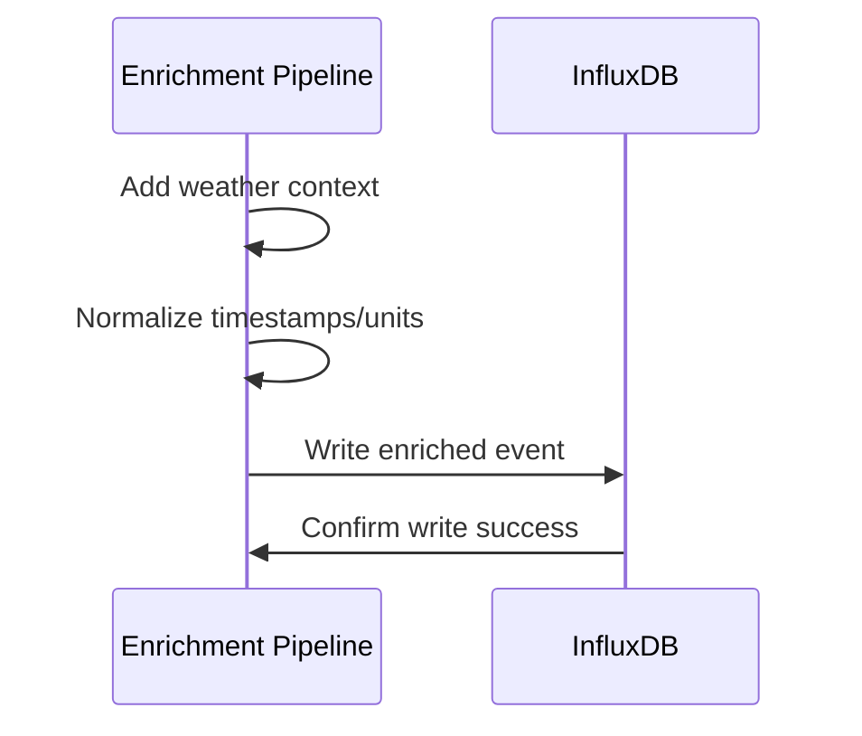

# Story 3.2: InfluxDB Schema Design & Storage

## Status

Ready for Development

## Story

**As a** data analyst,  
**I want** Home Assistant events stored in an optimized time-series database schema,  
**so that** I can efficiently query historical data and perform pattern analysis.

## Acceptance Criteria

1. InfluxDB database is configured with proper retention policies (1 year default)
2. Schema includes optimized tags (entity_id, domain, device_class, location) for efficient querying
3. Fields store normalized event data (state, attributes, weather context) for analysis
4. Data is written in batches for optimal performance and reduced database load
5. Schema supports multi-temporal analysis (day/week/month/season/year patterns)
6. Database connection is resilient with automatic reconnection on failures
7. Storage usage is monitored and reported for capacity planning

## Tasks / Subtasks

- [ ] Task 1: Implement InfluxDB client and connection management (AC: 6)
  - [ ] Create InfluxDB client using official Python client library
  - [ ] Implement database connection with authentication and configuration
  - [ ] Add connection pooling and management for high-volume operations
  - [ ] Implement automatic reconnection on connection failures
  - [ ] Add connection health monitoring and status reporting

- [ ] Task 2: Implement optimized database schema design (AC: 2, 3)
  - [ ] Create database and bucket initialization scripts
  - [ ] Implement tag schema for efficient querying (entity_id, domain, device_class, area)
  - [ ] Design field schema for normalized event data and weather context
  - [ ] Add schema validation and compliance checking
  - [ ] Implement schema migration and version management

- [ ] Task 3: Implement retention policies and data lifecycle (AC: 1)
  - [ ] Create retention policies for different data types (raw, hourly, daily summaries)
  - [ ] Implement automatic data cleanup and archival processes
  - [ ] Add configurable retention periods and policy management
  - [ ] Implement shard duration optimization for performance
  - [ ] Add retention policy monitoring and alerting

- [ ] Task 4: Implement batch writing for optimal performance (AC: 4)
  - [ ] Create batch writing system with configurable batch sizes
  - [ ] Implement batch timeout handling for partial batches
  - [ ] Add batch processing metrics and performance monitoring
  - [ ] Implement batch error handling and retry logic
  - [ ] Add batch processing optimization for high-volume scenarios

- [ ] Task 5: Implement multi-temporal analysis support (AC: 5)
  - [ ] Create continuous queries for hourly and daily summaries
  - [ ] Implement downsampling queries for long-term pattern analysis
  - [ ] Add seasonal and yearly aggregation support
  - [ ] Implement pattern analysis query templates
  - [ ] Add temporal analysis performance optimization

- [ ] Task 6: Implement storage monitoring and capacity planning (AC: 7)
  - [ ] Create storage usage monitoring and reporting
  - [ ] Implement database size tracking and growth analysis
  - [ ] Add storage capacity alerting and threshold monitoring
  - [ ] Implement storage optimization recommendations
  - [ ] Add storage usage reporting in health checks

- [ ] Task 7: Implement comprehensive data validation (AC: 3)
  - [ ] Create data validation pipeline before database writes
  - [ ] Implement schema compliance checking for all data
  - [ ] Add data quality validation and error reporting
  - [ ] Implement malformed data handling and logging
  - [ ] Add data validation metrics and success tracking

- [ ] Task 8: Create comprehensive tests (AC: All)
  - [ ] Create `test_influxdb_client.py` for database client testing
  - [ ] Create `test_schema_validation.py` for schema testing
  - [ ] Create `test_batch_writing.py` for batch processing testing
  - [ ] Create `test_retention_policies.py` for retention testing
  - [ ] Create `test_multi_temporal_analysis.py` for temporal queries testing
  - [ ] Add integration tests for complete database workflow

## Dev Notes

### Previous Story Insights
[Source: Story 3.1 completion notes]
- Weather API integration and caching system is established
- Weather enrichment pipeline is implemented
- Event processing with weather context is available
- Rate limiting and error handling for weather service is in place

### Technology Stack
[Source: architecture/tech-stack.md]

**InfluxDB Integration Technology:**
- **Database:** InfluxDB 2.7 for time-series data storage
- **Backend Language:** Python 3.11 for database client and operations

### Context7 Implementation Guidance

#### InfluxDB Schema Design
[Source: Context7 Knowledge Base - InfluxDB]

**Optimized Time-Series Schema:**
```python
# services/enrichment-pipeline/src/influxdb_schema.py
from typing import Dict, Any, Optional
from datetime import datetime
from dataclasses import dataclass

@dataclass
class InfluxDBSchema:
    measurement: str
    tags: Dict[str, str]
    fields: Dict[str, Any]
    timestamp: datetime

class HomeAssistantSchema:
    """Schema design for Home Assistant events"""
    
    @staticmethod
    def create_point(event: Dict[str, Any]) -> InfluxDBSchema:
        """Create InfluxDB point from Home Assistant event"""
        entity_id = event.get('entity_id', '')
        domain = entity_id.split('.')[0] if '.' in entity_id else 'unknown'
        
        # Tags (for indexing and filtering)
        tags = {
            'entity_id': entity_id,
            'domain': domain,
            'device_class': event.get('attributes', {}).get('device_class', ''),
            'area': event.get('attributes', {}).get('area', '')
        }
        
        # Fields (for measurements)
        fields = {
            'state_value': event.get('state'),
            'normalized_value': HomeAssistantSchema._normalize_value(
                event.get('state'), 
                event.get('attributes', {}).get('device_class')
            )
        }
        
        # Add weather fields if available
        if 'weather' in event:
            weather = event['weather']
            fields.update({
                'temperature': weather.get('temperature'),
                'humidity': weather.get('humidity'),
                'pressure': weather.get('pressure')
            })
        
        return InfluxDBSchema(
            measurement='home_assistant_events',
            tags=tags,
            fields=fields,
            timestamp=datetime.fromisoformat(event.get('timestamp', datetime.utcnow().isoformat()))
        )
    
    @staticmethod
    def _normalize_value(state: Any, device_class: str) -> Optional[float]:
        """Normalize state value to numeric"""
        if isinstance(state, (int, float)):
            return float(state)
        
        if isinstance(state, str):
            # Boolean states
            if state.lower() in ['on', 'true', '1']:
                return 1.0
            elif state.lower() in ['off', 'false', '0']:
                return 0.0
            
            # Try to convert to float
            try:
                return float(state)
            except ValueError:
                pass
        
        return None
```

#### InfluxDB Batch Writer
[Source: Context7 Knowledge Base - InfluxDB]

**Efficient Batch Writing:**
```python
# services/enrichment-pipeline/src/influxdb_writer.py
import asyncio
import logging
from typing import List, Dict, Any
from influxdb_client import InfluxDBClient, Point, WritePrecision
from influxdb_client.client.write_api import ASYNCHRONOUS

logger = logging.getLogger(__name__)

class InfluxDBBatchWriter:
    def __init__(self, client: InfluxDBClient, bucket: str, org: str):
        self.client = client
        self.bucket = bucket
        self.org = org
        self.write_api = client.write_api(write_options=ASYNCHRONOUS)
        self.batch_size = 1000
        self.batch = []
        self._lock = asyncio.Lock()
    
    async def write_event(self, event: Dict[str, Any]):
        """Add event to batch"""
        async with self._lock:
            point = HomeAssistantSchema.create_point(event)
            influx_point = Point(point.measurement)
            
            # Set timestamp
            influx_point.time(point.timestamp, WritePrecision.NS)
            
            # Add tags
            for key, value in point.tags.items():
                if value:  # Only add non-empty tags
                    influx_point.tag(key, value)
            
            # Add fields
            for key, value in point.fields.items():
                if value is not None:
                    influx_point.field(key, value)
            
            self.batch.append(influx_point)
            
            # Write batch if full
            if len(self.batch) >= self.batch_size:
                await self._flush_batch()
    
    async def _flush_batch(self):
        """Flush current batch to InfluxDB"""
        if not self.batch:
            return
        
        try:
            self.write_api.write(
                bucket=self.bucket,
                org=self.org,
                record=self.batch
            )
            logger.debug(f"Wrote {len(self.batch)} points to InfluxDB")
            self.batch.clear()
        except Exception as e:
            logger.error(f"Error writing batch to InfluxDB: {e}")
            self.batch.clear()
    
    async def flush(self):
        """Flush remaining events"""
        async with self._lock:
            await self._flush_batch()
```
- **Database Client:** Official InfluxDB Python client library
- **Processing:** asyncio for concurrent database operations
- **Testing:** pytest 7.4+ for database integration testing

### InfluxDB Schema Design Requirements
[Source: architecture/database-schema.md]

**Database Configuration:**
- **Database:** `home_assistant`
- **Organization:** `home_assistant`
- **Bucket:** `events`
- **Retention Policy:** 1 year (365 days)

**Primary Measurement:** `home_assistant_events`

**Tags (for filtering and grouping):**
- `entity_id` - Home Assistant entity identifier
- `domain` - Entity domain (sensor, switch, light, etc.)
- `device_class` - Device classification (temperature, motion, etc.)
- `area` - Room/area location (living_room, bedroom, etc.)
- `device_name` - Friendly device name
- `integration` - HA integration source (zwave, mqtt, etc.)
- `weather_condition` - Current weather condition
- `time_of_day` - Time period (morning, afternoon, etc.)

**Fields (measurements and values):**
- `state_value` - Current state value (string)
- `previous_state` - Previous state value (string)
- `normalized_value` - Standardized numeric value (float)
- `confidence` - Sensor confidence level (float)
- `duration_seconds` - Time in current state (integer)
- `energy_consumption` - Energy usage in kWh (float)
- `weather_temp` - Current temperature in Celsius (float)
- `weather_humidity` - Current humidity percentage (float)
- `weather_pressure` - Current atmospheric pressure in hPa (float)
- `unit_of_measurement` - Unit of measurement (string)

### Multi-Temporal Analysis Support
[Source: architecture/database-schema.md]

**Continuous Queries for Pattern Analysis:**

**Hourly Summaries:**
```sql
CREATE CONTINUOUS QUERY "hourly_summaries" ON "home_assistant"
BEGIN
  SELECT 
    mean("normalized_value") as avg_value,
    min("normalized_value") as min_value,
    max("normalized_value") as max_value,
    count("state_value") as event_count
  INTO "home_assistant"."autogen"."hourly_events"
  FROM "home_assistant"."autogen"."home_assistant_events"
  GROUP BY time(1h), "entity_id", "domain", "device_class"
END
```

**Daily Summaries:**
```sql
CREATE CONTINUOUS QUERY "daily_summaries" ON "home_assistant"
BEGIN
  SELECT 
    mean("normalized_value") as avg_value,
    min("normalized_value") as min_value,
    max("normalized_value") as max_value,
    count("state_value") as event_count,
    sum("energy_consumption") as total_energy
  INTO "home_assistant"."autogen"."daily_events"
  FROM "home_assistant"."autogen"."home_assistant_events"
  GROUP BY time(1d), "entity_id", "domain", "device_class"
END
```

### Retention Policies
[Source: architecture/database-schema.md]

**Raw Data Policy:**
- **Policy Name:** `raw_data_policy`
- **Duration:** 365 days (1 year)
- **Replication:** 1 (single instance)
- **Shard Duration:** 7 days

**Hourly Summary Policy:**
- **Policy Name:** `hourly_summary_policy`
- **Duration:** 730 days (2 years)
- **Replication:** 1
- **Shard Duration:** 30 days

**Daily Summary Policy:**
- **Policy Name:** `daily_summary_policy`
- **Duration:** 2555 days (7 years)
- **Replication:** 1
- **Shard Duration:** 90 days

### Database Processing Workflow
[Source: architecture/core-workflows.md]

**Primary Data Ingestion Workflow:**


### Configuration Requirements
[Source: architecture/development-workflow.md]

**Required Environment Variables:**
```bash
# InfluxDB Configuration
INFLUXDB_URL=http://influxdb:8086
INFLUXDB_TOKEN=your_influxdb_token_here
INFLUXDB_ORG=home_assistant
INFLUXDB_BUCKET=events

# Database Performance Configuration
INFLUXDB_BATCH_SIZE=1000
INFLUXDB_BATCH_TIMEOUT=5
INFLUXDB_WRITE_TIMEOUT=30
INFLUXDB_READ_TIMEOUT=10

# Retention Policy Configuration
RAW_DATA_RETENTION_DAYS=365
HOURLY_SUMMARY_RETENTION_DAYS=730
DAILY_SUMMARY_RETENTION_DAYS=2555

# Logging Configuration
LOG_LEVEL=INFO
LOG_FORMAT=json
```

### File Locations
[Source: architecture/unified-project-structure.md]

**Enrichment Pipeline Service Structure:**
```
services/enrichment-pipeline/
├── src/
│   ├── __init__.py
│   ├── main.py                # Service entry point
│   ├── weather_service.py     # Weather API integration
│   ├── data_normalizer.py     # Data normalization
│   └── influxdb_client.py     # Database operations
├── tests/
│   ├── test_influxdb_client.py
│   ├── test_schema_validation.py
│   ├── test_batch_writing.py
│   └── test_retention_policies.py
├── Dockerfile
└── requirements.txt

infrastructure/
├── influxdb/
│   ├── init-scripts/
│   │   ├── setup-database.sql     # Database initialization
│   │   └── create-retention.sql   # Retention policies
│   └── config/
│       └── influxdb.conf          # InfluxDB configuration
```

### Batch Processing Optimization
[Source: architecture/security-and-performance.md]

**Database Performance:**
- Database Optimization: InfluxDB indexes on frequently queried tags
- Batch writing for optimal performance and reduced database load
- Connection pooling for high-volume operations
- Batch timeout handling for partial batches
- Batch processing metrics and performance monitoring

### Testing Requirements
[Source: architecture/testing-strategy.md]

**Database Integration Test Organization:**
```
services/enrichment-pipeline/tests/
├── test_influxdb_client.py
├── test_schema_validation.py
├── test_batch_writing.py
├── test_retention_policies.py
├── test_multi_temporal_analysis.py
└── test_database_performance.py
```

**Test Examples:**
```python
import pytest
import asyncio
from services.enrichment_pipeline.src.influxdb_client import InfluxDBClient

@pytest.mark.asyncio
async def test_batch_writing():
    client = InfluxDBClient()
    await client.connect()
    
    # Test batch writing performance
    events = generate_test_events(1000)
    
    start_time = time.time()
    await client.write_events_batch(events)
    end_time = time.time()
    
    # Verify batch writing performance
    write_time = end_time - start_time
    assert write_time < 5  # 1000 events in under 5 seconds
    assert client.get_batch_success_rate() > 95  # 95%+ success rate

@pytest.mark.asyncio
async def test_schema_validation():
    client = InfluxDBClient()
    
    # Test schema compliance
    valid_event = create_valid_test_event()
    invalid_event = create_invalid_test_event()
    
    assert await client.validate_event_schema(valid_event) == True
    assert await client.validate_event_schema(invalid_event) == False

@pytest.mark.asyncio
async def test_multi_temporal_queries():
    client = InfluxDBClient()
    
    # Test temporal analysis queries
    hourly_data = await client.query_hourly_summaries("sensor.temperature", "1d")
    daily_data = await client.query_daily_summaries("sensor.temperature", "30d")
    
    assert len(hourly_data) == 24  # 24 hours of data
    assert len(daily_data) == 30   # 30 days of data
```

### Coding Standards
[Source: architecture/coding-standards.md]

**Critical Rules:**
- **Database Operations:** All database operations must use async/await patterns
- **Batch Processing:** All writes must use batch processing for performance
- **Error Handling:** All database errors must be handled gracefully with retries
- **Naming Conventions:** 
  - Functions: snake_case (e.g., `write_events_batch()`)
  - Database Fields: snake_case (e.g., `normalized_value`)
  - Configuration: UPPER_CASE (e.g., `INFLUXDB_BATCH_SIZE`)

### Performance Considerations
[Source: architecture/security-and-performance.md]

**Database Performance:**
- Batch writing for optimal performance and reduced database load
- Connection pooling for high-volume operations
- InfluxDB indexes on frequently queried tags
- Batch timeout handling for partial batches
- Storage usage monitoring and capacity planning

### Health Monitoring Integration
[Source: architecture/data-models.md]

**Database Health Status:**
```typescript
interface ServiceStatus {
  websocket_client: 'healthy' | 'unhealthy';
  enrichment_service: 'healthy' | 'unhealthy';
  influxdb: 'healthy' | 'unhealthy';
  weather_api: 'healthy' | 'unhealthy';
}
```

**Database Metrics:**
- Write performance and batch success rate
- Query performance and response times
- Storage usage and growth rate
- Connection health and availability
- Retention policy compliance and data lifecycle

### Storage Monitoring
[Source: architecture/monitoring-and-observability.md]

**Database Storage Metrics:**
- Database size and growth rate
- Storage capacity utilization
- Retention policy compliance
- Query performance and optimization
- Batch writing efficiency and throughput

## Change Log

| Date | Version | Description | Author |
|------|---------|-------------|---------|
| 2024-12-19 | 1.0 | Initial story creation from Epic 3.2 | Scrum Master Bob |

## Dev Agent Record

*This section will be populated by the development agent during implementation*

### Agent Model Used

*To be filled by dev agent*

### Debug Log References

*To be filled by dev agent*

### Completion Notes List

*To be filled by dev agent*

### File List

*To be filled by dev agent*

## QA Results

*Results from QA Agent review will be populated here*
