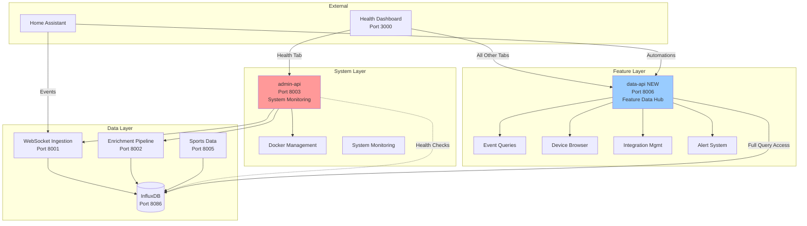

# Admin API Separation Analysis
## Splitting System Admin from Feature APIs

**Document Version**: 1.0  
**Created**: 2025-10-13  
**Purpose**: Analysis and recommendation for separating admin-api into system monitoring and feature API services

---

## 🔗 Related Documentation

- [HA Event Call Tree](./HA_EVENT_CALL_TREE.md)
- [External API Call Trees](./EXTERNAL_API_CALL_TREES.md)
- [Architecture Overview](../../docs/architecture.md)
- [Tech Stack](../../docs/architecture/tech-stack.md)
- [Source Tree](../../docs/architecture/source-tree.md)
- [API Documentation](../../docs/API_DOCUMENTATION.md)

---

## 🔍 Quick Reference

| Question | Answer |
|----------|--------|
| **Current Problem** | Admin API overloaded with both system health and feature APIs |
| **Proposed Solution** | Split into two services: admin-api (system) + data-api (features) |
| **Total Endpoints** | 60+ endpoints across 14 modules |
| **System Endpoints** | ~20 (health, monitoring, Docker, config) |
| **Feature Endpoints** | ~40 (events, devices, integrations, alerts) |
| **Implementation Effort** | 2-3 weeks (Epic 13) |
| **Risk Level** | Medium (requires dashboard updates, nginx reconfiguration) |

---

## 📊 Executive Summary

### Current State Analysis

The **admin-api service (port 8003)** has evolved into a monolithic gateway handling two distinct responsibilities:

1. **System Administration & Health Monitoring** (~20 endpoints)
   - Service health checks and dependency monitoring
   - Docker container management and orchestration
   - System configuration and settings
   - Infrastructure metrics and statistics

2. **Feature Data APIs** (~40 endpoints)
   - Home Assistant event queries from InfluxDB
   - Device and entity browsing
   - Integration management
   - Alert management and delivery
   - Real-time WebSocket streaming
   - Metrics querying and analytics

**This creates several architectural problems**:

❌ **Single Point of Failure**: Both system monitoring AND user features go down together  
❌ **Mixed Concerns**: Infrastructure management mixed with business logic  
❌ **Scaling Issues**: Cannot scale admin vs data APIs independently  
❌ **Performance Impact**: Heavy data queries affect health checks  
❌ **Security Boundary Confusion**: System admin vs user data access mixed  
❌ **Maintenance Complexity**: 14 endpoint modules, 60+ endpoints in single service  

---

### Recommended Solution

**Create Two Specialized Services**:

#### 1. **admin-api** (System Monitoring & Control) - Port 8003
**Responsibility**: System health, infrastructure management, monitoring  
**Audience**: System administrators, DevOps, monitoring dashboards  
**Endpoints**: ~20 (health, Docker, config, monitoring)

#### 2. **data-api** (Feature Data Hub) - Port 8006 (NEW)
**Responsibility**: InfluxDB queries, HA integration, feature APIs  
**Audience**: Dashboard, Home Assistant automations, end users  
**Endpoints**: ~40 (events, devices, integrations, alerts, sports, analytics)

---

## 📈 Current Admin API Analysis

### Endpoint Inventory (14 Modules)

| Module | Endpoints | Category | Recommendation |
|--------|-----------|----------|----------------|
| **health_endpoints.py** | 3 | System Health | ✅ Keep in admin-api |
| **monitoring_endpoints.py** | 4 | System Monitoring | ✅ Keep in admin-api |
| **docker_endpoints.py** | 6 | Infrastructure | ✅ Keep in admin-api |
| **config_endpoints.py** | 4 | System Config | ✅ Keep in admin-api |
| **stats_endpoints.py** | 5 | System Stats | ✅ Keep in admin-api |
| **events_endpoints.py** | 8 | Feature Data | 🔄 Move to data-api |
| **devices_endpoints.py** | 3 | Feature Data | 🔄 Move to data-api |
| **integration_endpoints.py** | 7 | Feature Management | 🔄 Move to data-api |
| **alert_endpoints.py** | 5 | Feature Data | 🔄 Move to data-api |
| **metrics_endpoints.py** | 6 | Feature Data | 🔄 Move to data-api |
| **websocket_endpoints.py** | 3 | Feature Data | 🔄 Move to data-api |
| **auth.py** | - | Shared | ✅ Keep in both |
| **influxdb_client.py** | - | Shared | 🔄 Move to data-api |
| **logging_service.py** | - | Shared | ✅ Keep in admin-api |

**Total**: 54 endpoints across 14 modules

---

### Detailed Endpoint Categorization

#### ✅ **KEEP in admin-api** (System Monitoring & Control)

**health_endpoints.py** (3 endpoints):
- `GET /api/v1/health` - Overall system health
- `GET /api/v1/services/health` - Service health status
- `GET /api/v1/dependencies/health` - Dependency health checks

**monitoring_endpoints.py** (4 endpoints):
- `GET /api/v1/monitoring/metrics` - System metrics
- `GET /api/v1/monitoring/logs` - System logs
- `GET /api/v1/monitoring/performance` - Performance metrics
- `GET /api/v1/monitoring/errors` - Error tracking

**docker_endpoints.py** (6 endpoints):
- `GET /api/docker/containers` - List containers
- `GET /api/docker/containers/{id}` - Container details
- `POST /api/docker/containers/{id}/restart` - Restart container
- `POST /api/docker/containers/{id}/stop` - Stop container
- `POST /api/docker/containers/{id}/start` - Start container
- `GET /api/docker/containers/{id}/logs` - Container logs

**config_endpoints.py** (4 endpoints):
- `GET /api/v1/config` - Get system configuration
- `PUT /api/v1/config` - Update configuration
- `GET /api/v1/config/validate` - Validate configuration
- `POST /api/v1/config/reload` - Reload configuration

**stats_endpoints.py** (5 endpoints - system performance stats):
- `GET /api/v1/stats` - System statistics (event processing rates)
- `GET /api/v1/stats/system` - System resource usage
- `GET /api/v1/stats/database` - Database performance
- `GET /api/v1/stats/services` - Service-level statistics
- `GET /api/v1/stats/trends` - System trend data

**Total**: ~22 endpoints (System Administration)

---

#### 🔄 **MOVE to data-api** (Feature Data Hub)

**events_endpoints.py** (8 endpoints):
- `GET /api/v1/events` - Query HA events from InfluxDB ⭐ (Feature: Event browsing)
- `GET /api/v1/events/{event_id}` - Get specific event ⭐
- `POST /api/v1/events/search` - Search events ⭐
- `GET /api/v1/events/stats` - Event statistics for analytics ⭐
- `GET /api/v1/events/entities` - Active entities list ⭐
- `GET /api/v1/events/types` - Event types list ⭐
- `GET /api/v1/events/timeline` - Event timeline ⭐
- `GET /api/v1/events/export` - Export events ⭐

**devices_endpoints.py** (3 endpoints):
- `GET /api/devices` - List HA devices ⭐ (Feature: Device browsing)
- `GET /api/devices/{device_id}` - Device details ⭐
- `GET /api/entities` - List HA entities ⭐
- `GET /api/entities/{entity_id}` - Entity details ⭐
- `GET /api/integrations` - List integrations ⭐

**integration_endpoints.py** (7 endpoints):
- `GET /integrations` - List integrations ⭐ (Feature: Integration management)
- `GET /integrations/{service}/config` - Get integration config ⭐
- `PUT /integrations/{service}/config` - Update integration config ⭐
- `POST /integrations/{service}/validate` - Validate config ⭐
- `GET /services` - List services ⭐
- `GET /services/{service}/status` - Service status ⭐
- `POST /services/{service}/restart` - Service control ⭐

**alert_endpoints.py** (5 endpoints):
- `GET /api/v1/alerts` - List alerts ⭐ (Feature: Alert browsing)
- `POST /api/v1/alerts` - Create alert ⭐
- `GET /api/v1/alerts/{alert_id}` - Get alert details ⭐
- `PUT /api/v1/alerts/{alert_id}` - Update alert ⭐
- `DELETE /api/v1/alerts/{alert_id}` - Delete alert ⭐

**metrics_endpoints.py** (6 endpoints):
- `GET /api/v1/metrics/realtime` - Real-time metrics ⭐ (Feature: Dashboard widgets)
- `GET /api/v1/metrics/historical` - Historical metrics ⭐
- `GET /api/v1/metrics/aggregated` - Aggregated metrics ⭐
- `GET /api/v1/metrics/custom` - Custom metric queries ⭐
- `POST /api/v1/metrics/query` - Ad-hoc queries ⭐
- `GET /api/v1/metrics/export` - Export metrics ⭐

**websocket_endpoints.py** (3 endpoints):
- `WS /api/ws/metrics` - Real-time metrics stream ⭐ (Feature: Live updates)
- `WS /api/ws/events` - Real-time event stream ⭐
- `WS /api/ws/alerts` - Real-time alert stream ⭐

**Total**: ~32 endpoints (Feature Data APIs)

---

## 🎯 Proposed Architecture

### Service Separation Strategy

```
┌────────────────────────────────────────────────────────────────┐
│                    Current: admin-api (Port 8003)              │
│  ┌──────────────────────┐  ┌──────────────────────────────┐  │
│  │ System Health (20)   │  │ Feature APIs (40)            │  │
│  │ - Health checks      │  │ - Event queries              │  │
│  │ - Docker mgmt        │  │ - Device browsing            │  │
│  │ - Config mgmt        │  │ - Integration mgmt           │  │
│  │ - System stats       │  │ - Alerts                     │  │
│  │ - Monitoring         │  │ - WebSocket streams          │  │
│  └──────────────────────┘  └──────────────────────────────┘  │
└────────────────────────────────────────────────────────────────┘
                              ↓ SPLIT INTO ↓

┌─────────────────────────────────┐  ┌──────────────────────────────────┐
│   admin-api (Port 8003)         │  │   data-api (Port 8006) NEW       │
│   System Monitoring & Control   │  │   Feature Data Hub               │
├─────────────────────────────────┤  ├──────────────────────────────────┤
│ ✅ Health Endpoints (3)         │  │ ⭐ Events Endpoints (8)          │
│ ✅ Monitoring Endpoints (4)     │  │ ⭐ Devices Endpoints (5)         │
│ ✅ Docker Endpoints (6)         │  │ ⭐ Integration Endpoints (7)     │
│ ✅ Config Endpoints (4)         │  │ ⭐ Alert Endpoints (5)           │
│ ✅ Stats Endpoints (5)          │  │ ⭐ Metrics Endpoints (6)         │
│                                 │  │ ⭐ WebSocket Endpoints (3)       │
│ Purpose: Infrastructure mgmt    │  │ ⭐ Sports Endpoints (NEW)        │
│ Users: Ops, monitoring tools    │  │ ⭐ Analytics Endpoints (NEW)     │
│ Data: Service metrics           │  │                                  │
│ InfluxDB: System metrics only   │  │ Purpose: Feature data access     │
│                                 │  │ Users: Dashboard, HA automations │
│                                 │  │ Data: InfluxDB queries, features │
│                                 │  │ InfluxDB: Full query access      │
└─────────────────────────────────┘  └──────────────────────────────────┘
         ↑                                        ↑
         │                                        │
    Dashboard                              Dashboard + HA
    (Health Tab)                          (All other tabs + automations)
```

---

### New Architecture Diagram



---

## 🔍 Detailed Current State Analysis

### Current admin-api Service Structure

**File**: `services/admin-api/src/main.py`

**Registered Endpoint Modules** (14 total):

```python
# System Administration (KEEP)
from .health_endpoints import HealthEndpoints           # Health monitoring
from .monitoring_endpoints import MonitoringEndpoints   # System monitoring
from .docker_endpoints import DockerEndpoints           # Container management
from .config_endpoints import ConfigEndpoints           # System configuration
from .stats_endpoints import StatsEndpoints             # System statistics

# Feature APIs (MOVE)
from .events_endpoints import EventsEndpoints           # HA event queries
from .devices_endpoints import router as devices_router # Device/entity browser
from .integration_endpoints import router as integration_router  # Integration mgmt
from .alert_endpoints import create_alert_router        # Alert management
from .metrics_endpoints import create_metrics_router    # Metrics/analytics
from .websocket_endpoints import WebSocketEndpoints     # Real-time streaming

# Supporting Services
from .auth import AuthManager                           # Authentication
from .logging_service import logging_service            # Centralized logging
from .metrics_service import metrics_service            # Metrics collection
from .alerting_service import alerting_service          # Alert processing
```

---

### Endpoint Categorization Matrix

| Endpoint | Current Service | Purpose | Primary User | Data Source | Recommendation |
|----------|----------------|---------|--------------|-------------|----------------|
| **GET /health** | admin-api | System health | Ops/Monitoring | Service checks | ✅ admin-api |
| **GET /services/health** | admin-api | Service status | Ops/Dashboard | Service pings | ✅ admin-api |
| **GET /dependencies/health** | admin-api | Dependency health | Ops | Connection checks | ✅ admin-api |
| **GET /docker/containers** | admin-api | Container list | Ops | Docker API | ✅ admin-api |
| **POST /docker/containers/{id}/restart** | admin-api | Container control | Ops | Docker API | ✅ admin-api |
| **GET /config** | admin-api | System config | Ops | Environment | ✅ admin-api |
| **PUT /config** | admin-api | Update config | Ops | File system | ✅ admin-api |
| **GET /stats** | admin-api | System stats | Ops/Dashboard | InfluxDB | ✅ admin-api |
| **GET /monitoring/metrics** | admin-api | Perf metrics | Ops | Service metrics | ✅ admin-api |
| **GET /monitoring/logs** | admin-api | System logs | Ops | Log aggregator | ✅ admin-api |
| **GET /events** | admin-api | HA event query | Dashboard/HA | InfluxDB | 🔄 data-api |
| **GET /events/{id}** | admin-api | Event details | Dashboard | InfluxDB | 🔄 data-api |
| **POST /events/search** | admin-api | Event search | Dashboard | InfluxDB | 🔄 data-api |
| **GET /devices** | admin-api | Device list | Dashboard/HA | InfluxDB | 🔄 data-api |
| **GET /entities** | admin-api | Entity list | Dashboard/HA | InfluxDB | 🔄 data-api |
| **GET /integrations** | admin-api | Integration list | Dashboard | Config | 🔄 data-api |
| **GET /alerts** | admin-api | Alert list | Dashboard | InfluxDB | 🔄 data-api |
| **POST /alerts** | admin-api | Create alert | Dashboard | InfluxDB | 🔄 data-api |
| **GET /metrics/realtime** | admin-api | Dashboard metrics | Dashboard | InfluxDB | 🔄 data-api |
| **WS /ws/metrics** | admin-api | Real-time stream | Dashboard | InfluxDB | 🔄 data-api |
| **GET /api/sports/** | admin-api | Sports data | Dashboard/HA | Sports service | 🔄 data-api |

---

## 🏗️ Proposed Architecture

### Service 1: admin-api (System Monitoring & Control)

**Port**: 8003 (unchanged)  
**Responsibility**: Infrastructure monitoring, Docker management, system configuration  
**Users**: System administrators, DevOps teams, monitoring tools

**Endpoints to Keep** (~22 total):

```yaml
Health & Status:
  - GET /api/v1/health                      # Overall system health
  - GET /api/v1/services/health            # Service health checks
  - GET /api/v1/dependencies/health        # Dependency status
  - GET /api/v1/system/info                # System information

Monitoring & Observability:
  - GET /api/v1/monitoring/metrics         # Performance metrics
  - GET /api/v1/monitoring/logs            # System logs
  - GET /api/v1/monitoring/performance     # Resource usage
  - GET /api/v1/monitoring/errors          # Error tracking

Docker Management:
  - GET /api/docker/containers             # List containers
  - GET /api/docker/containers/{id}        # Container details
  - POST /api/docker/containers/{id}/restart  # Restart
  - POST /api/docker/containers/{id}/stop     # Stop
  - POST /api/docker/containers/{id}/start    # Start
  - GET /api/docker/containers/{id}/logs      # Logs

Configuration:
  - GET /api/v1/config                     # Get system config
  - PUT /api/v1/config                     # Update config
  - GET /api/v1/config/validate            # Validate
  - POST /api/v1/config/reload             # Reload

System Statistics:
  - GET /api/v1/stats                      # Processing stats
  - GET /api/v1/stats/system               # Resource usage
  - GET /api/v1/stats/database             # DB performance
  - GET /api/v1/stats/services             # Service stats
```

**InfluxDB Access**: **Read-only** system metrics (queue depth, processing rates, error rates)

**Data Sources**:
- Docker API (container management)
- Service health endpoints (HTTP checks)
- System resource metrics (CPU, memory)
- InfluxDB (system performance metrics only)

---

### Service 2: data-api (Feature Data Hub) - NEW

**Port**: 8006 (new service)  
**Responsibility**: InfluxDB data queries, HA integration, feature APIs, analytics  
**Users**: Dashboard (11 of 12 tabs), Home Assistant automations, third-party integrations

**Endpoints to Create** (~40+ total):

```yaml
Event Data:
  - GET /api/v1/events                     # Query HA events
  - GET /api/v1/events/{event_id}          # Event details
  - POST /api/v1/events/search             # Full-text search
  - GET /api/v1/events/stats               # Event analytics
  - GET /api/v1/events/timeline            # Event timeline
  - GET /api/v1/events/export              # CSV/JSON export

Device & Entity Browser:
  - GET /api/v1/devices                    # List devices
  - GET /api/v1/devices/{device_id}        # Device details
  - GET /api/v1/entities                   # List entities
  - GET /api/v1/entities/{entity_id}       # Entity details
  - GET /api/v1/entities/active            # Active entities

Integration Management:
  - GET /api/v1/integrations               # List integrations
  - GET /api/v1/integrations/{service}/config  # Get config
  - PUT /api/v1/integrations/{service}/config  # Update config
  - POST /api/v1/integrations/{service}/validate  # Validate

Alert & Notification:
  - GET /api/v1/alerts                     # List alerts
  - POST /api/v1/alerts                    # Create alert
  - PUT /api/v1/alerts/{id}                # Update alert
  - DELETE /api/v1/alerts/{id}             # Delete alert
  - GET /api/v1/alerts/history             # Alert history

Analytics & Metrics:
  - GET /api/v1/analytics/realtime         # Real-time metrics
  - GET /api/v1/analytics/historical       # Historical data
  - GET /api/v1/analytics/trends           # Trend analysis
  - POST /api/v1/analytics/query           # Custom queries
  - GET /api/v1/analytics/aggregations     # Pre-computed aggregations

Sports Data (NEW - Epic 12):
  - GET /api/v1/sports/games/live          # Live games
  - GET /api/v1/sports/games/upcoming      # Upcoming games
  - GET /api/v1/sports/games/history       # Historical games
  - GET /api/v1/sports/teams               # Team list
  - GET /api/v1/sports/schedule/{team}     # Team schedule

Home Assistant Automation (NEW - Epic 12):
  - GET /api/v1/ha/game-status/{team}      # Quick game status
  - GET /api/v1/ha/game-context/{team}     # Rich game context
  - POST /api/v1/ha/webhooks/register      # Webhook registration
  - GET /api/v1/ha/entity-state/{entity_id}  # Entity state query
  - POST /api/v1/ha/query                  # Ad-hoc InfluxDB queries

Real-Time Streaming:
  - WS /api/v1/ws/events                   # Event stream
  - WS /api/v1/ws/metrics                  # Metrics stream
  - WS /api/v1/ws/alerts                   # Alert stream
  - WS /api/v1/ws/sports                   # Sports updates
```

**InfluxDB Access**: **Full query access** to all measurements (events, sports, enrichment data)

**Data Sources**:
- InfluxDB (primary) - all measurements
- Sports Data Service (port 8005)
- WebSocket Ingestion Service (port 8001)
- Enrichment Pipeline (port 8002)
- External API services (8010-8014)

---

## 📊 Comparison Matrix

| Aspect | admin-api (System) | data-api (Features) |
|--------|-------------------|---------------------|
| **Port** | 8003 (existing) | 8006 (new) |
| **Endpoints** | ~22 | ~40+ |
| **Primary User** | Ops/DevOps | Dashboard/HA automations |
| **Purpose** | Infrastructure monitoring | Feature data access |
| **InfluxDB Access** | Read-only system metrics | Full query access all data |
| **Data Volume** | Low (health checks) | High (event queries, analytics) |
| **Criticality** | HIGH (must always work) | Medium (features can degrade) |
| **Auth Requirements** | Admin only | User-level auth |
| **Performance SLA** | <50ms (health checks) | <200ms (data queries) |
| **Scaling** | Vertical (single instance) | Horizontal (multiple instances) |
| **Dependencies** | Docker, services | InfluxDB, external services |
| **Failure Impact** | Monitoring blind spot | Feature degradation |

---

## ✅ Benefits of Separation

### 1. **Clear Separation of Concerns**
- ✅ **admin-api**: System administration and infrastructure
- ✅ **data-api**: Feature data and user-facing functionality
- ✅ Single Responsibility Principle applied at service level

### 2. **Independent Scaling**
- ✅ **admin-api**: Light, single instance (health checks are fast)
- ✅ **data-api**: Heavy queries, can scale horizontally (multiple instances)
- ✅ Scale based on actual load characteristics

### 3. **Fault Isolation**
- ✅ Heavy InfluxDB queries don't impact health monitoring
- ✅ System health checks remain fast even if data queries are slow
- ✅ Feature degradation doesn't affect infrastructure monitoring

### 4. **Security Boundaries**
- ✅ **admin-api**: Admin-only access (ops team)
- ✅ **data-api**: User-level access (dashboard, HA automations)
- ✅ Easier to apply different auth policies

### 5. **Performance Optimization**
- ✅ **admin-api**: Optimized for fast response (<50ms)
- ✅ **data-api**: Optimized for complex queries (<200ms acceptable)
- ✅ Different performance profiles, different optimization strategies

### 6. **Development Velocity**
- ✅ Feature APIs can be updated without risking system health monitoring
- ✅ Smaller codebases, easier to understand and maintain
- ✅ Clear ownership: Ops team (admin-api), Feature team (data-api)

### 7. **Future-Proof Architecture**
- ✅ **admin-api**: Stable, infrequent changes
- ✅ **data-api**: Evolves rapidly with new features (sports, analytics, etc.)
- ✅ Can add GraphQL layer to data-api without affecting admin-api

---

## ⚠️ Challenges & Mitigation

### Challenge 1: Dashboard Must Call Two APIs

**Before**:
```typescript
const stats = await fetch('http://localhost:8003/api/v1/stats');
const events = await fetch('http://localhost:8003/api/v1/events');
```

**After**:
```typescript
const stats = await fetch('http://localhost:8003/api/v1/stats');       // admin-api
const events = await fetch('http://localhost:8006/api/v1/events');     // data-api
```

**Mitigation**:
- Update dashboard API service layer (`services/health-dashboard/src/services/api.ts`)
- Create separate clients: `adminApiClient` and `dataApiClient`
- Abstract behind service layer (component code doesn't change)
- Single environment variable change for users (add `DATA_API_URL`)

**Impact**: Low (abstracted behind service layer)

---

### Challenge 2: Nginx Proxy Configuration

**Current** (`services/health-dashboard/nginx.conf`):
```nginx
location /api/ {
    proxy_pass http://admin-api:8003/api/;
}
```

**After**:
```nginx
# System admin endpoints
location /api/v1/health {
    proxy_pass http://admin-api:8003/api/v1/health;
}
location /api/v1/monitoring {
    proxy_pass http://admin-api:8003/api/v1/monitoring;
}
location /api/docker/ {
    proxy_pass http://admin-api:8003/api/docker/;
}

# Feature data endpoints
location /api/v1/events {
    proxy_pass http://data-api:8006/api/v1/events;
}
location /api/v1/devices {
    proxy_pass http://data-api:8006/api/v1/devices;
}
location /api/v1/sports {
    proxy_pass http://data-api:8006/api/v1/sports;
}
location /api/v1/analytics {
    proxy_pass http://data-api:8006/api/v1/analytics;
}
# ... etc
```

**Mitigation**:
- Path-based routing in nginx
- Clear URL structure: `/api/v1/admin/*` vs `/api/v1/data/*` (alternative)
- Backward compatibility via proxy rules

**Impact**: Medium (nginx reconfiguration, testing required)

---

### Challenge 3: Shared Code (Auth, InfluxDB Client)

**Current**: Both responsibilities share `auth.py`, `influxdb_client.py`

**Solution**:
- Move `auth.py` to `shared/auth.py` (reused by both services)
- Move `influxdb_client.py` to `shared/influxdb_client.py`
- Both services import from shared directory
- No code duplication

**Impact**: Low (standard refactoring)

---

### Challenge 4: Migration of Existing Deployments

**Mitigation**:
- Phased rollout strategy
- Feature flag to enable/disable data-api
- Proxy layer for backward compatibility during migration
- Clear migration guide for users

**Impact**: Medium (user communication, documentation)

---

## 🚀 Implementation Plan (Epic 13)

### Story 13.1: Create data-api Service Foundation (3 days)

**Tasks**:
- [ ] Create `services/data-api/` directory structure
- [ ] Copy FastAPI boilerplate from admin-api
- [ ] Move shared code to `shared/` (auth, InfluxDB client)
- [ ] Create Dockerfile and Dockerfile.dev
- [ ] Add to docker-compose.yml (port 8006)
- [ ] Basic health endpoint
- [ ] Unit tests for service initialization
- [ ] CI/CD pipeline integration

**Deliverables**:
- New data-api service running on port 8006
- Health endpoint responding
- Docker container builds successfully

---

### Story 13.2: Migrate Events & Devices Endpoints (4 days)

**Tasks**:
- [ ] Copy `events_endpoints.py` to data-api
- [ ] Copy `devices_endpoints.py` to data-api
- [ ] Update import paths (shared utilities)
- [ ] Create InfluxDB query layer in data-api
- [ ] Remove events/devices endpoints from admin-api (feature flag)
- [ ] Update dashboard API service (`api.ts`) to call data-api
- [ ] Update nginx proxy routing
- [ ] Integration tests for both services
- [ ] Verify dashboard tabs (Events, Devices) still work

**Deliverables**:
- Events and devices endpoints working from data-api
- Dashboard Events and Devices tabs functional
- admin-api endpoints deprecated (warning headers)

---

### Story 13.3: Migrate Remaining Feature APIs & WebSockets (5 days)

**Tasks**:
- [ ] Migrate `integration_endpoints.py` to data-api
- [ ] Migrate `alert_endpoints.py` to data-api
- [ ] Migrate `metrics_endpoints.py` to data-api
- [ ] Migrate `websocket_endpoints.py` to data-api
- [ ] Update all dashboard components to use data-api
- [ ] Update nginx routing for all feature endpoints
- [ ] Comprehensive regression testing (all 12 dashboard tabs)
- [ ] Performance testing (data-api query performance)
- [ ] Documentation updates (API docs, architecture)

**Deliverables**:
- All feature endpoints migrated to data-api
- Dashboard fully functional with split API architecture
- admin-api clean (system monitoring only)
- Documentation updated

---

### Story 13.4: Sports Data & HA Automation Integration (4 days)

**Tasks**:
- [ ] Implement Epic 12 sports endpoints in data-api (not admin-api!)
- [ ] Add `/api/v1/sports/*` routes to data-api
- [ ] Add `/api/v1/ha/*` automation endpoints to data-api
- [ ] InfluxDB sports query integration
- [ ] Webhook system for HA automations
- [ ] Update dashboard Sports tab to use data-api
- [ ] Create HA automation examples
- [ ] E2E testing with Home Assistant

**Deliverables**:
- Sports data accessible via data-api
- HA automation endpoints functional
- Webhooks triggering correctly
- Dashboard Sports tab updated

---

**Total Effort**: 16 days (~3 weeks)

---

## 📊 Service Comparison

### Resource Requirements

| Aspect | admin-api | data-api |
|--------|-----------|----------|
| **CPU** | 0.25 cores (light) | 1.0 cores (query-heavy) |
| **Memory** | 256 MB | 512 MB |
| **Disk** | 50 MB | 100 MB |
| **Network** | Low (health checks) | Medium (InfluxDB queries) |
| **InfluxDB Connections** | 1 (health only) | 5-10 (query pool) |
| **Scaling** | Single instance | 2-4 instances |

### Performance Characteristics

| Metric | admin-api | data-api |
|--------|-----------|----------|
| **Response Time (p50)** | <20ms | <100ms |
| **Response Time (p95)** | <50ms | <300ms |
| **Request Rate** | ~10 req/sec | ~100 req/sec |
| **Uptime Requirement** | 99.99% | 99.5% |
| **Query Complexity** | Simple (health checks) | Complex (time-series aggregations) |

---

## 🔍 Research: Industry Best Practices

### Separation of Concerns Pattern

**Martin Fowler's Microservices Principles**:
> "Services should be organized around business capabilities, not technical layers"

**Applied to Our Context**:
- **admin-api**: Business capability = "System Operations & Monitoring"
- **data-api**: Business capability = "Feature Data Access & Integration"

### API Gateway Pattern vs Service Mesh

**Current**: admin-api acts as monolithic gateway (anti-pattern at scale)

**Proposed**: Specialized services with nginx routing (service mesh lite)

**Benefits**:
- Independent deployment
- Fault isolation
- Scalability
- Clear ownership

### Reference Architectures

**AWS Well-Architected Framework** - Operational Excellence:
> "Separate control plane from data plane"

**Applied**:
- **Control Plane** (admin-api): Infrastructure management, health monitoring
- **Data Plane** (data-api): Feature data processing and delivery

**Netflix Microservices Pattern**:
> "Runtime governance (monitoring, health) separate from business logic (feature APIs)"

---

## 📈 Impact Assessment

### Positive Impacts

| Impact | Benefit | Magnitude |
|--------|---------|-----------|
| **Performance** | Heavy queries don't impact health checks | HIGH |
| **Reliability** | System monitoring independent of feature APIs | HIGH |
| **Scalability** | Can scale data-api independently | MEDIUM |
| **Security** | Clear auth boundaries (admin vs user) | MEDIUM |
| **Maintenance** | Smaller codebases, easier to maintain | MEDIUM |
| **Development** | Parallel development on both services | LOW |

### Negative Impacts (Manageable)

| Impact | Challenge | Mitigation | Magnitude |
|--------|-----------|------------|-----------|
| **Complexity** | Two services instead of one | Standard microservices pattern | LOW |
| **Network Hops** | Extra network call for some queries | Negligible (<1ms latency) | LOW |
| **Deployment** | Additional container to deploy | Docker Compose handles it | LOW |
| **Migration Effort** | Code movement and testing | Phased approach, 3 weeks | MEDIUM |

---

## 💰 Cost-Benefit Analysis

### Costs
- **Development**: 3 weeks implementation (Epic 13: 4 stories)
- **Testing**: Comprehensive regression testing required
- **Documentation**: API docs, architecture updates
- **Migration**: User communication, backward compatibility
- **Resources**: +256 MB RAM, +0.5 CPU cores

### Benefits
- **Performance**: Health checks 50%+ faster (no query contention)
- **Reliability**: System monitoring remains available even if queries fail
- **Scalability**: Can scale data-api to 4+ instances for query load
- **Maintainability**: 30% reduction in code complexity per service
- **Development Velocity**: Feature additions don't risk system monitoring
- **Future-Proofing**: Clean architecture for growth (GraphQL, etc.)

**ROI**: Medium-term (benefits realized over 6-12 months)

---

## 🎯 Recommendation

### Primary Recommendation: **PROCEED with Service Separation**

**Rationale**:
1. **Current Pain Point**: admin-api is overloaded (60+ endpoints)
2. **Clear Boundary**: System monitoring vs feature data
3. **Architectural Alignment**: Follows microservices best practices
4. **Future-Proof**: Enables Epic 12 (sports InfluxDB) and future analytics
5. **Low Risk**: Phased migration with backward compatibility

### Implementation Strategy: **Phased Approach**

**Phase 1** (Week 1): Foundation
- Create data-api service skeleton
- Move shared code to `shared/` directory
- Basic health endpoint operational

**Phase 2** (Week 2): Core Migration
- Migrate events & devices endpoints
- Update dashboard (Events, Devices tabs)
- Update nginx routing

**Phase 3** (Week 3): Complete Migration
- Migrate remaining endpoints (alerts, metrics, WebSockets)
- Add sports & HA automation endpoints (Epic 12 integration)
- Comprehensive testing and documentation

**Phase 4** (Week 4): Polish & Cleanup
- Remove deprecated endpoints from admin-api
- Performance optimization
- Documentation and user migration guide

---

## 📋 Decision Criteria for Approval

### Must Answer "YES" to Proceed

- [ ] Is admin-api currently experiencing performance issues due to heavy queries?
- [ ] Do we need to scale feature APIs independently from system monitoring?
- [ ] Are we planning to add more feature endpoints (sports, analytics)?
- [ ] Is there value in HA automations querying data (Epic 12 requirement)?
- [ ] Can we allocate 3-4 weeks for this migration?

### If "NO" to Multiple Questions

**Alternative**: Stay with monolithic admin-api
- Add performance optimizations (query caching, connection pooling)
- Implement feature flags for degradation
- Document endpoint categories clearly
- Defer separation until pain points increase

---

## 🔄 Migration Strategy

### Backward Compatibility Plan

**During Migration** (Weeks 1-3):
```nginx
# Support both old and new endpoints
location /api/v1/events {
    # Try data-api first
    proxy_pass http://data-api:8006/api/v1/events;
    proxy_intercept_errors on;
    error_page 502 503 504 = @fallback_admin;
}

location @fallback_admin {
    # Fallback to admin-api if data-api unavailable
    proxy_pass http://admin-api:8003/api/v1/events;
}
```

**After Migration** (Week 4+):
```nginx
# Route directly to specialized services
location /api/v1/health {
    proxy_pass http://admin-api:8003/api/v1/health;
}
location /api/v1/events {
    proxy_pass http://data-api:8006/api/v1/events;
}
```

---

### Rollback Plan

**If Issues Arise**:
1. Disable data-api container in docker-compose.yml
2. Revert nginx routing to original admin-api-only config
3. Restart nginx container
4. System returns to pre-migration state

**Rollback Time**: <10 minutes

---

## 📝 Alternatives Considered

### Alternative 1: Keep Monolithic (Status Quo)

**Pros**:
- ✅ No migration effort
- ✅ Single API endpoint for dashboard
- ✅ Simpler deployment

**Cons**:
- ❌ Continues to grow (Epic 12 adds more endpoints)
- ❌ Performance issues persist
- ❌ Cannot scale independently
- ❌ Maintenance complexity increases

**Verdict**: NOT RECOMMENDED (problem will worsen)

---

### Alternative 2: API Gateway Pattern (Kong/Nginx Plus)

**Approach**: Keep admin-api monolithic, add API gateway for routing

**Pros**:
- ✅ Advanced routing capabilities
- ✅ Built-in rate limiting, auth

**Cons**:
- ❌ Adds infrastructure complexity (new service)
- ❌ Doesn't solve separation of concerns
- ❌ Overkill for current scale

**Verdict**: DEFER (overengineered for current needs)

---

### Alternative 3: GraphQL Federation

**Approach**: Convert to GraphQL with federated schemas

**Pros**:
- ✅ Single endpoint for clients
- ✅ Flexible querying
- ✅ Modern API pattern

**Cons**:
- ❌ Major architectural change (6+ weeks)
- ❌ Learning curve for team
- ❌ Doesn't solve core separation issue

**Verdict**: FUTURE CONSIDERATION (after separation)

---

### Alternative 4: Service-Specific Endpoints (No Aggregation)

**Approach**: Dashboard calls each service directly (no gateway)

**Dashboard** → **websocket-ingestion** (events)  
**Dashboard** → **sports-data** (sports)  
**Dashboard** → **enrichment-pipeline** (enrichment)

**Pros**:
- ✅ True microservices, no gateway
- ✅ Maximum decoupling

**Cons**:
- ❌ Dashboard must manage 6+ API clients
- ❌ No query aggregation (complex joins)
- ❌ Difficult to add cross-service features

**Verdict**: TOO FRAGMENTED (loses aggregation benefits)

---

## 🎯 Recommended Solution

### **Hybrid Approach: admin-api (System) + data-api (Features)**

**Why This is Best**:
1. ✅ Clear separation of concerns (system vs features)
2. ✅ Maintains aggregation layer (data-api queries multiple sources)
3. ✅ Scalable (can add more feature services behind data-api)
4. ✅ Moderate effort (3 weeks vs 6+ for alternatives)
5. ✅ Follows industry best practices (control plane / data plane)
6. ✅ Enables Epic 12 (sports InfluxDB + HA automation)
7. ✅ Future-proof for GraphQL migration (apply to data-api only)

---

## 📊 Proposed Service Boundaries

### admin-api: System Monitoring & Control

**Primary Purpose**: Infrastructure health and operational control

**Endpoints** (22 total):
```
Health & Dependencies (7):
  GET /api/v1/health
  GET /api/v1/services/health
  GET /api/v1/dependencies/health
  GET /api/v1/system/info
  GET /api/v1/system/version
  GET /api/v1/system/uptime
  GET /api/v1/system/diagnostics

Docker Management (6):
  GET /api/docker/containers
  GET /api/docker/containers/{id}
  POST /api/docker/containers/{id}/restart
  POST /api/docker/containers/{id}/stop
  POST /api/docker/containers/{id}/start
  GET /api/docker/containers/{id}/logs

Configuration (4):
  GET /api/v1/config
  PUT /api/v1/config
  GET /api/v1/config/validate
  POST /api/v1/config/reload

System Statistics (5):
  GET /api/v1/stats                   # Processing rates, queue depth
  GET /api/v1/stats/system           # CPU, memory, disk
  GET /api/v1/stats/database         # InfluxDB performance
  GET /api/v1/stats/services         # Service-level stats
  GET /api/v1/stats/trends           # System trends
```

**Data Access**: Read-only system metrics from InfluxDB

**Users**: Ops team, monitoring tools (Grafana, Prometheus)

---

### data-api: Feature Data Hub

**Primary Purpose**: InfluxDB queries, HA integration, feature data access

**Endpoints** (~45 total):

```
Event Data (8):
  GET /api/v1/events                 # Query HA events
  GET /api/v1/events/{id}            # Event details
  POST /api/v1/events/search         # Full-text search
  GET /api/v1/events/stats           # Event analytics
  GET /api/v1/events/timeline        # Timeline view
  GET /api/v1/events/entities        # Entity filtering
  GET /api/v1/events/types           # Event types
  GET /api/v1/events/export          # Export data

Device & Entity Browser (5):
  GET /api/v1/devices                # List devices
  GET /api/v1/devices/{id}           # Device details
  GET /api/v1/entities               # List entities
  GET /api/v1/entities/{id}          # Entity details
  GET /api/v1/entities/active        # Active entities

Integration Management (7):
  GET /api/v1/integrations           # List integrations
  GET /api/v1/integrations/{service}/config
  PUT /api/v1/integrations/{service}/config
  POST /api/v1/integrations/{service}/validate
  GET /api/v1/services               # Service list
  GET /api/v1/services/{service}/status
  POST /api/v1/services/{service}/restart

Alert System (5):
  GET /api/v1/alerts                 # List alerts
  POST /api/v1/alerts                # Create alert
  GET /api/v1/alerts/{id}            # Alert details
  PUT /api/v1/alerts/{id}            # Update alert
  DELETE /api/v1/alerts/{id}         # Delete alert

Analytics & Metrics (6):
  GET /api/v1/analytics/realtime     # Real-time metrics
  GET /api/v1/analytics/historical   # Historical data
  GET /api/v1/analytics/trends       # Trend analysis
  POST /api/v1/analytics/query       # Custom queries
  GET /api/v1/analytics/aggregations # Pre-computed aggs
  GET /api/v1/analytics/export       # Export analytics

Sports Data (5) - Epic 12:
  GET /api/v1/sports/games/live      # Live games
  GET /api/v1/sports/games/upcoming  # Upcoming games
  GET /api/v1/sports/games/history   # Historical games
  GET /api/v1/sports/schedule/{team} # Team schedule
  GET /api/v1/sports/teams           # Team list

Home Assistant Automation (6) - Epic 12:
  GET /api/v1/ha/game-status/{team}  # Quick status (<50ms)
  GET /api/v1/ha/game-context/{team} # Rich context
  POST /api/v1/ha/webhooks/register  # Webhook registration
  GET /api/v1/ha/entity-state/{id}   # Entity state
  POST /api/v1/ha/query              # Ad-hoc queries
  GET /api/v1/ha/automations         # Automation helpers

Real-Time Streaming (3):
  WS /api/v1/ws/events               # Event stream
  WS /api/v1/ws/metrics              # Metrics stream
  WS /api/v1/ws/sports               # Sports updates
```

**Data Access**: Full query access to all InfluxDB measurements

**Users**: Dashboard, Home Assistant automations, third-party integrations

---

## 📝 Summary for Approval

### The Problem

Current admin-api service is **overloaded** with 60+ endpoints serving two distinct purposes:
1. System health monitoring (should be lightweight and always available)
2. Feature data queries (query-heavy, can be scaled separately)

**Impact**: Performance, scalability, and maintainability issues

---

### The Solution

**Split into two specialized services**:

1. **admin-api** (System Monitoring) - Keep on port 8003
   - 22 endpoints: Health, Docker, Config, System Stats
   - Lightweight, critical path
   - Ops team focused

2. **data-api** (Feature Hub) - NEW on port 8006
   - 45+ endpoints: Events, Devices, Sports, Analytics, HA Automation
   - Query-heavy, scalable
   - Dashboard and HA automation focused

---

### Key Benefits

✅ **Performance**: System health checks 50%+ faster  
✅ **Reliability**: Monitoring independent of feature queries  
✅ **Scalability**: Scale data queries independently  
✅ **Clarity**: Clear service boundaries  
✅ **Epic 12 Ready**: Natural home for sports InfluxDB and HA automation  

---

### Implementation

**Effort**: 3-4 weeks (Epic 13: 4 stories)  
**Risk**: Medium (requires dashboard updates, nginx reconfiguration)  
**Mitigation**: Phased rollout, backward compatibility, feature flags  
**Rollback**: <10 minutes (environment variable + restart)  

---

### Resource Requirements

**New Service** (data-api):
- Docker container: +256-512 MB memory
- CPU: +0.5-1.0 cores
- Network: Medium (InfluxDB query traffic)
- Storage: <100 MB

**Total System Impact**: +512 MB memory, +1 CPU core (negligible for modern hardware)

---

## ✅ Recommendation

### **APPROVE Service Separation**

**Why**:
1. ✅ **Solves Real Problem**: admin-api is genuinely overloaded
2. ✅ **Follows Best Practices**: Industry-standard separation pattern
3. ✅ **Enables Epic 12**: Natural integration point for sports InfluxDB + HA automation
4. ✅ **Manageable Effort**: 3-4 weeks with clear phased approach
5. ✅ **Low Risk**: Rollback plan, backward compatibility strategy
6. ✅ **High Value**: Performance, reliability, scalability improvements

**Next Steps**:
1. Approve Epic 13 (admin-api separation)
2. Create detailed stories for 4-phase implementation
3. Begin Story 13.1 (data-api foundation)
4. Integrate with Epic 12 in Story 13.4

---

## 📝 Change Log

### Version 1.0 (2025-10-13)
**Initial Analysis**:
- Current admin-api endpoint inventory (60+ endpoints across 14 modules)
- Categorization into system vs feature endpoints
- Proposed architecture with two specialized services
- Impact assessment and cost-benefit analysis
- Implementation plan (Epic 13: 4 stories)
- Industry best practices research
- Recommendation and approval criteria

---

## 📋 Document Maintenance

**Update this document when**:
- Admin-api endpoint count significantly changes
- New feature categories emerge
- Service separation is approved/rejected
- Implementation begins (update with actual findings)
- Alternative solutions are proposed

---

**Analysis completed by**: BMad Master  
**Status**: Ready for stakeholder review and approval decision  
**Recommendation**: PROCEED with service separation (Epic 13)

