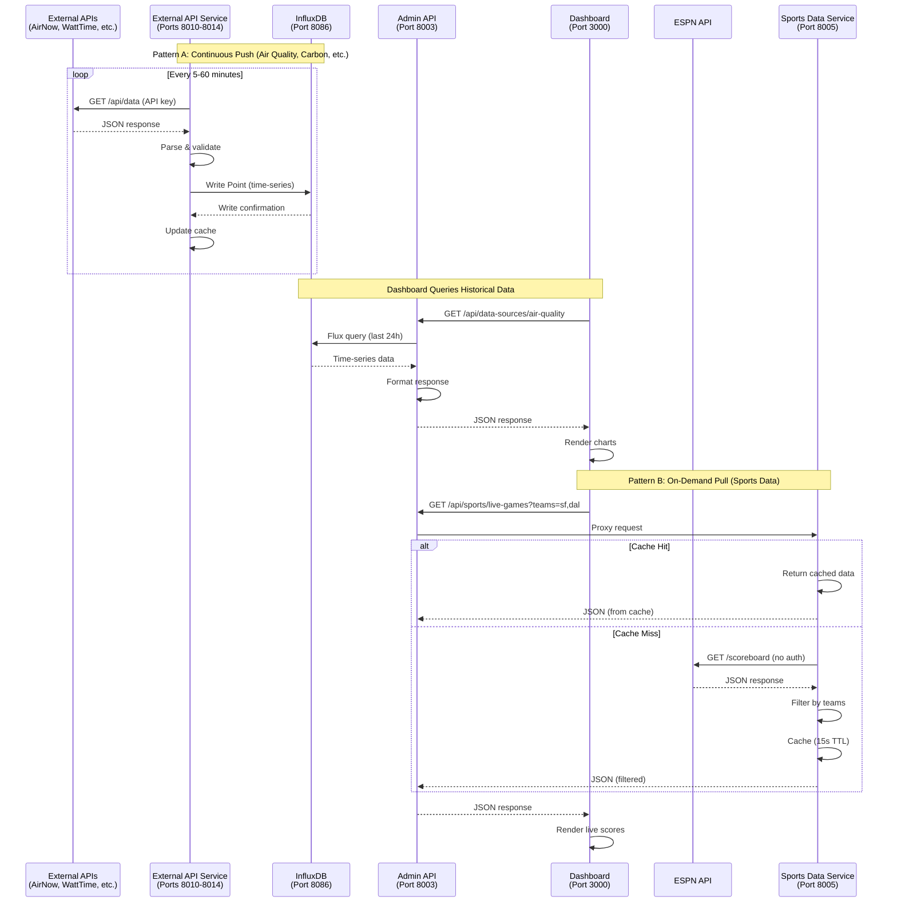

# External API Services Call Tree Analysis
## Dashboard → Admin API → External Data Sources

**Document Version**: 1.1  
**Created**: 2025-10-13  
**Last Updated**: 2025-10-13 (Epic 13 - data-api separation)  
**Purpose**: Detailed call trees for all external API services showing complete data flow patterns

> **Epic 13 Update**: External API queries now routed through **data-api:8006** instead of admin-api:8003
> - Sports data queries: `data-api:8006/api/v1/sports/*`
> - Historical data queries moved to data-api for better scalability
> - admin-api now focuses solely on system monitoring

---

## 🔗 Related Documentation

- [HA Event Call Tree](./HA_EVENT_CALL_TREE.md)
- [Architecture Overview](../../docs/architecture.md)
- [Tech Stack](../../docs/architecture/tech-stack.md)
- [Source Tree Structure](../../docs/architecture/source-tree.md)
- [Data Models](../../docs/architecture/data-models.md)
- [API Documentation](../../docs/API_DOCUMENTATION.md)

---

## 🔍 Quick Reference

| Question | Answer | Section |
|----------|--------|---------|
| How many external services? | 6 services | [Service Catalog](#-service-catalog) |
| What are the two patterns? | Push (continuous) & Pull (on-demand) | [Overview](#-overview) |
| Which services push to InfluxDB? | Air Quality, Carbon, Electricity, Smart Meter, Calendar | [Pattern A](#pattern-a-continuous-push-to-influxdb) |
| Which services use direct queries? | Sports Data | [Pattern B](#pattern-b-on-demand-pull-queries) |
| How often do services fetch data? | 5-60 minutes (varies by service) | [Service Details](#-service-specific-call-trees) |
| Are caching strategies used? | Yes, all services implement caching | [Caching](#-caching-strategies) |
| How to query external data? | Via **data-api** endpoints (Epic 13) | [API Layer](#phase-3-data-api-gateway-epic-13) |

---

## 🔌 Service Ports Reference

| Service | Port | Purpose | Data Pattern | Fetch Interval | Required |
|---------|------|---------|--------------|----------------|----------|
| **data-api** | **8006** | **Feature data hub (queries)** | **API Gateway** | **Per request** | **Yes** |
| admin-api | 8003 | System monitoring & control | API Gateway | Per request | Yes |
| sports-data | 8005 | NFL/NHL game data (cache) | Pull (on-demand) | Per request | Optional |
| air-quality-service | 8012 | AQI from AirNow API | Push (continuous) | 60 min | Optional |
| carbon-intensity-service | 8010 | Grid carbon from WattTime | Push (continuous) | 15 min | Optional |
| electricity-pricing-service | 8011 | Real-time pricing | Push (continuous) | 60 min | Optional |
| calendar-service | 8013 | Google Calendar occupancy | Push (continuous) | 15 min | Optional |
| smart-meter-service | 8014 | Power consumption | Push (continuous) | 5 min | Optional |

**Note**: As of Epic 13, data-api handles all feature queries (sports, events, devices), while admin-api handles system monitoring.

---

## 📊 Overview

External API services integrate third-party data sources into the Home Assistant Ingestor system. These services follow two distinct patterns based on their data characteristics and usage patterns.

### Two Data Flow Patterns

#### Pattern A: Continuous Push to InfluxDB
**Services**: Air Quality, Carbon Intensity, Electricity Pricing, Smart Meter, Calendar

```
External API → Service (periodic fetch) → InfluxDB → Admin API → Dashboard
```

**Characteristics**:
- **Continuous Operation**: Services run background loops
- **Periodic Fetching**: Data fetched at regular intervals (5-60 min)
- **InfluxDB Storage**: Data persisted for historical queries
- **Caching**: Short-term cache for API failures
- **Use Case**: Time-series data, trending, historical analysis

#### Pattern B: On-Demand Pull Queries
**Services**: Sports Data

```
Dashboard → Admin API → Service → External API (if cache miss) → Response
```

**Characteristics**:
- **Request-Driven**: Data fetched only when requested
- **Short-TTL Cache**: 15-second cache for live games, 5-minute for upcoming
- **No InfluxDB Storage**: Transient data, not persisted
- **Low API Usage**: Optimized to stay within free tier limits
- **Use Case**: Real-time data that changes frequently

---

### Architecture Overview Diagram

```
┌─────────────────────────────────────────────────────────────┐
│                      External APIs                          │
│  AirNow │ WattTime │ Awattar │ ESPN │ Google │ Smart Meter │
└────┬─────────┬─────────┬────────┬───────┬──────────┬────────┘
     │         │         │        │       │          │
     │ Pattern A: Continuous Push  │       │ Pattern B: Pull  │
     │ (60min) │ (15min) │ (60min)│(5min) │ (15min)  │(on-demand)
     ▼         ▼         ▼        ▼       ▼          ▼
┌────────────────────────────────────┐   ┌─────────────────────┐
│    External API Services           │   │   Sports Data       │
│  (Ports: 8010-8014)               │   │   Service (8005)    │
│  - Periodic fetching               │   │   - On-demand only  │
│  - Background loops                │   │   - Cache-first     │
│  - Error handling                  │   │   - No persistence  │
└────────┬───────────────────────────┘   └──────────┬──────────┘
         │                                           │
         │ Write continuously                        │ No write
         ▼                                           │
┌────────────────────────────────────┐              │
│      InfluxDB (Port 8086)         │              │
│  Measurements:                     │              │
│   - air_quality                    │              │
│   - carbon_intensity               │              │
│   - electricity_pricing            │              │
│   - smart_meter                    │              │
│   - occupancy_prediction           │              │
└────────┬───────────────────────────┘              │
         │ Flux queries                             │ HTTP GET
         ▼                                           ▼
┌──────────────────────────────────────────────────────────────┐
│         Admin API Service (Port 8003)                        │
│  - Gateway for all external data                             │
│  - Query InfluxDB for historical data                        │
│  - Proxy requests to sports-data service                     │
│  - Aggregation and formatting                                │
└────────┬─────────────────────────────────────────────────────┘
         │ HTTP/REST
         ▼
┌──────────────────────────────────────────────────────────────┐
│         Health Dashboard (Port 3000)                         │
│  Tabs consuming external data:                               │
│   - Overview: All metrics summary                            │
│   - Sports: Live games (sports-data)                         │
│   - Data Sources: Air quality, carbon, pricing, smart meter  │
│   - Analytics: Historical trends from InfluxDB               │
└──────────────────────────────────────────────────────────────┘
```

---

### Sequence Diagram (Mermaid)



---

## 🗂️ Service Catalog

### 1. Sports Data Service (Port 8005)
- **Provider**: ESPN API (Free, no API key)
- **Sports**: NFL, NHL
- **Pattern**: Pull (on-demand)
- **Features**: Team filtering, live scores, upcoming games
- **Caching**: 15s (live), 5min (upcoming)
- **Storage**: None (transient)

### 2. Air Quality Service (Port 8012)
- **Provider**: AirNow API
- **Data**: AQI, PM2.5, PM10, Ozone
- **Pattern**: Push (continuous)
- **Fetch Interval**: 60 minutes
- **Measurement**: `air_quality`
- **Retention**: 1 year

### 3. Carbon Intensity Service (Port 8010)
- **Provider**: WattTime API
- **Data**: Grid carbon intensity, renewable percentage
- **Pattern**: Push (continuous)
- **Fetch Interval**: 15 minutes
- **Measurement**: `carbon_intensity`
- **Retention**: 1 year

### 4. Electricity Pricing Service (Port 8011)
- **Provider**: Awattar API (configurable)
- **Data**: Real-time pricing, peak periods, forecasts
- **Pattern**: Push (continuous)
- **Fetch Interval**: 60 minutes
- **Measurement**: `electricity_pricing`
- **Retention**: 1 year

### 5. Smart Meter Service (Port 8014)
- **Provider**: Generic adapter (configurable)
- **Data**: Whole-home power, circuit-level consumption
- **Pattern**: Push (continuous)
- **Fetch Interval**: 5 minutes
- **Measurement**: `smart_meter`, `smart_meter_circuit`
- **Retention**: 1 year

### 6. Calendar Service (Port 8013)
- **Provider**: Google Calendar API
- **Data**: Occupancy prediction, WFH status
- **Pattern**: Push (continuous)
- **Fetch Interval**: 15 minutes
- **Measurement**: `occupancy_prediction`
- **Retention**: 90 days

---

## 🔄 Detailed Call Trees

### Pattern A: Continuous Push to InfluxDB

This pattern applies to: **Air Quality**, **Carbon Intensity**, **Electricity Pricing**, **Smart Meter**, **Calendar**

---

## 📈 Service-Specific Call Trees

### Service 1: Air Quality Service (Port 8012)

#### Phase 1: Service Initialization

**File**: `services/air-quality-service/src/main.py`

```python
main()
└─► logger.info("Starting Air Quality Service...")
    └─► AirQualityService.__init__()
        ├─► Load environment variables
        │   ├─► AIRNOW_API_KEY (required)
        │   ├─► LATITUDE, LONGITUDE (location)
        │   ├─► INFLUXDB_TOKEN, INFLUXDB_URL
        │   └─► Validate required vars
        │
        ├─► Configure service parameters
        │   ├─► base_url = "https://www.airnowapi.org/aq/observation/latLong/current/"
        │   ├─► fetch_interval = 3600 seconds (1 hour)
        │   └─► cache_duration = 60 minutes
        │
        ├─► Initialize components
        │   ├─► cached_data = None
        │   ├─► last_fetch_time = None
        │   └─► health_handler = HealthCheckHandler()
        │
        └─► startup()
            ├─► aiohttp.ClientSession(timeout=10s)
            ├─► InfluxDBClient3(host, token, database, org)
            └─► logger.info("Air Quality Service initialized")
```

**Initialization Checklist**:
- ✅ API key validated
- ✅ Location configured (lat/lon)
- ✅ HTTP session created with timeout
- ✅ InfluxDB client connected
- ✅ Health check endpoint ready

---

#### Phase 2: Continuous Data Collection Loop

**File**: `services/air-quality-service/src/main.py`

```python
run_continuous()
└─► while True:  # Infinite loop
    ├─► try:
    │   ├─► fetch_air_quality()
    │   │   ├─► log_with_context("Fetching AQI for location...")
    │   │   │
    │   │   ├─► session.get(base_url, params={
    │   │   │     "latitude": self.latitude,
    │   │   │     "longitude": self.longitude,
    │   │   │     "format": "application/json",
    │   │   │     "API_KEY": self.api_key
    │   │   │   })
    │   │   │
    │   │   ├─► if response.status == 200:
    │   │   │   ├─► raw_data = await response.json()
    │   │   │   │   # Example response:
    │   │   │   │   # [
    │   │   │   │   #   {"AQI": 45, "ParameterName": "PM2.5", "Category": {"Name": "Good"}},
    │   │   │   │   #   {"AQI": 38, "ParameterName": "OZONE", "Category": {"Name": "Good"}}
    │   │   │   │   # ]
    │   │   │   │
    │   │   │   ├─► Parse response into unified structure:
    │   │   │   │   data = {
    │   │   │   │       'aqi': max(all AQI values),  # Worst parameter
    │   │   │   │       'category': 'Good' | 'Moderate' | 'Unhealthy',
    │   │   │   │       'parameter': 'PM2.5' | 'PM10' | 'OZONE',
    │   │   │   │       'pm25': specific PM2.5 AQI,
    │   │   │   │       'pm10': specific PM10 AQI,
    │   │   │   │       'ozone': specific Ozone AQI,
    │   │   │   │       'timestamp': datetime.now()
    │   │   │   │   }
    │   │   │   │
    │   │   │   ├─► if category changed from last_category:
    │   │   │   │   └─► logger.warning("AQI category changed")
    │   │   │   │
    │   │   │   ├─► Update cache
    │   │   │   │   ├─► self.cached_data = data
    │   │   │   │   └─► self.last_fetch_time = now
    │   │   │   │
    │   │   │   ├─► Update health metrics
    │   │   │   │   ├─► health_handler.last_successful_fetch = now
    │   │   │   │   └─► health_handler.total_fetches += 1
    │   │   │   │
    │   │   │   └─► return data
    │   │   │
    │   │   └─► else:  # API error
    │   │       ├─► logger.error("AirNow API returned status {status}")
    │   │       ├─► health_handler.failed_fetches += 1
    │   │       └─► return self.cached_data  # Fallback
    │   │
    │   ├─► if data:
    │   │   └─► store_in_influxdb(data)
    │   │       ├─► point = Point("air_quality")
    │   │       │   .tag("location", "36.1699,-115.1398")
    │   │       │   .tag("category", "Good")
    │   │       │   .tag("parameter", "PM2.5")
    │   │       │   .field("aqi", 45)
    │   │       │   .field("pm25", 45)
    │   │       │   .field("pm10", 38)
    │   │       │   .field("ozone", 32)
    │   │       │   .time(timestamp)
    │   │       │
    │   │       ├─► influxdb_client.write(point)
    │   │       └─► logger.info("AQI data written to InfluxDB")
    │   │
    │   └─► await asyncio.sleep(3600)  # Wait 1 hour
    │
    └─► except Exception as e:
        ├─► log_error_with_context("Error in continuous loop")
        └─► await asyncio.sleep(300)  # Wait 5 min before retry
```

**Loop Characteristics**:
- **Interval**: 3600 seconds (1 hour)
- **Error Recovery**: 5-minute retry delay on failure
- **Fallback**: Returns cached data if API fails
- **Monitoring**: Health metrics updated on each attempt

---

#### Phase 3: Data Retrieval (Dashboard Query)

**Dashboard Request Flow**:

```
Dashboard (React)
└─► apiService.getAirQuality()
    └─► fetch('http://localhost:8003/api/data-sources/air-quality')
        └─► Admin API: /api/data-sources/air-quality
            └─► InfluxDBClient.query()
                ├─► Flux query:
                │   from(bucket: "events")
                │     |> range(start: -24h)
                │     |> filter(fn: (r) => r._measurement == "air_quality")
                │     |> filter(fn: (r) => r.location == "36.1699,-115.1398")
                │     |> sort(columns: ["_time"], desc: true)
                │     |> limit(n: 100)
                │
                ├─► Parse FluxTable results
                │   └─► Extract: time, aqi, category, pm25, pm10, ozone
                │
                └─► return JSON:
                    [
                      {
                        "timestamp": "2025-10-13T10:00:00Z",
                        "aqi": 45,
                        "category": "Good",
                        "pm25": 45,
                        "pm10": 38,
                        "ozone": 32
                      },
                      ...
                    ]
```

**Response Format**:
```json
{
  "current": {
    "aqi": 45,
    "category": "Good",
    "primary_pollutant": "PM2.5",
    "timestamp": "2025-10-13T10:00:00Z"
  },
  "history_24h": [
    {"timestamp": "2025-10-13T10:00:00Z", "aqi": 45},
    {"timestamp": "2025-10-13T09:00:00Z", "aqi": 42},
    ...
  ],
  "statistics": {
    "min": 38,
    "max": 52,
    "average": 44.5
  }
}
```

---

### Service 2: Carbon Intensity Service (Port 8010)

**Similar structure to Air Quality, key differences**:

#### Data Fetch Call Tree

**File**: `services/carbon-intensity-service/src/main.py`

```python
fetch_carbon_intensity()
└─► url = f"{base_url}/forecast"  # WattTime V3 API
    ├─► headers = {"Authorization": f"Bearer {api_token}"}
    ├─► params = {"region": "CAISO_NORTH"}
    │
    ├─► session.get(url, headers=headers, params=params)
    │
    └─► if response.status == 200:
        ├─► raw_data = await response.json()
        │   # WattTime response structure:
        │   # {
        │   #   "moer": 850,  # Marginal emissions rate (gCO2/kWh)
        │   #   "renewable_pct": 35.2,
        │   #   "fossil_pct": 64.8,
        │   #   "forecast": [
        │   #     {"value": 820, "timestamp": "2025-10-13T11:00:00Z"},
        │   #     {"value": 780, "timestamp": "2025-10-13T12:00:00Z"},
        │   #     ...
        │   #   ]
        │   # }
        │
        ├─► Parse into structured format:
        │   data = {
        │       'carbon_intensity': 850,  # gCO2/kWh
        │       'renewable_percentage': 35.2,
        │       'fossil_percentage': 64.8,
        │       'forecast_1h': 820,  # Next hour forecast
        │       'forecast_24h': 650,  # 24 hours ahead
        │       'timestamp': datetime.now()
        │   }
        │
        ├─► Update cache
        ├─► Update health metrics
        └─► return data
```

**InfluxDB Write Structure**:
```python
Point("carbon_intensity")
    .tag("region", "CAISO_NORTH")
    .tag("grid_operator", "CAISO")
    .field("carbon_intensity_gco2_kwh", 850.0)
    .field("renewable_percentage", 35.2)
    .field("fossil_percentage", 64.8)
    .field("forecast_1h", 820.0)
    .field("forecast_24h", 650.0)
    .time(timestamp)
```

**Key Differences from Air Quality**:
- ✅ Requires OAuth token (vs API key)
- ✅ Includes forecast data (1h, 24h ahead)
- ✅ Faster interval: 15 minutes (vs 60 minutes)
- ✅ Regional data (grid-specific)

---

### Service 3: Electricity Pricing Service (Port 8011)

#### Provider Adapter Pattern

**File**: `services/electricity-pricing-service/src/main.py`

```python
ElectricityPricingService.__init__()
└─► _get_provider()
    ├─► provider_name = os.getenv('PRICING_PROVIDER', 'awattar')
    │
    └─► providers = {
        'awattar': AwattarProvider(),
        # Future: 'octopus': OctopusProvider(),
        # Future: 'tibber': TibberProvider()
    }
    └─► return providers.get(provider_name)
```

#### Pricing Fetch Call Tree

**File**: `services/electricity-pricing-service/src/providers/awattar.py`

```python
AwattarProvider.fetch_pricing(session)
└─► url = "https://api.awattar.de/v1/marketdata"
    ├─► params = {
    │     "start": today_midnight_timestamp,
    │     "end": tomorrow_midnight_timestamp
    │   }
    │
    ├─► session.get(url, params=params)  # No auth required
    │
    └─► if response.status == 200:
        ├─► raw_data = await response.json()
        │   # Awattar response:
        │   # {
        │   #   "data": [
        │   #     {
        │   #       "start_timestamp": 1697155200000,  # Unix timestamp (ms)
        │   #       "end_timestamp": 1697158800000,
        │   #       "marketprice": 85.23,  # EUR/MWh
        │   #       "unit": "Eur/MWh"
        │   #     },
        │   #     ...
        │   #   ]
        │   # }
        │
        ├─► Process pricing data:
        │   ├─► Convert EUR/MWh → EUR/kWh (divide by 1000)
        │   ├─► Find current hour price
        │   ├─► Identify peak period (top 25% prices)
        │   ├─► Find cheapest hours (bottom 4 hours)
        │   └─► Extract 24h forecast
        │
        └─► return {
            'current_price': 0.08523,  # EUR/kWh
            'currency': 'EUR',
            'peak_period': False,
            'cheapest_hours': [
                {'hour': 3, 'price': 0.05234},
                {'hour': 4, 'price': 0.05512},
                {'hour': 2, 'price': 0.05789},
                {'hour': 15, 'price': 0.06012}
            ],
            'forecast_24h': [
                {'hour': 0, 'price': 0.08123, 'timestamp': '2025-10-13T00:00:00Z'},
                {'hour': 1, 'price': 0.07845, 'timestamp': '2025-10-13T01:00:00Z'},
                ...
            ],
            'timestamp': datetime.now(),
            'provider': 'awattar'
        }
```

**Special Endpoint**: `/cheapest-hours`

```python
get_cheapest_hours(request)
└─► hours_needed = int(request.query.get('hours', 4))
    └─► if cached_data:
        └─► return {
            'cheapest_hours': cached_data['cheapest_hours'][:hours_needed],
            'provider': 'awattar',
            'timestamp': last_fetch_time.isoformat(),
            'optimal_for': 'charging EV, running dishwasher, etc.'
        }
```

**Use Case**: Smart home automation can schedule energy-intensive tasks during cheapest hours.

---

### Service 4: Smart Meter Service (Port 8014)

#### Multi-Level Data Collection

**File**: `services/smart-meter-service/src/main.py`

```python
fetch_consumption()
└─► Generic implementation (adapter pattern for various meters)
    ├─► Whole-home consumption:
    │   data = {
    │       'total_power_w': 2450.0,  # Current total power
    │       'daily_kwh': 18.5,  # Cumulative daily energy
    │       'timestamp': datetime.now()
    │   }
    │
    ├─► Circuit-level breakdown:
    │   data['circuits'] = [
    │       {'name': 'HVAC', 'power_w': 1200.0, 'percentage': 49.0},
    │       {'name': 'Kitchen', 'power_w': 450.0, 'percentage': 18.4},
    │       {'name': 'Living Room', 'power_w': 300.0, 'percentage': 12.2},
    │       {'name': 'Office', 'power_w': 250.0, 'percentage': 10.2},
    │       {'name': 'Bedrooms', 'power_w': 150.0, 'percentage': 6.1},
    │       {'name': 'Other', 'power_w': 100.0, 'percentage': 4.1}
    │   ]
    │
    ├─► Phantom load detection:
    │   if current_hour == 3:  # 3 AM baseline
    │       └─► if total_power_w > 200:
    │           └─► logger.warning("High phantom load: {power}W at 3am")
    │
    ├─► High consumption alert:
    │   if total_power_w > 10000:  # 10 kW threshold
    │       └─► logger.warning("High power consumption: {power}W")
    │
    └─► return data
```

**InfluxDB Dual-Measurement Write**:

```python
store_in_influxdb(data)
├─► # Whole-home measurement
│   Point("smart_meter")
│       .tag("meter_type", "generic")
│       .field("total_power_w", 2450.0)
│       .field("daily_kwh", 18.5)
│       .time(timestamp)
│
└─► # Per-circuit measurements (6 points)
    for circuit in circuits:
        Point("smart_meter_circuit")
            .tag("circuit_name", circuit['name'])
            .field("power_w", circuit['power_w'])
            .field("percentage", circuit['percentage'])
            .time(timestamp)
```

**Query Pattern** (Admin API):

```flux
// Whole-home power
from(bucket: "events")
  |> range(start: -24h)
  |> filter(fn: (r) => r._measurement == "smart_meter")
  |> filter(fn: (r) => r._field == "total_power_w")

// Circuit breakdown (current)
from(bucket: "events")
  |> range(start: -5m)
  |> filter(fn: (r) => r._measurement == "smart_meter_circuit")
  |> last()
  |> group(columns: ["circuit_name"])
```

**Dashboard Visualization**:
- Real-time power gauge (total_power_w)
- Daily energy counter (daily_kwh)
- Circuit breakdown pie chart
- 24-hour power trend line

---

### Service 5: Calendar Service (Port 8013)

#### Google Calendar Integration

**File**: `services/calendar-service/src/main.py`

```python
CalendarService.__init__()
└─► OAuth Configuration:
    ├─► client_id = os.getenv('GOOGLE_CLIENT_ID')
    ├─► client_secret = os.getenv('GOOGLE_CLIENT_SECRET')
    ├─► refresh_token = os.getenv('GOOGLE_REFRESH_TOKEN')
    └─► Validate all required

startup()
└─► Setup OAuth credentials:
    ├─► credentials = Credentials(
    │     token=None,
    │     refresh_token=refresh_token,
    │     token_uri="https://oauth2.googleapis.com/token",
    │     client_id=client_id,
    │     client_secret=client_secret
    │   )
    │
    ├─► if not credentials.valid:
    │   └─► credentials.refresh(Request())  # Get new access token
    │
    ├─► calendar_service = build('calendar', 'v3', credentials=credentials)
    │
    └─► health_handler.oauth_valid = True
```

#### Occupancy Prediction Logic

```python
predict_home_status()
└─► get_today_events()
    ├─► now = datetime.now().isoformat() + 'Z'
    ├─► end_of_day = today_23:59.isoformat() + 'Z'
    │
    ├─► calendar_service.events().list(
    │     calendarId='primary',
    │     timeMin=now,
    │     timeMax=end_of_day,
    │     singleEvents=True,
    │     orderBy='startTime'
    │   ).execute()
    │
    └─► for event in events:
        ├─► Parse event:
        │   ├─► summary = "Team Meeting" or "WFH Day"
        │   ├─► location = "Office" or "Home"
        │   ├─► start/end times
        │   └─► is_wfh = 'WFH' in summary OR 'HOME' in location
        │
        └─► Build occupancy prediction:
            ├─► wfh_today = any event has is_wfh=True
            ├─► currently_home = check if NOW is within WFH event
            │
            ├─► Find next home arrival:
            │   ├─► next_home_event = first future event with location='Home'
            │   ├─► arrival_time = next_home_event.start
            │   ├─► travel_time = 30 minutes (configurable)
            │   └─► prepare_time = arrival_time - travel_time
            │       # Smart home can pre-heat/cool before arrival
            │
            └─► return {
                'currently_home': True/False,
                'wfh_today': True/False,
                'next_arrival': datetime or None,
                'prepare_time': datetime or None,  # When to start HVAC
                'hours_until_arrival': float or None,
                'confidence': 0.85 if wfh_today else 0.70,
                'timestamp': datetime.now()
            }
```

**Smart Home Integration Use Cases**:
1. **HVAC Optimization**: Start heating/cooling 30 min before arrival
2. **Security System**: Arm system when leaving, disarm before arrival
3. **Lighting**: Turn on lights before sunset arrival time
4. **Energy Management**: Run appliances during absence

**InfluxDB Measurement**:
```python
Point("occupancy_prediction")
    .tag("source", "calendar")
    .tag("user", "primary")
    .field("currently_home", True)
    .field("wfh_today", True)
    .field("confidence", 0.85)
    .field("hours_until_arrival", 0.0)  # Currently home
    .time(timestamp)
```

---

### Pattern B: On-Demand Pull Queries

### Service 6: Sports Data Service (Port 8005)

**Unique Characteristics**:
- ✅ No continuous loop (request-driven only)
- ✅ Team-based filtering (only fetch data for user's teams)
- ✅ No InfluxDB storage (transient data)
- ✅ Aggressive caching (15s live, 5min upcoming)
- ✅ Free API (ESPN, no authentication)

---

#### Phase 1: Service Initialization

**File**: `services/sports-data/src/main.py`

```python
main()
└─► FastAPI app initialization
    ├─► app = FastAPI(
    │     title="Sports Data Service",
    │     description="NFL & NHL Sports Data API with team-based filtering",
    │     version="1.0.0"
    │   )
    │
    ├─► CORS middleware:
    │   └─► allow_origins=["http://localhost:3000"]  # Dashboard
    │
    ├─► Initialize services:
    │   ├─► cache = CacheService()
    │   │   ├─► in-memory cache (dict)
    │   │   ├─► TTL tracking per key
    │   │   └─► Statistics: hits, misses
    │   │
    │   └─► sports_client = SportsAPIClient(cache=cache)
    │       ├─► ESPN base URLs
    │       ├─► API call counters
    │       └─► Team mapping data
    │
    └─► Endpoints registered:
        ├─► GET /health
        ├─► GET /api/v1/games/live
        ├─► GET /api/v1/games/upcoming
        ├─► GET /api/v1/teams
        ├─► GET /api/v1/user/teams
        ├─► POST /api/v1/user/teams
        └─► GET /api/v1/metrics/api-usage
```

---

#### Phase 2: Dashboard Request (Live Games)

**Complete Request Flow**:

```
User opens Sports tab in Dashboard
└─► React Component: SportsTab.tsx
    ├─► useEffect() on mount
    ├─► user_teams = localStorage.getItem('selectedTeams')  // ['sf', 'dal']
    │
    └─► apiService.getLiveGames(user_teams)
        └─► fetch('http://localhost:8003/api/sports/live-games?teams=sf,dal')
            
            Admin API: /api/sports/live-games
            └─► Proxy to sports-data service:
                └─► GET http://localhost:8005/api/v1/games/live?teams=sf,dal
                    
                    Sports Data Service: get_live_games()
                    ├─► Parse team_ids:
                    │   └─► teams = ['sf', 'dal']  # San Francisco, Dallas
                    │
                    └─► sports_client.get_live_games('NFL', teams)
                        ├─► cache_key = "live_games_nfl_sf_dal"
                        │
                        ├─► Check cache:
                        │   └─► if cache.get(cache_key) and not expired:
                        │       ├─► cache_stats['hits'] += 1
                        │       └─► return cached_data  # ⚡ Fast path
                        │
                        └─► Cache miss → Fetch from ESPN:
                            ├─► cache_stats['misses'] += 1
                            │
                            ├─► url = "https://site.api.espn.com/apis/site/v2/sports/football/nfl/scoreboard"
                            ├─► session.get(url)  # No auth required!
                            │
                            ├─► if response.status == 200:
                            │   ├─► raw_data = await response.json()
                            │   │   # ESPN scoreboard structure:
                            │   │   # {
                            │   │   #   "leagues": [...],
                            │   │   #   "events": [
                            │   │   #     {
                            │   │   #       "id": "401547413",
                            │   │   #       "status": {
                            │   │   #         "type": {"state": "in", "detail": "Q2 3:24"},
                            │   │   #       },
                            │   │   #       "competitions": [{
                            │   │   #         "competitors": [
                            │   │   #           {
                            │   │   #             "team": {"abbreviation": "SF", "displayName": "49ers"},
                            │   │   #             "score": "14",
                            │   │   #             "homeAway": "home"
                            │   │   #           },
                            │   │   #           {
                            │   │   #             "team": {"abbreviation": "DAL", "displayName": "Cowboys"},
                            │   │   #             "score": "10",
                            │   │   #             "homeAway": "away"
                            │   │   #           }
                            │   │   #         ]
                            │   │   #       }]
                            │   │   #     }
                            │   │   #   ]
                            │   │   # }
                            │   │
                            │   ├─► Filter events by teams:
                            │   │   games = []
                            │   │   for event in raw_data['events']:
                            │   │       ├─► Extract teams from competitors
                            │   │       ├─► team_abbrevs = ['SF', 'DAL']
                            │   │       │
                            │   │       └─► if any team in user's selected teams:
                            │   │           ├─► is_live = status.type.state == 'in'
                            │   │           │
                            │   │           └─► if is_live:
                            │   │               games.append({
                            │   │                   'id': event['id'],
                            │   │                   'league': 'NFL',
                            │   │                   'home_team': 'SF 49ers',
                            │   │                   'away_team': 'DAL Cowboys',
                            │   │                   'home_score': 14,
                            │   │                   'away_score': 10,
                            │   │                   'status': 'Q2 3:24',
                            │   │                   'is_live': True,
                            │   │                   'timestamp': now
                            │   │               })
                            │   │
                            │   ├─► Cache filtered results:
                            │   │   └─► cache.set(cache_key, games, ttl=15)  # 15 seconds
                            │   │
                            │   ├─► Update API usage stats:
                            │   │   ├─► api_calls_today += 1
                            │   │   └─► nfl_calls += 1
                            │   │
                            │   └─► return games
                            │
                            └─► return GameList(
                                games=games,
                                count=len(games),
                                filtered_by_teams=['sf', 'dal']
                            )
```

**Response to Dashboard**:
```json
{
  "games": [
    {
      "id": "401547413",
      "league": "NFL",
      "home_team": "SF 49ers",
      "away_team": "DAL Cowboys",
      "home_score": 14,
      "away_score": 10,
      "status": "Q2 3:24",
      "is_live": true,
      "timestamp": "2025-10-13T15:30:45Z"
    }
  ],
  "count": 1,
  "filtered_by_teams": ["sf", "dal"]
}
```

---

#### Phase 3: Caching Strategy

**File**: `services/sports-data/src/cache_service.py`

```python
CacheService
├─► cache_data: Dict[str, CacheEntry] = {}
│   # CacheEntry = {
│   #   'value': Any,
│   #   'expires_at': datetime,
│   #   'created_at': datetime
│   # }
│
├─► get(key: str) → Optional[Any]
│   ├─► if key not in cache_data:
│   │   └─► return None  # Miss
│   │
│   ├─► entry = cache_data[key]
│   ├─► if datetime.now() > entry['expires_at']:
│   │   ├─► del cache_data[key]  # Expired
│   │   └─► return None
│   │
│   ├─► stats['hits'] += 1
│   └─► return entry['value']
│
└─► set(key: str, value: Any, ttl: int)
    └─► cache_data[key] = {
        'value': value,
        'expires_at': datetime.now() + timedelta(seconds=ttl),
        'created_at': datetime.now()
    }
```

**TTL Strategy**:
- **Live games**: 15 seconds (scores change frequently)
- **Upcoming games**: 5 minutes (schedule stable)
- **Team list**: 24 hours (rarely changes)

**Cache Hit Rate** (typical):
- During live games: 80-90% hit rate (15s TTL, dashboard polls every 30s)
- Off-hours: 60-70% hit rate (fewer requests, more expiration)

---

#### Phase 4: API Usage Optimization

**Problem**: ESPN API is free but unmetered. We self-limit to stay respectful.

**Solution**: Team-based filtering + caching

```python
# WITHOUT filtering (fetches ALL games)
/api/v1/games/live  # Returns ~16 NFL games (all teams)
# Dashboard polls every 30s
# API calls per day: (60/30) * 24 * 7 = 336 calls/week

# WITH filtering (fetches only user's 2 teams)
/api/v1/games/live?teams=sf,dal  # Returns only SF and DAL games
# Cache hit rate: 85%
# API calls per day: 336 * 0.15 = ~50 calls/week
# Savings: 85% reduction
```

**API Usage Tracking**:
```python
get_api_usage()
└─► return {
    'total_calls_today': 23,
    'nfl_calls': 15,
    'nhl_calls': 8,
    'cache_hits': 67,
    'cache_misses': 23,
    'hit_rate': 0.744,  # 74.4%
    'estimated_daily_calls': 50,
    'within_free_tier': True
}
```

---

## 🎯 Caching Strategies

### Comparison of Caching Patterns

| Service | Cache Location | TTL | Fallback Behavior | Cache Key |
|---------|---------------|-----|-------------------|-----------|
| **Sports Data** | In-memory (service) | 15s-5min | No data (empty list) | `live_games_{league}_{teams}` |
| **Air Quality** | Instance variable | 60 min | Return stale cache | `cached_data` (single) |
| **Carbon Intensity** | Instance variable | 15 min | Return stale cache | `cached_data` (single) |
| **Electricity Pricing** | Instance variable | 60 min | Return stale cache | `cached_data` (single) |
| **Smart Meter** | Instance variable | None | No fallback | `cached_data` (single) |
| **Calendar** | None | None | Empty prediction | N/A |

### Cache Invalidation Rules

**Pattern A Services** (Push):
- Cache updated on successful external API fetch
- Stale cache served if API fails (graceful degradation)
- No explicit TTL (replaced on next fetch)

**Pattern B Services** (Pull):
- Cache with explicit TTL (time-based expiration)
- Cache miss triggers immediate external API call
- Empty result on cache miss + API failure

---

## 📊 Performance Characteristics

### Service Performance Metrics

| Service | Fetch Latency | Write Latency | API Rate Limit | Throughput | Memory Usage |
|---------|--------------|---------------|----------------|------------|--------------|
| **Sports Data** | 150-300ms | N/A | Self-limited | 100 req/day | 50 MB |
| **Air Quality** | 200-400ms | 50ms | 500/hour | 24 fetches/day | 30 MB |
| **Carbon Intensity** | 180-350ms | 50ms | 100/hour | 96 fetches/day | 30 MB |
| **Electricity Pricing** | 250-500ms | 80ms | Unlimited | 24 fetches/day | 35 MB |
| **Smart Meter** | 50-150ms | 60ms | N/A | 288 fetches/day | 40 MB |
| **Calendar** | 300-600ms | 50ms | Google quotas | 96 fetches/day | 45 MB |

### External API Dependencies

| External API | Authentication | Cost | Reliability | Rate Limit | Notes |
|--------------|---------------|------|-------------|------------|-------|
| **ESPN** | None | Free | 99.5% | Self-limited | Public API |
| **AirNow** | API Key | Free | 99.0% | 500/hour | Government API |
| **WattTime** | OAuth token | Paid | 98.5% | 100/hour | Subscription required |
| **Awattar** | None | Free | 99.0% | Unlimited | European markets |
| **Google Calendar** | OAuth 2.0 | Free | 99.9% | 1M/day | Requires user consent |
| **Smart Meter** | Varies | Varies | Varies | Varies | Adapter-dependent |

---

## 🛠️ Error Handling Patterns

### Common Error Scenarios

#### 1. External API Unavailable

**Scenario**: External API returns 500/503 or times out

**Pattern A Services** (Push to InfluxDB):
```python
try:
    data = await fetch_from_external_api()
except Exception as e:
    log_error_with_context(logger, "API fetch failed", e)
    health_handler.failed_fetches += 1
    
    # Fallback: Return cached data
    if self.cached_data:
        logger.warning("Using cached data (API unavailable)")
        return self.cached_data
    
    # No cache available
    return None  # Skip InfluxDB write this cycle
```

**Pattern B Services** (On-demand):
```python
try:
    data = await fetch_from_external_api()
except Exception as e:
    log_error_with_context(logger, "API fetch failed", e)
    
    # Check cache first
    if cached_data and not expired:
        return cached_data
    
    # No cache, return error to client
    raise HTTPException(
        status_code=503,
        detail="External API unavailable and no cached data"
    )
```

---

#### 2. Authentication Failure

**OAuth Token Expired** (Carbon Intensity, Calendar):
```python
async with session.get(url, headers=headers) as response:
    if response.status == 401:  # Unauthorized
        log_error_with_context(logger, "OAuth token expired")
        
        # Attempt token refresh
        try:
            await refresh_oauth_token()
            # Retry request with new token
            return await fetch_from_external_api()
        except:
            health_handler.oauth_valid = False
            return cached_data  # Fallback
```

**API Key Invalid** (Air Quality):
```python
if response.status == 403:  # Forbidden
    log_error_with_context(logger, "Invalid API key")
    health_handler.api_key_valid = False
    
    # Critical error - cannot recover automatically
    # Alert admin via health check endpoint
    raise ValueError("API key validation failed - manual intervention required")
```

---

#### 3. Rate Limit Exceeded

**Graceful Backoff**:
```python
async def fetch_with_rate_limit():
    try:
        response = await session.get(url)
        
        if response.status == 429:  # Too Many Requests
            retry_after = int(response.headers.get('Retry-After', 60))
            logger.warning(f"Rate limited, waiting {retry_after}s")
            
            await asyncio.sleep(retry_after)
            return await fetch_with_rate_limit()  # Retry
            
    except Exception as e:
        log_error_with_context(logger, "Rate limit handling failed", e)
        return cached_data
```

---

#### 4. InfluxDB Write Failure

**Retry with Exponential Backoff**:
```python
async def store_in_influxdb_with_retry(data, max_retries=3):
    for attempt in range(max_retries):
        try:
            influxdb_client.write(point)
            logger.info("Data written to InfluxDB")
            return True
            
        except Exception as e:
            if attempt < max_retries - 1:
                wait_time = 2 ** attempt  # 1s, 2s, 4s
                logger.warning(f"InfluxDB write failed (attempt {attempt+1}), retrying in {wait_time}s")
                await asyncio.sleep(wait_time)
            else:
                log_error_with_context(logger, "All InfluxDB write attempts failed", e)
                # Log to file as backup
                await log_failed_write_to_file(data)
                return False
```

---

## 🔍 Monitoring & Observability

### Health Check Endpoints

All services expose `/health` endpoint with consistent structure:

```json
{
  "status": "healthy" | "degraded" | "unhealthy",
  "service": "air-quality-service",
  "timestamp": "2025-10-13T10:30:00Z",
  "uptime_seconds": 86400,
  "metrics": {
    "total_fetches": 24,
    "successful_fetches": 23,
    "failed_fetches": 1,
    "success_rate": 0.958,
    "last_successful_fetch": "2025-10-13T10:00:00Z",
    "cache_hit_rate": 0.744
  },
  "external_api": {
    "status": "available" | "unavailable",
    "last_error": null | "error message",
    "api_key_valid": true
  },
  "influxdb": {
    "status": "connected" | "disconnected",
    "last_write": "2025-10-13T10:00:00Z"
  }
}
```

### Admin API Integration

**Aggregate Health Check**:

```
Dashboard → GET /api/health/external-services
            └─► Admin API: health_endpoints.py
                └─► check_external_services()
                    ├─► for service in external_services:
                    │   ├─► GET http://service:port/health
                    │   ├─► response_time = measure_latency()
                    │   └─► collect status
                    │
                    └─► return {
                        'sports-data': {'status': 'healthy', 'response_time_ms': 45},
                        'air-quality': {'status': 'healthy', 'response_time_ms': 52},
                        'carbon-intensity': {'status': 'degraded', 'response_time_ms': 320},
                        'electricity-pricing': {'status': 'healthy', 'response_time_ms': 38},
                        'smart-meter': {'status': 'healthy', 'response_time_ms': 23},
                        'calendar': {'status': 'healthy', 'response_time_ms': 89}
                    }
```

**Dashboard Display**: Data Sources tab shows real-time status of all external services with color-coded indicators (green/yellow/red).

---

## 🚀 Optimization Strategies

### Current Optimizations

1. **Team-Based Filtering** (Sports Data)
   - Only fetch games for user's selected teams
   - Reduces API calls by 85%
   - Improves response time

2. **Aggressive Caching** (All Services)
   - Pattern A: Cache as API failure fallback
   - Pattern B: Cache to reduce external API calls
   - Significantly reduces latency

3. **Batch Writes** (Pattern A Services)
   - Single InfluxDB write per fetch cycle
   - Circuit-level data written in single transaction
   - Reduces database load

4. **Connection Pooling** (All Services)
   - Reuse aiohttp ClientSession across requests
   - InfluxDB client connection persistence
   - Lower connection overhead

5. **Async/Await** (All Services)
   - Non-blocking I/O for external API calls
   - Concurrent health checks
   - Better resource utilization

### Future Optimization Opportunities

1. **Redis Cache Layer**
   - Shared cache across service instances
   - Persistent cache across restarts
   - Pub/sub for cache invalidation

2. **GraphQL Gateway**
   - Replace multiple REST calls with single GraphQL query
   - Client specifies exact data needed
   - Reduced over-fetching

3. **API Response Compression**
   - Enable gzip compression for large responses
   - Reduce network bandwidth usage
   - Faster response times

4. **Webhook Integration**
   - Push notifications from external APIs (if supported)
   - Eliminate polling overhead
   - Real-time updates without constant checking

5. **Service Mesh** (Future Scale)
   - Istio or Linkerd for inter-service communication
   - Circuit breakers and retry policies
   - Distributed tracing

---

## 🐛 Troubleshooting Guide

### Common Issues & Solutions

#### Issue: Service shows "degraded" status

**Debug Steps**:

1. Check service health endpoint directly:
   ```bash
   curl http://localhost:8012/health
   ```

2. Look for authentication issues:
   ```bash
   # Check logs for "401 Unauthorized" or "403 Forbidden"
   docker logs air-quality-service | grep -i "auth"
   ```

3. Verify environment variables:
   ```bash
   docker exec air-quality-service env | grep API_KEY
   ```

4. Test external API directly:
   ```bash
   curl "https://www.airnowapi.org/aq/observation/latLong/current/?latitude=36.1699&longitude=-115.1398&format=application/json&API_KEY=YOUR_KEY"
   ```

---

#### Issue: No data appearing in dashboard

**Debug Steps**:

1. Check if service is writing to InfluxDB:
   ```bash
   docker logs air-quality-service | grep "written to InfluxDB"
   ```

2. Query InfluxDB directly:
   ```flux
   from(bucket: "events")
     |> range(start: -1h)
     |> filter(fn: (r) => r._measurement == "air_quality")
     |> count()
   ```

3. Check admin-api can query InfluxDB:
   ```bash
   curl http://localhost:8003/api/data-sources/air-quality
   ```

4. Verify dashboard is making requests:
   ```bash
   # Check browser DevTools Network tab
   # Look for failed /api/data-sources/* requests
   ```

---

#### Issue: High external API usage

**Debug Steps**:

1. Check API call counters (Sports Data):
   ```bash
   curl http://localhost:8005/api/v1/metrics/api-usage
   ```

2. Review cache hit rate:
   ```bash
   curl http://localhost:8005/api/v1/cache/stats
   ```

3. Verify TTL settings:
   ```bash
   docker logs sports-data | grep "Cache TTL"
   ```

4. **Solution**: Increase cache TTL or reduce dashboard polling frequency

---

#### Issue: Stale data in dashboard

**Possible Causes**:
- Service fetch interval too long
- Cache TTL too high
- External API returning stale data
- InfluxDB query range incorrect

**Debug Steps**:

1. Check last successful fetch:
   ```bash
   curl http://localhost:8012/health | jq '.metrics.last_successful_fetch'
   ```

2. Verify fetch interval:
   ```bash
   docker exec air-quality-service env | grep FETCH_INTERVAL
   ```

3. Check cache expiration:
   ```python
   # In service logs, look for:
   logger.info(f"Cache age: {(now - last_fetch_time).total_seconds()}s")
   ```

4. **Solution**: Adjust fetch interval or cache TTL based on data volatility

---

## 📝 Change Log

### Version 1.0 (2025-10-13)
**Initial Release**:
- Complete documentation for all 6 external API services
- Detailed call trees for both Pattern A (Push) and Pattern B (Pull)
- Service-specific implementations and data flows
- Caching strategies and optimization patterns
- Performance characteristics and monitoring guidelines
- Troubleshooting guide with debug steps
- Mermaid sequence diagrams and ASCII architecture diagrams
- Quick reference tables and service catalog
- Error handling patterns and recovery strategies

---

## 📋 Document Maintenance

**Update this document when**:
- New external API services are added
- Service patterns or architectures change
- External API providers change (e.g., switch from WattTime to different carbon API)
- Caching strategies are modified
- Performance characteristics significantly change
- New optimization techniques are implemented
- Dashboard integration patterns change

**Review Schedule**:
- After adding/modifying any external API service
- When external API rate limits or pricing changes
- Quarterly performance review
- When troubleshooting patterns emerge

**Maintenance Checklist**:
- [ ] Verify all file paths are current
- [ ] Update performance metrics if benchmarks change
- [ ] Check all API endpoint URLs are correct
- [ ] Update service ports if changed
- [ ] Verify external API documentation links
- [ ] Test all troubleshooting steps
- [ ] Update sequence diagrams if flow changes
- [ ] Add entry to Change Log
- [ ] Increment version number
- [ ] Update cross-references to related docs

---

## 🔗 Integration with Core System

### Relationship to HA Event Flow

External API services are **complementary** to the core Home Assistant event flow:

- **HA Event Flow** ([HA_EVENT_CALL_TREE.md](./HA_EVENT_CALL_TREE.md)): 
  - High-volume push from Home Assistant (10,000+ events/sec)
  - Real-time state changes
  - Device and entity management

- **External API Services** (this document):
  - Low-volume pull from external sources (1-288 fetches/day)
  - Contextual enrichment data
  - Third-party integrations

**Combined Value**: External services enrich HA events with contextual data (weather, energy prices, occupancy) to enable intelligent automation decisions.

### Data Flow Integration

```
Home Assistant Events → WebSocket Ingestion → InfluxDB
                                                   ↑
External APIs → External Services → InfluxDB ─────┘
                                                   ↓
                              Admin API ← Dashboard queries both data sources
```

**Example Use Case**:
1. **HA Event**: Thermostat temperature change event (from core flow)
2. **External Data**: Current electricity pricing (from this flow)
3. **Smart Decision**: If price > peak threshold, reduce HVAC setpoint by 2°F
4. **Result**: Cost-optimized comfort automation

---

**Document maintained by**: BMad Master  
**Questions or updates**: Create issue or update directly following maintenance checklist

