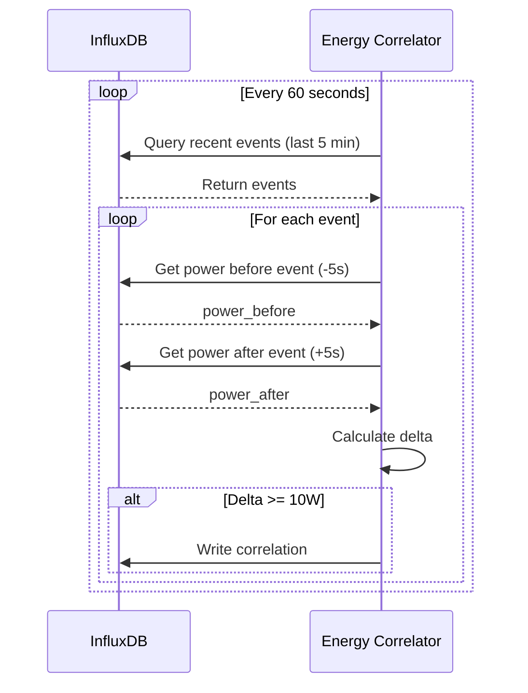

# Energy-Event Correlation Service

Post-processes Home Assistant events and power consumption data to identify causality relationships.

## Purpose

Analyzes which device state changes (switches, lights, HVAC, etc.) cause measurable power consumption changes, creating actionable insights for energy optimization.

## How It Works



## Features

- **Temporal Correlation**: Matches events with power changes within ±10 second window
- **Multi-Domain Support**: Analyzes switches, lights, climate, fans, covers
- **Threshold Filtering**: Only correlates significant changes (>10W by default)
- **Statistics Tracking**: Monitors correlation rates and performance
- **API Endpoints**: Health check and statistics

## Environment Variables

Required:
- `INFLUXDB_TOKEN` - InfluxDB authentication token

Optional:
- `INFLUXDB_URL` - InfluxDB URL (default: `http://influxdb:8086`)
- `INFLUXDB_ORG` - InfluxDB organization (default: `home_assistant`)
- `INFLUXDB_BUCKET` - InfluxDB bucket (default: `home_assistant_events`)
- `PROCESSING_INTERVAL` - Processing interval in seconds (default: `60`)
- `LOOKBACK_MINUTES` - How far back to process events (default: `5`)
- `SERVICE_PORT` - HTTP port (default: `8015`)
- `LOG_LEVEL` - Logging level (default: `INFO`)

## API Endpoints

### `GET /health`
Health check endpoint

**Response:**
```json
{
  "status": "healthy",
  "service": "energy-correlator",
  "uptime_seconds": 3600.5,
  "last_successful_fetch": "2025-01-15T19:00:00Z",
  "total_fetches": 60,
  "failed_fetches": 0,
  "success_rate": 1.0
}
```

### `GET /statistics`
Get correlation statistics

**Response:**
```json
{
  "total_events_processed": 1250,
  "correlations_found": 45,
  "correlations_written": 45,
  "correlation_rate_pct": 3.6,
  "write_success_rate_pct": 100.0,
  "errors": 0,
  "config": {
    "correlation_window_seconds": 10,
    "min_power_delta_w": 10.0
  }
}
```

### `POST /statistics/reset`
Reset statistics counters

**Response:**
```json
{
  "message": "Statistics reset"
}
```

## InfluxDB Schema

### Input Measurements (Read)

**`home_assistant_events`** - HA state change events
```
Tags: entity_id, domain, state_value, previous_state
Fields: (various)
```

**`smart_meter`** - Power consumption readings
```
Fields: total_power_w
```

### Output Measurement (Write)

**`event_energy_correlation`** - Event-power correlations
```
Tags:
  entity_id: string           # e.g., "switch.living_room_lamp"
  domain: string              # e.g., "switch"
  state: string               # e.g., "on"
  previous_state: string      # e.g., "off"

Fields:
  power_before_w: float       # Power 5s before event
  power_after_w: float        # Power 5s after event
  power_delta_w: float        # Change in power (can be negative)
  power_delta_pct: float      # Percentage change

Timestamp: Event time (from home_assistant_events)
```

## Example Correlations

### Light Switch
```
Event: switch.living_room_lamp [off → on]
Time: 2025-01-15T19:30:00Z
Power Before: 2450W
Power After: 2510W
Delta: +60W (+2.4%)
```

### HVAC System
```
Event: climate.living_room [idle → heating]
Time: 2025-01-15T08:15:00Z
Power Before: 1850W
Power After: 4350W
Delta: +2500W (+135%)
```

### Multiple Lights
```
Event: light.bedroom_lights [on → off]
Time: 2025-01-15T23:00:00Z
Power Before: 2150W
Power After: 2030W
Delta: -120W (-5.6%)
```

## Use Cases

### 1. Device Power Profiling
Identify actual power consumption of individual devices:
```sql
SELECT 
  entity_id,
  AVG(power_delta_w) as avg_power_draw
FROM event_energy_correlation
WHERE state = 'on' AND previous_state = 'off'
GROUP BY entity_id
ORDER BY avg_power_draw DESC
```

### 2. Automation Effectiveness
Measure energy savings from automations:
```sql
SELECT 
  SUM(power_delta_w) as total_savings_w
FROM event_energy_correlation
WHERE state = 'off' 
AND time >= now() - 24h
```

### 3. Anomaly Detection
Find devices with unusual power consumption:
```sql
SELECT 
  entity_id,
  power_delta_w,
  power_delta_pct
FROM event_energy_correlation
WHERE ABS(power_delta_w) > 1000
OR ABS(power_delta_pct) > 50
ORDER BY time DESC
```

## Configuration Tuning

### Correlation Window
```bash
# Default: ±10 seconds
# Increase for slower-responding devices
CORRELATION_WINDOW_SECONDS=15

# Decrease for more precise correlation
CORRELATION_WINDOW_SECONDS=5
```

### Minimum Delta Threshold
```bash
# Default: 10W
# Increase to reduce noise (ignore small changes)
MIN_POWER_DELTA=50

# Decrease to catch smaller devices
MIN_POWER_DELTA=5
```

### Processing Frequency
```bash
# Default: 60 seconds
# Increase for lower CPU usage
PROCESSING_INTERVAL=300

# Decrease for more real-time correlation
PROCESSING_INTERVAL=30
```

## Performance Characteristics

### Resource Usage
- **CPU**: ~1-2% (during processing bursts)
- **Memory**: ~50-100MB
- **Network**: Minimal (queries to InfluxDB only)
- **Disk I/O**: Minimal (InfluxDB writes)

### Processing Speed
- **Events per second**: ~200-500
- **Correlations per minute**: ~5-20 (depends on event frequency)
- **InfluxDB query time**: <50ms per query
- **Total cycle time**: ~2-5 seconds per iteration

### Scalability
- Can process 10,000+ events/hour
- InfluxDB writes are batched
- Queries are time-range limited (5 minutes)
- Handles missing data gracefully

## Troubleshooting

### No Correlations Found
**Symptom:** `correlations_found: 0` in statistics

**Possible Causes:**
1. No events in InfluxDB (`home_assistant_events` measurement)
2. No power data in InfluxDB (`smart_meter` measurement)
3. Power changes too small (< min_power_delta threshold)
4. Time sync issues between services

**Debug:**
```bash
# Check for events
curl http://localhost:8015/statistics

# Check InfluxDB data
docker exec homeiq-influxdb \
  influx query 'SELECT COUNT(*) FROM home_assistant_events'

docker exec homeiq-influxdb \
  influx query 'SELECT COUNT(*) FROM smart_meter'
```

### High Error Rate
**Symptom:** `errors` increasing in statistics

**Possible Causes:**
1. InfluxDB connection issues
2. Invalid data formats
3. Permission issues

**Debug:**
```bash
# Check logs
docker logs homeiq-energy-correlator --tail 100

# Verify InfluxDB health
curl http://localhost:8086/health
```

## Dependencies

### Python Packages
- `aiohttp==3.9.1` - HTTP server
- `influxdb3-python==0.3.0` - InfluxDB client
- `python-dotenv==1.0.0` - Environment variables

### External Services
- **InfluxDB** - Data source and sink
- **smart-meter-service** - Provides power data
- **websocket-ingestion** - Provides event data

## Development

### Local Testing
```bash
# Build service
docker-compose build energy-correlator

# Run service
docker-compose up -d energy-correlator

# View logs
docker logs -f homeiq-energy-correlator

# Check statistics
curl http://localhost:8015/statistics
```

### Manual Correlation Run
```bash
# Trigger immediate processing via API
curl -X POST http://localhost:8015/statistics/reset
```

## License

MIT License

